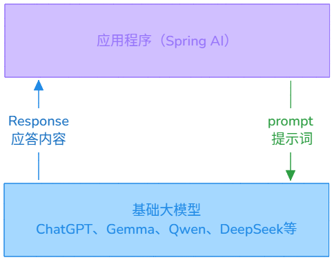
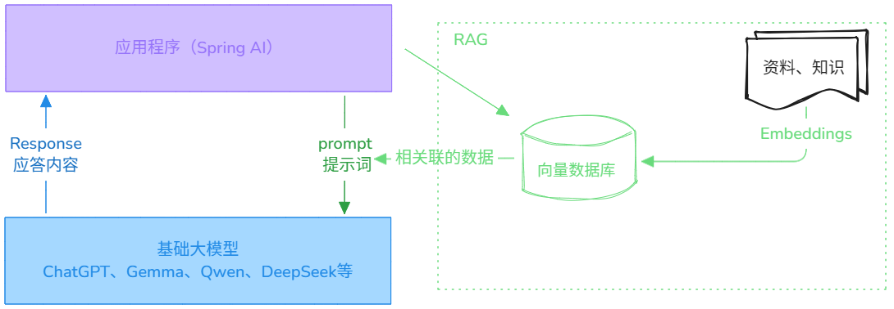
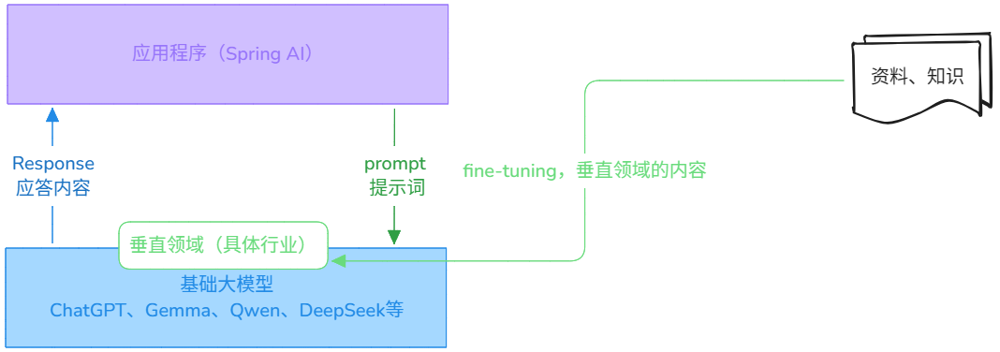
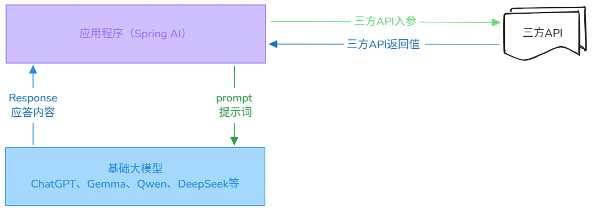

### Spring AI 应用场景

**Spring AI 使用大模型的流程**：



**RAG（检索增强生成）**：给基础大模型提供额外的资料、知识，让大模型更接近真实场景。



**fine-tuning（微调）**：让大模型在垂直领域（具体行业）更加优秀。用垂直领域的知识进行训练。



**function-call（函数调用）**：接入三方 API，进行回答一些实时的问题。注意：在满足三方 API 的引用场景时，系统是调用了两次大模型。第一次借助大模型解析三方 API 入参，第二次结合三方 API 返回值让大模型生成最终结果返回给用户。



### Spring AI + Open AI 工程搭建

**步骤 1**：创建一个 Spring Boot 工程。

Spring Boot 的 pom. Xml 的部分内容，如下所示：

```xml
<parent>  
    <groupId>org.springframework.boot</groupId>  
    <artifactId>spring-boot-starter-parent</artifactId>  
    <version>3.4.2</version>  
    <relativePath/>
</parent>

<dependencies>  
    <dependency>  
        <groupId>org.springframework.boot</groupId>  
        <artifactId>spring-boot-starter-web</artifactId>  
    </dependency>  
  
    <dependency>  
        <groupId>org.springframework.boot</groupId>  
        <artifactId>spring-boot-starter-test</artifactId>  
        <scope>test</scope>  
    </dependency>  
</dependencies>

<build>  
    <plugins>  
        <plugin>  
            <groupId>org.springframework.boot</groupId>  
            <artifactId>spring-boot-maven-plugin</artifactId>  
        </plugin>  
    </plugins>  
</build>
```

**步骤 2**：加入 OpenAI 依赖和配置信息。

OpenAI 的 pom. Xml 的依赖部分内容，如下所示：

```xml
<properties>  
    <java.version>17</java.version>  
    <spring-ai.version>1.0.0-M5</spring-ai.version>  
</properties>

<dependencies>  
    <dependency>  
        <groupId>org.springframework.ai</groupId>  
        <artifactId>spring-ai-openai-spring-boot-starter</artifactId>  
    </dependency>  
</dependencies>

<dependencyManagement>  
    <dependencies>  
        <dependency>  
            <groupId>org.springframework.ai</groupId>  
            <artifactId>spring-ai-bom</artifactId>  
            <version>${spring-ai.version}</version>  
            <type>pom</type>  
            <scope>import</scope>  
        </dependency>  
    </dependencies>  
</dependencyManagement>
```

OpenAI 的 application. Yml 的配置部分内容，如下所示：

```yaml
spring:  
  ai:  
    openai:  
      api-key: OpenAI[api-key]
      base-url: OpenAI[base-url]
```

**步骤 3**：配置 ChatClient 对象 Bean。

创建一个 AIConfig. Java 用来生成 ChatClient 对象 Bean，提供基础对话的对象。

```java
@Configuration  
public class AIConfig {  
  
    @Bean  
    ChatClient chatClient(ChatClient.Builder builder) {  
        return builder.build();  
    }  
}

// 或者如下内容

@RestController  
@RequestMapping("/ai")  
public class AIController {  
  
    private final ChatClient chatClient;  
  
    public AIController(ChatClient.Builder chatClientBuilder) {  
        this.chatClient = chatClientBuilder.build();  
    }
}
```

至此，工程搭建完成。

### Spring AI 相关名词

AI 涉及到的角色： `system` 、 `assistant` 、 `user` 。

- `system` ：设置 AI 的行为、角色、背景等。通常可以用于设定对话的语境，让 AI 在指定的语境下工作。
- `assistant` ：AI 回复的信息，由程序借助大模型自动生成。
- `user` ：用户的提问。

### OpenAI 对话实现【ChatClient】

> 使用 `ChatClient` 对象。

**普通对话**：一问一答的方式。

```java
@RestController  
@RequestMapping("/ai")  
public class AIController {  
  
    @Autowired  
    private ChatClient chatClient;

	@GetMapping("/chat")  
	public String chat(@RequestParam(value = "message", defaultValue = "讲一个笑话") String message) {  
	    return chatClient.prompt()  
	            .user(message)  
	            .call()  
	            .content();  
	}
}
```

**普通对话**：预设置角色。

```java  
@Configuration  
public class AIConfig {  

	@Bean  
	ChatClient chatClient(ChatClient.Builder builder) {  
	    return builder.defaultSystem("你现在是一个笑话专家，专门为别人讲述好听且动人的笑话。当别人需要让你讲笑话时，讲出你准备的笑话就可以。如果不是，提示用户你是一个笑话专家，只负责讲笑话！")  
	            .build();  
	}
}
```

**流式响应**：一问一答的方式，但以流式返回结果。

```java  
@RestController  
@RequestMapping("/ai")  
public class AIController {  
  
    @Autowired  
    private ChatClient chatClient;

	@GetMapping(value = "/chatStream", produces = "text/html;charset=UTF-8")  
	public Flux<String> chatStream(@RequestParam(value = "message", defaultValue = "讲一个笑话") String message) {  
	    Flux<String> output = chatClient.prompt()  
	            .user(message)  
	            .stream()  
	            .content();  
	    return output;  
	}
}
```

**设置系统代理**：存在 `OpenAI[base-url]` 需要先代理才能访问。

```java
@SpringBootApplication  
public class SpringAiTestApplication {  
  
    public static void main(String[] args) {  
        String proxy = "127.0.0.1";  
        int port = 7890;  
        System.setProperty("proxyType", "4");  
        System.setProperty("proxyHost", proxy);  
        System.setProperty("proxyPort", String.valueOf(port));  
        System.setProperty("proxySet", "true");  
        SpringApplication.run(SpringAiTestApplication.class, args);  
    }  
}
```

### OpenAI 对话实现【ChatModel】

> 使用 `ChatClient` 对象。

**普通对话**：一问一答的方式。

```java
@RestController  
@RequestMapping("/ai")  
public class AIController {  
  
	@Autowired  
	private ChatModel chatModel;

    @GetMapping("/chatModelApi")  
    public String chatModelApi(@RequestParam(value = "message", defaultValue = "讲一个笑话") String message) {  
		Prompt prompt = new Prompt(  
		    // new UserMessage(message) 等价于 message,    
		    message,  
		    OpenAiChatOptions.builder()  
		            .model("gpt-4o")  
		            .temperature(0.4)  
		            .build()  
		);
		ChatResponse response = chatModel.call(prompt);  

		return response.getResult().getOutput().getContent();
    }
}
```

**流式响应**：一问一答的方式，但以流式返回结果。

```java  
@RestController  
@RequestMapping("/ai")  
public class AIController {  
  
	@Autowired  
	private ChatModel chatModel;

    @GetMapping(value = "chatModelStreamApi", produces = "text/html;charset=UTF-8")  
    public Flux<String> chatModelStreamApi(@RequestParam(value = "message", defaultValue = "讲一个笑话") String message) {  
        Prompt prompt = new Prompt(  
			// new UserMessage(message) 等价于 message,
			message,  
			OpenAiChatOptions.builder()  
					.model("gpt-4o")  
					.temperature(0.4)  
					.build()  
        );  
        Flux<String> chatResponseFlux = chatModel.stream(prompt)  
                .map(response -> response.getResult().getOutput().getContent());  
        return chatResponseFlux;  
    }
}
```

### OpenAI 文生图

> 使用 `OpenAiImageModel` 对象。

```java  
@RestController  
@RequestMapping("/ai")  
public class AIController {  
  
	@Autowired  
	private OpenAiImageModel imageModel;

	@GetMapping(value = "/text2Image")  
	public String text2Image(@RequestParam(value = "message", defaultValue = "画一个猫") String message) {  
	    ImagePrompt imagePrompt = new ImagePrompt(  
	        // new ImageMessage(message)  等价于 message,        
	        message,  
	        OpenAiImageOptions.builder()  
	                .withModel(OpenAiImageApi.DEFAULT_IMAGE_MODEL)  
	                .quality("hd")  
	                .N(1)  
	                .height(1024)  
	                .width(1024).build()  
	    );  
	    ImageResponse response = imageModel.call(imagePrompt);  
	    return response.getResult().getOutput().getUrl();  
	}
}
```

### OpenAI 文生语音

> 使用 `OpenAiAudioSpeechModel` 对象。

```java  
@RestController  
@RequestMapping("/ai")  
public class AIController {  
  
	@Autowired  
	private OpenAiAudioSpeechModel speechModel;

	@GetMapping(value = "/text2Audio")  
	public String text2Audio(@RequestParam(value = "message", defaultValue = "Hello, this is a text-to-speech example.") String message) {  
	    OpenAiAudioSpeechOptions speechOptions = OpenAiAudioSpeechOptions.builder()  
	            .model(OpenAiAudioApi.TtsModel.TTS_1.value)  
	            .voice(OpenAiAudioApi.SpeechRequest.Voice.ALLOY)  
	            .responseFormat(OpenAiAudioApi.SpeechRequest.AudioResponseFormat.MP3)  
	            .speed(1.0f)  
	            .build();  
	  
	    SpeechPrompt speechPrompt = new SpeechPrompt(  
	            // new SpeechMessage(message)  等价于 message,            
	            message,  
	            speechOptions  
	    );  
	    SpeechResponse response = speechModel.call(speechPrompt); 
	     
	    // 处理生成的mp3文件  
	    byte[] body = response.getResult().getOutput();  
	    FileOutputStream fos = null;  
	    try {  
	        fos = new FileOutputStream("./speech1.mp3");  
	        fos.write(body);  
	    } catch (IOException e) {  
	        throw new RuntimeException(e);  
	    } finally {  
	        if (fos != null) {  
	            try {  
	                fos.close();  
	            } catch (IOException e) {  
	                throw new RuntimeException(e);  
	            }  
	        }  
	    }  
	    return "ok";  
	}
}
```

### OpenAI 语音翻译

> 使用 `OpenAiAudioTranscriptionModel` 对象。

```java  
@RestController  
@RequestMapping("/ai")  
public class AIController {  
  
	@Autowired  
	private OpenAiAudioTranscriptionModel transcriptionModel;

	@GetMapping(value = "/audio2Text")  
	public String audio2Text(@RequestParam(value = "message", defaultValue = "Hello, this is a text-to-speech example.") String message) {  
	    OpenAiAudioTranscriptionOptions transcriptionOptions = OpenAiAudioTranscriptionOptions.builder()  
	            .model(OpenAiAudioApi.WhisperModel.WHISPER_1.value)  
	            .responseFormat(OpenAiAudioApi.TranscriptResponseFormat.TEXT)  
	            .temperature(0f)  
	            .build();  
	  
	    FileSystemResource resource = new FileSystemResource("speech1.mp3");  
	    // ClassPathResource resource = new ClassPathResource("/speech.mp3");  
	    if (resource.exists()) {  
	        System.out.println("文件存在！");  
	    } else {  
	        System.out.println("文件不存在！");  
	    }  
	  
	    AudioTranscriptionPrompt transcriptionRequest = new AudioTranscriptionPrompt(resource, transcriptionOptions);  
	    AudioTranscriptionResponse response = transcriptionModel.call(transcriptionRequest);  
	    return response.getResult().getOutput();  
	}
}
```

### OpenAI 多模态

> 使用 `ChatModel` 对象。

**普通对话**：一问一答的方式。

```java
@RestController  
@RequestMapping("/ai")  
public class AIController {  
  
	@Autowired  
	private ChatModel chatModel;

	@GetMapping(value = "/multi")  
	public String multi(@RequestParam(value = "message", defaultValue = "你从这个图片中看到了什么？") String message) throws IOException {  
	    // byte[] imageData = new ClassPathResource("/image.jpeg").getContentAsByteArray();  
	    ClassPathResource resource = new ClassPathResource("/image.jpeg");  
	  
	    UserMessage userMessage = new UserMessage(  
	            message,  
	            List.of(new Media(MimeTypeUtils.IMAGE_JPEG, resource))  
	    );  
	    OpenAiChatOptions aiChatOptions = OpenAiChatOptions.builder()  
	            .model(OpenAiApi.ChatModel.GPT_4_O.getValue())  
	            .build();  
	  
	    ChatResponse response = chatModel.call(new Prompt(userMessage, aiChatOptions));  
	    return response.getResult().getOutput().getContent();  
	}
}
```

**流式响应**：一问一答的方式，但以流式返回结果。

```java
@RestController  
@RequestMapping("/ai")  
public class AIController {  
  
	@Autowired  
	private ChatModel chatModel;

	@GetMapping(value = "/multiStream", produces = "text/html;charset=UTF-8")  
	public Flux<String> multiStream(@RequestParam(value = "message", defaultValue = "你从这个图片中看到了什么？") String message) {  
	    ClassPathResource resource = new ClassPathResource("/image.jpeg");  
	    UserMessage userMessage = new UserMessage(  
	            message,  
	            List.of(new Media(MimeTypeUtils.IMAGE_JPEG, resource))  
	    );  
	  
	    OpenAiChatOptions aiChatOptions = OpenAiChatOptions.builder()  
	            .model(OpenAiApi.ChatModel.GPT_4_O.getValue())  
	            .build();  
	  
	    Flux<String> responseFlux = chatModel.stream(new Prompt(userMessage, aiChatOptions))  
	            .map(response -> response.getResult().getOutput().getContent());  
	    return responseFlux;  
	}
}
```

### function-call 函数调用

> 使用 `ChatModel` 对象。

**步骤1**：准备与三方交互的Function。

```java
public class LocationNameFunction implements Function<LocationNameFunction.Request, LocationNameFunction.Response> {  
  
    @Override  
    public Response apply(Request request) {  
        if (request.name.isBlank() || request.location.isBlank()) {  
            return new Response("传入的参数不足，请检查后传入！");  
        }  
        return new Response("API调用完成，有5人");  
    }  
  
    public record Request(  
            String name,  
            String location  
    ) {  
    }  
  
    public record Response(  
            String message  
    ) {  
    }  
}
```

**步骤2**：注册成对象Bean。

```java
@Component  
public class AIFunctionCallBeanConfig {  
  
    @Bean  
    @Description("某个地方有多少个什么名字的人")  
    public Function<LocationNameFunction.Request, LocationNameFunction.Response> locationNameFunction() {  
        return new LocationNameFunction();  
    }  
}
```

**步骤3**：绑定到大模型上，实现function-call调用。

```java
@RestController  
@RequestMapping("/ai")  
public class AIController {  
  
	@Autowired  
	private ChatModel chatModel;

	@GetMapping(value = "/functionCall")  
	public String functionCall(@RequestParam(value = "message", defaultValue = "北京有多少个叫张三的人？") String userInput) throws IOException {  
	    OpenAiChatOptions aiChatOptions = OpenAiChatOptions.builder()  
	            .function("locationNameFunction")  
	            .model(OpenAiApi.ChatModel.GPT_4_O.value)  
	            .build();  
	    ChatResponse response = chatModel.call(new Prompt(userInput, aiChatOptions));  
	    return response.getResult().getOutput().getContent();  
	}
}
```
