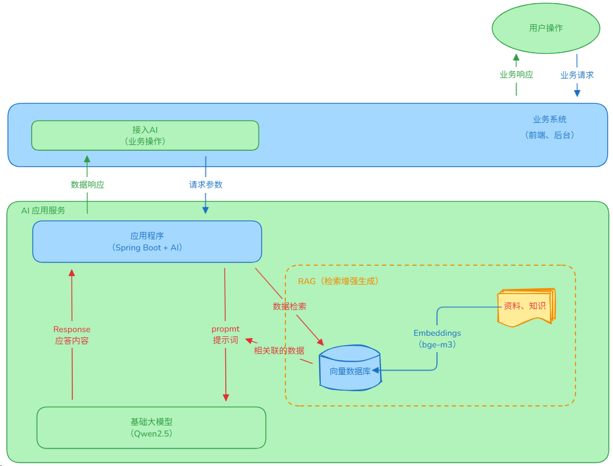
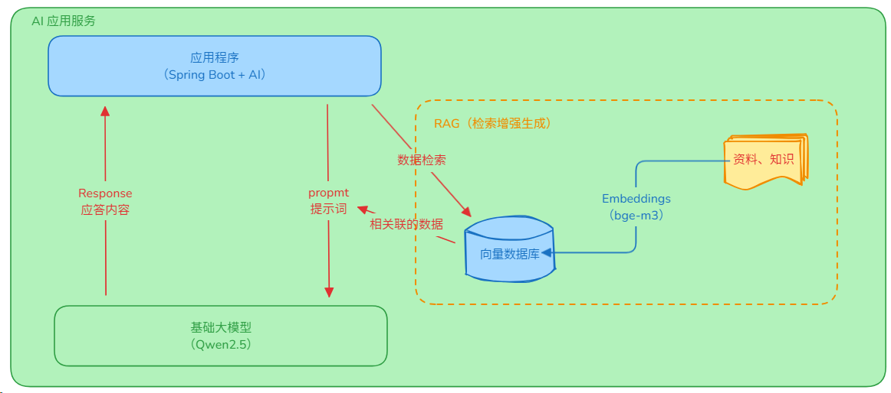
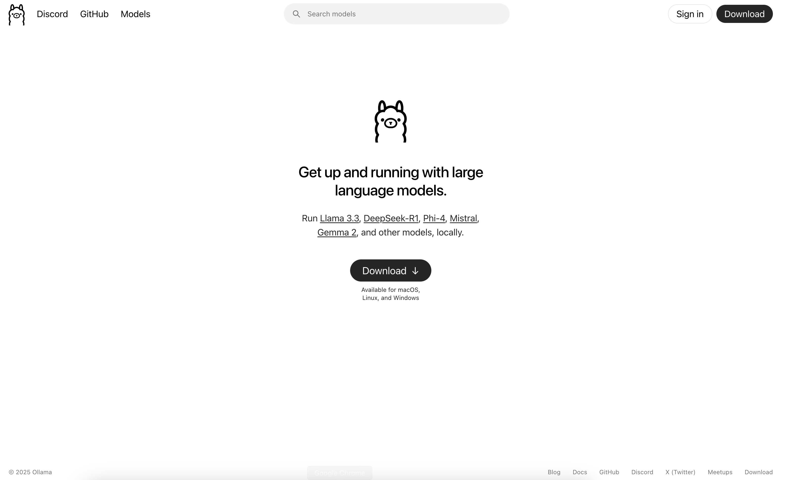
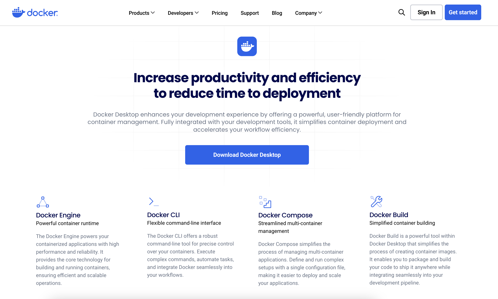
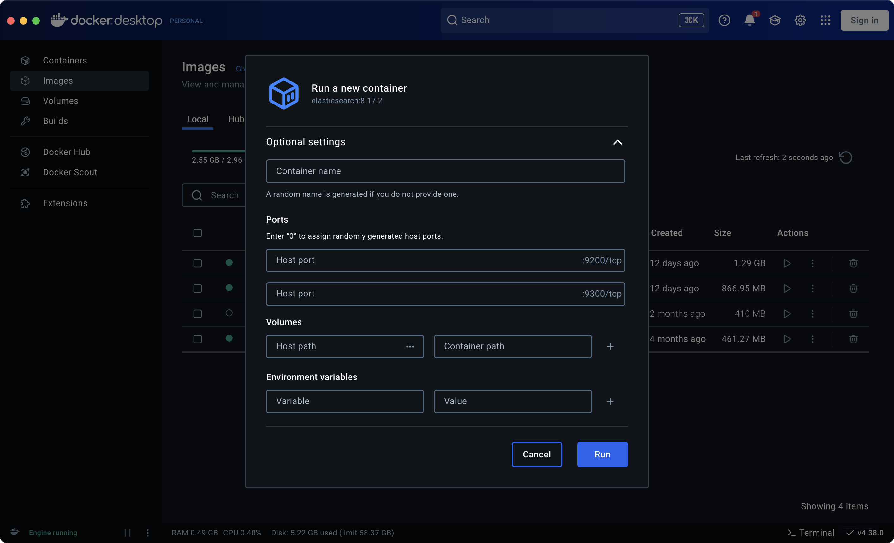
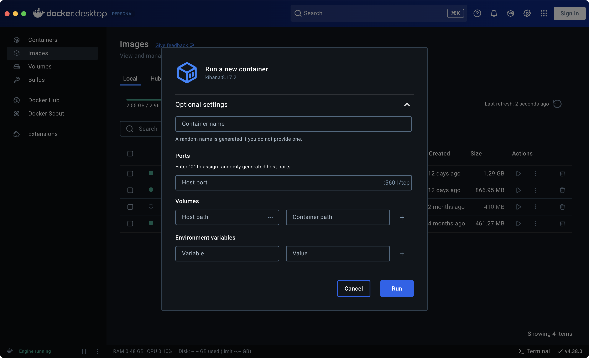

> **前言**：**以下包含的相关技术和内容**
> 1. **基础AI大模型**：Qwen2.5，借助Ollama工具访问。
> 2. **RAG知识库**：Elasticsearch向量数据存储。
> 3. **框架**：Spring框架。
> 4. **语言**：Java语言。

### 涉及的概念内容

**AI大模型 + RAG知识库**：是一种结合了大型语言模型（LLM）和检索增强生成（RAG，Retrieval-Augmented Generation）技术的系统，通过引入外部知识库来增强AI的生成能力和准确性。

**AI大模型**：也称为大型语言模型（LLM），是一种经过大量文本数据训练的人工智能模型，能够生成自然语言文本。它可以根据用户输入的提示（prompt）生成回答、文章、故事等内容。然而，AI大模型有时会出现“幻觉”问题，即生成与事实不符的内容

**RAG知识库**：是为了解决AI大模型“幻觉”问题而设计的一种技术。它通过检索外部知识库中的信息，为AI大模型提供更准确的上下文，从而生成更符合事实的答案。

RAG知识库的工作原理可以分为以下几个步骤：

1. 数据准备：将知识库中的数据划分为小块，并通过嵌入模型将其转换为向量形式，存储在向量数据库中。
2. 数据检索：当用户提出问题时，系统会将问题转换为向量形式，并在向量数据库中检索与问题最相关的文档。
3. 生成回答：将检索到的文档与用户问题结合，形成更丰富的上下文信息，输入到AI大模型中，生成最终的回答。

**AI大模型 + RAG知识库的优势**：

1. 提高准确性：通过引入外部知识库，AI大模型能够生成更符合事实的回答。
2. 无需重新训练：用户可以随时更新知识库，而无需重新训练AI大模型。
3. 增强灵活性：RAG知识库可以根据不同的应用场景和需求进行定制。

**AI大模型 + RAG知识库在实际应用中的架构示意图**：



本文将讲述如何实现AI应用服务部分，如下图所示：



### 搭建AI应用服务框架

#### 1. 搭建基础大模型

使用Ollama + Qwen2.5 AI大模型来搭建本地大模型并提供外部访问接口。

- Ollama 官网地址：[ollama.com](https://ollama.com/)



**步骤一**：安装Ollama软件

- Ollama 下载地址：[ollama.com/download](https://ollama.com/download)

**步骤二**：拉取AI大模型

```shell
# 拉取
ollama pull qwen2.5:7b

# 拉取并运行 - 运行后可在窗口中直接测试
ollama run qwen2.5:7b
```

#### 2. 搭建RAG环境

使用Docker容器化Elasticsearch 和 Kibana，原因是方便简单。

**步骤一**：下载Docker Desktop软件。

- Docker Desktop 下载地址：[dockerd.com.cn](https://dockerd.com.cn/)



注意：在Windows中运行时，需要开启Hyper-V。

**步骤二**：拉取Elasticsearch 和 Kibana镜像。

```shell
docker pull elasticsearch:8.17.2
docker pull kibana:8.17.2
```

**步骤三**：启动Elasticsearch 和 Kibana镜像

方式1：Docker Desktop软件启动





方式2：使用Docker命令启动

```shell
docker network create net-es-kibana

docker run -d \
  --name elasticsearch \
  --network net-es-kibana \
  -p 9200:9200 \
  -p 9300:9300 \
  -e "discovery.type=single-node" \
  -e "ELASTIC_PASSWORD=elastic" \
  -e "network.host=0.0.0.0" \
  -e "xpack.security.enabled=false" \
  -e "xpack.security.http.ssl.enabled=false" \
  elasticsearch:8.17.2

docker run -d \
  --name kibana \
  --network net-es-kibana \
  -p 5601:5601 \
  -e "ELASTICSEARCH_HOSTS=http://elasticsearch:9200" \
  kibana:8.17.2
```

#### 3. 搭建应用程序

**步骤 1**：创建一个 Spring Boot 工程。

Spring Boot 的 pom. Xml 的部分内容，如下所示：

```xml
<parent>  
    <groupId>org.springframework.boot</groupId>  
    <artifactId>spring-boot-starter-parent</artifactId>  
    <version>3.4.2</version>  
    <relativePath/>
</parent>

<dependencies>  
    <dependency>  
        <groupId>org.springframework.boot</groupId>  
        <artifactId>spring-boot-starter-web</artifactId>  
    </dependency>  
  
    <dependency>  
        <groupId>org.springframework.boot</groupId>  
        <artifactId>spring-boot-starter-test</artifactId>  
        <scope>test</scope>  
    </dependency>  
</dependencies>

<build>  
    <plugins>  
        <plugin>  
            <groupId>org.springframework.boot</groupId>  
            <artifactId>spring-boot-maven-plugin</artifactId>  
        </plugin>  
    </plugins>  
</build>
```

**步骤 2**：加入 Ollama和Elasticsearch 依赖和配置信息。

Ollama和Elasticsearch 的 pom. Xml 的依赖部分内容，如下所示：

```xml
<properties>  
    <java.version>17</java.version>  
    <spring-ai.version>1.0.0-M6</spring-ai.version>  
</properties>

<dependencies>  
	<dependency>  
	    <groupId>com.alibaba.fastjson2</groupId>  
	    <artifactId>fastjson2</artifactId>  
	    <version>2.0.55</version>  
	</dependency>
	<dependency>  
	    <groupId>org.springframework.ai</groupId>  
	    <artifactId>spring-ai-elasticsearch-store-spring-boot-starter</artifactId>  
	</dependency>
	<dependency>  
	    <groupId>org.springframework.ai</groupId>  
	    <artifactId>spring-ai-ollama-spring-boot-starter</artifactId>  
	</dependency>
</dependencies>

<dependencyManagement>  
    <dependencies>  
        <dependency>  
            <groupId>org.springframework.ai</groupId>  
            <artifactId>spring-ai-bom</artifactId>  
            <version>${spring-ai.version}</version>  
            <type>pom</type>  
            <scope>import</scope>  
        </dependency>  
    </dependencies>  
</dependencyManagement>
```

OpenAI 的 application. yml 的配置部分内容，如下所示：

```yaml
spring:  
  elasticsearch:  
    uris: http://localhost:9200  
    username: elastic  
    password: elastic  
  ai:  
    vectorstore:  
      elasticsearch:  
        initialize-schema: true  
        index-name: custom-index  
        dimensions: 1024  
        similarity: cosine  
        batching-strategy: TOKEN_COUNT  
    ollama:  
      base-url: http://localhost:11434  
      chat:  
        options:  
          model: qwen2.5:7b  
      embedding:  
        model: bge-m3:567m
```

**步骤 3**：配置 ChatClient 对象 Bean。

创建一个 AIConfig. Java 用来生成 ChatClient 对象 Bean，提供基础对话的对象。

```java
@Configuration  
public class OllamaConfig {  
  
    @Autowired  
    private OllamaChatModel chatModel;  
  
    @Autowired  
    private ElasticsearchVectorStore vectorStore;  
  
    @Bean  
    public ChatClient chatClient() {  
        return ChatClient.builder(chatModel).build();  
    }  
  
    @Bean  
    public ChatClient chatVectorClient() {  
        return ChatClient.builder(chatModel).defaultAdvisors(new QuestionAnswerAdvisor(vectorStore)).build();  
    }  
  
    @Bean  
    public ChatMemory chatMemory() {  
        return new InMemoryChatMemory();  
    }  
}
```

至此，工程搭建完成。

### RAG资料、知识Embedding

创建ElasticsearchVectorController类，实现RAG资料、知识加入到向量数据库中。

```java
@RestController  
@RequestMapping("/elasticsearch/vector")  
public class ElasticsearchVectorController {  
  
    @Autowired  
    private ElasticsearchVectorStore vectorStore;  
  
    @RequestMapping("/datasetWrite")  
    public String datasetWrite() {  
        StringBuilder sb = new StringBuilder();  
        InputStream resourceAsStream = this.getClass().getClassLoader().getResourceAsStream("dataset.txt");  
  
        try (  
                BufferedReader reader = new BufferedReader(new InputStreamReader(resourceAsStream));  
        ) {  
            String line;  
            while ((line = reader.readLine()) != null) {  
                sb.append(line).append("\n");  
            }  
        } catch (IOException e) {  
            throw new RuntimeException(e);  
        }  
        List<Document> dataset = Arrays.stream(sb.toString().split("\n\n")).map(Document::new).toList();  
        vectorStore.doAdd(dataset);  
        return "ok，已经写入" + dataset.size() + "条数据";  
    }  
  
    @RequestMapping("/datasetJSONWrite")  
    public String datasetWriteJSON() {  
        List<Document> dataset = new ArrayList<>();  
        ObjectMapper objectMapper = new ObjectMapper();  
        try {  
            ClassPathResource resource = new ClassPathResource("dataset.json");  
            InputStream inputStream = resource.getInputStream();  
            JsonNode rootNode = objectMapper.readTree(inputStream);  
            for (JsonNode node : rootNode) {  
                System.out.println(node.toString());  
                dataset.add(new Document(node.toString()));  
            }  
        } catch (IOException e) {  
            throw new RuntimeException(e);  
        }  
        vectorStore.doAdd(dataset);  
        return "ok，已经写入" + dataset.size() + "条数据";  
    }  
  
    @GetMapping(value = "/getSimilaritySearchInfo", produces = "text/html;charset=UTF-8")  
    public Flux<String> getSimilaritySearchInfo(@RequestParam(value = "query", required = true) String query) {  
        List<Document> list = vectorStore.similaritySearch(  
                SearchRequest.builder()  
                        .query(query)  
                        .similarityThreshold(0.6)  
                        .topK(5)  
                        .build()  
        );  
        return Flux.fromIterable(list.stream().map(document -> document.getText()).toList());  
    }  
}
```

注意：在工程的resources目录下准备 dataset.txt 和 dataset.json 两个资料、知识文件。

### RAG资料、知识Embedding请求

将资料、知识写入Elasticsearch向量数据库：

```text
# help.txt文档绑定
localhost:启动端口/elasticsearch/vector/datasetWrite

# dataset.json文档绑定
localhost:启动端口/elasticsearch/vector/datasetJSONWrite
```

读取Elasticsearch向量数据库中的资料、知识：

```text
localhost:启动端口/elasticsearch/vector/getSimilaritySearchInfo?query=查询内容
```

### 应用程序调用RAG知识库和AI大模型

创建OllamaController类，编写方法。访问RAG知识库，将RAG相关知识传入AI大模型，生成回答内容。

```java
@RestController  
@RequestMapping("/ollama")  
public class OllamaController {  
  
    @Autowired  
    @Qualifier("chatClient")  
    private ChatClient chatClient;  
  
    @GetMapping(value = "/chat/notUseRAG", produces = "text/html;charset=UTF-8")  
    public Flux<String> chatNotUseVector(@RequestParam(value = "message", defaultValue = "讲一个笑话") String message) {  
        return chatClient.prompt().user(message).stream().content();  
    }  
  
    @Autowired  
    @Qualifier("chatVectorClient")  
    private ChatClient chatVectorClient;  
  
    @GetMapping(value = "/chat/useRAG", produces = "text/html;charset=UTF-8")  
    public Flux<String> chatUseVector(@RequestParam(value = "message", defaultValue = "讲一个笑话") String message) {  
        return chatVectorClient.prompt().user(message).stream().content();  
    }  
}
```

### 业务操作访问RAG知识库和AI大模型

不使用RAG知识库请求：

```text
localhost:启动端口/ollama/chat/notUseRAG?message=你想问的内容
```

使用RAG知识库请求：

```text
localhost:启动端口/ollama/chat/useRAG?message=你想问的内容
```
