---
文章分类:
  - 编程语言与技术
文章标签:
  - Java
  - JetBrains
  - Java Duke
文章简介: Java在2025年5月23日（昨日）迎来了30周年纪念。JetBrains推出Java 30 Anniversary插件，开发者每次启动开发工具时，都会看到Java的吉祥物Duke出现在启动画面。
创建时间: 2025-05-24
更新时间: 2025-05-24
---

Java在2025年5月23日（昨日）迎来了30周年纪念。为了庆祝这一重要时刻，JetBrains推出了一款名为“**Java 30 Anniversary**”的插件。安装该插件后，开发者每次启动开发工具时，都会看到Java的吉祥物Duke出现在启动画面上，仿佛Java在默默支持着每一位开发者。

通过完成一个简单的测试，开发者可以解锁Duke的代码，享受这一独特的体验。相关设置可以在“**设置 > 外观与行为 > Java 30 Anniversary Splash Screen**”中找到。这个小小的举动不仅为开发过程增添了乐趣，也体现了Java社区对开发者的关怀和对Java历史的尊重。

接下来，将分享一系列Java 30 Anniversary Splash Screen的内容，包括对应的角色代码、图标和描述。

## 01. Shortcut sorcerer(快捷键魔法师)

**Describe**：

You haven’t touched a mouse in years. You summon code with keystrokes and pure willpower.

> 你已经多年没碰过鼠标了，你仅靠键盘按键和纯粹的意志力就能调用代码。

**Character Code**：

Your Duke character code：`2b40ec50ce31589592a9295a860409aa`。

**Rendering**：

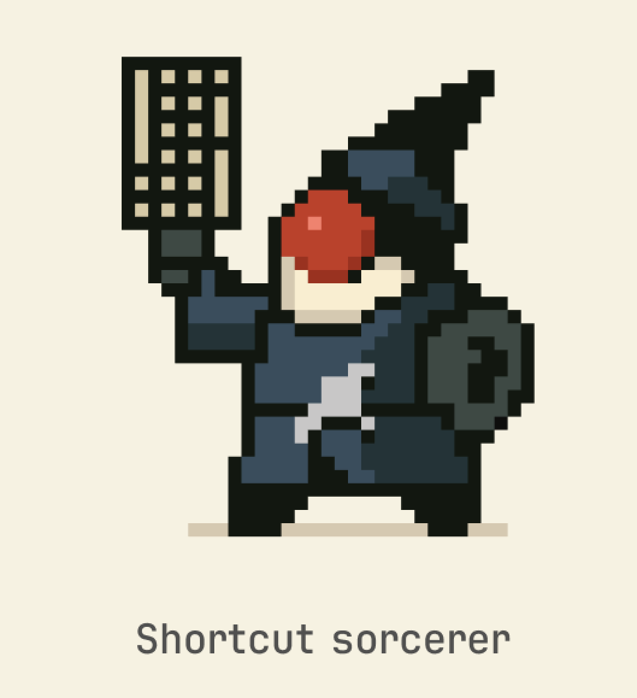

## 02. Romote-controlled dev（远程控制开发者）

**Describe**：

You deploy from a hammock, respond from three time zones, and haven’t worn real pants since 2020.

> 你躺在吊床上部署代码，跨越三个时区响应问题，自2020年以来就没再穿过正装裤。

**Character Code**：

Your Duke character code：`bc17df702c2c65ab9eea00c668f590c1`。

**Rendering**：

## 03. Git philosopher（Git 哲学家）

**Describe**：

You commit with intention and merge with grace. For you, every branch is a journey, and every rebase a meditation.

> 你带着明确的意图提交代码，优雅地合并分支。对你来说，每一个分支都是一场旅程，每一次变基都是一次冥想。

**Character Code**：

Your Duke character code：`8d5859ddaf5134cc5ae4d4098ac2cd6e`。

**Rendering**：

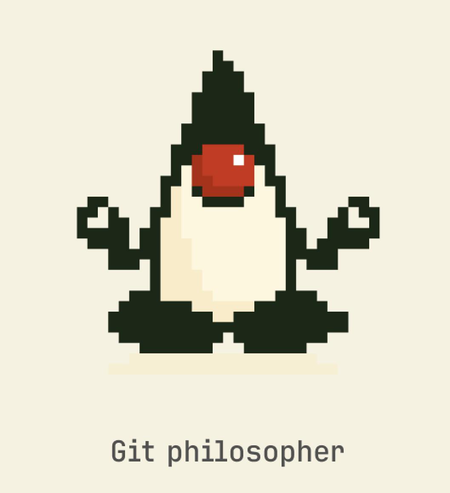

## 04. Syntax nomad（语法游牧者）

**Describe**：

You don’t chase goals – you follow the flow. Lost routes, surprise errors? That’s all just part of the adventure.

> 你不追逐目标，而是顺应流程。迷失的路径、意外的错误？这些全都是冒险的一部分。

**Character Code**：

Your Duke character code：`4ec8f48d0fd6b011e4a0bbc801cd41c3`。

**Rendering**：

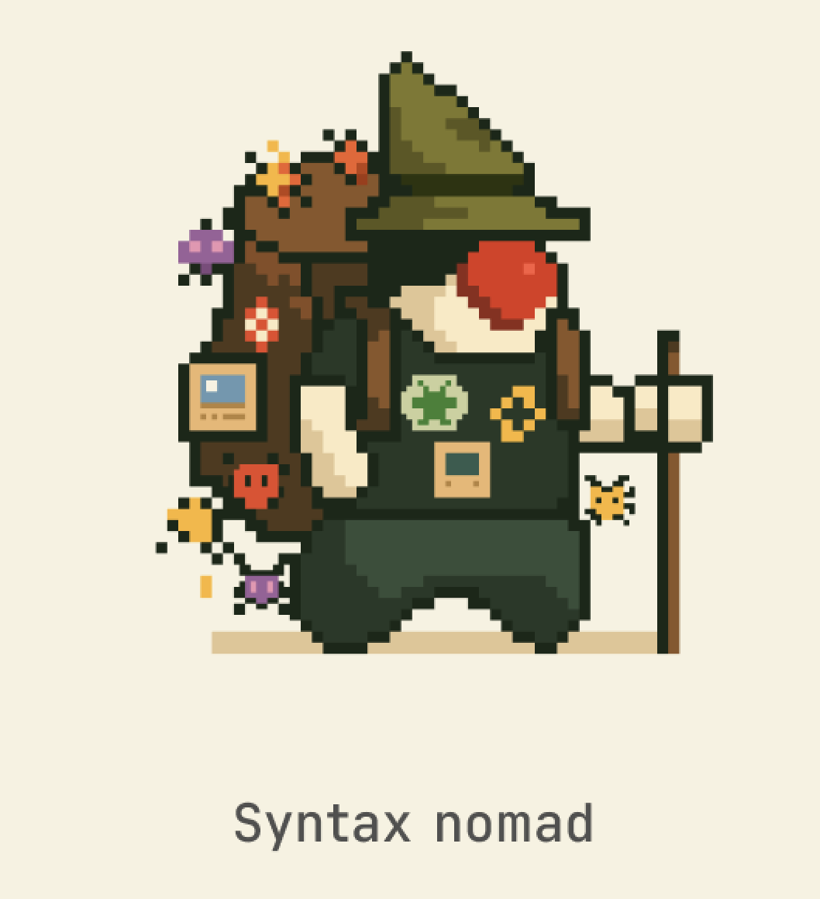

## 05. Container whisperer(容器低语者)

**Describe**：

You deploy across clouds like it’s second nature. Docker listens, Kubernetes obeys, and somehow it all just works.

> 你在云端部署应用就像呼吸一样自然。Docker会听从你的指令，Kubernetes会服从你的安排，不知何故，一切都能顺利运行。

**Character Code**：

Your Duke character code：`2d0e55ecd2adb48a19d1a579037813a0`。

**Rendering**：

## 06. WARlord(WAR大领主)

**Describe**：

You deploy apps that come in megabytes and leave behind smoke. If the server survives, it’s a win.

> 你部署的应用程序动辄以兆字节计，运行时如同战场般硝烟弥漫。如果服务器能够幸存，那就算胜利了。

**Character Code**：

Your Duke character code：`a25c68853e9c2edc7c3a3508b325b5af`。

**Rendering**：

## 07. Duke Nukem.java(公爵大冒险.java)

**Describe**：

You code like an action movie: fast, bold, and with a big splash screen. Every feature is an entrance.

> 你写代码就像拍动作片：快速、大胆，还带着一个超炫的启动画面。每个功能都像是一个惊艳的登场。

**Character Code**：

Your Duke character code：`fda9b7d363f53597b647322572c616ba`。

**Rendering**：

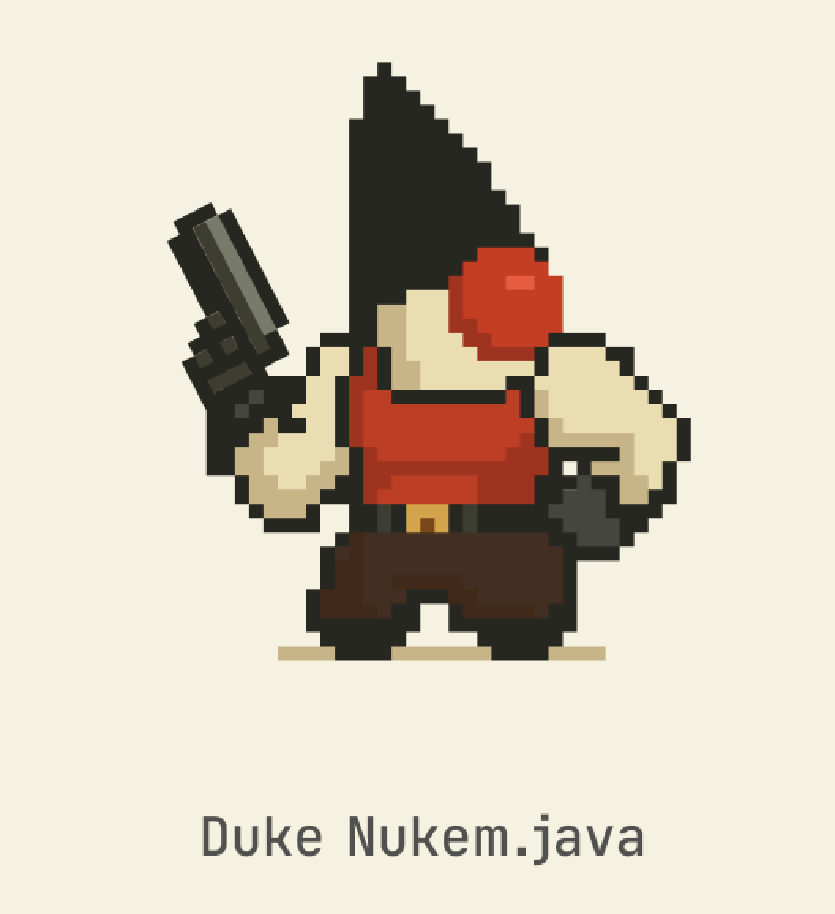

## 08. IDE skeptic(IDE怀疑论者)

**Describe**：

You trust your terminal more than any UI. If it needs a mouse, it probably needs a rethink.

> 你更信任终端，而不是任何图形界面。如果需要鼠标，那它可能需要重新思考。

**Character Code**：

Your Duke character code：`3ad7a84642024a8e1ea14be3ce70bd78`。

**Rendering**：

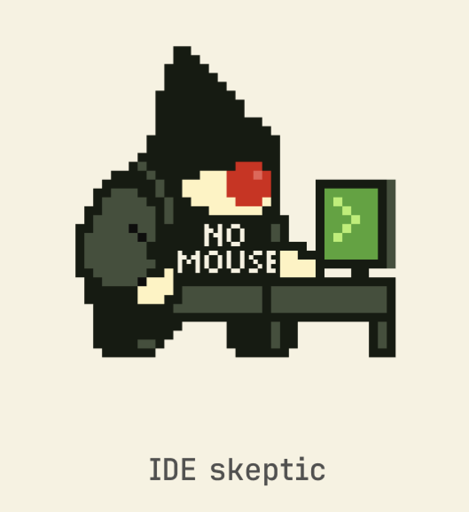

## 09. Meme-driven dev(梗驱动开发者)

**Describe**：

You speak fluent meme. That’s how you explain bugs and survive reviews. No meme? Then, it didn’t happen.

> 你精通各种梗。你用梗来解释漏洞，用梗来应对代码审查。没有梗？那这事就没发生过。

**Character Code**：

Your Duke character code：`0b435eb9bfc2464bd9ef61bb8d5d8846`。

**Rendering**：

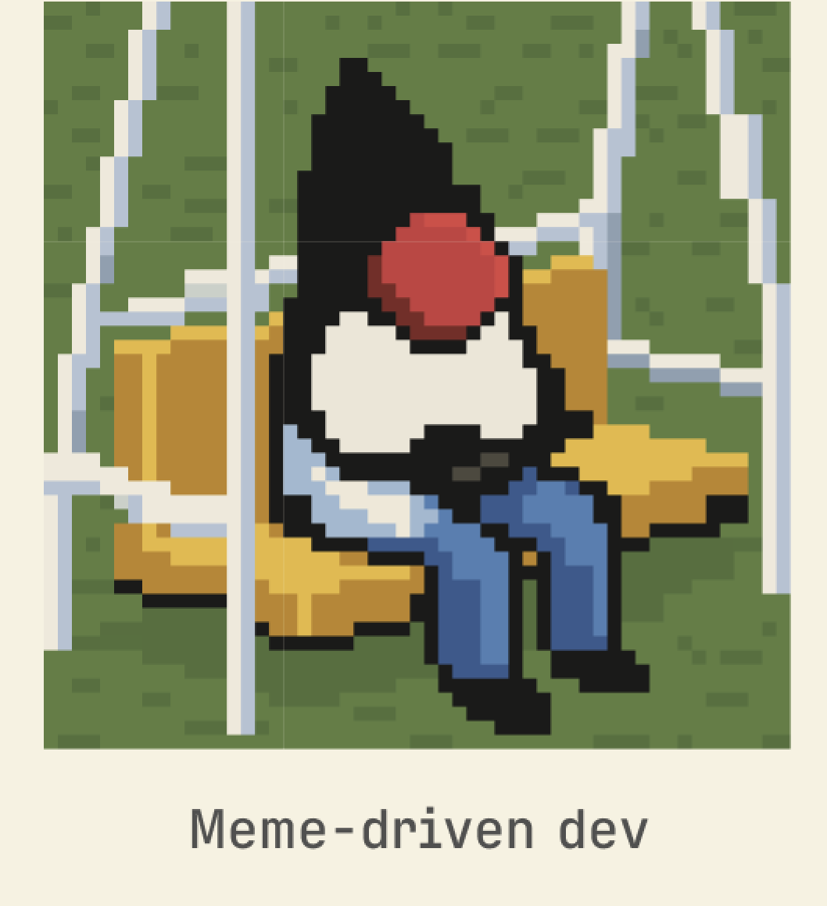

## 10. Director of agents(代理总监)

**Describe**：

You don’t code, you command. The agents do your bidding, and you take the credit.

> 你不是在写代码，而是在发号施令。代理们听从你的指令，而你则收获所有的赞誉。

**Character Code**：

Your Duke character code：`60d5d194ecf1215296d3cdcf719ca89d`。

**Rendering**：

## 11. Microservice guru(微服务大师)

**Describe**：

You see systems as stories – split, scalable, and speaking over HTTP. You don’t build apps. You shape universes.

> 你将系统视为故事——它们被拆分、可扩展，并通过HTTP进行通信。你不是在构建应用程序，而是在塑造一个个宇宙。

**Character Code**：

Your Duke character code：`f69c946282538cbac54b9539c216def9`。

**Rendering**：

## 12. IDE loyalist(IDE 忠诚者)

**Describe**：

You picked your IDE once, and now it’s basically a lifestyle. When it crashes, you crash with it.

> 你选择了一款 IDE，现在它几乎成了你的一种生活方式。当它崩溃时，你也会跟着崩溃。

**Character Code**：

Your Duke character code：`3a2ce589d224acb366b5116f84e86ca6`。

**Rendering**：

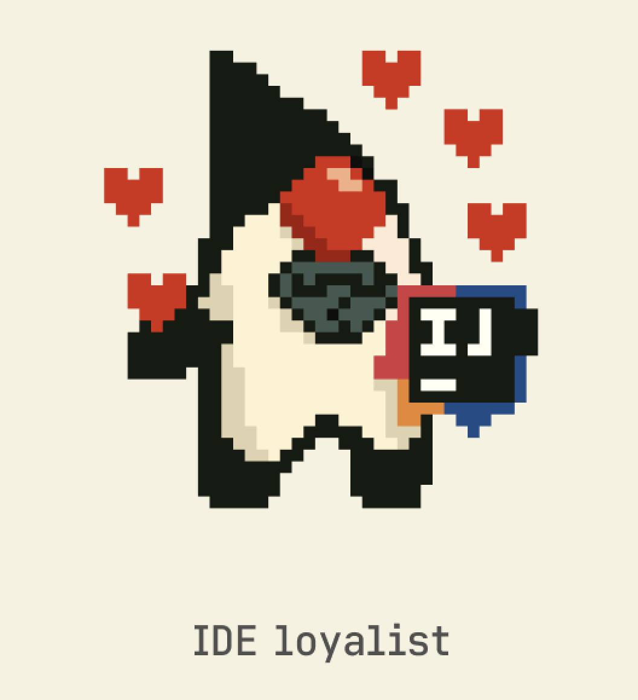

## 13. Framework collector(框架收藏家)

**Describe**：

You’ve seen every framework, tried most, and remember them all. Your toolbox is a museum, and you’re the curator.

> 你见识过每一个框架，尝试过大多数，并且对它们都记忆犹新。你的工具箱就像一座博物馆，而你是馆长。

**Character Code**：

Your Duke character code：`69225e22e6ded2f60f1065db941a0f6e`。

**Rendering**：

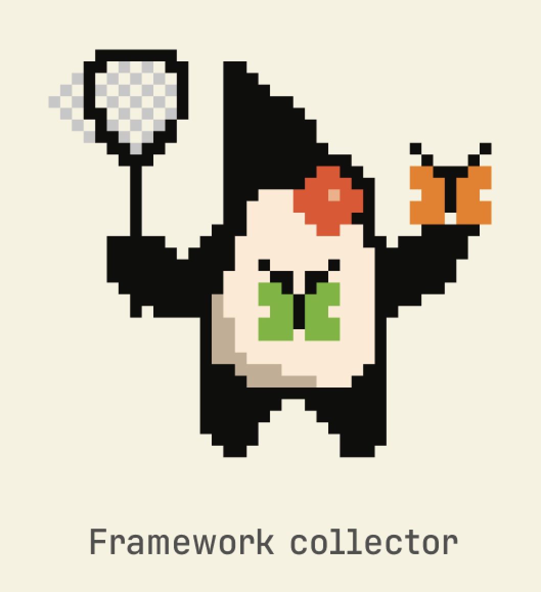

## 14. Lambda ambassador(Lambda 大使)

**Describe**：

-> is your signature. One-liners, your style. Clean, sharp, and just cryptic enough to make them wonder.

> `->` 是你的标志。一行代码就是你的风格。简洁、锐利，且足够神秘，让人忍不住去琢磨。

**Character Code**：

Your Duke character code：`19672ab97b05acc9743cbbf560afaf18`。

**Rendering**：

## 15. Zoom shadow(Zoom 影子)

**Describe**：

Since the pandemic, you’ve turned your camera on. Your teammates’ background talks is your productivity soundtrack.

> 自从疫情开始，你一直开着摄像头。队友们背景中的交谈声就是你高效工作的背景音乐。

**Character Code**：

Your Duke character code：`110eefd412c6be4d2864894af8f3f0cb`。

**Rendering**：

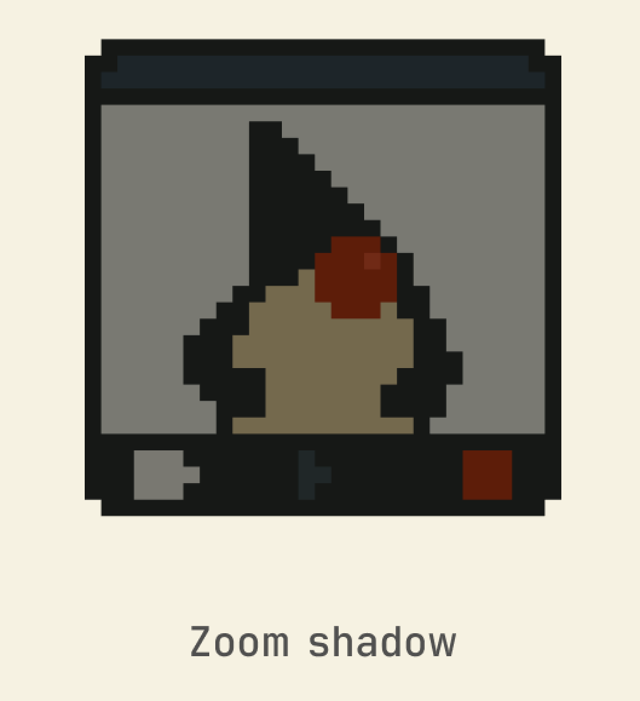

## 16. Friday deployer(周五部署者)

**Describe**：

You ship on Fridays because you like to feel alive. It’s brave. It’s chaotic. It’s very you.

> 你在周五进行部署，因为你喜欢那种充满活力的感觉。这是勇敢的，这是混乱的，这很像你。

**Character Code**：

Your Duke character code：`f76af4e3cd9b3832ee30c7919e99ae17`。

**Rendering**：

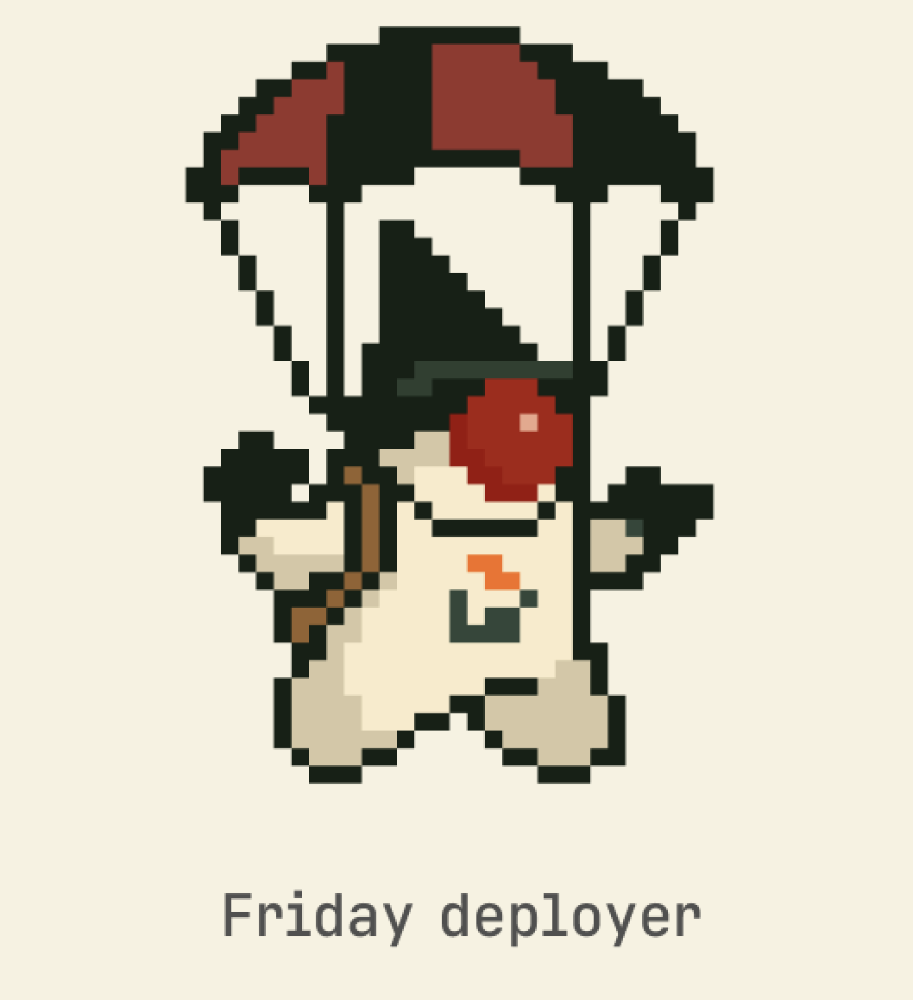

## 17. Web chaos Duke(网页混乱公爵)

**Describe**：

You built a homepage with four fonts, two applets, and one soul. No regrets, just GIFs.

> 你用四种字体、两个小程序和一颗灵魂搭建了一个主页。没有遗憾，只有GIF图。

**Character Code**：

Your Duke character code：`f62cd724d63ad6f54151403bd73e874c`。

**Rendering**：

## 18. Stack Overflow prophet(Stack Overflow先知)

**Describe**：

You don’t debug, you find answers. Always in a 12-year-old thread with one upvote and "This saved my life" comment.

> 你不是在调试，而是在寻找答案。总是在一个有12年历史的帖子中，只有一个点赞和“这救了我的命”的评论。

**Character Code**：

Your Duke character code：`e5c81f16e574e1f9c5f68f15b9d314f4`。

**Rendering**：

## 19. The applet evangelist(小程序传道者)

**Describe**：

You put Java in the browser and called it innovation. It blinked, and it crashed, but you believed.

> 你把Java放到了浏览器里，并称之为创新。它闪烁，它崩溃，但你坚信不疑。

**Character Code**：

Your Duke character code：`83828e5cd7f44ca1a53c7197382ea224`。

**Rendering**：

## 20. Dark theme Duke(暗黑主题公爵)

**Describe**：

You code in the dark and you like it that way. Light mode is for quitters.

> 你在黑暗中编码，并且喜欢这种方式。浅色模式是给那些半途而废的人准备的。

**Character Code**：

Your Duke character code：`b1ececb71ab88dfd65cf40966d8eb135`。

**Rendering**：

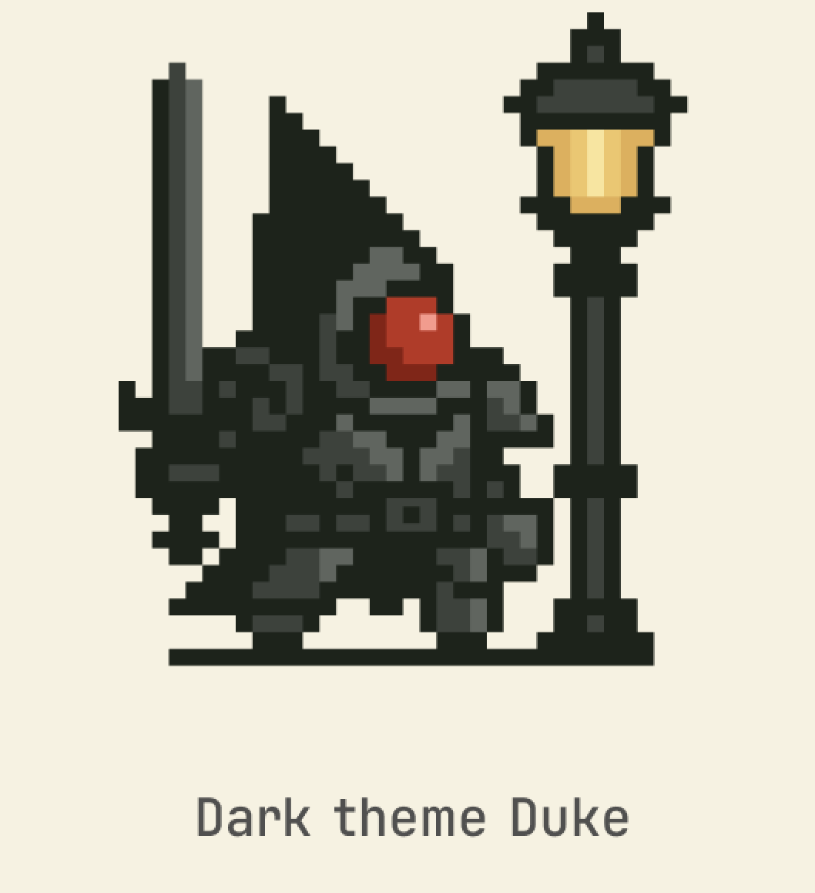

## 21. Javafluencer(Java影响者)

**Describe**：

You ship clean code and content. One hand on the keyboard, the other posting a tutorial that’s already going viral.

> 你提供干净的代码和优质内容。一只手在键盘上飞舞，另一只手则在发布一个即将爆火的教程。

**Character Code**：

Your Duke character code：`ad383f39cbf1d69607223f66c07bdd1e`。

**Rendering**：

## 22. Debugger in baggy jeans(穿宽松牛仔裤的调试大师)

**Describe**：

You squash bugs in oversized hoodies with style. The stack trace fears you.

> 你穿着宽松的连帽衫，以酷炫的风格消灭漏洞。堆栈跟踪都怕你。

**Character Code**：

Your Duke character code：`7cddee11a6a1af5477479c1aaad86f66`。

**Rendering**：

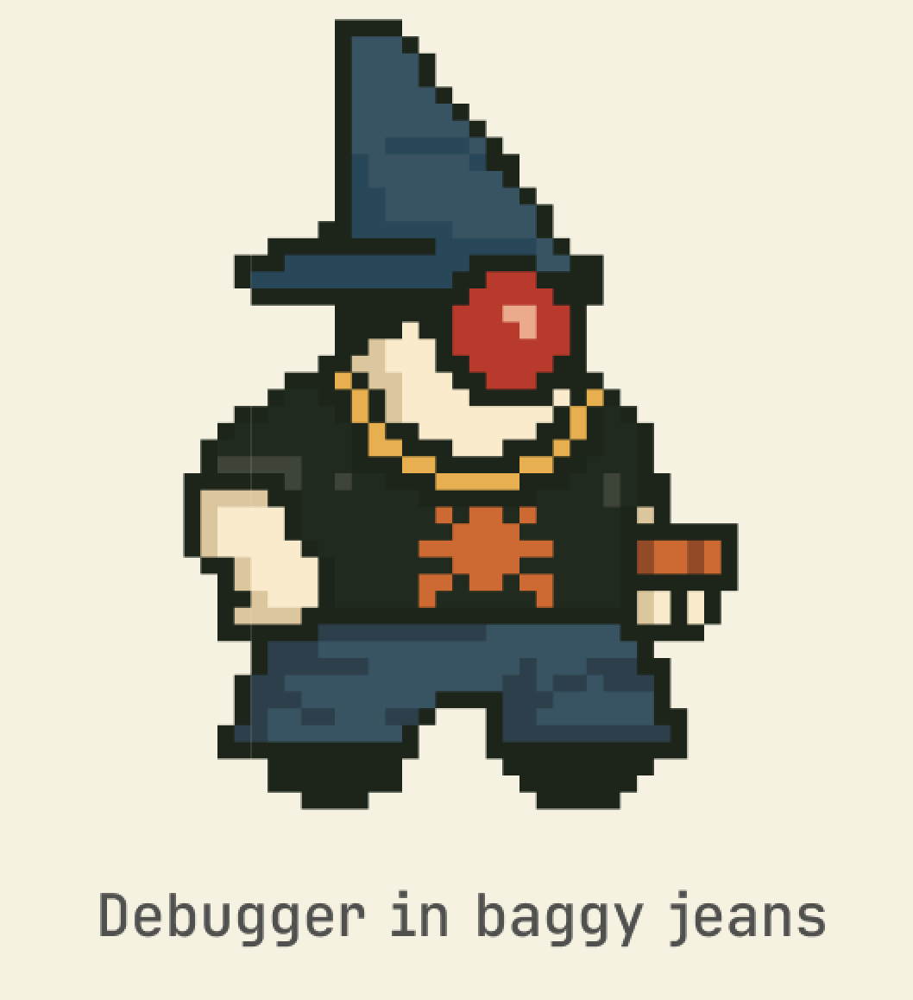

## 23. AI-powered dev(AI驱动的开发者)

**Describe**：

You no longer write code — you accept it. AI Assistant is your colleague, your editor, and maybe your therapist.

> 你不再编写代码——你接受它。AI助手是你的同事、你的编辑，甚至可能是你的心理医生。

**Character Code**：

Your Duke character code：`935953a74313da7ec95c6dbfadfaca02`。

**Rendering**：

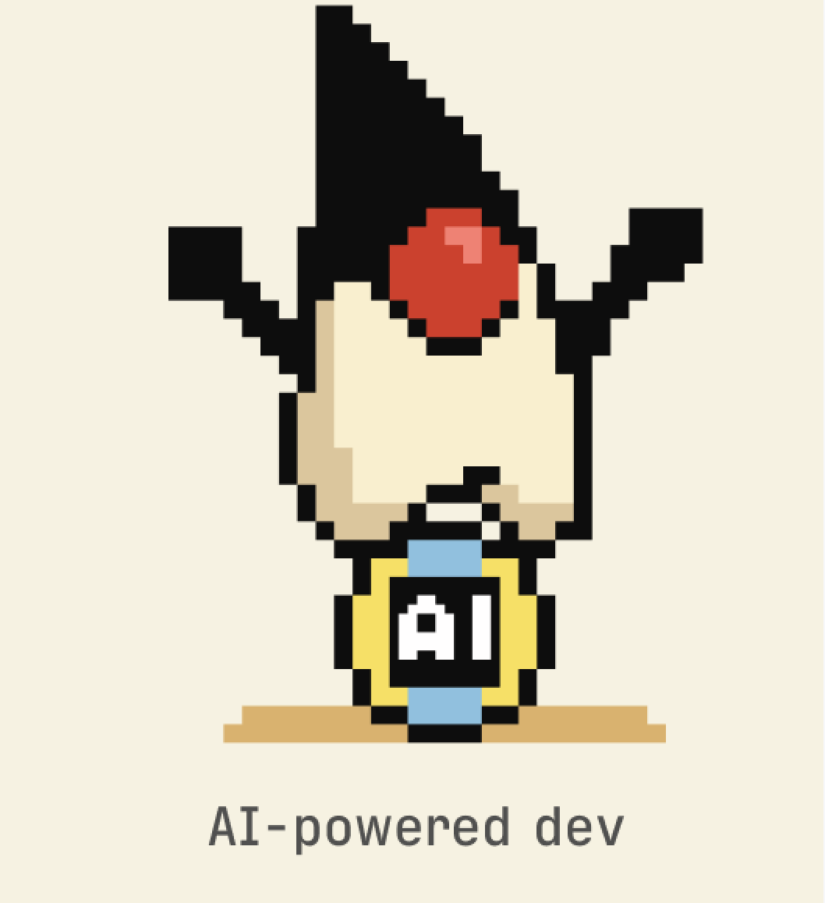

## 24. Lord of agents(代理领主)

**Describe**：

Agents don’t help you; they work for you. They debug and refactor while you pull the strings.

> 代理不是来帮助你的，而是为你工作的。它们负责调试和重构代码，而你则是幕后操纵的那个人。

**Character Code**：

Your Duke character code：`9116a07e790bd5af3f7f8a2bff210657`。

**Rendering**：

## 25. Shift+Shift Duke(Shift+Shift公爵)

**Describe**：

You summon IntelliJ IDEA search like it’s a superpower. If it’s not searchable, it doesn’t exist.

> 你像使用超能力一样召唤IntelliJ IDEA的搜索功能。如果它不可搜索，那它就不存在。

**Character Code**：

Your Duke character code：`87c1125501ead2504419b534ffe1d00d`。

**Rendering**：

## 26. Optional oracle(Optional神谕者)

**Describe**：

You wrapped your whole codebase in Optional and called it peace of mind. Null can’t hurt you anymore.

> 你将整个代码库都封装在`Optional`里，并称之为安心。空值（`null`）再也伤不到你了。

**Character Code**：

Your Duke character code：`1d8b5b90ef272c283a93a1f94fd16dd1`。

**Rendering**：

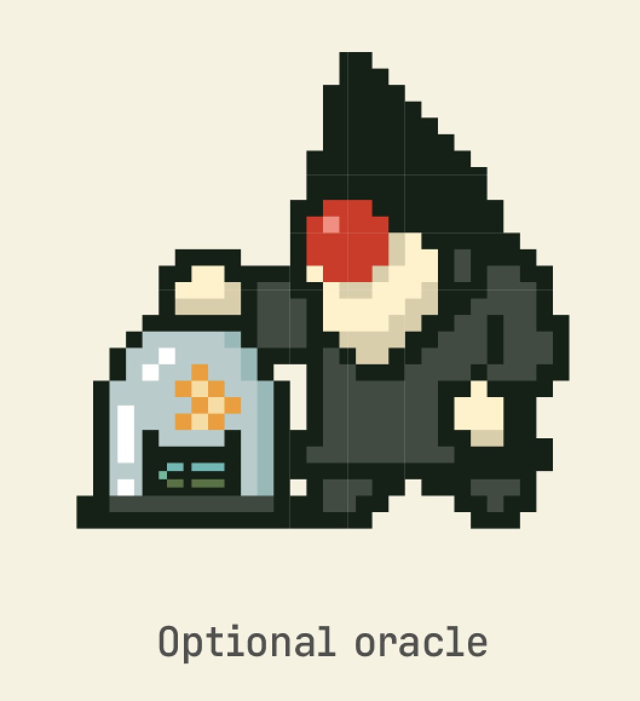

## 27. Conference king(会议之王)

**Describe**：

You attend talks, hoard stickers, and network like it’s a side quest. You came for the swag. You stayed for the swag.

> 你参加讲座，收集贴纸，像完成一个支线任务一样拓展人脉。你是为了周边产品而来，也为了周边产品而留下。

**Character Code**：

Your Duke character code：`882c4006ef2fef660df2cc9d33c08198`。

**Rendering**：

## 28. The JavaZilla(Java巨兽)

**Describe**：

Once you wrote an app that devoured a team. No one understands it, but it still runs – somehow.

> 曾经，你写了一个吞噬整个团队的应用程序。没人能理解它，但它仍然在运行——不知何故。

**Character Code**：

Your Duke character code：`6c0e8437227d1951391aeaa240f11cdd`。

**Rendering**：

## 29. Stack trace therapist(堆栈跟踪治疗师)

**Describe**：

You read errors like poetry and fix bugs with empathy. Your debugger is basically a confessional booth.

> 你像读诗一样阅读错误信息，并带着同理心修复漏洞。你的调试器简直就是一间忏悔室。

**Character Code**：

Your Duke character code：`ed28f2945037a6d7a5985cc3d766bfeb`。

**Rendering**：

## 30. Prompt perfectionist(提示词完美主义者)

**Describe**：

You rewrite prompts like they’re haikus. When the AI finally gets it right, it feels like love.

> 你像写俳句一样精心改写提示词。当AI终于理解正确时，那种感觉就像恋爱一样。

**Character Code**：

Your Duke character code：`5a0932b1ea26a39e72380fd7f4fd60c9`。

**Rendering**：

