---
文章分类:
  - 编程语言与技术
文章标签:
  - 理论
文章简介: 
文章精选:
  - 否
是否发布:
  - 否
发布时间: 
创建时间: 2024-08-05
修改时间: 2024-12-08
---

### 1. 死锁

**死锁**：指两个或两个以上的进程在执行过程中，由于竞争资源或者彼此通信而造成的一种阻塞的现象，若无外力作用，它们都将无法推进下去。此时称系统处于死锁状态或系统产生了死锁，这些永远互相等待的进程称为死锁进程。

**死锁产生的原因**：1. **竞争资源**；2. **进程调度顺序不当**。

**竞争资源**：

- 共享资源数量不满足各个进程需求。
- 各个进程之间发生资源竞争导致死锁。

**死锁的四个必要条件**：1. **互斥条件**；2. **请求保持条件**；3. **不可剥夺条件**；4. **环路等待条件**。

互斥条件：

- 进程对资源的使用是排他性的使用。
- 某资源只能由一个进程使用，其他进程需要使用只能等待。

请求保持条件：

- 进程至少保持一个资源，又提出新的资源请求。
- 新资源被占用，请求被阻塞。
- 被阻塞的进程不释放自己保持的资源。

不可剥夺条件：

- 进程获得的资源在未完成使用前不能被剥夺。
- 获得的资源只能由进程自身释放。

环路等待条件：

- 发生死锁时，必然存在进程-资源环形链。

**解除死锁的方法**：1. **摒弃请求保持条件**；2. **摒弃不可剥夺条件**；3. **摒弃环路等待条件**。

摒弃请求保持条件：

- 系统规定进程运行之前，一次性申请所有需要的资源。
- 进程在运行期间不会提出资源请求，从而摒弃请求保持条件。

摒弃不可剥夺条件：

- 当一个进程请求新的资源得不到满足时，必须释放占有的资源。
- 进程运行时占有的资源可以被释放，意味着可以被剥夺。

摒弃环路等待条件：

- 可用资源线性排序，申请时必须按照需要递增申请。
- 线性申请不再形成环路，从而摒弃了环路等待条件。

**解除死锁的算法**：**银行家算法**

- 客户申请的贷款是有限的，每次申请需声明最大资金量。
- 银行家在能够满足贷款时，都应该给用户贷款。
- 客户在使用贷款后，能够及时归还贷款。

### 2. 同步问题三大经典案例

**生产者-消费者问题**：

- 一组生产者进程、一组消费者进程、一个缓冲区。
- 生产者在缓冲区溢出前，不断从缓冲区生产数据。
- 消费者在缓冲区为空前，不断从缓冲区消费数据。

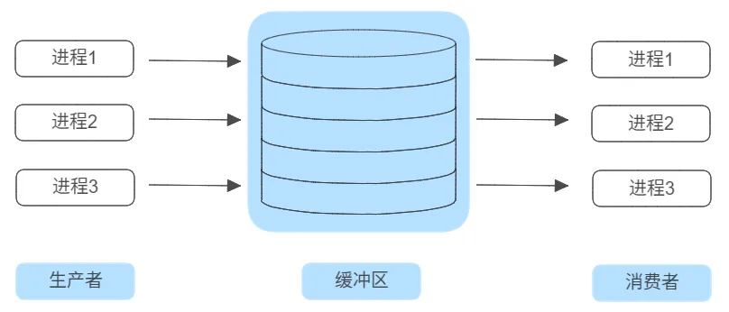

生产者-消费者通过缓冲区存在**同步关系**：

- 当缓冲区满时，生产者必须等待消费者消费数据。
- 当缓冲区空时，消费者必须等待生产者生产数据。

生产者-消费者、生产者之间、消费者之间存在**互斥关系**：

- 对缓冲区数据进行存取操作时，必须互斥进行。

**读者-写者问题**：

- 不同的线程读写者操作同一个数据可能会导致该数据出错。
- 发生时机：寄存器 <-> 主存；主存 <-> 辅存。

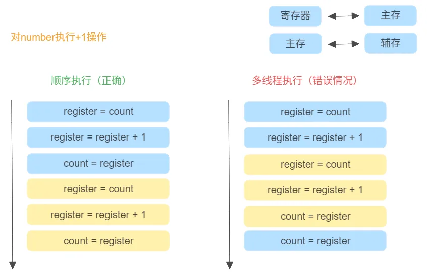

- 读-写操作之间存在同步关系。
- 多个写操作应该串行完成。

**哲学家进餐问题**：

有五个哲学家，他们的生活方式是交替地进行思考和进餐，哲学家共同使用一张圆桌，分别坐在周围的五张椅子上，在圆桌上有五个碗和五支筷子。平时哲学家们只进行思考，饥饿时则试图取靠近他们的左、右两支筷子，只有两支筷子都被他拿到的时候就能进餐，进餐完毕之后，放下左右筷子继续思考。

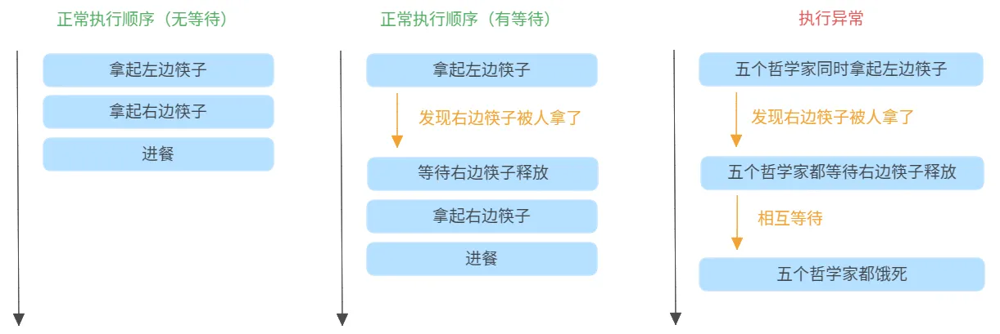

**临界资源**：指一些虽作为共享资源却又无法同时被多个线程共同访问的资源。当有进程在使用临界资源时，其他进程必须依据操作系统的同步机制等待占用进程释放该共享资源才可重新竞争使用共享资源。

**原子性**：

- 原子性是指一系列操作不可被中断的特性。
- 这一系列操作可能么全部执行完成，要么全部没有执行。
- 不存在部分执行部分未执行的情况。

### 3. 锁的种类

**锁的种类**：1. 乐观锁 / 悲观锁；2. 无锁 / 偏向锁 / 轻量级锁 / 重量级锁；3. 公平锁 / 非公平锁；4. 可重入锁 / 非可重入锁；5. 共享锁 / 排他锁。

**乐观锁 / 悲观锁**：

- 乐观锁默认不添加锁，悲观锁每次操作都加锁。
- 乐观锁适合读操作的场景，悲观锁适合写操作的场景。

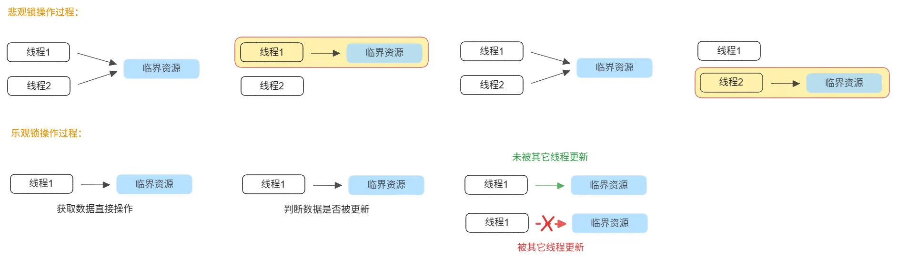

**无锁 / 偏向锁 / 轻量级锁 / 重量级锁**：

- 无锁：不锁资源，多个线程只一个线程修改成功，其他线程会重试。
- 偏向锁：同一个线程执行临界资源会自动获取资源。
- 轻量级锁：多个线程竞争同步资源时，没有获得资源的线程自旋等待锁释放。
- 重量级锁：多个线程竞争同步资源时，没有获得资源的线程阻塞等待唤醒。

**公平锁 / 非公平锁**：

- 公平锁：等待锁的线程不会饥饿等待；但整体吞吐效率相对非公平锁要低。
- 非公平锁：整体吞吐效率高，CPU不必唤醒所有线程；但会出现饥饿等待。

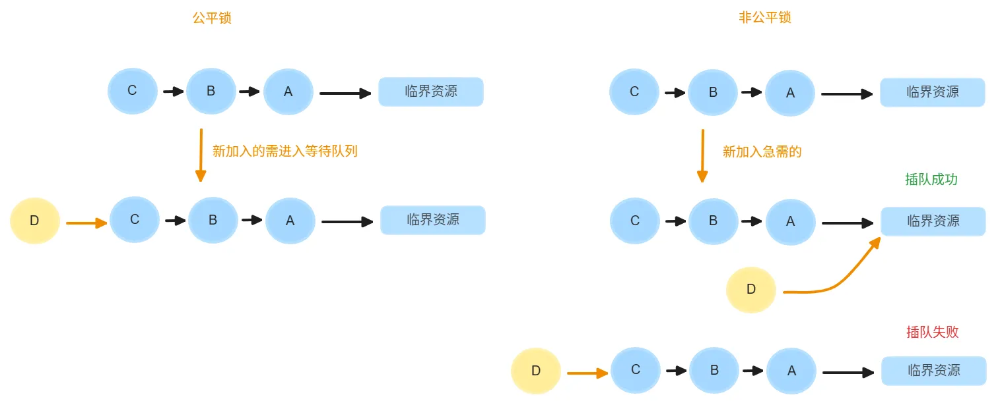

**可重入锁 / 非可重入锁**：

- 重入：任意线程获取锁以后，这个线程再次获得该锁时不会阻塞。
- 可重入锁（递归锁）：指同一个线程在外层方法获取锁的时候，再进入该线程的内部方法会自动获取锁，不会因为之前已经获取过还没释放而阻塞。
- 非可重入锁：当前线程再次获取当前线程已经获得的锁时，如果该锁低仍被线程所持有未被释放，那么将会出现死锁。

**共享锁 / 排他锁**：

- 排他锁（互斥锁）：指该锁一次只能被一个线程所持有。
- 共享锁：指该锁可被多个线程所持有。
- 获得共享锁的线程只能读数据，不能修改数据。

### 4. 线程间通信

**线程间通信的常见方法**：1. 互斥锁（mutex）；2. 自旋锁（spin_lock）；3. 读写锁（rwlock）；4. 条件变量（condition）。

**互斥锁（mutex）**：

- 互斥锁是最简单的线程同步方法。
- 互斥量（互斥锁）处于两态之一的变量：解锁和加锁。
- 两个状态可以保证资源的串行访问。
- 操作系统层和高级语言都直接提供了接口，可直接使用。

**自旋锁（spin_lock）**：

- 自旋锁也是一种多线程同步的变量。
- 使用自旋锁的线程会反复检查变量是否可用。
- 自旋锁不会让出CPU，是一种**忙等待**的状态。
- 自旋锁避免了进程或线程上下文切换的开销。
- 操作系统内部很多地方使用的是自旋锁。
- 自旋锁不适合在单核CPU中使用。

**互斥锁和自旋锁的区别**：当遇到访问的资源被其他线程占用时，互斥锁会让出当前的CPU；而自旋锁则会占用当前CPU，直到属于它的时间片用完。

**读写锁（rwlock）**：

- 适合临界资源多读少写，因为读取时并不会改变临界资源的值。
- 读写锁是一种特殊的自旋锁。
- 允许多个读者同时访问资源以提高读性能。
- 对于写操作来说是互斥的。

**条件变量（condition）**：

- 条件变量是一种相对复杂的线程同步方法。
- 条件变量允许线程睡眠（wait），直到满足某种条件。
- 当满足条件时，可以向该线程发送信号，通知唤醒（signal）。

### 5. 进程间通信

**进程间通信的方法**：1. 管道；2. 消息队列；3. 共享内存；4. 信号；5. 套接字。

**管道（pipe）**：分为**匿名管道**和**命名管道**，主要是在Linux中。是将前一个结果作为后一个的输入。

```
# 匿名管道 示例
netstart -anlp | grep 8080
cat server.log | grep ERROR | grep Thread
man netstart | more

# 命名管道
mkdifo pipe1 # 创建管道
echo "this is a pipe1 demo" > pipe1 # 写入管道
cat pipe1 # 查看管道
```

**消息队列**：

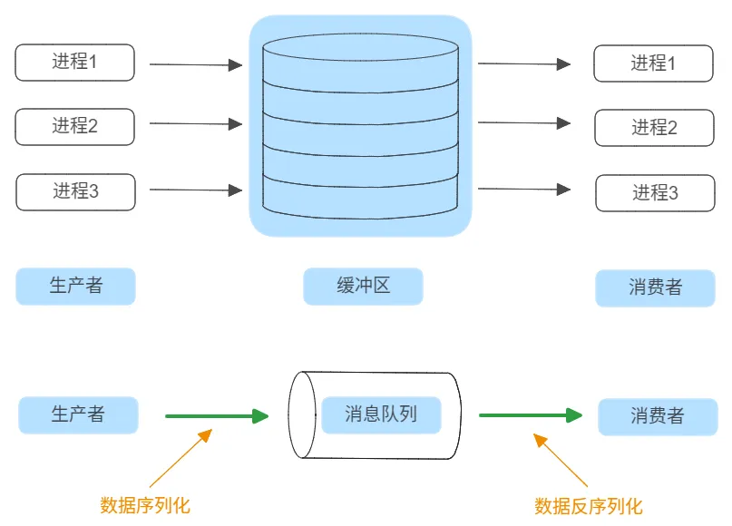

单进程间通信和跨进程间通信：

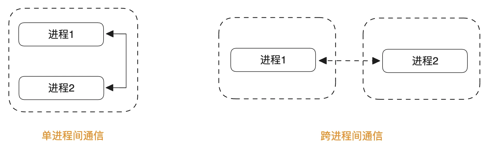

- 消息中间件：Kafka、RabbitMQ...

**共享内存**：

- 在某种程度上，多进程是共同使用物理内存的。
- 由于操作系统的进程管理，进程间的内存是独立的。
- 共享存储允许不相关的进程访问同一片物理内存。
- 共享内存是两个进程之间共享和传递数据最快的方式。
- 共享内存**未提供同步机制**，需要借助其他机制管理访问。

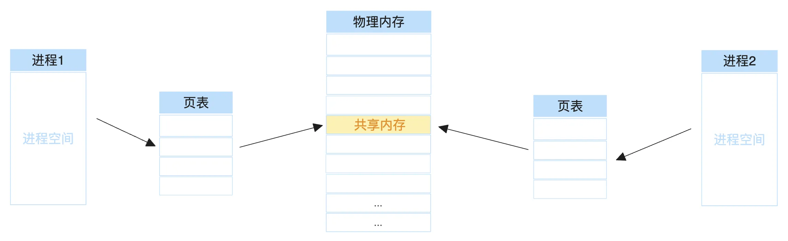

**信号**：

- 在操作系统中，不同信号使用不同的值来表示。
- 接收信号的进程需要注册对应的信号处理函数。
- 例如：`kill -l`，查看支持信号列表。


**套接字**：

可以进行单进程间通信和跨进程间通信：


网络套接字（Socket）：属于跨进程间通信，由IP地址 + 端口组成。

域套接字：是一种高级的进程间通信的方法；Unix域套接字可以用于同一机器进程间通信；Unix系统提供的域套接字提供了网络套接字类似的功能；Unix域套接字无需经过完整的网络协议栈。

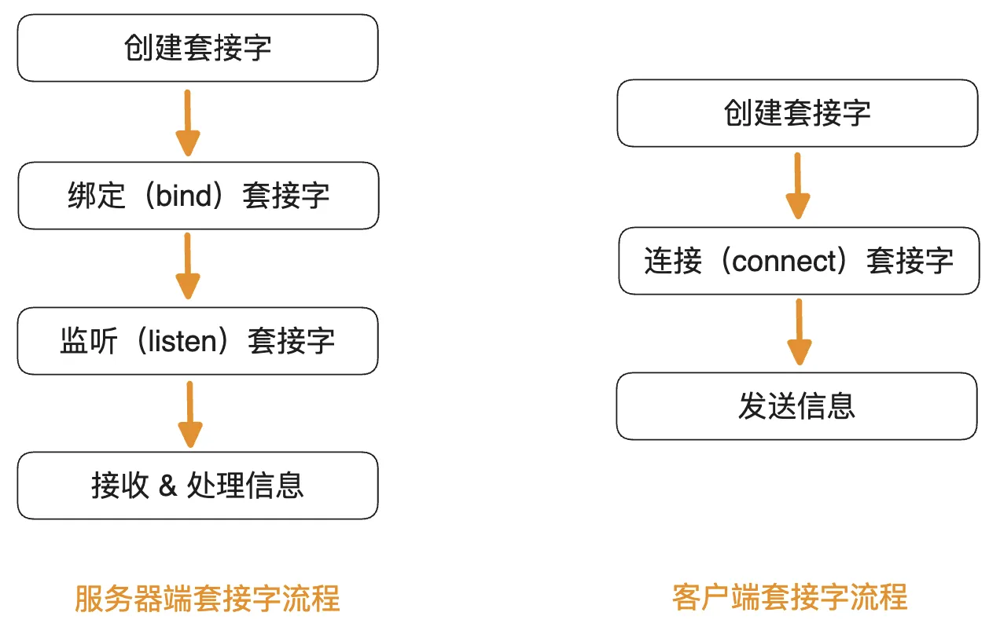

### 6. CAS原理与无锁技术

**大量使用锁的弊端**：

- 开发难度：并行系统访问临界资源必须考虑加锁。
- 墨菲定律：只要存在的一定会发生，死锁。
- 调度问题：低优先级线程持有锁导致高优先级线程无法执行。
- 性能问题：满足一致性要求的前提下需要串行访问。
- 锁粒度：锁粒度过小/过大，设计不当。

**CAS技术**：是无锁技术的基石，原理就是原子性。一系列操作不可中断的特性，要么全做，要么全不做。

CAS（Compare & Set，或 Compare & Swap），现在几乎所有的CPU指令都支持**CAS原子性操作**，而在X86下对应的是CMPXCHG汇编指令。伪代码如下所示：

```C++
int compare_and_swap(int* reg, int oldval, int newval){
    int old_reg_val = *reg;
    if(old_reg_val == oldval){
        *reg = newval;
        return old_reg_val;
    }
}
```

- CAS：比较旧值 和 交换新值。
- Fetch And Add：一般用来对变量做 +1 的原子操作。
- Test And Set：写值到某个内存位置并传回其旧值。

**CAS与无锁队列**：

有锁队列时的操作示意图：

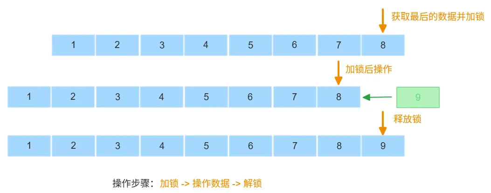

无锁队列操作伪代码：

```C++
void* push(queue* q, void* data){
    void* old_tail, new_tail;
    do{
        old_tail = q->tail;
        new_tail=data;
    }while(!CAS(q->tail, old_tail, new_tail))
}
```

- 通过CAS操作，不锁队列；进行循环重试，直至成功。
- 并发场景下，如果CAS执行失败，则说明此刻有其他线程正在插入数据。
- 并发场景下，如果CAS执行成功，则说明当前线程插入成功。

**CAS的ABA问题**：指CAS交换数据在多次操作后恢复原值而线程无法感知的问题。

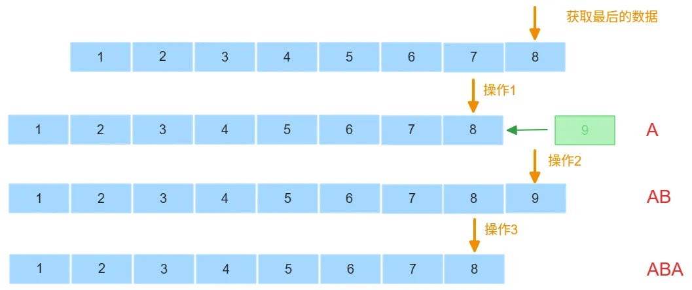

**解决CAS的ABA问题方法**：加入操作的版本号；CAS除了比较旧值外，还需要比较版本号是否为最新的。

### 7. 分布式锁实现

**分布式锁场景**：

- 订单系统、秒杀系统。
- 积分系统、消费系统。
- 消息中间件、服务中间件、数据发布-订阅。

**分布式锁相关特征**：

- 分布式部署：集群、微服务。
- 服务节点之间需要通信。
- 数据强一致性要求、性能要求、并发量要求。

**实现方案1：基于Redis**

**Redis**：是一个使用ANSI C编写的开源、支持网络、基于内存、分布式、可选持久性的键值存储数据库。

Redis具有的特性：

- 读写性能优异；
- 内存读写，可持久化数据；
- 数据类型丰富、单线程、数据自动过期、发布-订阅。

Redis单节点实现：

- 使用Redis性能优异的Key-Value数据库。
- 获取数据并加锁操作：`setnx <key> <value>`
- 释放锁：`del <dey>`
- 可能会造成：单点问题、雪崩效应。

Redis集群实现：

- 防止单点问题和雪崩效应。
- 节点通过主从来保证集群的一致性。

**实现方案2：基于Zookeeper**

**Zookeeper**是一个分布式的，开放源码的分布式应用程序协调服务，是Googole的Chubby一个开源的实现，是Hadoop和HBase的重要组件。提供一致性服务的软件，提供的功能包括：配置维护、域名服务、分布式同步、组服务等。

Zookeeper的临时节点：临时节点由某个客户端创建，当客户端与Zookeeper集群断开连接时，则该节点自动被删除。

Zookeeper实现：

- 使用Zookeeper的数据节点：znode临时节点；
- 服务1在Zookeeper中创建znode1；
- 服务2在Zookeeper中创建znode1，会创建失败；
- 服务1释放znode（断开连接），服务2创建成功。

**实现方案3：基于MySQL**

**MySQL**提供一致性服务：事务、表级锁、行级锁。

MySQL实现：

- 设置UNIQUE KEY：表级唯一，不能重复插入。
- 通过MySQL保证同一个KEY只有一个节点插入成功。
- 删除记录时释放锁。

将锁的竞争压力交给MySQL，为防止MySQL的单点问题，也可以通过集群解决。

**现在的分布式锁框架**：

- SharkLock：京东，是开源的基于Redis的分布式锁实现。
- Chubby：Google，由Google开发的一种分布式锁服务，是基于Paxos算法的锁服务，但没有公开源代码。
- Redisson：Redis服务，是一个基于Java的Redis客户端库。
- Curator：Netflix，由Netflix开源的一套用于Apache ZooKeeper客户端的丰富API。
- ETCD：go 技术，是一个分布式键值存储系统，使用Raft算法来保证数据的一致性。
- consul：Java 技术，由HashiCorp开发的分布式服务发现和配置共享系统。

### 8. 计算机的层次结构划分

**计算机分层的原因**：为了符合一个良好的设计规范，复杂系统的实现要有清晰的分层设计。

**计算机的层次结构**：

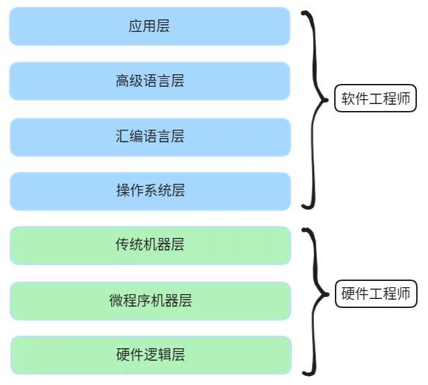

**应用层**：满足用户在各种场景下便捷使用计算机的需求。办公场景、娱乐场景、学习场景等。

**高级语言层**：

- 面向程序员的计算机层次。Java、C/C++、Python等。
- 编程实现易用的应用层软件提供用户使用。

**汇编语言层**：

- 面向偏底层软件工程师的计算机层次。嵌入式工程师、二进制安全、机械自动化等。
- 汇编语言可以翻译成可直接执行的机器语言。

**操作系统层**：

- 传统硬件与传统软件的分界线。
- 向上提供了简易的操作接口。向下对接了指令系统，管理硬件资源。

**传统机器层**：微程序。

**微程序机器层**：微指令。

**硬件逻辑层**：门电路。

### 9. 程序编译与程序解释

**语言表达过程**：

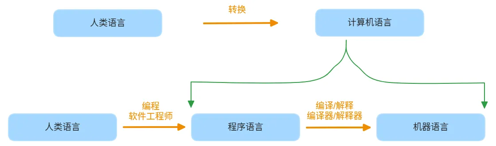

**程序编译过程**：


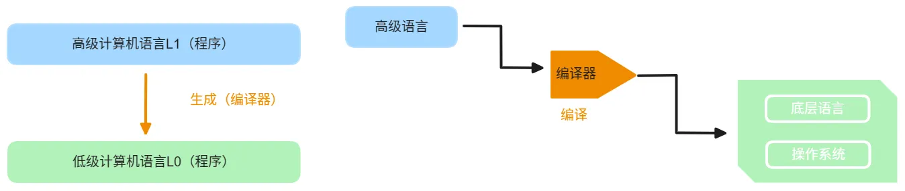

**程序解释过程**：


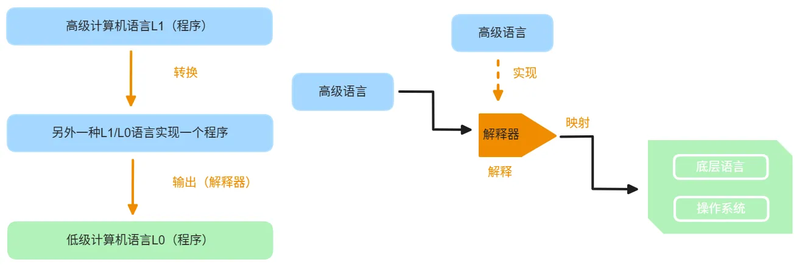

**常见的编译与解释语言**：

- 编译语言：C/C++、Object-C、Golang等。
- 解释语言：Python、Php、JavaScript等。

**Java语言过程**：

- 高级语言 -> **虚拟机** -> 操作系统
- Java程序 -> Java字节码 -> Java虚拟机 -> 操作系统

虚拟机存在目的：**一次张编译，随处运行**。

- 解决不同平台不同编译器的问题
- 解决不同平台部署需要重新编译的问题
- 解决编译结果不复用的问题

**Java虚拟机与字节码【编译+解释】**：


**字节码**（Bytecode）：指已经经过编译，但与特定机器代码无关，需要解释转译后才能成为机器代码的中间代码。字节码可能与源码不同，不便于理解，是编码后的数据常量、引用、指令等构成的序列。

### 10. 编译器原理

**编译器的运行过程**：

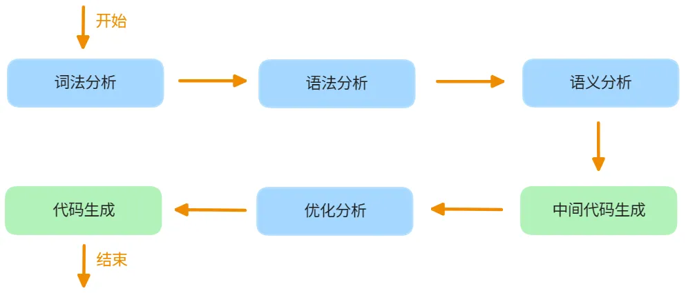

**词法分析**：对保留关键字、运算符、变量等进行操作；将字符流转化为符号流。

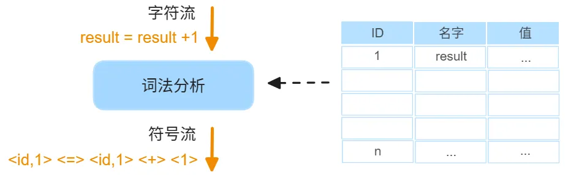

**语法分析**：构建语法树，判断代码是否有误。将符号流转化为语法树。

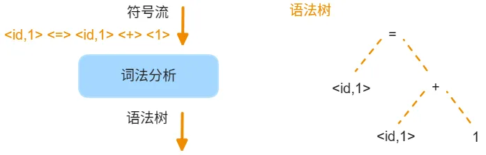

**语义分析**：构建语义树，对类型进行检查和类型转换进行判断。

**中间代码生成**：生成计算机可以识别的代码。

**优化分析**：对中间代码进行合并，减少指令条数。

**代码生成**：将优化的内容映射为计算机可执行的指令。

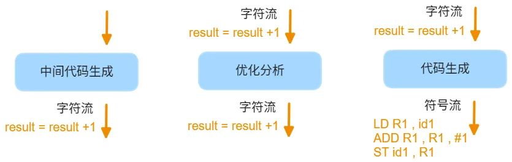

### 11. 程序运行原理

**CPU体系结构**：

- 二进制程序本质是一条一条的CPU指令。在不同的CPU体系结构中，指令集也是有所不同的。
- 部分程序在跨平台时需要重新编译，例如：C/C++；但也有部分程序在跨平台时不需要重新编译，例如：Java。
- 在运行时需要考虑的内容有：将程序以何种方式加载至内存，怎样定位程序的入口函数地址，系统应如何进行程序运行的内存初始化工作。
- 在不同系统中其运行程序的文件名称是不相同的。MacOS：Mach-O；Linux：ELF；Windows：PE。

**程序运行过程**：


**以C/C++为例，从源码文件（test.cpp）到可执行的二进制文件（main），程序运行过程**：

1. **预编译**：对一些代码文本的替换工作。包括：`#define`、`#include`、条件编译和代码注释等。
2. **编译**：`g++ -c test.cpp -o test.o`，将源文件转化为目标文件。
3. **汇编**：将汇编的代码转成机器码。早期汇编和编译是分为两步，汇编器和编译器；现在合并为了一步，统一为编译器。
4. **链接**：取得`test.o`目标文件仅仅是源码文件`test.cpp`编译成的二进制文件。如果源码文件中有引用其他程序文件`a.cpp`，则在没有经过链接过程是不能够执行的。编译引用文件：`g++ -c a.cpp -o a.o`；链接：`g++ a.o test.o -o main`。**在调用系统库、第三方库实现相关功能时，一般采用动态链接库**。
5. **装载**：将执行文件加载到内存中运行。确定进程入口地址和完整的进程空间。涉及到虚拟内存空间、段页式存储管理。

**装载的空间相关字段**：

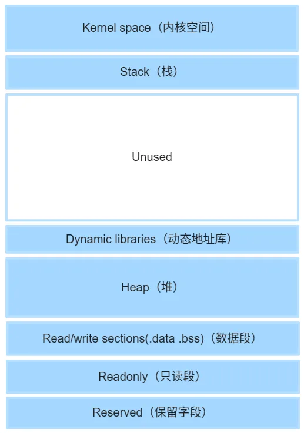

**以Java为例，从源码文件到可执行的二进制程序，程序运行过程**：


解释执行效率不如本地二进制执行效率。Java虚拟机负责解释字节码。

**JIT技术（Just In Time）**：对于存在中间代码的运行系统（Java、Python等），解释执行过程的效率不如传统本地代码的执行效率，在实现JIT的系统中，JIT可以**在运行过程动态将中间字节码编译成本地代码**，从而加快运行速度。**性能优化收益 > 编译消耗**。

### 12. 链接方式

**链接的目的**：

- 将不同目标文件之间组装为目标文件。
- 目标文件链接为可执行文件。

**链接分类**：静态链接库和动态链接库。

**库与链接库的概念**：

- **库**：是写好的、现有的、成熟的、可以复用有代码。现实中每个程序都要依赖很多基础的底层库，不可能代码都是从零开始，因此库的存在意义非同寻常。
- **链接库**：制作成通用格式的共享库，具备标准的加载接口，可以提供相同平台下不同程序使用的库。

**动态/静态链接库**：动态/静态特指链接库提供调用的不同形式，动态链接和静态链接各有优劣。

| 平台          | 动态链接库 | 静态链接库 |
| ----------- | ----- | ----- |
| **Linux**   | *.so  | *.a   |
| **Windows** | *.dll | *.lib |

**需要链接的原因**：

- 由于目标文件仅仅是将当前的源码文件编译成二进制文件。
- 没有经过链接过程的文件是不一定能够执行的。
- 调用系统库、第三方库实现相关功能。

**目标文件的字段**：

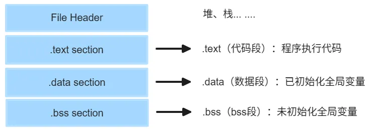

**静态链接**：

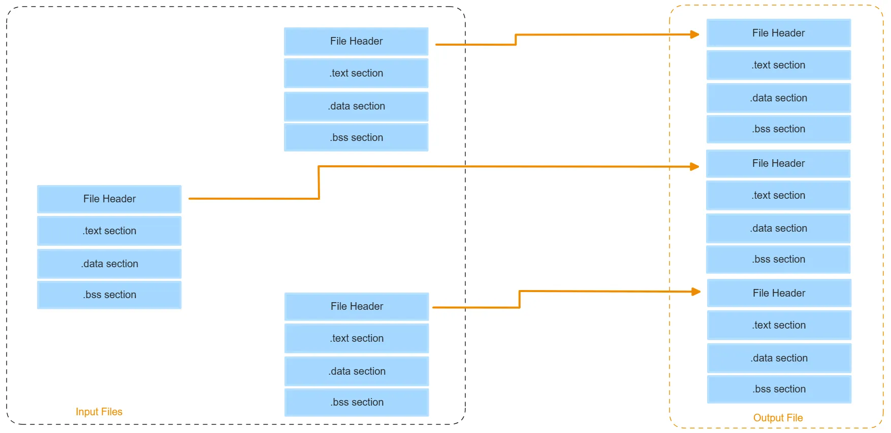

**动态链接**：

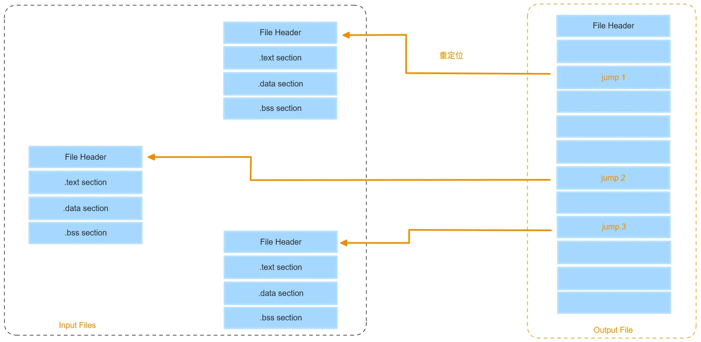

**静态链接 VS 动态链接**：

| 对比对象 | 静态链接 | 动态链接 |
| -------- | -------- | -------- |
| 内存空间     | 浪费内存空间   | 节省内存空间   |
| 编译时间     | 较长       | 较短       |
| 共享对象更新   | 麻烦       | 便捷       |
| 灵活性      | 不灵活      | 较灵活      |
| 启动速度     | 较快       | 较慢       |
| 寻址速度     | 较高       | 较低       |
