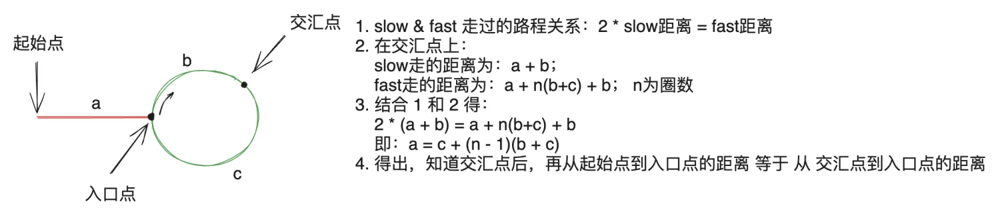

---
文章分类:
  - 编程语言与技术
文章标签:
  - 理论
文章简介: 
文章精选:
  - 否
是否发布:
  - 否
发布时间: 
创建时间: 2024-08-05
修改时间: 2024-12-08
---

### 1. 时间复杂度与空间复杂度

**时间复杂度**：描述算法运行时间的函数。使用大**O**符号表示。

时间复杂度的常见示例：

| 复杂度        | 名称  |
| ---------- | --- |
| O(1)       | 常数阶 |
| O(n)       | 线性阶 |
| O(n2)      | 平方阶 |
| O(log n)   | 对数阶 |
| O(n log n) | 对数阶 |
| O(2n)      | 指数阶 |

常见排序对应的时间复杂度：

| 排序方法 | 复杂度        |
| ---- | ---------- |
| 冒泡排序 | O(n2)      |
| 选择排序 | O(n2)      |
| 归并排序 | O(n log n) |
| 插入排序 | O(n2)      |
| 快速排序 | O(n log n) |

**空间复杂度**：描述算法运行时占用内存空间的函数。使用大**O**符号表示。

**时间复杂度与空间复杂度的关系**：互为相反数。

### 2. 链表结构

**链表分类**：**单向链表**、**双向链表**和**环形链表**。

**链表的特点**：

- 链表是一种物理存储单元上非连续、非顺序的存储结构。
- 链表的逻辑顺序是通过链表中的指针链接次序实现的。

**单向链表的特点**：1. 当前节点的值；2. 下一个节点的值。

```java
class ListNode{
    int val;
    ListNode next;
}
```

**双向链表的特点**：1. 当前节点的值；2. 下一个节点的引用；3. 上一个节点的引用。

```java
class ListNode{
    int val;
    ListNode next;
    ListNode prev;
}
```

**环形链表的特点**：

- 总有一个或多个节点上有两个指针。
- 主要的类型有：**首尾相连**和**局部成环**。

**链表相关操作的时间复杂度**：

| **链表操作** | **复杂度**                                   |
| -------- | ----------------------------------------- |
| 链表新增     | 单向链表：首尾新增O(1)；中间新增O(n)。  <br>双向链表：新增O(1)。 |
| 链表删除     | 单向链表：首尾删除O(1)；中间删除O(n)。<br>双向链表：删除O(1)。   |
| 链表修改     | 单向链表：首尾修改O(1)；中间修改O(n)。<br>双向链表：修改O(1)。   |
| 链表查询     | 单向链表：查询O(n)；  <br>双向链表：查询O(n)。            |

### 3. 链表实践操作

**链表常见的操作**：单链表反转链表、单向链表局部反转链表、单链表是否有环、单链表返回环的起始节点。

**单链表定义**：

```java
import java.util.ArrayList;
import java.util.List;

public class ListNode {
    public int val;
    public ListNode next;

    public ListNode() {
    }

    public ListNode(int val, ListNode next) {
        this.val = val;
        this.next = next;
    }

    public static ListNode build(List<Integer> list) {
        if (list == null || list.isEmpty()) {
            return null;
        }
        ListNode head = new ListNode(list.get(0), null);
        ListNode pos = head;
        for (int i = 1; i < list.size(); i++) {
            pos.next = new ListNode(list.get(i), null);
            pos = pos.next;
        }
        return head;
    }

    public static void print(ListNode head) {
        ListNode pos = head;
        List<Integer> list = new ArrayList<>();
        while (pos != null) {
            list.add(pos.val);
            pos = pos.next;
        }
        System.out.println(list);
    }
}
```

**单链表反转链表**：

```java
import java.util.Arrays;

public class ReverseSingleList {
    
    // 遍历反转
    public ListNode reverseList(ListNode head) {
        if (head == null || head.next == null) return head;
        ListNode pre = null;
        ListNode cur = head;
        ListNode next = cur.next;
        while (next != null) {
            cur.next = pre;
            pre = cur;
            cur = next;
            next = next.next;
        }
        cur.next = pre;
        return cur;
    }

    public static void main(String[] args) {
        ListNode head = ListNode.build(Arrays.asList(1, 2, 3, 4, 5, 6));
        ListNode.print(head);
        ListNode reverseHead = new ReverseSingleList().reverseList(head);
        ListNode.print(reverseHead);
    }
}
```

**单向链表局部反转链表**：

```java
import java.util.Arrays;

public class ReverseSingleList {

    public ListNode reverseBetween(ListNode head, int left, int right) {
        // 0. 定义一个新链表节点,给原有的节点插入一个头节点
        // 目的：为了防止整个head链表参与反转
        ListNode newListPos=new ListNode();
        newListPos.next=head;
        // 1. 找到left位置的前一个节点
        ListNode leftPre = newListPos;
        for (int i = 0; i < left - 1; i++) {
            leftPre = leftPre.next;
        }
        // 2. 获取反转的首位
        ListNode reverseHead = leftPre.next;
        // 3. 找到right位置的节点
        ListNode rightPos = leftPre;
        for (int i = 0; i < right - left + 1; i++) {
            rightPos = rightPos.next;
        }
        // 4. 获取right之后的所有内容
        ListNode rightNext = rightPos.next;
        // 5. 断开需要反转的链表
        leftPre.next = null;
        rightPos.next = null;
        // 6. 反转链表
        ListNode reverseList = reverseList(reverseHead);
        // 7. 链接反转链表
        leftPre.next = reverseList;
        while (reverseList.next != null) {
            reverseList = reverseList.next;
        }
        reverseList.next = rightNext;
        return newListPos.next;
    }


    public ListNode reverseList(ListNode head) {
        if (head == null || head.next == null) return head;
        ListNode pre = null;
        ListNode cur = head;
        ListNode next = cur.next;
        while (next != null) {
            cur.next = pre;
            pre = cur;
            cur = next;
            next = next.next;
        }
        cur.next = pre;
        return cur;
    }

    public static void main(String[] args) {
        ListNode head = ListNode.build(Arrays.asList(1, 2, 3, 4, 5, 6, 7, 8));
        ListNode.print(head);
        ListNode reverseBetweenHead = new ReverseSingleList().reverseBetween(head, 2, 8);
        ListNode.print(reverseBetweenHead);
    }
}
```

**单链表是否有环**：

```java
import java.util.HashMap;
import java.util.Map;

public class RingSingleList {

    // 通过map遍历
    public boolean hasCycle(ListNode head) {
        Map<ListNode, Boolean> map = new HashMap<>();
        while (head != null) {
            if (map.containsKey(head)) {
                return true;
            }
            map.put(head, true);
            head = head.next;
        }
        return false;
    }
    
    // 通过slow & fast
    public boolean hasCycle2(ListNode head) {
        if(head == null && head.next == null){
            return false;
        }
        ListNode slow = head;
        ListNode fast = head.next;
        while (fast != null && fast.next != null) {
            if (slow == fast) {
                return true;
            }
            slow = slow.next;
            fast = fast.next.next;
        }
        return false;
    }

    public static void main(String[] args) {
        ListNode node5 = new ListNode(5, null);
        ListNode node4 = new ListNode(4, node5);
        ListNode node3 = new ListNode(3, node4);
        ListNode node2 = new ListNode(2, node3);
        ListNode node1 = new ListNode(1, node2);
        ListNode head = new ListNode(0, node1);
        node5.next = node3;

        boolean b1 = new RingSingleList().hasCycle(head);
        System.out.println(b1);
        
        boolean b2 = new RingSingleList().hasCycle2(head);
        System.out.println(b2);
    }
}
```

**单链表返回环的起始节点**：

```java
import java.util.HashMap;
import java.util.Map;

public class RingSingleList {

    // 通过map遍历
    public ListNode getCycleHead(ListNode head) {
        Map<ListNode, Boolean> map = new HashMap<>();
        while (head != null) {
            if (map.containsKey(head)) {
                return head;
            }
            map.put(head, true);
            head = head.next;
        }
        return null;
    }

    // 通过slow & fast
    public ListNode getCycleHead2(ListNode head) {
        if (head == null) {
            return null;
        }
        ListNode slow = head;
        ListNode fast = head;
        ListNode meetPos = null;
        while (fast != null && fast.next != null) {
            slow = slow.next;
            fast = fast.next.next;
            if (slow == fast) {
                meetPos = fast;
                break;
            }
        }
        if (meetPos != null) {
            slow = head;
            while (slow != meetPos) {
                slow = slow.next;
                meetPos = meetPos.next;
                if (meetPos == slow) {
                    return meetPos;
                }
            }
        }
        return null;
    }

    public static void main(String[] args) {
        ListNode node5 = new ListNode(5, null);
        ListNode node4 = new ListNode(4, node5);
        ListNode node3 = new ListNode(3, node4);
        ListNode node2 = new ListNode(2, node3);
        ListNode node1 = new ListNode(1, node2);
        ListNode head = new ListNode(0, node1);
        node5.next = node2;

        ListNode cycleHead1 = new RingSingleList().getCycleHead(head);
        System.out.println(cycleHead1.val);

        ListNode cycleHead2 = new RingSingleList().getCycleHead2(head);
        System.out.println(cycleHead2.val);
    }
}
```

**单链表返回环的起始节点快慢指针的原理**：



### 4. 数组、栈、队列结构

**数组的特点**：

- 固定长度，不支持增、删。
- 内存连续。
- 访问任意元素时间复杂度为O(1)。

**栈的特点**：后进先出。

**队列的特点**：先进先出。

### 5. 数组、栈、队列实践操作

**数组常见的操作**：回旋二维数组、三数之和。

**回旋二维数组**：

```java
import java.util.ArrayList;
import java.util.List;

public class ArrayVisit {

    public List<Integer> visitArrayClockwise(int[][] matrix) {
        // 方向：右、下、左、上
        int[][] directions = new int[][]{{0, 1}, {1, 0}, {0, -1}, {-1, 0}};
        List<Integer> visitList = new ArrayList<>();
        if (matrix == null || matrix.length == 0 || matrix[0].length == 0) {
            return visitList;
        }
        int rows = matrix.length;
        int cols = matrix[0].length;
        int curRow = 0;
        int curCol = 0;
        int curDirection = 0;
        boolean[][] visited = new boolean[rows][cols];
        for (int i = 0; i < rows * cols; i++) {
            visitList.add(matrix[curRow][curCol]);
            visited[curRow][curCol] = true;
            int nextRow = curRow + directions[curDirection][0];
            int nextCol = curCol + directions[curDirection][1];
            if (nextRow < 0 || nextRow >= rows 
                || nextCol < 0 || nextCol >= cols 
                || visited[nextRow][nextCol]) {
                curDirection = (curDirection + 1) % 4;
            }
            curRow = curRow + directions[curDirection][0];
            curCol = curCol + directions[curDirection][1];
        }
        return visitList;
    }

    public static void main(String[] args) {
        int[][] matrix = {{1, 2, 3}, {4, 5, 6}, {7, 8, 9}};
        List<Integer> integers = new ArrayVisit().visitArrayClockwise(matrix);
        System.out.println(integers);
    }

}
```

**三数之和**：

```java
import java.util.ArrayList;
import java.util.Arrays;
import java.util.List;

public class ThreeNumsSum {

    public List<List<Integer>> threeSum(int[] nums) {
        List<List<Integer>> res = new ArrayList<>();
        Arrays.sort(nums);
        int len = nums.length;
        for (int i = 0; i < len; i++) {
            if(nums[i] > 0){
                break;
            }
            // 第一位候选去重
            if (i > 0 && nums[i] == nums[i - 1]) {
                continue;
            }
            int rightPos = len - 1;
            for (int leftPos = i + 1; leftPos < len; leftPos++) {
                // 第二位候选去重
                if (leftPos > i + 1 && nums[leftPos] == nums[leftPos - 1]) {
                    continue;
                }
                while (leftPos < rightPos
                        && nums[i] + nums[leftPos] + nums[rightPos] > 0) {
                    rightPos--;
                }
                if (leftPos == rightPos) {
                    break;
                }
                if (nums[i] + nums[leftPos] + nums[rightPos] == 0) {
                    res.add(Arrays.asList(nums[i],
                            nums[leftPos],
                            nums[rightPos]));
                }
            }
        }
        return res;
    }

    public static void main(String[] args) {
        int[] nums = new int[]{1, 2, 0, -1, -3, -1};
        List<List<Integer>> res = new ThreeNumsSum().threeSum(nums);
        System.out.println(res);
    }
}
```

**栈常见的操作**：有效的括号。

**有效的括号**：

```java
import java.util.Vector;

public class Solution {

    public boolean isValid(String s) {
        Vector<Character> stack = new Vector<>();
        for (char c : s.toCharArray()) {
            switch (c) {
                case '(':
                case '[':
                case '{': {
                    stack.add(c);
                    break;
                }
                case ')': {
                    if (stack.isEmpty()) {
                        stack.add(c);
                    } else {
                        if (stack.lastElement() == '(') {
                            stack.remove(stack.size() - 1);
                        }
                    }
                    break;
                }
                case ']': {
                    if (stack.isEmpty()) {
                        stack.add(c);
                    } else {
                        if (stack.lastElement() == '[') {
                            stack.remove(stack.size() - 1);
                        }
                    }
                    break;
                }
                case '}': {
                    if (stack.isEmpty()) {
                        stack.add(c);
                    } else {
                        if (stack.lastElement() == '{') {
                            stack.remove(stack.size() - 1);
                        }
                    }
                    break;
                }
            }
        }
        return stack.isEmpty();
    }

    public static void main(String[] args) {
        String s = "{{{}}}[][][][]";
        boolean valid = new Solution().isValid(s);
        System.out.println(valid);
    }
}
```

**队列常见的操作**：用两个栈实现队列。

**用两个栈实现队列**：

```java
import java.util.Vector;

public class CQueue {
    private Vector<Integer> tailQueue;
    private Vector<Integer> headQueue;

    public CQueue() {
        this.tailQueue = new Vector<>();
        this.headQueue = new Vector<>();
    }

    public void appendTail(int value) {
        tailQueue.add(value);
    }

    public int deleteHead() {
        if (tailQueue.isEmpty() && headQueue.isEmpty()) {
            return -1;
        }
        if (headQueue.isEmpty()) {
            while (!tailQueue.isEmpty()) {
                headQueue.add(tailQueue.remove(tailQueue.size() - 1));
            }
        }
        return headQueue.remove(headQueue.size() - 1);
    }

}
```

### 6. 二叉树

**二叉树的相关概念**：

- **根（Root）**：二叉树的根是树的起始点，它是树中唯一没有父节点的节点。
- **子树（SubTree）**：子树是指从某个节点及其所有后代组成的树。每个节点都可以是其子树的根。
- **节点（Node）**：节点是二叉树的基本组成部分，它包含数据和指向其他节点的链接，通常是左子节点和右子节点。
- **度（Degree）**：节点的度是指该节点有多少个子节点。在二叉树中，节点的度可以是0、1或2。
- **边（Edge）**：边是连接两个节点的链接。在二叉树中，每个节点最多有两条边，分别连接其左子节点和右子节点。
- **孩子节点（ChildNode）**：孩子节点是指某个节点的子节点。
- **父节点（ParentNode）**：父节点是指某个节点的父节点。在二叉树中，除了根节点外，每个节点都有一个父节点。
- **叶子节点（LeafNode）**：叶子节点是二叉树中没有子节点的节点。叶子节点的度为0。
- **路径（Path）**：路径是从根节点到某个节点的一系列边的序列。路径的长度是路径上边的数量。
- **深度（Depth）**：节点的深度是从根节点到该节点的路径长度。根节点的深度为1。
- **层（Level）**：二叉树的层是指从根节点开始的层级结构。

**满二叉树**：一棵二叉树只有度为0的结点和度为2的结点，并且度为0的结点在同一层上。

**平衡二叉树（AVL树）**：一棵空树或它的左右两个子树的高度差的绝对值不超过1，并且左右两个子树都是平衡二叉树。

**二叉搜索树（二叉查找树、二叉排序树）**：它的特征有如下

- 可以是一棵空树；
- 若它的左子树不空，则左子树上所有结点的值均小于它的根结点的值；
- 若它的右子树不空，则右子树上所有结点的值均大于它的根结点的值；
- 它的左右子树又分别为平衡二叉树。

**二叉树遍历方式**：前序遍历、中序遍历、后序遍历；

前序遍历的顺序：1. 访问根节点；2. 前序遍历左子树；3. 前序遍历右子树。

中序遍历的顺序：1. 前序遍历左子树；2. 访问根节点；3. 前序遍历右子树。

后序遍历的顺序：1. 前序遍历左子树；2. 前序遍历右子树；3. 访问根节点。

**二叉树遍历实现代码**：

```java
import java.util.ArrayList;
import java.util.Arrays;
import java.util.List;

public class TreeNode {
    int value;
    TreeNode left;
    TreeNode right;

    TreeNode(int value) {
        this.value = value;
    }

    TreeNode(int value, TreeNode leftNode, TreeNode rightNode) {
        this.value = value;
        this.left = leftNode;
        this.right = rightNode;
    }

    // 构建二叉树的方法
    public static TreeNode buildTree(List<Integer> values) {
        if (values.isEmpty()) {
            return null;
        }
        List<TreeNode> listTrees = new ArrayList<>();
        for (Integer value : values) {
            listTrees.add(new TreeNode(value));
        }
        for (int i = 0; i < listTrees.size(); i++) {
            int leftIndex = 2 * i + 1;
            int rightIndex = 2 * i + 2;
            if (leftIndex < listTrees.size() && listTrees.get(leftIndex) != null) {
                listTrees.get(i).left = listTrees.get(leftIndex);
            }
            if (rightIndex < listTrees.size() && listTrees.get(rightIndex) != null) {
                listTrees.get(i).right = listTrees.get(rightIndex);
            }
        }
        return listTrees.get(0);
    }

    // 前序遍历
    public static void preOrder(List<Integer> result, TreeNode head) {
        if (head == null) {
            return;
        }
        result.add(head.value);
        preOrder(result, head.left);
        preOrder(result, head.right);
    }

    // 中序遍历
    public static void inOrder(List<Integer> result, TreeNode head) {
        if (head == null) {
            return;
        }
        inOrder(result, head.left);
        result.add(head.value);
        inOrder(result, head.right);
    }

    // 后序遍历
    public static void postOrder(List<Integer> result, TreeNode head) {
        if (head == null) {
            return;
        }
        postOrder(result, head.left);
        postOrder(result, head.right);
        result.add(head.value);
    }
    
    public static void main(String[] args) {
        //    1
        //  2   3
        // 4 5 6 7
        List<Integer> numbers = Arrays.asList(1, 2, 3, 4, 5, 6, 7);
        TreeNode head = buildTree(numbers);

        List<Integer> preOrderResult = new ArrayList<>();
        preOrder(preOrderResult, head);
        System.out.println("前序遍历结果：" + preOrderResult);

        List<Integer> inOrderResult = new ArrayList<>();
        inOrder(inOrderResult, head);
        System.out.println("中序遍历结果：" + inOrderResult);

        List<Integer> postOrderResult = new ArrayList<>();
        postOrder(postOrderResult, head);
        System.out.println("后序遍历结果：" + postOrderResult);
    }
}
```

### 7. 二叉树实践

二叉树从根到叶子节点路径和（深度优先搜索）

```java
import java.util.ArrayList;
import java.util.List;

public class TreePathSum {
    public List<List<Integer>> pathSum(TreeNode root, int targetSum) {
        List<List<Integer>> result = new ArrayList<>();
        List<Integer> path = new ArrayList<>();
        preOrder(root, path, targetSum, result);
        return result;
    }

    public void preOrder(TreeNode head, List<Integer> path, int targetSum, List<List<Integer>> result) {
        if (head == null) {
            return;
        }
        path.add(head.value);
        targetSum -= head.value;
        if (targetSum == 0 && head.left == null && head.right == null) {
            result.add(new ArrayList<>(path));
        }
        preOrder(head.left, new ArrayList<>(path), targetSum, result);
        preOrder(head.right, new ArrayList<>(path), targetSum, result);
    }
}
```

### 8. 搜索

在有限的求解空间里，经过求解过程，得到正确的结果集。

- 人脑更擅长解决复杂、不规则、抽象的问题。
- 计算机更擅长解决规则的、明确、具象的问题。

**搜索算法**是利用计算机的高性能来有目的的穷举一个问题的部分或所有的可能情况，从而求出问题的解的一种方法。搜索过程实际上是根据初始条件和扩展规则构造一棵解答树并寻找符合目标状态的节点的过程。

- 只要算力允许，绝大部分计算机问题都可以通过搜索解决。

二叉树的遍历方式：

- 深度优先遍历：前序遍历、中序遍历、后序遍历。只是中间节点的位置不一样，本质都是先遍历到叶子节点。
- 广度优先遍历：层序遍历。按层进行遍历，先遍历第一层、再遍历第二层，以此类推。

### 9. 深度优先搜索（DFS）实战

计算岛屿个数

```java
public class HasNumberIsLands {
    public int numIslands(char[][] grid) {
        int result = 0;
        int row = grid.length;
        int col = grid[0].length;
        int[][] visited = new int[row][col];
        for (int i = 0; i < row; i++) {
            for (int j = 0; j < col; j++) {
                visited[i][j] = 0;
            }
        }
        for (int i = 0; i < row; i++) {
            for (int j = 0; j < col; j++) {
                if (grid[i][j] == '1' && visited[i][j] == 0) {
                    dfs(grid, i, j, visited);
                    result++;
                }
            }
        }
        return result;
    }

    private void dfs(char[][] grid, int i, int j, int[][] visited) {
        if (i < 0 || i >= grid.length || j < 0 || j >= grid[0].length || visited[i][j] == 1 || grid[i][j] == '0') {
            return;
        }
        visited[i][j] = 1;
        dfs(grid, i - 1, j, visited);
        dfs(grid, i + 1, j, visited);
        dfs(grid, i, j - 1, visited);
        dfs(grid, i, j + 1, visited);
    }
}
```

### 10. 广度优先搜索（BFS）实战

**二叉树广度优先遍历**：

```java
import java.util.*;

public class TreeNode {
    int value;
    TreeNode left;
    TreeNode right;

    TreeNode(int value) {
        this.value = value;
    }

    TreeNode(int value, TreeNode leftNode, TreeNode rightNode) {
        this.value = value;
        this.left = leftNode;
        this.right = rightNode;
    }

    // 构建二叉树的方法
    public static TreeNode buildTree(List<Integer> values) {
        if (values.isEmpty()) {
            return null;
        }
        List<TreeNode> listTrees = new ArrayList<>();
        for (Integer value : values) {
            listTrees.add(new TreeNode(value));
        }
        for (int i = 0; i < listTrees.size(); i++) {
            int leftIndex = 2 * i + 1;
            int rightIndex = 2 * i + 2;
            if (leftIndex < listTrees.size() && listTrees.get(leftIndex) != null) {
                listTrees.get(i).left = listTrees.get(leftIndex);
            }
            if (rightIndex < listTrees.size() && listTrees.get(rightIndex) != null) {
                listTrees.get(i).right = listTrees.get(rightIndex);
            }
        }
        return listTrees.get(0);
    }

    // 广度优先遍历
    public static void levelOrder(List<Integer> result, TreeNode head) {
        if(head == null) {
            return;
        }
        Queue<TreeNode> queue = new LinkedList<>();
        queue.offer(head);
        while (!queue.isEmpty()) {
            TreeNode node = queue.poll();
            result.add(node.value);
            if(node.left != null) {
                queue.offer(node.left);
            }
            if(node.right != null) {
                queue.offer(node.right);
            }
        }
    }

    public static void main(String[] args) {
        //    1
        //  2   3
        // 4 5 6 7
        List<Integer> numbers = Arrays.asList(1, 2, 3, 4, 5, 6, 7);
        TreeNode head = buildTree(numbers);

        List<Integer> levelOrderResult = new ArrayList<>();
        levelOrder(levelOrderResult, head);
        System.out.println("广度优先遍历结果：" + levelOrderResult);
    }
}
```

**二叉树从根到叶子节点路径和（广度优先搜索）**：

```java
import java.util.ArrayList;
import java.util.LinkedList;
import java.util.List;
import java.util.Queue;

public class TreePathSum {
    public List<List<Integer>> pathSum(TreeNode root, int targetSum) {
        List<List<Integer>> result = new ArrayList<>();
        List<Integer> path = new ArrayList<>();
        bfs(root, result, targetSum);
        return result;
    }

    public void bfs(TreeNode root, List<List<Integer>> result, int targetSum) {
        if (root == null) {
            return;
        }
        Queue<List<TreeNode>> queue = new LinkedList<>();
        List<TreeNode> path = new ArrayList<>();
        path.add(root);
        queue.offer(path);
        while (!queue.isEmpty()) {
            List<TreeNode> currentPath = queue.poll();
            TreeNode lastNode = currentPath.get(currentPath.size() - 1);
            if (lastNode.left == null && lastNode.right == null) {
                int sum = 0;
                for (TreeNode node : currentPath) {
                    sum += node.value;
                }
                if (sum == targetSum) {
                    List<Integer> list = new ArrayList<>();
                    for (TreeNode node : currentPath) {
                        list.add(node.value);
                    }
                    result.add(list);
                }
            } else {
                if (lastNode.left != null) {
                    List<TreeNode> newPath = new ArrayList<>(currentPath);
                    newPath.add(lastNode.left);
                    queue.offer(newPath);
                }
                if (lastNode.right != null) {
                    List<TreeNode> newPath = new ArrayList<>(currentPath);
                    newPath.add(lastNode.right);
                    queue.offer(newPath);
                }
            }
        }
    }
}
```

**计算岛屿个数**：

```java
import java.util.LinkedList;
import java.util.Queue;

public class HasNumberIsLands {
    public int numIslands(char[][] grid) {
        int result = 0;
        int row = grid.length;
        int col = grid[0].length;

        for (int i = 0; i < row; i++) {
            for (int j = 0; j < col; j++) {
                if (grid[i][j] == '1') {
                    result++;
                    bfs(grid, i, j);
                }
            }
        }
        return result;
    }

    private void bfs(char[][] grid, int i, int j) {
        int[] dr = {-1, 1, 0, 0}; // 行方向的偏移量
        int[] dc = {0, 0, -1, 1}; // 列方向的偏移量

        Queue<int[]> queue = new LinkedList<>();
        queue.offer(new int[]{i, j});
        grid[i][j] = '2'; // 标记为已访问

        while (!queue.isEmpty()) {
            int[] current = queue.poll();
            int r = current[0];
            int c = current[1];

            for (int k = 0; k < 4; k++) {
                int newR = r + dr[k];
                int newC = c + dc[k];

                if (newR >= 0 && newR < grid.length && newC >= 0 && newC < grid[0].length && grid[newR][newC] == '1') {
                    queue.offer(new int[]{newR, newC});
                    grid[newR][newC] = '2'; // 标记为已访问
                }
            }
        }
    }

    public static void main(String[] args) {
        char[][] grid = {
                {'1', '1', '0', '0', '0'},
                {'1', '1', '0', '0', '0'},
                {'0', '0', '1', '0', '0'},
                {'0', '0', '0', '1', '1'},
                {'0', '0', '1', '0', '1'}
        };

        HasNumberIsLands solution = new HasNumberIsLands();
        System.out.println(solution.numIslands(grid));
    }
}
```

**在找最短路径问题上**：

- DFS，需要找到所有的路径后，才能找出最短的路径。
- BFS，当第一次找到出口时，即为最短的路径。

### 11. 回溯算法

**回溯法**在问题的解空间树中，按深度优先策略，从根节点出发搜索解空间树。算法搜索至解空间树的任意一点时，先判该结点是否包含问题的解。如果肯定不包含，则跳过对该节点为根的子树的搜索，逐层向其祖先结点回溯；否则，进入该子树，继续按深度优先策略搜索。

提前结束避免不必要的搜索，优化搜索空间。

回溯算法希望问题的解可以表示成树的形式；随着对初始问题的深入，求解空间逐渐变大；使用剪枝判断，去掉无解树枝，优化搜索空间。

**回溯算法的实现模板**：

```java
result = []
def backtrack(路径, 选择列表):
    if 满足结束条件:
        result.add(路径)
        return
    for 选择 in 选择列表:
        做选择
        backtrack(路径, 选择列表)
        撤销选择
```

给定一个不含重复数字的数组nums，返回其所有可能的全排列，可以按任意顺序返回结果。

```java
import java.util.ArrayList;
import java.util.List;

public class Solution {
    public List<List<Integer>> permute(int[] nums) {
        List<List<Integer>> result = new ArrayList<>();
        List<Integer> path = new ArrayList<>();
        int[] visited = new int[nums.length];
        backstack(nums, path, visited, result);
        return result;
    }

    private void backstack(int[] nums, List<Integer> path, int[] visited, List<List<Integer>> result) {
        if (path.size() == nums.length) {
            result.add(new ArrayList<>(path));
            return;
        }
        for (int i = 0; i < nums.length; i++) {
            if (visited[i] == 1) {
                continue;
            }
            visited[i] = 1;
            path.add(nums[i]);
            backstack(nums, path, visited, result);
            visited[i] = 0;
            path.remove(path.size() - 1);
        }
    }

    public static void main(String[] args) {
        Solution solution = new Solution();
        List<List<Integer>> result = solution.permute(new int[]{1, 2, 3});
        System.out.println(result);
    }

}
```

八皇后问题

```java
import java.util.ArrayList;
import java.util.List;

public class Solution {
    public List<List<String>> solveNQueens(int n) {
        char[][] board = new char[n][n];
        for (int i = 0; i < n; i++) {
            for (int j = 0; j < n; j++) {
                board[i][j] = '.';
            }
        }
        List<List<String>> result = new ArrayList<>();
        int row = 0;
        backtrack(board, row, n, result);
        return result;
    }

    private void backtrack(char[][] board, int row, int n, List<List<String>> result) {
        if (row == n) {
            result.add(toStringList(board));
            return;
        }
        for (int col = 0; col < n; col++) {
            if (!isValid(row, col, board)) {
                continue;
            }
            board[row][col] = 'Q';
            backtrack(board, row + 1, n, result);
            board[row][col] = '.';
        }
    }

    private List<String> toStringList(char[][] board) {
        List<String> result = new ArrayList<>();
        for (int i = 0; i < board.length; i++) {
            StringBuilder sb = new StringBuilder();
            for (int j = 0; j < board.length; j++) {
                sb.append(board[i][j]);
            }
            result.add(sb.toString());
        }
        return result;
    }

    private boolean isValid(int row, int col, char[][] board) {
        // 行
        for (int tempCol = 0; tempCol < board.length; tempCol++) {
            if (board[row][tempCol] == 'Q') {
                return false;
            }
        }
        // 列
        for (int tempRow = 0; tempRow < board.length; tempRow++) {
            if (board[tempRow][col] == 'Q') {
                return false;
            }
        }
        // 45
        for (int tempRow = row - 1, tempCol = col + 1; tempRow >= 0 && tempCol < board.length; tempRow--, tempCol++) {
            if (board[tempRow][tempCol] == 'Q') {
                return false;
            }
        }
        // 135
        for (int tempRow = row - 1, tempCol = col - 1; tempRow >= 0 && tempCol >= 0; tempRow--, tempCol--) {
            if (board[tempRow][tempCol] == 'Q') {
                return false;
            }
        }
        return true;
    }

    public static void main(String[] args) {
        int n = 4;
        Solution solution = new Solution();
        List<List<String>> result = solution.solveNQueens(n);
        System.out.println(result);
    }

}
```

### 12. 贪心算法

贪心算法：总是作出在当前看来最好的选择。也就是并不从整体最优考虑，作出的选择只是在某种意义上的局部最优。

在一些情况下，即使贪心算法不能得到整体的最优解，其最终结果却是最优解的很好近似。

贪心算法的两个性质：**贪心选择**和**最优子结构**

贪心选择：

- 所求问题的整体最优解可以通过一系列局部最优的选择来达到。
- 贪心选择的这一性质是贪心算法和动态规划算法的主要区别。
- 贪心算法通常自顶向下的方式进行，以迭代的方式作出相继的贪心选择，每作一次贪心选择就将所求的问题简化为规模更小的子问题。而动态规划算法通常以自底向上的方式解各子问题。
- 要确定其是否具有贪心选择的性质，必须证明每一步所作的贪心选择会让最终结果处于整体最优解。

最优子结构：

- 当一个问题的最优解包含其子问题的最优解时，称此问题具有最优子结构性质。问题的最优子结构性质是该问题可用动态规划算法或贪心算法的关键特征。

给定一个非负整数组nums，最初位于数组的第一个下标。数组中的每个元素代表在该位置可以跳跃的最大长度。判断是否能够到达最后一个下标。

```java
public class Solution {
    public boolean canJump(int[] nums) {
        int right = 0;
        for (int i = 0; i < nums.length; i++) {
            if (i == 0) {
                right = nums[i];
            } else if (i <= right) {
                right = Math.max(right, nums[i] + i);
            }
            if (right >= (nums.length - 1)) {
                return true;
            }
        }
        return false;
    }

    public static void main(String[] args) {
        Solution solution = new Solution();
        int[] nums = {3, 2, 1, 0, 1};
        System.out.println(solution.canJump(nums));
    }
}
```

顾客找零问题

```java
public class Solution {

    public boolean lemonadeChange(int[] bills) {
        int five = 0;
        int ten = 0;
        for (int bill : bills) {
            if (bill == 5) {
                five++;
            }
            if (bill == 10) {
                ten++;
                five--;
            }
            if (bill == 20) {
                if (ten > 0 && five > 0) {
                    ten--;
                    five--;
                } else  {
                    five = five - 3;
                }
            }
            if (five < 0 || ten < 0) {
                return false;
            }
        }
        return true;
    }

    public static void main(String[] args) {
        Solution solution = new Solution();
        int[] bills = {5, 5, 20, 10, 20};
        System.out.println(solution.lemonadeChange(bills));
    }
}
```

### 13. 动态规划

动态规划 VS 贪心算法

- 动态规划算法通常以自底向上的方式，而贪心算法则通常以自顶向下的方式进行，以迭代的方式作出相继的贪心选择，每次贪心选择就将所求的问题简化为规模更小的子问题。
- 动态规划其实是运筹学的一种最优化方法，但在计算机问题上应用比较多，动态规划问题的一般形式就是求最值。
- 最值问题一般可以通过搜索解决，只不过在运算量很大的时候，搜索不是最优的做法，动态规划是在搜索的基础上，做了一些优化，这取决于问题的性质。
- 动态规划算法与分治类似，其基本思想也是将待求解问题分解成若干个子问题。
- 但是经分解得到的子问题往往不是互相独立的。不同子问题的数目常常只有多项式量级。在用分解时，有些子问题被重复计算了许多次。

最优子结构：

- 当一个问题的最优解包含其子问题的最优解时，称此问题具有最优子结构性质。问题的最优子结构性质是该问题可用动态规划算法或贪心算法的关键特征。

重叠子问题：

- 重叠子问题是一个递归解决方式里包括的子问题尽管非常多，但不同子问题非常少，少量的子问题被重复解决非常多次。

**动态规划的基本步骤**：

- 找出最优解的性质，并刻划其结构特征。
- 递归地定义最优值。
- 以自底向上的方式计算出最优值。
- 根据计算最优值时得到的信息，构造最优解。

状态转移公式是动态规划的核心所在。

动态规划的本质就是从最优子结构的角度自底向上解决总的问题。

状态转移公式建立了总问题和最优子结构问题之间的联系，通过不断分解，得到初始状态，再自底向上解决。

动态规划的三要素：最优子问题、重叠子问题、状态转移公式。

买卖股票的最佳时机

```java
public class Solution {

    public int maxProfit(int[] prices) {
        int result = 0;
        int[][] dp = new int[prices.length][2];
        dp[0][0] = 0;
        dp[0][1] = -prices[0];
        for (int i = 1; i < prices.length; i++) {
            dp[i][0] = Math.max(dp[i - 1][0], dp[i - 1][1] + prices[i]);
            dp[i][1] = Math.max(dp[i - 1][1], dp[i - 1][0] - prices[i]);
        }
        result = Math.max(dp[prices.length - 1][0], dp[prices.length - 1][0]);
        return result;
    }
}
```

打家劫舍

```java
public class Solution {

    public int rob(int[] nums) {
        if (nums == null || nums.length == 0) {
            return 0;
        }
        if (nums.length == 1) {
            return nums[0];
        }
        if (nums.length == 2) {
            return Math.max(nums[0], nums[1]);
        }
        int[] dp = new int[nums.length];
        dp[0] = nums[0];
        dp[1] = Math.max(nums[0], nums[1]);
        for (int i = 2; i < nums.length; i++) {
            dp[i] = Math.max(dp[i - 2] + nums[i], dp[i - 1]);
        }
        return dp[nums.length - 1];
    }
}
```
