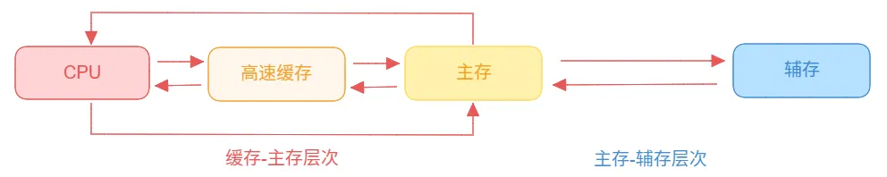

**常见的数据库**：MySQL、HBase、PostgreSQL、SQL Server、Memcahe、SQLite、MongoDB、Neo4j、Redis等等。

### 1. 数据库

**关系型数据库**（Relational Database Management System，RDBMS），是一种基于关系模型的数据库管理系统。它通过表格、行和列的形式存储数据，借助关联表格进行分类、合并、连接或选取等运算来实现数据库的管理。

**常见的关系型数据库**：MySQL、SQL Server、SQLite、PostgreSQL；

- **MySQL**：一个广泛使用的开源关系型数据库管理系统，以其高性能、可靠性和易用性而闻名。
- **SQL Server**：微软开发的商业关系型数据库管理系统，以其强大的分析和报告功能、高可用性和企业级安全性而著称。
- **SQLite**：一个轻量级的开源数据库，以其无需服务器配置、高度可移植性和内嵌在应用程序中的能力而受欢迎。
- **PostgreSQL**：一个高度可扩展的开源对象关系型数据库系统，以其对复杂查询的支持、丰富的数据类型和强大的扩展性而受到青睐。

**非关系型数据库**（Not Only SQL，NoSQL），不使用传统的SQL进行数据库查询和操作，主要是为了解决大规模数据集的存储和处理问题。其种类繁多且结构简单。

**常见的非关系型数据库**：MongoDB、Redis、Neo4j等

- **键值对数据库**（Key-Value），以键值对的形式存储，即每个数据都有一个唯一的键（Key）和一个关联的值（Value）。其Value支持多种数据格式，通常提供快速的数据访问速度**常见的键值数据库**：Redis、Memcache等。
- **文档数据库**，以文档的形式存储数据，通常使用JSON、XML等格式。其允许存储结构化、半结构化或非结构化的数据，每个文档可以有不同的结构，且部分数据库支持回溯文档的变更历史。**常见的文档数据库**：MongoDB等。
- **列存储数据库**，是将数据按列而不是按行存储，适用于处理大型数据集，但不适合数据更新、删除频繁的场景。**常见的列数据库**：HBase等。
- **图数据库**，是以图论为基础的数据库，专门用于存储和查询图结构数据。在图数据库中，数据以节点（或称为顶点）和边的形式存在，边表示节点之间的关系。其特别适合于处理高度连接的数据，例如社交网络、推荐系统、供应链管理等。**常见的图数据库**：Neo4j等。

之后的所有内容不一定通用，以MySQL为例。

### 2. 数据库的创建

**数据库的创建语句**：

```sql
CREATE {DATABASE | SCHEMA} [IF NOT EXISTS] db_name [create_option];
```

其中，**create_option** 可选项如下：

- CHARACTER SET [=] charset_name，字符集，中文推荐：utf8mb4。
- COLLATE [=] collation_name，排序规则，中文推荐：utf8mb4_unicode_ci。
- ENCRYPTION [=] {'Y' | 'N'}，是否加密，需要MySQL支持TDE，一般不用。

**注意**：MySQL在高版本中，Database和SCHEMA两者同义。

### 3. 数据库表的创建

**数据库表的创建语句**：

```sql
CREATE [TEMPORARY] TABLE [IF NOT EXISTS] tb_name(
  column_definition,...
)[table_options] [partition_options]
```

其中，**column_definition** 选项是定义表字段名字、表字段属性和索引，表字段属性包括：数据类型、是否为空和默认值等。

- **主键索引**：PRIMARY KEY(字段)
- **外键索引**：FOREIGN KEY(字段) REFREENCES 参照表(参照字段)
- **其他索引**：KEY(字段)

**table_options** 选项是定义表的属性，如存储引擎、字符集、最大行数、注释等：

- **存储引擎**：ENGINE，常见的存储引擎包括 InnoDB（默认的事务性存储引擎）、MyISAM、MEMORY 等。
- **字符集**：CHARSET 或 CHARACTER SET。
- **最大行数**：MAX_ROWS，表的最大行数限制。
- **注释**：COMMENT。

**partition_options** 选项是定义表数据的分区规则。

- **range 分区**：行数据根据属于给定的连续范围的列值被分配到不同的分区。
- **list 分区**：根据列值的列表将数据分配到不同的分区。
- **key 分区**：类似于RANGE分区，它使用MySQL数据库提供的哈希函数来选择分区。
- **hash 分区**：根据列值的HASH值将数据均匀地分配到不同的分区。

### 4. 数据库表字段类型

| 数据类型                     | 定义                                               |
| ------------------------ | ------------------------------------------------ |
| 数字类型（Numeric Data）       | TINYINT，INTERGER，FLOAT，DOUBLE，DECIMAL，NUMERIC    |
| 日期类型（Date and Time Data） | DATE，TIME，DATETIME，TIMESTMP，YEAR                 |
| 字符串类型（String Data）       | CHAR，VARCHAR，BINARY，VARBINARY，BLOB，TEXT，ENUM，SET |
| 空间数据类型（Spatial Data）     | 略                                                |
| JSON数据类型（JSON Data）      | JSON                                             |

MySQL的**整数数值类型**：

| 类型           | 大小      | 有符号（signed）范围            | 无符号（unsigned）范围 | 描述    |
| ------------ | ------- | ------------------------ | --------------- | ----- |
| tinyint      | 1 byte  | (-128,127)               | (0,255)         | 小整数值  |
| smallint     | 2 bytes | (-32768,32767)           | (0,65535)       | 大整数值  |
| mediumint    | 3 bytes | (-8388608,8388607)       | (0，16777215)    | 大整数值  |
| int/interger | 4 bytes | (-2147483648,2147483647) | (0,4294967295)  | 大整数值  |
| bigint       | 8 bytes | (-2^63,2^63-1)           | (0,2^64-1)      | 极大整数值 |

MySQL的**浮点数数值类型**：

| 类型      | 大小               | 有符号（signed）范围                                                                                               | 无符号（unsigned）范围                                        | 描述      |
| ------- | ---------------- | ----------------------------------------------------------------------------------------------------------- | ------------------------------------------------------ | ------- |
| float   | 4 bytes          | (-3.402823466 E+38,3.402823351 E+38)                                                                        | 0，(1.175494351 E-38，3.402 823466 E+38)                 | 单精度浮点数值 |
| double  | 8 bytes          | (-1.7976931348623157 E+308，-2.2250738585072014 E-308)，0，(2.2250738585072014 E-308，1.7976931348623157 E+308) | 0，(2.225073858507201 4 E-308，1.7976931348623157 E+308) | 双精度浮点数值 |
| decimal | 依赖于M(精度)和D(标度)的值 | 依赖于M(精度)和D(标度)的值                                                                                            | 小数值(精确定点数，D小数点位数)                                      |         |

MySQL的**日期时间类型**：

| 类型        | 大小  | 范围                                        | 格式                  | 描述           |
| --------- | --- | ----------------------------------------- | ------------------- | ------------ |
| date      | 3   | 1000-01-01 至 9999-12-31                   | YYYY-MM-DD          | 日期值          |
| time      | 3   | -838:59:59 至 838:59:59                    | HH:MM:SS            | 时间值或持续时间     |
| year      | 1   | 1901 至 2155                               | YYYY                | 年份           |
| datetime  | 8   | 1000-01-01 00:00:00 至 9999-12-31 23:59:59 | YYYY-MM-DD HH:MM:SS | 混合日期和时间值     |
| timestamp | 4   | 1970-01-01 00:00:01 至 2038-01-19 03:14:07 | YYYY-MM-DD HH:MM:SS | 混合日期和时间值，时间戳 |

MySQL的**字符串类型**：

| 类型         | 大小                   | 描述              |
| ---------- | -------------------- | --------------- |
| char       | 0 - 255 bytes        | 定长字符串           |
| varchar    | 0 - 65535 bytes      | 变长字符串           |
| tinyblob   | 0 - 255 bytes        | 不超过255个字符的二进制数据 |
| tinytext   | 0 - 255 bytes        | 短文本字符串          |
| blob       | 0 - 65535 bytes      | 二进制形式的长文本数据     |
| text       | 0 - 65535 bytes      | 长文本数据           |
| mediumblob | 0 - 16777215 bytes   | 二进制中等长度文本数据     |
| mediumtext | 0 - 16777215 bytes   | 中等长度文本数据        |
| longblob   | 0 - 4194967295 bytes | 二进制形式的极大文本数据    |
| longtext   | 0 - 4194967295 bytes | 极大文本数据          |

**注意**：

- char VS varchar：varchar可变长，char占用固定存储空间。
- varchar VS text：text不允许默认值。
- text（mediumtext、longtext）支持比varchar更长的存储长度。
- text创建索引会比varchar占用的空间更大。
- 两者通过名字区分存储内容；固定长度用char，尽量使用varchar，尽量少使用text。

MySQL的**JSON类型**：

- JSON列中的内容会被自动校验，不允许错误。
- 存储在JSON列中的内容会被转换为允许快速读取元素的内部格式。
- 优化器支持局部读写，不用覆盖完整内容。

### 5. 数据库的ACID属性

ACID主要是在事务中体现的，所以需要借助事务来进一步阐述。

**数据库事务**是用于维护数据库的完整性；保证成批的MySQL操作要么完全执行，要么完全不执行。为保证事务的正确可靠，故须具备以下四个特性：

1. 原子性（Atomicity，不可分割性）
2. 一致性（Consistency）
3. 隔离性（Isolation，独立性）
4. 持久性（Durability）

**原子性**（Atomicity）：在一个事务中所有操作要么全部完成，要么全部不完成，不会结束在中间的某个环节。当事务在执行过程中若发生错误后，会被回滚到事务开始的状态。即，事务不可分割，不可约简。

**一致性**（Consistency）：在一个事务开始之前和结束以后，数据库的完整性没有被破坏。即写入的内容完全符合所有的预设、触发器、级联回滚等。

**隔离性**（Isolation）：数据库允许多个并发事务同时对其数据进行读写和修改，而并不会由于交叉执行导致数据的不一致。

**持久性**（Durability）：一个事务在处理结束后，对数据的修改就是永久的，即便系统故障也不会丢失。

### 6. 数据库事务的隔离级别

事务在处理的过程中可能会出现以下情况：

- **脏读**：一个事务读取了另一个事务操作未提交的数据，即这个事务就读到了脏数据。
- **不可重复读**：一个事务多次读取同一份数据时，另一个事务在这个事务操作期间对这一份数据进行更新并提交，导致这个事务多次读取这份数据的结果不一致。注重数据不可被更改。
- **幻读**：一个事务需要对一份数据进行操作时，事先已经判断符合操作要求，但在正式操作时却发现有其它事务的操作（插入/删除）导致无法满足执行要求。即在一个事务操作里发现之前从未有操作的数据。注重数据不可被插入或删除。

为了预防这些情况，故此，事务之间进行隔离，其隔离级别由低到高依次是：未提交读、提交读、 可重复读、串行化。

1. **未提交读**：能够读取到其它事务操作后但未提交的数据。无法解决脏读、不可重复读和幻读。
2. **提交读**：既能读到其它事务未提交的数据，后又能读到其它事务对该数 据已提交的内容。无法解决不可重复读和幻读。
3. **可重复读**：事务开始操作时所读取的内容要求在该事务的整个周期内保持不变。无法解决幻读。
4. **串行读**：事务之间必需排队依次执行。故不存在并行执行事务的情况。

### 7. MySQL索引

数据库的主要功能：查询和插入

查询：精确查询和范围查询

- 精确查询：通过一个具体的Key找到对应的一条或者多条数据。
- 范围查询：查询Key在某个范围内的所有数据。

插入：插入性能和查询性能

- 插入性能：插入数据的过程不能消耗太多的时间。
- 查询性能：插入数据在被查询的时候，需要快速返回。

当数据量超过内存时，部分数据需要暂存硬盘。由于数组和链表的平均操作复杂度为O(n)，所以不适用于MySQL的索引。

而树中，二叉搜索树，左子树所有节点的值均小于根节点的值，右子树所有节点的值均大于根节点的值，保证有序，且操作复杂度为O(logn)。但是根节点和叶子节点都保存有数据，对于范围查询来说，需要不断的从根节点进行遍历。

所以为了解决范围查询，根节点不保存数据，只在叶子节点保存数据；叶子节点使用双向链表链接起来，即可快速范围查询。

B树、B+树，由于树高影响查询性能，因此降低树高，提升性能；将二叉搜索树改造成多叉搜索树，降低树高。

B树、B+树：

- B树在叶子节点、根节点都保存数据，不利于范围查询。
- B+树根节点不存储数据，叶子节点使用双向链表链接，适合范围查询。
- 在插入数据、精确查询时，两者性能相近。

### 8. 聚簇索引与非聚簇索引

**索引**：在关系数据库中，索引是一种单独的、物理的对数据库表中一列或多列的值进行排序的一种存储结构，它是某个表中一列或若干列值的集合和相应的指向表中物理标识这些值的数据页的逻辑指针清单。索引的作用相当于图书的目录，可以根据目录中的页码快速找到所需的内容。

由于存储器层次结构：



- 聚簇索引：将数据存储与索引放在一块，找到索引就找到了数据。
- 非聚簇索引：将数据存储与索引分开存储，索引指向数据内存空间。
- 非聚簇索引通常也被称为二级索引。

聚簇索引：InnoDB使用的是聚簇索引，将主键组织到一棵B+树中，而行数据就存储在叶子节点，为了在相同结果集的情况下，减少逻辑IO。

- 一个数据表只有一个聚簇索引。
- 默认情况下聚簇索引是主键。
- 聚簇索引性能最好且具有唯一性，需要慎重选择字段作为聚簇索引。

非聚簇索引：一个数据表可以有多个非聚簇索引，MyISAM使用的是非聚簇索引；非聚簇索引和聚簇索引的B+数看上去并没有不同，节点完全一致，只是存储的内容不一致。

在一个数据表中，只有一个聚簇索引；但却有多个非聚簇索引。

**非聚簇索引执行过程**：

1. 先在非聚簇辅助索引检索到对应的记录，获得相应的主键。
2. 根据主键在聚簇索引再进行一次检索操作。
3. 对非聚簇索引的数据列检索要两次检索索引。

**聚簇索引的优点**：

- 行数据与叶子节点一起存储，结合内存页结构，检索速度快。
- 聚簇索引适合排序场合、范围查询场合。
- 维护聚簇索引不需要对行数据进行额外的管理操作。

**聚簇索引的使用注意事项**：

- 不建议使用长字符串（UUID）作为主键索引。
- 稀疏数据的列不适合建立聚簇索引。
- 频繁更新的列不适合建立索引。

### 9. 联合索引

联合索引（复合索引），即是由多个字段组成的一个索引。

**联合索引作用的时机**：

- 联合索引使用遵循最左匹配原则
- where条件必须作用联合索引的第一个字段。
- 联合索引与where条件的顺序无关，只和字段有关。

### 10. MVCC原理

MVCC是为了平衡读写性能和数据准确性。

- 表级锁：操作特定表时，对整个表增加互斥锁。
- 行级锁：操作特定行数据时，对相应行增加互斥锁。
- MVCC多版本控制

MVCC（Multiversion Concurrency Control，多版本并发控制技术），原理是通过数据行的多个版本管理来实现数据库的并发控制，简单来说就是保存数据的历史版本。可是通过比较版本号决定数据是否显示出来，读取数据时不需要加锁就可以保证事物的隔离效果。

多版本；并发控制；历史版本；版本号；隔离效果

**隐藏列**：DB_ROW_ID、DB_TRX_ID、DB_ROLL_PTR

- DB_ROW_ID：隐藏的行ID，用于生成默认的聚簇索引。
- DB_TRX_ID：隐藏的事务ID，最后一个操作该行的事务ID，单调自增ID。
- DB_ROLL_PTR：回滚指针，指向这条记录的Undo Log信息。

**DB_TRX_ID在增、删、改、查的过程变化**：

**插入数据**：更新DB_TRX_ID

- InnoDB为新插入的每一行保存当前系统版本号作为行版本号。

**删除数据**：删除标记为写入当前事物版本号

- InnoDB为删除的每一行保存当前事物版本号作为行删除标识。
- 删除在内部视为更新，行中的一个特殊位会被设置为已删除。

**更改数据**：插入/删除

- InnoDB为插入一行新纪录，保存当前事物版本号作为行版本号。
- 保存当前事物版本号到原来行作为行删除标识。

**查询数据**：

- InnoDB只查找版本早于当前事物版本的数据行，行的系统版本号小于或等于事物的系统版本号。
- 行的删除版本要么未定义，要么大于当前事物版本号，这可以确保事务读取到的行，在事务开始之前未被删除。

MVCC原理的优点：

- 解决读写阻塞问题（读写不阻塞）
- 降低死锁的概率（乐观锁、非必要不加锁）
- 解决一致性读的问题（快照读）

MVCC在一定程度上实现了读写并发；只在可重复读和提交的两个隔离级别下工作；行锁、并发控制、事务回滚等多种特性都与其有关。

### 11. 数据库备份与恢复

MySQL数据库的日志类型：二进制日志（binlog）、重做日志（redolog）、回滚日志（undolog）、慢查询日志（slowquerylog）、中继日志（relaylog）。

**二进制日志（binlog）**：通过对数据库操作在磁盘上的冗余备份，可以进行主备备同步、恢复数据。使用`show varibales like '%log_bin%'`进行查看binlog的配置。使用`show binary logs`进行查看binlog的文件信息。

- 默认的binlog为二进制格式。
- 可以通过mysqlbinlog命令解析成可读日志。`mysqlbinlog --start-datetime='开始时间' 文件路径 --result-file='转化之后的文件路径'`。
- 内容就是可读的增、删、改SQL语句。
- 查询语句不影响MySQL数据，所以查询语句不会被记录下来。

**重做日志（redolog）**：

- 事务提交MySQL后，同步也会记录redolog到磁盘
- 如果事务提交过程故障，则重新执行redolog恢复事务
- 如果事务成功落磁盘，则redolog就失去作用了

**回滚日志（undolog）**：

- undolog和redolog功能类似，作用相反
- 如果事务执行过程故障，则通过undolog回滚事务
- MySQL恢复到执行事务之前的状态

**慢查询日志（slowquerylog）**：

- 根据查询数据量的不同，不同SQL会有不同的查询时间
- Slowquerylog是用于记录超过正常时间查询语句的日志
- 对于慢查询的优化，可以通过explain找到性能瓶颈，优化性能

**中继日志（relaylog）**：

- relaylog和binlog功能类似，都是主备同步时用到
- relaylog数据格式与binlog一致
- relaylog实际上相当于是备份节点的缓冲buffer
- 额外记录备份情况：master.info、relay-log.info

### 12. 权限维护

权限粒度：全局层级（global level）、数据库层级（database level）、数据库对象层级（table level）、列层级（column level）

**全局层级（global level）**：作用于整个MySQL实例级别，包括操作数据库、服务启停、配置更改等，其权限信息存储在mysql.user表。

**数据库层级（database level）**：作用于指定的数据库的所有对象中，包括触发器、视图、表、索引等，权限信息存储在mysql.db表。

**数据库对象层级（table level）**:作用于指定数据库的指定表，包括对表结构的维护、表级锁等，权限信息存储在mysql.tables_priv表。

**列层级（column level）**：作用于指定数据库指定表的列，包括对表特定列的增删改查、列定义修改等，权限信息存储在mysql.columns_priv表。

**创建用户并授权**：

```sql
create user <username>@<hostname> identified by <password>;

# username：创建的用户名字
# hostname：允许登录的主机IP，localhost表示本机、"%"表示任意主机
# password：用户的登录密码
```

**移除授权**：

```sql
revoke all privilege on *.* to <username>@<hostname>;
```

**用户更改**：

```sql
# 删除用户
drop user <username>@<hostname>
# 更改用户
rename user <username>@<hostname> to <new username>@<hostname>
# 更改用户密码
set password for <username>@<hostname> = new_password;
alter user <username>@<hostname> identified by <new password>;
mysqladmin -u <username> -h <hostname> password <new password>;
```
