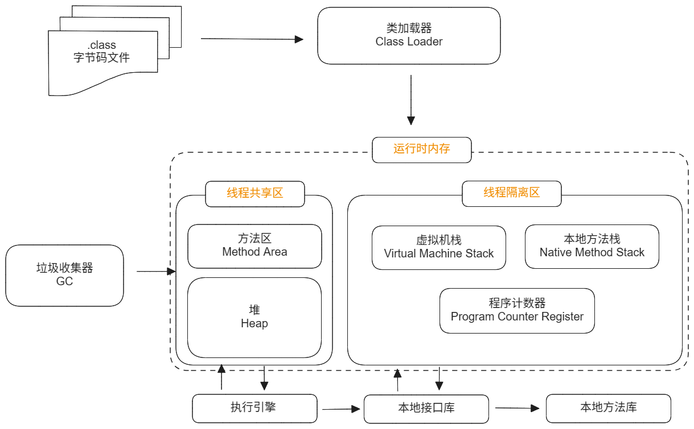
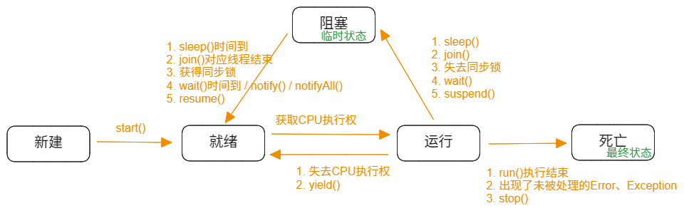
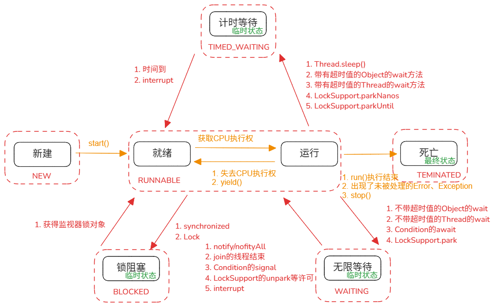

---
文章分类:
  - 计算机基础知识
文章标签:
  - 理论
  - Java
文章简介: Java的多线程，
文章精选:
  - 否
是否发布:
  - 否
发布时间: 
创建时间: 2024-11-23
修改时间:
---

### 1. 多线程概念

**程序、进程与线程**：

- 程序（Program）：为完成特定任务，用某种语言编写的**一组指令的集合**。即**一段静态的代码**，静态对象。
- 进程（Process）：程序的一次执行过程，或正在内存中运行的应用程序。**程度是静态的，进程是动态的**。
- 线程（Thread）：进程进一步细化，程序内部的**一条执行路径**。一个进程至少有一个线程。

**进程 VS 线程**：

- **进程**：系统运行一个程序，动态执行代码的过程。代表着程序运行的整个生命周期。每个进程都有一个独立的内存空间。**操作系统调度和分配资源的最小单位，也是系统运行程序的基本单位**。
- **线程**：在一个进程中同一时间可并行执行若干线程。是**CPU调度和执行的最小单位**。在一个进程中的多个线程共享这个进程的内存单元，但**多个线程在操作共享系统资源时可能会带来安全隐患**。



**线程调度方式**：

- **分时调度**：所有线程轮流获取CPU的使用权，并且平均分配每个线程占用CPU的时间。
- **抢占式调度**：让优先级高的线程以较大的概率优先使用CPU。优先级相同，会随机选择其中一个等待的线程。Java中使用的是抢占式调度

> 在单核CPU下，拷备多个大文件，顺序执行会快些。因为交替执行拷备时，增加了切换时间。

**多线程的优点**：

1. 提高应用程序的响应。
2. 提高计算机CPU的利用率。
3. 改善程序执行结构，将复杂的进程分为多个线程，独立运行，利于理解和修改。

**单核CPU和多核CPU**：

- **单核CPU**：在一个时间单元内，只能执行一个线程的任务。
- **多核CPU**：在一个时间单元内，可以有多个线程执行的任务。但性能与单核CPU不是成倍增加。性能损耗点：1. 多核CPU在其他共用资源的限制；2. 多核CPU之间协调管理的损耗。

**并行与并发**：

- **并行（parallel）**：指两个或多个事件在**同一时刻**发生（同时发生）。即在同一时刻，有多条指令在多个CPU上同时执行。
- **并发（concurrency）**:指两个或多个事件在**同一个时间段内**发生。即在一段时间内，有多条指令在单个CPU上快速轮换、交替执行。

### 2. 多线程创建和启动 Thread

通过继承Thread类的方式，从而实现多线程创建和启动。

**多线程创建和启动 Thread的步骤**：

1. 创建一个类并继承Thread类。
2. 重写Thread类的`run()`方法。
3. 实例化一个当前创建类的对象。
4. 使用对象调用`start()`方法。

**多线程创建和启动 Thread的示例**：

```java
// 创建一个继承自Thread类的EvenNumberThread类，该类输出从0到500的所有偶数。  
public class EvenNumberThread extends Thread {  
    @Override  
    public void run() {  
        for (int i = 0; i <= 500; i += 2) {  
            System.out.println(Thread.currentThread().getName() + ": " + i);  
        }  
    }  
}

public class ThreadTest {  
    public static void main(String[] args) {  
        // 创建线程对象  
        EvenNumberThread t1 = new EvenNumberThread();  
        // 启动线程  
        t1.start();  
  
        for (int i = 0; i < 500; i++) {  
            if (i % 2 == 1) {  
                System.out.println(Thread.currentThread().getName() + ": " + i);  
            }  
        }  
    }  
}
```

**Thread中的start()方法作用**：1. 启动线程；2. 调用当前线程的`run()`方法。

> **注意**：通过Thread方式创建的线程对象不能多次调用`start()`方法，否则会抛出`java.lang.IllegalThreadStateException`异常。

**多线程创建和启动 Thread方式的多种实现**：

```java
// 创建一个继承自Thread类的EvenNumberThread类，该类输出从0到500的所有偶数。  
public class EvenNumberThread extends Thread {  
    @Override  
    public void run() {  
        for (int i = 0; i <= 500; i += 2) {  
            System.out.println(Thread.currentThread().getName() + ": " + i);  
        }  
    }  
}

// 创建一个继承自Thread类的OddNumberThread类，该类输出从0到500的所有奇数。  
public class OddNumberThread extends Thread {  
    @Override  
    public void run() {  
        for (int i = 1; i <= 500; i += 2) {  
            System.out.println(Thread.currentThread().getName() + ": " + i);  
        }  
    }  
}

// 线程的创建和使用。  
public class ThreadTest {  
    public static void main(String[] args) {  
        // 方式1：创建对象  
        EvenNumberThread t1 = new EvenNumberThread();  
        t1.start();  
        OddNumberThread t2 = new OddNumberThread();  
        t2.start();  
        
        // 方式2：使用匿名内部类  
        new Thread() {  
            public void run() {  
                for (int i = 0; i <= 500; i += 2) {  
                    System.out.println(Thread.currentThread().getName() + ": " + i);  
                }  
            }  
        }.start();  
        new Thread() {  
            public void run() {  
                for (int i = 1; i <= 500; i += 2) {  
                    System.out.println(Thread.currentThread().getName() + ": " + i);  
                }  
            }  
        }.start();  
    }  
}
```

### 3. 多线程创建和启动 Runnable

通过实现Runnable接口的方式，从而实现多线程创建和启动。

**多线程创建和启动 Runnable的步骤**：

1. 创建一个实现Runnable接口的类。
2. 实现Runnable接口的`run()`方法。
3. 实例化一个当前创建类的对象。
4. 将此对象传递到Thread类的构造器中，创建Thread类的实例。
5. 使用Thread类的实例调用`start()`方法。

**多线程创建和启动 Runnable的示例**：

```java
// 创建一个EvenNumberThread类，实现Runnable接口。  
public class EvenNumberThread implements Runnable {  
    @Override  
    public void run() {  
        for (int i = 0; i <= 500; i += 2) {  
            System.out.println(Thread.currentThread().getName() + ": " + i); 
        }  
    }  
}

public class ThreadTest {  
    public static void main(String[] args) {  
        // 创建一个EvenNumberThread对象  
        EvenNumberThread even = new EvenNumberThread();  
        // 创建一个线程，并将EvenNumberThread对象作为参数传递给它  
        Thread t1 = new Thread(even);  
        t1.start();  
    }  
}
```

**多线程创建和启动 Runnable方式的多种实现**：

```java
// 创建一个EvenNumberThread类，实现Runnable接口。  
public class EvenNumberThread implements Runnable {  
    @Override  
    public void run() {  
        for (int i = 0; i <= 500; i += 2) {  
            System.out.println(Thread.currentThread().getName() + ": " + i);  
        }  
    }  
}

public class ThreadTest {  
    public static void main(String[] args) {  
        // 方式1：实现Runnable接口  
        EvenNumberThread even = new EvenNumberThread();  
        Thread t1 = new Thread(even);  
        t1.start();  
  
        // 方式2：匿名内部创建一个Runnable对象  
        new Thread(new Runnable() {  
            @Override  
            public void run() {  
                for (int i = 1; i <= 500; i += 2) {  
                    System.out.println(Thread.currentThread().getName() + ": " + i);  
                }  
            }  
        }).start();  
    }  
}
```

**继承Thread VS 实现Runnable**：

共同点：

1. 启动线程时，使用的都是Thread类中定义的`start()`方法。
2. 创建的线程对象，都是Thread类或其子类的实例。

不同点：

1. 一个是类的继承，一个是接口的实现

两者的联系：Thread是实现Runnable接口，成为Runnable接口的代理对象。

> **使用建议**：优先使用Runnable接口的方式。

**相较于继承Thead，使用实现Runnable方式的优点**：

1. 实现的方式，避免类的单继承的局限。
2. 更适合处理有共享数据的问题。
3. 实现了代码和数据的分离。

### 4. Thread类常用方法和线程生命周期

**Thread类中常用的构造器**：

| 方法                                       | 含义                                |
| ---------------------------------------- | --------------------------------- |
| `Thread()`                               | 分配一个新的线程对象                        |
| `Thread(String name)`                    | 分配一个指定名字的新的线程对象                   |
| `Thread(Runnable target)`                | 指定创建线程的目标对象，其实现了Runnable接口中的run方法 |
| `Thread(ThreadGroup group, String name)` | 分配一个带有指定目标的新的线程对象并指定名字            |

**Thread类中常用的方法**：

| 方法                                                                  | 含义                       |
| ------------------------------------------------------------------- | ------------------------ |
| `synchronized void start()`                                         | 1. 启动线程；2. 调用线程中的run()方法 |
| `void run()`                                                        | 线程执行的操作                  |
| `static native Thread currentThread()`                              | 获取当前执行代码的线程              |
| `final String getName()`                                            | 获取线程名                    |
| `final synchronized void setName(String name)`                      | 设置线程名                    |
| `static native void sleep(long millis) throws InterruptedException` | 静态方法，调用时可指定线程睡眠的毫秒数      |
| `static native void yield()`                                        | 静态方法，执行此方法会释放CPU的执行权     |
| `final void join() throws InterruptedException`                     | 阻塞当前执行的线程，直到调用者的方法执行完成   |
| `final native boolean isAlive()`                                    | 判断线程是否存活                 |

**Thread类中过时/弃用的方法**：

| 方法                     | 含义                          |
| ---------------------- | --------------------------- |
| `final void stop()`    | 强行结束一个线程的执行，直接进入死亡状态，不建议使用  |
| `final void suspend()` | 挂起线程，可能造成死锁，不建议使用           |
| `final void resume()`  | 唤醒线程，与`suspend()`成对出现，不建议使用 |

**线程的优先级**：

| 方法                                        | 含义                 |
| ----------------------------------------- | ------------------ |
| `final int getPriority()`                 | 获取当前线程的优先级         |
| `final void setPriority(int newPriority)` | 设置线程的优先级。范围：【1,10】 |

Thread类内部声明线程优先级的常量：

- `static final int MIN_PRIORITY = 1;`：最低优先级。
- `static final int NORM_PRIORITY = 5;`：普通优先级，默认情况下main线程是普通优先级。
- `static final int MAX_PRIORITY = 10;`：最高优先级。

**线程的生命周期**：

**JDK1.5之前【5种状态】**：新建（`NEW`）、就绪（`RUNNABLE`）、运行（`RUNNING`）、阻塞（`BLOCKED`）、死亡（`DEAD`）。CPU需要在多条线程之间切换，所以状态也就会多次在运行、阻塞和就绪之间切换。



**JDK1.5之后【6种状态】**：新建（`NEW`）、可运行（`RUNNABLE`）、锁阻塞（`BLOCKED`）、计时等待（`TIMED_WAITING`）、无限等待（`WAITING`）、被终止（`TEMINATED`）。



### 5. 多线程安全问题

当多个线程访问**同一个资源**（同一个变量、同一个文件、同一条记录等）时，若多线程**只有读**操作，那么不会存在线程安全问题。但多线程中**既有读又有写**操作时，就容易出现线程安全问题。

**多线程操作不安全示例**：

通过继承Thread类方式，展示多线程操作不安全

```java
// 定义继承Thread的类
public class ServiceDeskThread extends Thread {  
    private static int ticket = 100;  
  
    @Override  
    public void run() {  
        while (true) {  
            if (ticket > 0) {  
                try {  
                    Thread.sleep(100);  
                } catch (InterruptedException e) {  
                    throw new RuntimeException(e);  
                }  
                System.out.println(Thread.currentThread().getName() + "正在处理第" + ticket + "张票");  
                ticket--;  
            } else {  
                break;  
            }  
        }  
    }  
}

// 测试方法
public class NoSafeMultiThread {  
  
    public static void main(String[] args) {    
        ServiceDeskThread serviceDeskThread1 = new ServiceDeskThread();  
        ServiceDeskThread serviceDeskThread2 = new ServiceDeskThread();  
        ServiceDeskThread serviceDeskThread3 = new ServiceDeskThread();  
  
        serviceDeskThread1.start();  
        serviceDeskThread2.start();  
        serviceDeskThread3.start();  
    }  
}
```

通过实现Runnable接口方式，展示多线程操作不安全

```java
// 定义实现Runnable接口的类
public class ServiceDesk implements Runnable {  
    private int ticket = 100;  
  
    @Override  
    public void run() {  
        while (true) {  
            if (ticket > 0) {  
                try {  
                    Thread.sleep(100);  
                } catch (InterruptedException e) {  
                    throw new RuntimeException(e);  
                }  
                System.out.println(Thread.currentThread().getName() + "正在处理第" + ticket + "张票");  
                ticket--;  
            } else {  
                break;  
            }  
        }  
    }  
}

// 测试方法
public class NoSafeMultiThread {  
  
    public static void main(String[] args) {  
        ServiceDesk serviceDesk = new ServiceDesk();  
  
        Thread thread1 = new Thread(serviceDesk);  
        Thread thread2 = new Thread(serviceDesk);  
        Thread thread3 = new Thread(serviceDesk);  
  
        thread1.start();  
        thread2.start();  
        thread3.start();  
    }  
}
```

**多线程操作不安全的示例，会出现的情况有**：重票和错票。如果要解决这一现象，需要让多线程排队依次进入，等待上个线程操作完成后才能操作。

**Java的线程同步机制**：1. synchronized 同步代码块；2. synchronized 同步方法。

### 6. 解决多线程安全 synchronized同步代码块

**synchronized 同步代码块格式**：

```java
synchronized(同步监视器){
	// todo 需要同步的代码
}
```

**synchronized 同步代码块的解释**：

- **synchronized**：使得多线程执行到此处时会依次排队，等待上个在操作的线程执行完成后，才可让获得允许的线程进入。
- **同步监视器**：也称为锁，当线程获取了这个锁后，变成允许进入的线程，才能进入操作。可以使用类的对象，但多个线程必须是同一个同步监视器。
- **需要同步的代码**：是操作共享数据的代码段。共享数据为多个线程共同操作的数据。

**解决多线程安全问题，使用synchronized同步代码块示例**：

通过继承Thread类方式，使用synchronized同步代码块，让多线程操作安全

```java
public class ServiceDeskThread extends Thread {  
    private static int ticket = 100;  
  
    @Override  
    public void run() {  
        while (true) {  
            // this，当前调用run()方法的对象，即ServiceDeskThread的对象，不是唯一的，所以不能使用  
            // ServiceDeskThread.class，程序运行时，加载到内存中的对象（Class clz = ServiceDeskThread.class;），是唯一的  
            synchronized (ServiceDeskThread.class) {  
                if (ticket > 0) {  
                    try {  
                        Thread.sleep(100);  
                    } catch (InterruptedException e) {  
                        throw new RuntimeException(e);  
                    }  
                    System.out.println(Thread.currentThread().getName() + "正在处理第" + ticket + "张票");  
                    ticket--;  
                } else {  
                    break;  
                }  
            }  
        }  
    }  
}

public class SafeMultiThread {  
  
    public static void main(String[] args) {    
        ServiceDeskThread serviceDeskThread1 = new ServiceDeskThread();  
        ServiceDeskThread serviceDeskThread2 = new ServiceDeskThread();  
        ServiceDeskThread serviceDeskThread3 = new ServiceDeskThread();  
  
        serviceDeskThread1.start();  
        serviceDeskThread2.start();  
        serviceDeskThread3.start();  
    }  
}
```

通过实现Runnable接口方式，使用synchronized同步代码块，让多线程操作安全

```java
public class ServiceDesk implements Runnable {  
    private int ticket = 100;  
  
    @Override  
    public void run() {  
        while (true) {  
	        // this，当前调用run()方法的对象，即ServiceDesk的对象，是唯一的
            synchronized (this) {  
                if (ticket > 0) {  
                    try {  
                        Thread.sleep(100);  
                    } catch (InterruptedException e) {  
                        throw new RuntimeException(e);  
                    }  
                    System.out.println(Thread.currentThread().getName() + "正在处理第" + ticket + "张票");  
                    ticket--;  
                } else {  
                    break;  
                }  
            }  
        }  
    }  
}

public class SafeMultiThread {  
  
    public static void main(String[] args) {  
        ServiceDesk serviceDesk = new ServiceDesk();  
  
        Thread thread1 = new Thread(serviceDesk);  
        Thread thread2 = new Thread(serviceDesk);  
        Thread thread3 = new Thread(serviceDesk);  
  
        thread1.start();  
        thread2.start();  
        thread3.start();  
    }  
}
```

**解决多线程安全问题的示例，使用synchronized同步代码块需要注意**：

1. 通过继承Thread类方式，同步监视器可以考虑使用`当前类.class`，慎用`this`。
2. 通过实现Runnable接口方式，同步监视器可以考虑使用`this`。

### 7. 解决多线程安全 synchronized同步方法

当操作共享数据的代码完整的声明在一个方法中，那可以将此方法表明为同步方法，也可解决多线程安全问题。

**解决多线程安全问题，使用synchronized同步方法示例**：

通过继承Thread类方式，使用synchronized同步方法，让多线程操作安全

```java
public class ServiceDeskThread extends Thread {  
    private static int ticket = 100;  
  
    private static boolean flag = true;  
  
    @Override  
    public void run() {  
        while (flag) {  
            sellTicket();  
        }  
    }  
  
    /**  
     * 如果方法是非静态的，则同步监视器是this  
     * 如果方法是静态的，则同步监视器是当前类本身  
     */  
    public static synchronized void sellTicket() {  
        if (ticket > 0) {  
            try {  
                Thread.sleep(100);  
            } catch (InterruptedException e) {  
                throw new RuntimeException(e);  
            }  
            System.out.println(Thread.currentThread().getName() + "正在处理第" + ticket + "张票");  
            ticket--;  
        } else {  
            flag = false;  
        }  
    }  
}

public class SafeMultiThread {  
  
    public static void main(String[] args) {    
        ServiceDeskThread serviceDeskThread1 = new ServiceDeskThread();  
        ServiceDeskThread serviceDeskThread2 = new ServiceDeskThread();  
        ServiceDeskThread serviceDeskThread3 = new ServiceDeskThread();  
  
        serviceDeskThread1.start();  
        serviceDeskThread2.start();  
        serviceDeskThread3.start();  
    }  
}
```

通过实现Runnable接口方式，使用synchronized同步方法，让多线程操作安全

```java
public class ServiceDesk implements Runnable {  
    private int ticket = 100;  
  
    private boolean flag = true;  
  
    @Override  
    public void run() {  
        while (flag) {  
            //synchronized (this) {  
            //    sellTicket();            
            //}
            sellTicket();  
        }  
    }  
  
    /**  
     * 如果方法是非静态的，则同步监视器是this  
     */    
    public synchronized void sellTicket() {  
        if (ticket > 0) {  
            try {  
                Thread.sleep(100);  
            } catch (InterruptedException e) {  
                throw new RuntimeException(e);  
            }  
            System.out.println(Thread.currentThread().getName() + "正在处理第" + ticket + "张票");  
            ticket--;  
        } else {  
            flag = false;  
        }  
    }  
}

public class SafeMultiThread {  
  
    public static void main(String[] args) {  
        ServiceDesk serviceDesk = new ServiceDesk();  
  
        Thread thread1 = new Thread(serviceDesk);  
        Thread thread2 = new Thread(serviceDesk);  
        Thread thread3 = new Thread(serviceDesk);  
  
        thread1.start();  
        thread2.start();  
        thread3.start();  
    }  
}
```

**解决多线程安全问题的示例，使用synchronized同步方法块需要注意**：

1. 如果方法是静态的，则同步监视器是当前类本身。
2. 如果方法是非静态的，则同步监视器是this。

**解决多线程安全问题，使用synchronized的优缺点**：

- 优点：解决多线程安全问题。
- 缺点：在操作共享数据时，多线程是串行执行的，意味着性能降低。

两个储户，对同一个账户，存3次，每次存1000元。使用继承Thread、synchronized同步方法的方式案例：

```java
// 账户类
public class Account {  
    private double balance;  

	// 当前是this，Account的对象，在主方法中是唯一的，所以线程安全
    public synchronized void deposit(double amount) {  
        if (amount > 0) {  
            balance += amount;  
        }  
        System.out.println(Thread.currentThread().getName() + ": 存入 " + amount + "，当前余额为：" + balance);  
    }  
}

// 储户类
public class Customer extends Thread {  
    private Account account;  
  
    public Customer(Account account) {  
        this.account = account;  
    }  
  
    public Customer(Account account, String name) {  
        super(name);  
        this.account = account;  
    }  
  
    @Override  
    public void run() {  
        for (int i = 0; i < 3; i++) {  
            try {  
                Thread.sleep(500);  
            } catch (InterruptedException e) {  
                throw new RuntimeException(e);  
            }  
            account.deposit(100.0);  
        }  
    }  
}

// 主方法
public class ThreadMain {  
    public static void main(String[] args) {  
        Account account = new Account();  
        Customer customer1 = new Customer(account, "储户1");  
        Customer customer2 = new Customer(account, "储户2");  
        customer1.start();  
        customer2.start();  
    }  
}
```

### 8. 多线程的单例模式中懒汉加载问题

**单例模式中加载方式**：

- 饿汉加载：不存在线程安全问题。
- 懒汉加载：存在线程安全问题，需要使用同步机制来处理。

**多线程不安全的懒汉加载**：

```java
// Bank类
public class Bank {  
    private Bank() {  
    }  
  
    private static Bank instance = null;  
  
    public static Bank getInstance() {  
        if (instance == null) {  
            try {  
                Thread.sleep(100);  
            } catch (InterruptedException e) {  
                throw new RuntimeException(e);  
            }  
            instance = new Bank();  
        }  
        return instance;  
    }  
}

// 主方法
public class ThreadMain {  
    static Bank bank1 = null;  
    static Bank bank2 = null;  
      
    public static void main(String[] args) throws InterruptedException {  
        Thread thread1 = new Thread() {  
            @Override  
            public void run() {  
                bank1 = Bank.getInstance();  
            }  
        };  
        Thread thread2 = new Thread() {  
            @Override  
            public void run() {  
                bank2 = Bank.getInstance();  
            }  
        };  
  
        thread1.start();  
        thread2.start();  
  
        thread1.join();  
        thread2.join();  
  
        System.out.println(bank1);  
        System.out.println(bank2);  
        System.out.println(bank1 == bank2);  
    }  
}
```

**多线程安全的懒汉加载**：

通过继承Thread类方式，使用synchronized同步方法，让多线程操作安全

```java
// Bank类  
public class Bank {  
    private Bank() {  
    }  
  
    private static Bank instance = null;  
  
    public static synchronized Bank getInstance() {  
        if (instance == null) {  
            try {  
                Thread.sleep(100);  
            } catch (InterruptedException e) {  
                throw new RuntimeException(e);  
            }  
            instance = new Bank();  
        }  
        return instance;  
    }  
}

// 主方法  
public class ThreadMain {  
    static Bank bank1 = null;  
    static Bank bank2 = null;  
  
    public static void main(String[] args) throws InterruptedException {  
        Thread thread1 = new Thread() {  
            @Override  
            public void run() {  
                bank1 = Bank.getInstance();  
            }  
        };  
        Thread thread2 = new Thread() {  
            @Override  
            public void run() {  
                bank2 = Bank.getInstance();  
            }  
        };  
  
        thread1.start();  
        thread2.start();  
  
        thread1.join();  
        thread2.join();  
  
        System.out.println(bank1);  
        System.out.println(bank2);  
        System.out.println(bank1 == bank2);  
    }  
}
```

通过继承Thread类方式，使用synchronized同步代码块，让多线程操作安全

```java
// Bank类  
public class Bank {  
    private Bank() {  
    }  

	// volatile 将分配空间、初始化、调用构造器会在线程的工作存储区中一次性完成，然后复制到主存储区，避免指令重排
    private static volatile Bank instance = null;  
  
    public static Bank getInstance() {  
	    // 可能会出现指令重排，导致instance不为null，但对象还未完成初始化，所以instance加入volatile关键字
        if (instance == null) {  
            synchronized (Bank.class) {  
                if (instance == null) {  
                    try {  
                        Thread.sleep(100);  
                    } catch (InterruptedException e) {  
                        throw new RuntimeException(e);  
                    }  
                    instance = new Bank();  
                }  
            }  
        }  
        return instance;  
    }  
}

// 主方法  
public class ThreadMain {  
    static Bank bank1 = null;  
    static Bank bank2 = null;  
  
    public static void main(String[] args) throws InterruptedException {  
        Thread thread1 = new Thread() {  
            @Override  
            public void run() {  
                bank1 = Bank.getInstance();  
            }  
        };  
        Thread thread2 = new Thread() {  
            @Override  
            public void run() {  
                bank2 = Bank.getInstance();  
            }  
        };  
  
        thread1.start();  
        thread2.start();  
  
        thread1.join();  
        thread2.join();  
  
        System.out.println(bank1);  
        System.out.println(bank2);  
        System.out.println(bank1 == bank2);  
    }  
}
```

### 9. 多线程的死锁问题

**死锁**：指两个或两个以上的线程在执行过程中，由于竞争资源或者彼此通信而造成的一种阻塞的现象，若无外力作用，它们都将无法推进下去。此时称系统处于死锁状态或系统产生了死锁。

**死锁问题示例**：

```java
public class DeadLockThread {  
    public static void main(String[] args) {  
        final StringBuilder s1 = new StringBuilder();  
        final StringBuilder s2 = new StringBuilder();  
  
        new Thread() {  
            @Override  
            public void run() {  
                synchronized (s1) {  
                    s1.append("1");  
                    s2.append("a");  
                    try {  
                        Thread.sleep(1000);  
                    } catch (InterruptedException e) {  
                        throw new RuntimeException(e);  
                    }  
                    synchronized (s2){  
                        s1.append("2");  
                        s2.append("b");  
                        System.out.println(s1);  
                        System.out.println(s2);  
                    }  
                }  
            }  
        }.start();  
  
        new Thread() {  
            @Override  
            public void run() {  
                synchronized (s2) {  
                    s1.append("3");  
                    s2.append("c");  
                    try {  
                        Thread.sleep(1000);  
                    } catch (InterruptedException e) {  
                        throw new RuntimeException(e);  
                    }  
                    synchronized (s1){  
                        s1.append("4");  
                        s2.append("d");  
                        System.out.println(s1);  
                        System.out.println(s2);  
                    }  
                }  
            }  
        }.start();  
    }  
}
```

**死锁产生的原因**：**1. 竞争资源；2. 调度顺序不当**。

**竞争资源**：

- 共享资源数量不满足各个进程需求。
- 各个进程之间发生资源竞争导致死锁。

**死锁的四个必要条件**：**1. 互斥条件；2. 请求保持条件；3. 不可剥夺条件；4. 环路等待条件**。

**解除死锁的方法**：**1. 摒弃请求保持条件；2. 摒弃不可剥夺条件；3. 摒弃环路等待条件**。

### 10. 解决多线程安全 Lock锁方式

> Lock锁是jdk1.5提供的

**使用Lock锁方式保证多线程安全的步骤**：

1. 创建Lock锁的实例，保证多个线程共用同一个Lock实例，可以考虑将对象声明为`static final`。
2. 在操作共享资源前，执行`lock()`方法，锁定其它线程对共享资源的调用。
3. 在操作完共享资源后，执行`unlock()`方法，释放锁并允许其它线程对共享资源进行调用。

**解决多线程安全 Lock锁方式示例**：

```java
import java.util.concurrent.locks.ReentrantLock;  
  
public class ServiceDeskThread extends Thread {  
    private static int ticket = 100;  
  
    // 创建锁对象，需要保证多线程共用的是同一个Lock实例  
    private static final ReentrantLock lock = new ReentrantLock();  
  
    @Override  
    public void run() {  
        while (true) {  
            try {  
                // 锁定共享资源的调用  
                lock.lock();  
  
                if (ticket > 0) {  
                    try {  
                        Thread.sleep(100);  
                    } catch (InterruptedException e) {  
                        throw new RuntimeException(e);  
                    }  
                    System.out.println(Thread.currentThread().getName() + "正在处理第" + ticket + "张票");  
                    ticket--;  
                } else {  
                    break;  
                }  
            } finally {  
                // 释放对共享资源的锁定  
                lock.unlock();  
            }  
        }  
    }  
}

// 主方法
public class SafeMultiThread {  
  
    public static void main(String[] args) {  
        ServiceDeskThread serviceDeskThread1 = new ServiceDeskThread();  
        ServiceDeskThread serviceDeskThread2 = new ServiceDeskThread();  
        ServiceDeskThread serviceDeskThread3 = new ServiceDeskThread();  
  
        serviceDeskThread1.start();  
        serviceDeskThread2.start();  
        serviceDeskThread3.start();  
    }  
}
```

**synchronized同步方式 与 Lock锁的对比**：

- synchronized：不论是同步代码块还是同步方法，都需要在结束一对`{}`之后，才能释放同步监视器的调用。
- Lock：通过两个方法控制需要被同步的代码，更加灵活。作为接口，提供了多种实现类，适合更多更复杂的场景，效率更高。

### 11. 线程间通信和生产者消费者案例

**线程间通信**：多个线程共同完成一个任务，并且希望它们有规律的执行，那么多线程之间就需要进行一些通信机制，从而协调它们的工作。

**线程间通信的方法**：

1. `wait()`：线程执行此方法后，会进入等待状态。同时，会释放对同步监视器的调用。
2. `notify()`：执行此方法后，就会唤醒被`wait`的线程中优先级最高的一个线程。如果`wait`中存在多个优先级最高的线程时，会随机唤醒一个。而被唤醒的线程会从当初被`wait`的位置继续执行。
3. `notifyAll()` ：执行此方法后，就会唤醒所有被wait的线程

**线程间通信方法使用的注意点**：

1. 方法的使用必须是在同步代码块中或同步方法中。Lock锁需要配合Condition实现线程间的通信，方法并不适用。
2. 方法的调用者必须是同步监视器。否则出现`java.lang.IllegalMonitorStateException`运行时异常。
3. 方法表明是在Object类中。

**`wait()` 和 `sleep()` 的区别**：

相同点：执行后，当前线程都会进入阻塞状态。

不同点：

- 声明的位置：`wait()`，声明在Object类中；`sleep()`，声明在Thread，是静态方法。
- 使用的场景：`wait()`，只能使用在同步代码块或同步方法中；`sleep()`，可以是任何需要使用的场景。
- 在同步代码块或同步方法中：`wait()`，执行后会释放同步监视器；`sleep()`，执行后不会释放同步监视器。
- 结束阻塞的方式：`wait()`，到达指定时间自动结束阻塞 或 通过被notify唤醒而结束阻塞；`sleep()`，到达指定时间自动结束阻塞

**生产者消费者案例**：

```java
// 店员类  
public class Clerk {  
    private int productNum = 0;  
  
    public synchronized void addProduct() {  
        if (productNum >= 20) {  
            try {  
                wait();  
            } catch (InterruptedException e) {  
                throw new RuntimeException(e);  
            }  
        }  
  
        productNum++;  
        System.out.println(Thread.currentThread().getName() + "生产了第" + productNum + "个产品");  
  
        notify();  
    }  
  
    public synchronized void minusProduct() {  
        if (productNum < 0) {  
            try {  
                wait();  
            } catch (InterruptedException e) {  
                throw new RuntimeException(e);  
            }  
        }  
  
        System.out.println(Thread.currentThread().getName() + "消费了第" + productNum + "个产品");  
        productNum--;  
  
        notify();  
    }  
}

// 生产者  
public class Producer extends Thread {  
    private Clerk clerk;  
  
    public Producer(Clerk clerk) {  
        this.clerk = clerk;  
    }  
  
    @Override  
    public void run() {  
        while (true) {  
            System.out.println("生产者生产产品");  
            try {  
                Thread.sleep(50);  
            } catch (InterruptedException e) {  
                throw new RuntimeException(e);  
            }  
            clerk.addProduct();  
        }  
    }  
}

// 消费者  
public class Customer extends Thread {  
    private Clerk clerk;  
  
    public Customer(Clerk clerk) {  
        this.clerk = clerk;  
    }  
  
    @Override  
    public void run() {  
        while (true) {  
            System.out.println("消费者消费产品");  
            try {  
                Thread.sleep(100);  
            } catch (InterruptedException e) {  
                throw new RuntimeException(e);  
            }  
  
            clerk.minusProduct();  
        }  
    }  
}

// 主方法  
public class ProducerCustomerMain {  
    public static void main(String[] args) {  
        Clerk clerk = new Clerk();  
        Producer p1 = new Producer(clerk);  
        Customer c1 = new Customer(clerk);  
  
        p1.start();  
        c1.start();  
    }  
}
```

### 12. 多线程创建和启动 Callable

> Callable是jdk1.5提供的

通过实现Callable接口的方式，从而实现多线程创建和启动。

**多线程创建和启动 Callable的步骤**：

1. 创建一个实现Callable接口的类。
2. 实现Callable接口的`call()`方法，将线程要执行的操作声明在此方法中。
3. 实例化Callable接口实现类的对象。
4. 将Callable接口实现类的对象传递到FutureTask的构造器中，创建FutureTask的对象。
5. 将FutureTask的对象作为参数传递到Thread类的构造器中，创建Thread的对象。
6. 使用Thread类的实例调用`start()`方法。
7. 借助FutureTask对象的`get()`方法，获取Callable中call方法的返回值。

**多线程创建和启动 Callable的示例**：

```java
import java.util.concurrent.Callable;  
  
// 创建一个EvenNumberThread类，实现Callable接口。  
public class EvenNumberThread implements Callable {  
    @Override  
    public Object call() throws Exception {  
        int sum = 0;  
        for (int i = 0; i <= 500; i += 2) {  
            Thread.sleep(100);  
            
            System.out.println(Thread.currentThread().getName() + ": " + i); 
            sum += i;  
        }  
        return sum;  
    }  
}

import java.util.concurrent.FutureTask;  

// 主方法
public class CallableTest {  
    public static void main(String[] args) {  
        EvenNumberThread numberThread = new EvenNumberThread();  
  
        FutureTask futureTask = new FutureTask(numberThread);  
  
        Thread t1 = new Thread(futureTask);  
  
        t1.start();  
  
        try {  
            Object sum = futureTask.get();  
            System.out.println(Thread.currentThread().getName() + "输出的偶数总和为：" + sum);  
        } catch (Exception e) {  
            e.printStackTrace();  
        }  
    }  
}
```

**相较于实现Runnable，使用实现Callable方式的优点**：

1. `call()`可以有返回值，可以使用throws的方式处理异常，更加灵活。
2. Callable使用了泛型参数，可以指明具体的`call()`的返回类型。

**使用实现Callable方式的缺点**：如果主线程需要分线程的`call()`方法的返回值，则此时的主线程是阻塞状态的。

### 13. 多线程创建和启动 线程池

> 在实际开发时常用

**线程池的优点**：

1. 提高了程序执行的效率。（线程是提前创建的）
2. 提高了资源的利用率。（执行完的线程并未销毁，而是可以继续执行其它的任务）
3. 可以设置相关的参数，对线程池中的资源的使用进行管理。

**多线程创建和启动 Callable的步骤**：

1. 创建线程池，并指定初始的线程数量
2. 执行线程任务，需要提供实现Runnable接口或Callable接口 实现类或其子类的对象
3. 关闭连接池

**多线程创建和启动 Callable的示例**：

```java
// 创建一个继承自Thread类的EvenNumberThread类，该类输出从0到500的所有偶数。  
public class EvenNumberThread extends Thread {  
    @Override  
    public void run() {  
        for (int i = 0; i <= 500; i += 2) {  
            System.out.println(Thread.currentThread().getName() + ": " + i);  
        }  
    }  
}

// 创建一个继承自Thread类的OddNumberThread类，该类输出从0到500的所有奇数。  
public class OddNumberThread extends Thread {  
    @Override  
    public void run() {  
        for (int i = 1; i <= 500; i += 2) {  
            System.out.println(Thread.currentThread().getName() + ": " + i);  
        }  
    }  
}

import java.util.concurrent.ExecutorService;  
import java.util.concurrent.Executors;  
import java.util.concurrent.ThreadPoolExecutor;  

// 主方法
public class ThreadTest {  
    public static void main(String[] args) {  
        // 1. 创建线程池，并指定初始的线程数量  
        ExecutorService service = Executors.newFixedThreadPool(10);  
        ThreadPoolExecutor executor = (ThreadPoolExecutor) service;  
  
        // 设置线程池的属性  
        executor.setMaximumPoolSize(50); // 设置线程池中线程数的上限  
  
        // 2. 执行线程任务，需要提供实现Runnable接口或Callable接口 实现类或其子类的对象  
        //  service.execute(); -- 更适合于Runnable实现类或其子类的对象  
        //  service.submit(); -- 更适合于Callable实现类的对象  
        service.execute(new EvenNumberThread());  
        service.execute(new OddNumberThread());  
  
        // 3. 关闭连接池  
        service.shutdown();  
    }  
}
```
