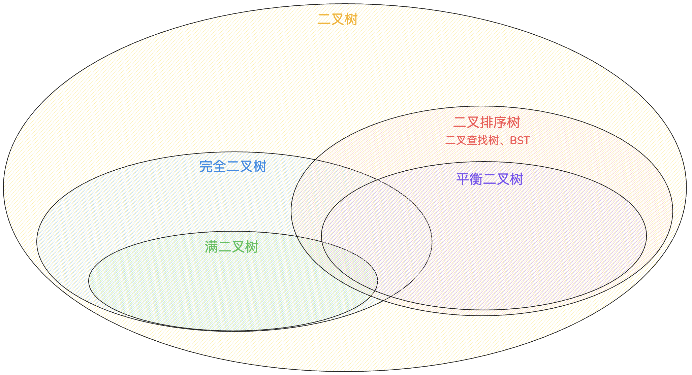

---
文章分类:
  - 编程语言与技术
文章标签:
  - 理论
  - Java
文章简介: Java的数据结构与集合源码，
文章精选:
  - 否
是否发布:
  - 否
发布时间: 
创建时间: 2024-12-01
修改时间:
---

### 1. 数据结构

**数据结构**：是一种程序设计优化的方法论，研究数据的 `逻辑结构` 和 `物理结构` 以及它们之间相互关系，并对这种结构定义相应的 `运算`，进而增加程序的执行速度，减少内存占用的空间。

数据结构的研究对象：1. 数据间的逻辑关系；2. 数据的存储结构；3. 运算结构。

1. 数据间的逻辑关系：
	- 集合结构：数据结构中的元素之间除了 `同属一个集合` 的相互关系外，没有其它关系。集合元素之间没有逻辑关系。
	- 线形结构：数据结构中的元素存在 `一对一` 的相互关系，如：排队。结构中必须存在唯一的首元素和唯一的尾元素。Java中有：一位数组、链表、栈、队列。
	- 树形结构：数据结构中的元素存在 `一对多` 的相互关系，如：文件系统，组织架构。
	- 图形结构：数据结构中的元素存在 `多对多` 的相互关系，如：铁路网，地铁网。
2. 数据的存储结构（物理结构）：
	- 顺序结构：数组 `Array`。   
	- 链式结构：链表 `Linked List`。
	- 索引结构：节点信息 + 索引表。
	- 散列结构：Hash存储。
3. 运算结构：
	- 分配资源、建立结构、释放资源。
	- 插入和删除。
	- 获取和遍历。
	- 修改和排序。

数据存储结构，通常用如下概念来理解数据间的逻辑关系：

- 线性表（一对一关系）：一位数组、单向链表、双向链表、栈、队列。
- 树（一对多关系）：各种类型的树，如：二叉树、B+树等。
- 图（多对多关系）。
- 哈希表：`HashMap`、`HashSet`。

### 2. 数据的存储结构

**顺序结构（数组）**：

数组：一次申请一大段连续的空间，一旦申请到，内存就固定了。

- 优点：只需要申请存放数据本身的内存空间即可，支持下标访问，也可以实现随机访问。
- 缺点：必须静态分配连续空间，内存空间的利用率比较低。插入或删除可能需要移动大量元素，效率比较低。

存储方式：所有数据存储在连续的空间中；数组中的每个元素都是一个具体的数据，所有数据都紧密排布，不能有间隔。

数组操作：

- 读内存：
	- 查：每个元素都有一个数值下标，可以通过下标瞬间定位到某个元素。
- 写内存：
	- 增：从头部插入、从中间插入、从尾部插入。插入元素引起部分元素后移，代价非常高。
	- 删：去掉元素，引起部分元素迁移，代价非常高。
	- 改：只需要修改对应位置的元素的内容，不需要申请或删除空间。

数组特点：

1. 查询效率非常高。
2. 数组查找块，但插入/删除效率低。
3. 若事先申请足够大的内存空间，可能造成空间浪费，如果实现申请较小的内存空间，可能造成频繁扩容导致元素频繁迁移。

适用范围：查询操作远多于插入/删除操作的场景，简单抽象数据结构的基石。

**链式结构（链表）**：

链表：一次申请一小块内存，按需申请。不实用连续的存储空间存放结构的元素，而是为每一个元素构造一个节点。节点中除了存放数据本身以外，还需要存放指向下一个节点的指针。

- 优点：不采用连续的存储空间导致内存空间利用率比较高，克服顺序存储结构中预知元素个数的缺点。插入或删除元素时，不需要移动大量元素。
- 缺点：需要额外的空间来表达数据之间的逻辑关系，不支持下标访问和随机访问。

存储思路：每一个小数据单独存在一小块内存中，这个单元被称作节点（ `Node` ），包括数据域和指针域。每个小块内存知道下一小块的地址。多个不连续的小内存空间组成，通过内存地址引用形成一个链的结构。

- 表头（头指针）：程序在获得表头就可以得到链表中所有的元素。
- 表尾：有的链表有，有的没有。

链表操作：

- 读取操作：
	- 查：节点是没有下标的，只能从链表的表头开始查找某个节点，进行遍历。
- 写入操作：
	- 增：申请一小块内存，节点。插入到链表中，包含从头部插入、从尾部插入和从中间插入。
	- 删：从链表中剥离节点，释放这个节点的内存。
	- 改：改变这个节点中所存储的值。

链表特点：

1. 逻辑上相邻节点物理上不必相邻。
2. 查找速度慢。
3. 链表插入/删除较数组快。

使用范围：插入/删除操作远多于查询操作的场景。抽象数据结构的基石，如：栈、队列、树。

**索引结构（节点信息 + 索引表）**：

索引：除了建立存储节点信息外，还建立附加的索引表来记录每个元素节点的地址。索引表由若干索引项组成。索引项的一般形式是：`(关键字,地址)`。

- 优点：用节点的索引号来确定节点存储地址，检索速度快。
- 缺点：增加了附加的索引表，会占用较多的存储空间。在增加和删除数据时要修改索引表，因而会花费较多的时间。

**散列结构（Hash存储）**：

散列：根据元素的关键字直接计算出该元素的存储地址，又称为Hash存储。

- 优点：检索、增加和删除节点的操作都很快。
- 缺点：不支持排序，一般比用线形表存储需要更多的空间，并且记录的关键字不能重复。

### 3. 常见的数据结构

**数组**：

> 见第2小节顺序结构（数组）部分。

**链表**：基本单位是节点（ `Node` ）

**单向链表**：

```java
class Node{
	Object data;
	Node next;

	public Node(){Object data}{
		this.data = data;
		this.next = null;
	}

	public Node(){Object data,Node next}{
		this.data = data;
		this.next = next;
	}
}
```

构建单向链表

```java
Node node1 = new Node("data1");
Node node2 = new Node("data2");
Node node3 = new Node("data3");
node1.next = node2;
node2.next = node3;
```

**双向链表**：

```java
class Node{
	Node prev;
	Object data;
	Node next;

	public Node(){Object data}{
		this.prev = null;
		this.data = data;
		this.next = null;
	}

	public Node(){Node prev,Object data,Node next}{
		this.prev = prev;
		this.data = data;
		this.next = next;
	}
}
```

构建双向链表

```java
Node node1 = new Node("data1");
Node node2 = new Node("data2");
Node node3 = new Node("data3");
node1.next = node2;
node2.prev = nodo1;
node2.next = node3;
node3.prev = node2;
```

**二叉树**：两类，包含父节点和不包含父节点。

**不包含父节点的二叉树**：

```java
class TreeNode{
	TreeNode left;
	Object data;
	TreeNode right;

	public Node(){TreeNode data}{
		this.left = null;
		this.data = data;
		this.right = null;
	}

	public Node(){TreeNode prev,Object data,TreeNode next}{
		this.left = prev;
		this.data = data;
		this.right = next;
	}
}
```

构建二叉树

```java
Node node1 = new Node("data1");
Node leftNode = new Node("data2");
Node rightNode = new Node("data3");
node1.left = leftNode;
node1.right = rightNode;
```

**包含父节点的二叉树**：

```java
class TreeNode{
	TreeNode parent;
	TreeNode left;
	Object data;
	TreeNode right;

	public Node(){TreeNode data}{
		this.parent = null;
		this.left = null;
		this.data = data;
		this.right = null;
	}

	public Node(){TreeNode parent,TreeNode prev,Object data,TreeNode next}{
		this.parent = parent;
		this.left = prev;
		this.data = data;
		this.right = next;
	}
}
```

构建二叉树

```java
Node node1 = new Node("data1");
Node leftNode = new Node("data2");
Node rightNode = new Node("data3");
node1.left = leftNode;
node1.right = rightNode;
leftNode.parent = node1;
rightNode.parent = node1;
```

**栈**：stack，先进后出。核心类库中的栈结构有 `Stack` 和 `LinkedList`。属于抽象数据类型 `ADT`。可以使用数组或链表来构建。

```java
class Stack{
	Object[] values;
	int size;

	public Static(int length){
		values = new Object[length];
	}

	// 入栈操作
	public void push(Object el){
		if(size >= values.length){
			throw new RuntimeException("栈空间已满，无法入栈");
		}
		values[size] = el;
		size++;
	}

	// 出栈操作
	public Object pop(){
		if(size <=0){
			throw new RuntimeException("栈内无元素，无法出栈");
		}
		Object obj = values[size - 1];
		values[size - 1] = null;
		size--;
		return obj;
	}
}
```

队列：queue，先进先出。属于抽象数据类型 `ADT`。可以使用数组或链表来构建。

```java
class Queue{
	Object[] values;
	int size;

	public Static(int length){
		values = new Object[length];
	}

	// 入栈操作
	public void add(Object el){
		if(size >= values.length){
			throw new RuntimeException("队列空间已满，无法入队");
		}
		values[size] = el;
		size++;
	}

	// 出栈操作
	public Object get(){
		if(size <=0){
			throw new RuntimeException("队列内无元素，无法取出");
		}
		Object obj = values[0];
		for(int i = 0; i < size -1;i++){
			values[i] = value[i+1];
		}
		values[size - 1]=null;
		size--;
		return obj;
	}
}
```

### 4. 树与二叉树

相关名词：

- 节点：树中的数据元素都称为节点。
- 根节点：最上面的节点称之为根，一棵树之有一个根且由根发展而来，从另一个角度来说，每个节点都可以是其字数的根。
- 父节点：节点的上层节点。
- 子节点：节点的下层节点。
- 兄弟节点：具有相同父节点的节点称为兄弟节点。
- 节点的度数：每个节点所拥有的子树的个数称之为节点的度。
- 树叶：度数为0的节点，也叫作终端节点。
- 非终端节点（或分支节点）：树叶以外的节点，或度数不为0的节点。
- 树的深度（或高度）：树中节点的最大层次树。
- 节点的层数：从根节点到树中某节点所经路径上的分支树称为该节点的层数，根节点的层数规定为1，其余节点的层数等于父节点的层数+1。
- 同代：在同一棵树中具有相同层数的节点。

二叉树（Binary tree）：是树形结构的一个重要类型。二叉树特点是每个节点最多只能有两颗子树，且有左右之分。

二叉树的遍历：

- 前序遍历：中左右。先访问根节点，再前序遍历左子树，最后再前序遍历右子树。
- 中序遍历：左中右。先前序遍历左子树，再访问根节点，最后再前序遍历右子树。
- 后序遍历：左右中。先前序遍历左子树，再前序遍历右子树，最后再访问根节点。

**经典二叉树**：



1. 满二叉树：除最后一层无任何子节点外，每一层上的所有节点都有两个子节点的二叉树。第N层的节点数是 $2^{n - 1}$ ，总的节点个数是 $2^n$。
2. 完全二叉树：叶子节点只能出现在最底层的两层，且最底层叶子节点均处于次底层节点的左侧。
3. 二叉排序/查找/搜索树：即BST（Binary Search/Sort Tree）。进行中序遍历，可以得到有序集合，便于检索。满足的性质：
	- 若它的左子树不为空，则左子树的所有节点的值均小于它的根节点的值。
	- 若它的右子树不为空，则右子树的所有节点的值均大于它的根节点的值。
	- 它的左、右子树叶分别为二叉排序/查找/搜索树。
4. 平衡二叉树：AVL（Self-balancing Binary Search Tree）。为了减少二叉排序树查找的层次，提高查找速度。平衡二叉树常用实现有：红黑树、AVL、替罪羊树、Treap、伸展树等。满足二叉排序的所有性质，此外还具有：
	- 它是一个空树或它左右两个子树的高度差的绝对值不超过1。
	- 左右两个子树也都是一个平衡二叉树。
	- 非叶子节点不一定都有两个子节点。

红黑树：Red-Black Tree。红黑树的每个节点都有存储为表示节点的颜色。可以是红或黑。是一种自平衡二叉查找树。红黑树的特性：

- 每个节点是红色或黑色。
- 根节点是黑色。
- 每个叶子节点（NIL）是黑色。叶子节点：是指为空（NIL或NULL）的节点。
- 每个红节点的两个子节点都是黑色（从每个叶子到根的所有路径都不能两个连续的红色节点）。
- 从任意节点到其每个叶子节点的所有路径包含相同数目的黑色节点（确保没有一条路径会比其他路径长出2倍）

### 5. List的实现类

**List的实现类：ArrayList**

ArrayList的特点：1. 实现了List接口，存储有序的、可以重复的数据；2. 底层使用 `Object[]` 数组存储；3. 线程不安全。

ArrayList源码解析：

JDK7时，ArrayList源码。类似于单例中的饿汉式，初始化时创建。

```java
// 底层会初始化数组，数组长度为10。Object[] elementData = new Object[10];
ArrayList<String> list = new ArrayList<>();

list.add("data1"); // elementData[0] = "data1"
list.add("data2"); // elementData[1] = "data2"
// todo()...
// 在添加第11个元素时，底层的elementData需要进行扩容。默认扩容为原来的1.5倍，并将原有数组中的值复制到新的数组中。
```

JDK8时，ArrayList源码。类似于单例中的懒汉式，第一次使用时创建。

```java
// 底层会初始化数组，数组长度为0。Object[] elementData = new Object[]{};
ArrayList<String> list = new ArrayList<>();

// 首次添加元素时，会重新初始化数组，数组长度为10。
list.add("data1"); // elementData[0] = "data1"
list.add("data2"); // elementData[1] = "data2"
// todo()...
// 在添加第11个元素时，底层的elementData需要进行扩容。默认扩容为原来的1.5倍，并将原有数组中的值复制到新的数组中。
```

**List的实现类：Vector**

Vector的特点：1. 实现了List接口，存储有序的、可以重复的数据；2. 底层使用 `Object[]` 数组存储；3. 线程安全。

Vector源码解析：

JDK8时，Vector源码。

```java
// 底层会初始化数组，数组长度为10。Object[] elementData = new Object[10];
Vector list = new Vector();

list.add("data1"); // elementData[0] = "data1"
list.add("data2"); // elementData[1] = "data2"
// todo()...
// 在添加第11个元素时，底层的elementData需要进行扩容。默认扩容为原来的2倍，并将原有数组中的值复制到新的数组中。
```

**List的实现类：LinkedList**

LinkedList的特点：1. 实现了List接口，存储有序的、可以重复的数据；2. 底层使用双向链表存储；3. 线程不安全。

LinkedList源码解析：

```java
// LinkedList内部类
Node first;
Node last;
class Node {
	Node prev;
	Object obj;
	Node next;
}


// 底层什么也没有做
LinkedList list = new LinkedList();

// 将数据封装到Node对象1中，list对象的first、last都指向此Node对象1上。
list.add("data1");
// 将数据封装到Node对象2中，对象1和对象2构成双向链表，同时last指向对象2。
list.add("data2");
// todo()...
// LinkedList使用的是双向链表，不需要考虑扩容问题。 
```

开发中的注意点：

1. Vector基本可以不使用。
2. ArrayList底层使用数组结构，查找和添加（尾部添加）效率高，时间复杂度为O(1)；删除和插入效率低，时间复杂度为O(n)。
   LinkedList底层使用双向链表结构，删除和插入效率高，时间复杂度O(1)；查找和添加（尾部添加）操作效率低，时间复杂度O(1)。【添加操作时间复杂度有可能为O(1)】
4. 在选择ArrayList前提下，`new ArrayList()`：底层创建长度为10的数组；`new ArrayList(int capacity)`：底层创建长度为capacity的数组；如果知道数组长度，可以直接使用带参的构造器，避免了底层的扩容和复制数组。

### 6. Map的实现类

**Map的实现类：HashMap**

HashMap的特点：1. 所有的key彼此之间是不可重复的、无序的。所有的key就构成一个Set集合。key所在的类要必须重写`hashCode()`和`equals()`方法；2. 所有的value之间是可重复的、无序的。所有的value就构成一个Collection集合。value所在的类要重写`equals()`方法；3. HashMap中的一个key-value构成了一个Entry类，Entry类是Map接口内置的接口类；4. HashMap所有的entry彼此之间是不可重复的、无序的。所有的entry构成了一个Set集合。

JDK7时，HashMap源码。

```java
// 创建对象的过程中，底层会初始化Entry[] table = new Entry[16];
HashMap<String, Integer> map = new HashMap<>();

// 将key和value先封装到Entry对象中，然后在考虑将对象添加到table数组中。
map.put("key1",1);
// todo()...
// 添加/修改过程：将(key1,value1)添加到当前的map中。
// 1. 调用kye1所在类的hashCode()方法，计算key1对应的哈希值1，在哈希值1经过某种算法（Hash()）之后得到哈希值2，哈希值2再经过某种算法（indexFor()）之后，就确定了其在数组table中的索引位置i。  
// 1.1 如果此时索引位置i的数组上没有元素，则(key1,value1)添加成功。 -- 情况1
// 1.2 如果此时索引位置i的数组上有元素(key2,value2)，则需要继续比较key1和key2的哈希值2 --> 哈希冲突
// 1.2.1 如果key1的哈希值2与key2的哈希值2不相同，则(key1,value1)添加成功。 -- 情况2
// 1.2.2 如果key1的哈希值2与key2的哈希值2相同，则需要继续比较key1和key2的equals()。调用key1所在类的equals()方法。将key作为参数传递出去。
// 1.2.2.1 调用equals()，返回false，则(key1,value1)添加成功。 -- 情况3
// 1.2.2.2 调用equals()，返回true，则认为key1和key2是相同的。默认情况下，value1替换原有的value2。
// 说明：
// 情况1，将(key1,value1)存放到数组的索引i的位置。
// 情况2，情况3，(key1,value1)元素与现有的(key2,value2)构成单向链表结构，(key1,value1)指向(key2,value2)。
// 随着不断添加元素的，在满足如下条件的情况下，会考虑扩容：
// (size >= threshold) && (null != table[i])，当元素的个数达到临界值（-> 数组的长度 * 加载因子）时，就考虑扩容。默认的临界值 = 16 * 0.75。默认扩容为原来的2倍。
// 
```

```java
// 实例化
HashMap<String, Integer> map = new HashMap<>();

// 对应的源码：
public HashMap(int initialCapacity, float loadFactor){
	// todo()...前置校验
	// 通过此循环，得到capacity的最终值，此最终值决定了Entry数组的长度
	int capacity = 1;
	while(capacity < initialCapacity){
		capacity <<= 1;
	}
	this.loadFactor = loadFactor; // 确定加载因子的值
	// 确定临界值
	threshold = (int) Math.min(capacity * loadFactor, MAXIMUM_CAPACITY +1);
	table = new Entry[capacity]; // 初始化数组，长度为capacity
	// todo()... 操作计数
}

static final int DEFAULT_INITIAL_CAPACITY = 16;
static final float DEFAULT_LOAD_FACTOR = 0.75f;

final float loadFactor; // 加载因子
int threshold; // 临界值
transient Entry<k,v>[] table; //存储数据的数组
// ---  ---

// 添加/修改数据
map.put("key1",1);

// 对应的源码：
public V put(K key, V value){
	// HashMap允许添加key为null的值，将此(key, value)存放到table索引0的位置
	if(key == null){
		return putForNullKey(value);
	}
	// 将key传入hash()，内部使用了key的哈希值1，此方法返回哈希值2
	int hash = hash(key);
	// 确定当前key，value在数组中的存放位置
	int i = indexFor(hash, table.length);
	
	for(Entry<K,V> e = table[i]; e != null; e = e.next){
		Object k;
		if(e.hash == hash && ((k = e.key) == key || key.equals(k))){
			V oldValue = e.value;
			e.value = value;
			e.recordAccess(this);
			return oldValue; // put是修改操作，返回原有旧的value值
		}
	}
	// todo()...计数操作
	// 将key,value封装为一个Entry对象，并将此对象保存在索引i的位置
	addEntry(hash, key, value, i);
	return null; //put是添加操作，会返回null值
}

final int hash(Object k){
	int h = 0;
	if(useAltHashing){
		if(k instanceof String){
			return sun.misc.Hashing.stringHash32((String) k);
		}
		h = hashSeed;
	}
	h ^= k.hashCode();
	
	h ^= (h >>> 20) ^ (h >>> 12);
	return h ^ (h >>> 7) ^ (h >>> 4);
}

static int indexFor(int h, int length){
	return h & (length - 1);
}

void addEntry(int hash, K key, V value, int bucketIndex){
	// 是否进行扩容
	if((size >= threshold) && (null != table[bucketIndex])){
		resize(2 * table.length); // 默认扩容原有容量的两倍
		hash = (null!=key)? hash(key):0;
		bucketIndex = indexFor(hash, table.length);
	}	
	createEntry(hash, key, value, bucketIndex);
}

void createEntry(int hash, K key, V value, int bucketIndex){
	Entry<K,V> e = table[bucketIndex];
	table[bucketIndex] = new Entry<>(hash, key, value, e);
	size++;
}

// Entry的定义内容
static class Entry<K,V> implements Map.Entry<K,V>{
	final K key;
	V value;
	Entry<K, V> next;
	int hash; // 使用key得到的哈希值2进行赋值

	Entry(int h, K k, V v, Entry<K,V> n){
		value = v;
		next = n;
		key = k;
		hash =h;
	}
}
```

JDK8中与JDK7的区别：

1. 在JDK8中，创建HashMap示例后，底层并没有初始化table数组。当首次添加 `(key, value)` 时，进行判断，如果table没有初始化，则对数组进行初始化。
2. 在JDK8中，HashMap底层定义了Node内部类，替换JDK7中的Entry内部类。仅仅是替换了名字。
3. 在JDK8中，如果当前 `(key, value)` 经过一系列判断后，可以添加到当前数组i位置中。如果i上有元素，则是旧的指向当前新的元素。
4. 在JDK8中存储结构是数组 + 单向链表 + 红黑树，在JDK7中存储结构是数组 + 单向链表。
	- 单向链表变为红黑树：当数组索引i位置上的元素个数到达8，并且数组的长度到达64时，此索引i位置上的多个元素调整为红黑树结构进行存储。目的是减少 `put() / get() / remove()` 方法消耗的时间。
	- 红黑树变为单向链表：当使用红黑树的索引i位置上的元素低于6时，会讲红黑树转化为单向链表。因为红黑树的元素存储空间是单向链表的元素存储空间的2倍。

```java
// JDK8中的属性/字段
static final int DEFAULT_INITIAL_CAPACITY = 1 << 4; // 默认初始化容量16
static final int MAXIMUM_CAPACITY = 1 << 30; // 最大容量 1 << 30
static final float DEFAULT_LOAD_FACTORY = 0.75f; // 默认记载因子
static final int TREEIFY_THRESHOLD = 8; // 默认树化阈值8，当链表长度达到此值后考虑树化
static final int UNTREEIFY_THRESHOLD = 6; // 默认反树化阈值6，当树中节点的个数达到此值时，考虑变为链表

// 当单个链表的节点个数达到8，并且table的长度达到64时，才会树化。
// 当单个的链表节点个数达到8，但table的长度为达到64时，先会扩容。
static final int MIN_TREEIFY_CAPACITY = 64; // 最小树化，数组长度64

transient Node<K, V>[] table; //数组
transient int size; // 记录有效映射关系的对数，也是Entry对象的个数
int threshold; // 阈值，当size达到阈值时，考虑扩容。
final float loadFactory; // 加载因子，影响扩容的频率
```

**Map的实现类：LinkedHashMap**

LinkedHashMap的特点：是HashMap的子类。除数组 + 单向链表 + 红黑树的基础上，又增加了一堆双向链表，记录 `(key, value)` 先后顺序。便于遍历所有的key-value。

LinkedHashMap重写了HashMap的方法：

```java
Node<K, V> newNode(int hash, K key, V value, Node<K, V> e){
	LinkedHashMap.Entry<K, V> p = new LinkedHashMap.Entry<K, V>(hash, key, value , e);
	linkNodeLast(p)
	return p;
}

// Entry定义结构
static class Entry<K, V> extends HashMap.Node<K, V>{
	Entry<K, V> before,after; // 增加的双向链表
	Entry(int hash, K key, V value, Node<K, V> next){
		super(hash, key, value, next);
	}
}
```

### 7. Set的实现类

**Set的实现类：HashSet**

> HashSet底层使用的是HashMap。其Map的Value值时常量 `private static final Object PRESENT = new Object();`。

**Set的实现类：LinkedHashSet**

> LinkedHashSet底层使用的是LinkedHashMap。其Map的Value值时常量 `private static final Object PRESENT = new Object();`。

### 8. 数据结构与集合源码补充

1. 数组和ArrayList的区别：ArrayList可以看作是对数组常见操作的封装。
2. HashMap长度时2的幂次方，主要是为了方便计算添加元素底层的索引i。
3. 哈希冲突的情况：1. `hashCode` 值相同；2. `hash()` 结果相同；3. `hash&(hash.length-1)` 的结果相同。
4. 解决Hash冲突：1. 头插法/尾插法；2. 替换元素的值。
5. HashMap底层使用数组 + 链表，为了解决哈希冲突。使用链表的方式，添加在索引i的位置。
6. 进行 `equals()` 判断使用的属性，通常也会参与hashCode方法计算，尽量保证 `hashCode()` 的一致性。hashCode计算，每个属性 * 31 后累加求和。
7. equals相等hash值一定相等，前提：尽量保证 `hashCode()` 的一致性。hash值相等equals不一定相等。
