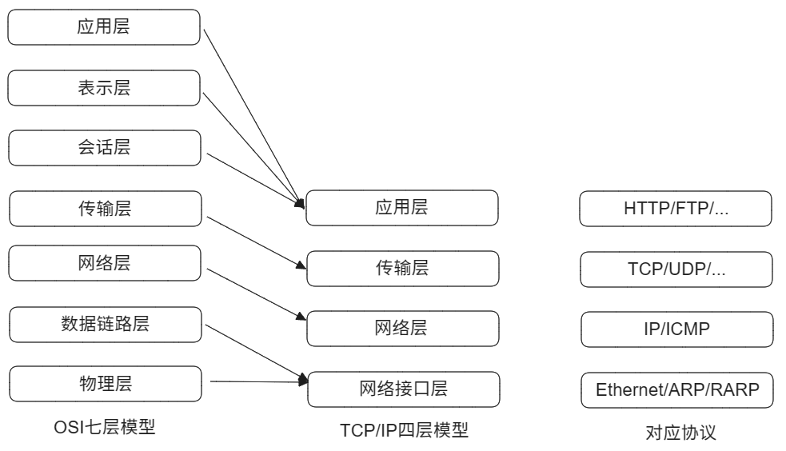
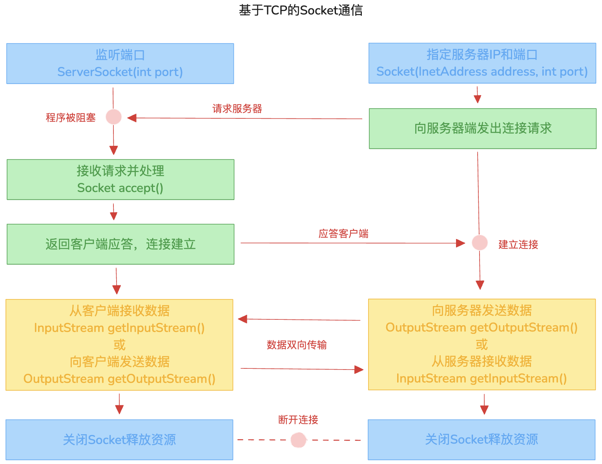

---
文章分类:
  - 计算机基础知识
文章标签:
  - 理论
  - Java
文章简介: Java的网络编程，熟悉TCP、UDP协议的网络编程，了解URL网络编程
文章精选:
  - 否
是否发布:
  - 否
发布时间: 
创建时间: 2024-11-09
修改时间: 2024-11-23
---

### 1. 网络编程

Java 从语言层面提供了对网络应用程序的支持，使得开发者可以轻松实现网络连接，而联网的底层细节则被隐藏在本机安装的系统中，并由JVM进行控制。此外，Java 实现了一个跨平台的网络库，为程序提供了一致的网络编程环境。

**软件架构**：

- C/S架构：Client/Server结构，即客户端和服务器端的结构。
- B/S架构：Browser/Server结构，即浏览器与服务器之间的结构。

这两种架构都依赖于网络传输。**网络编程**是指在特定协议的支持下，实现两台计算机之间通信的程序设计过程。

**计算机网络**：把分布在不同地理区域的计算机与专门的外部设备用通信线路互联成一个规模大、功能强的网络系统，从而使众多的计算机可以方便地互相传递信息、共享硬件、软件、数据信息等资源。

**网络编程的目的**：直接或间接地通过网络协议与其他计算机实现数据交换和通信。

在网络编程中，需要解决以下三个关键问题：

1. 如何准确地定位网络上的一台或多台主机。
2. 如何确定主机上的特定应用。
3. 如何进行可靠且高效的双向数据传输。

### 2. 网络编程三要素

**解决网络编程中的问题**：

1. 使用IP地址，准确定位网络上一台或多台主机。
2. 使用端口号，定位主机上的特定应用。
3. 规范网络通信协议，进行可靠、高效的数据传输。

**要素一：IP地址**

**IP地址**：互联网协议地址（Internet Protocol Address），给网络中的一台计算机设备做唯一的编号。IP地址 = 网络地址 + 主机地址。 

IP地址分类：

1. 通过IP地址的位数分为： 
	- IPv4：是一个32位的二进制数，被分为4个字节。在2011年初已经用尽。
	- IPv6：是一个128位的地址长度，共16个字节。在2012年6月6日启用。
2. 通过IP地址的可访问性分为：
	- 公网地址：万维网使用。
	- 私有地址：局域网使用，以192.168开头的。
3. 特殊IP地址：
	- 回路地址：127.0.0.1。

**域名**：为了更方便记忆IP地址。

**要素二：端口号**

**端口号**：标识主机中的进程（应用程序），不同进程分配不同的端口号。用2个字节表示的整数，范围：0 ~ 65535。

端口号的划分：

- 公认端口：0 ~1023，被预先定义的服务通信占用。
- 注册端口：1024 ~ 49151，分配给用户进程或应用程序。
- 动态/私有端口：49152 ~ 65535。

**要素三：网络通信协议**

**网络通信协议**：为了实现可靠、高效的数据传输

通过网络通信协议分层的方式，同层可以通信，上层可以调用下层，而与再下一层不发生关系，将功能明晰，各层互不影响，利于系统的开发和扩展。

**网络通信协议的参考模型**：OSI、TCP/IP模型。

- OSI模型过于理想化，未能在英特网上进行推广。
- TCP/IP参考模型（TCP/IP协议），常用的国际标准。



### 3. 网络编程API

**网络编程API**：InetAddress类

`InetAddress`类的一个实例代表一个具体的IP地址

`InetAddress`实例化方式：

| 方法                                          | 含义                      |
| ------------------------------------------- | ----------------------- |
| `static InetAddress getByName(String host)` | 获取指定IP对应的InetAddress的实例 |
| `static InetAddress getLocalHost()`         | 获取本地IP对应的InetAddress的实例 |
| `String getHostName()`                      | 获取域名，没有域名则获取IP地址        |
| `String getHostAddress()`                   | 获取IP地址                  |

```java
package org.internet;  
  
imp`ort java.net.InetAddress;  
import java.net.UnknownHostException;  
  
public class InternetTest1 {  
    public static void main(String[] args) {  
        test1();  
    }  
  
    public static void test1() {  
        try {  
            // 解析结果：/192.168.100.99  
            InetAddress inet1 = InetAddress.getByName("192.168.100.99");  
            System.out.println(inet1);  
  
            // 解析结果：www.baidu.com/183.2.172.42  
            InetAddress inet2 = InetAddress.getByName("www.baidu.com");  
            System.out.println(inet2);  
  
            // 解析本地IP地址  
            InetAddress localHost = InetAddress.getLocalHost();  
            System.out.println(localHost);  
  
            // 方法：获取InetAddress的域名和IP地址  
            System.out.println(inet2.getHostName());  
            System.out.println(inet2.getHostAddress());  
  
        } catch (UnknownHostException e) {  
            throw new RuntimeException(e);  
        }  
    }  
}
```

**网络编程API**：Socket类

**Socket**是网络上具有标识的IP地址和端口号组合，能够唯一识别的标识符套接字。它已经被广泛采用，成为事实上的标准，用于开发网络应用。

在网络通信中，Socket充当了两个端点的角色，即两台机器间通信的端点。

在通信过程中，双方都需要一个Socket，数据通过IO传输在两个Socket之间流动。一般而言，主动发起通信的应用程序被称为客户端，而等待通信请求的一方则称为服务端。

**Socket分类**：

1. 流套接字(Stream Socket)：使用TCP提供可靠的字节流服务。
	- ServerSocket类实现了TCP服务器套接字，服务器套接字等待请求通过网络传入。
	- Socket类实现了客户端套接字（也可称：套接字）。套接字是两台机器通信的端点。  
2. 数据报套接字（Datagram Socket）：使用UDP提供“尽力而为”的数据报服务。
	- DatagramSocket类表示用来发送和接收UDP数据包的套接字。

在数据报套接字中：

- `DatagramSocket` 用于处理数据报文（datagram）的发送和接收，适用于需要进行点对点或广播通信的应用。
- `DatagramPacket` 是一个封装了发送或接收的数据以及目标地址和端口的对象，并且通常与 `DatagramSocket` 配合使用。

### 4. TCP、UDP协议

在Java中，TCP和UDP协议主要通过`java.net`包中的类和接口来实现。这些类和接口提供了低层次的通信细节，使得开发者可以直接使用它们进行网络程序开发，而无需过多关注底层的通信机制。

具体来说，`java.net`包中包含了支持以下两种常见网络协议的类：

- TCP（传输控制协议）：用于建立可靠的、面向连接的数据传输。
- UDP（用户数据报协议）：用于提供无连接的数据传输服务。

TCP协议与UDP协议：

**TCP协议**：

- TCP协议用于**客户端**和**服务器**两个应用进程之间的通信。
- 使用TCP协议前，需先**建立TCP连接**，形成基于字节流的数据传输通道。
- 通过“三次握手”来建立**可靠的连接**。在数据传输前，采用点对点通信方式，并使用**重发机制**确保消息可靠传输：发送方发送消息后等待接收方确认，若未收到确认则会重新发送该消息。
- 在连接中可以进行大数据量的传输。
- 传输完毕后需要**释放已建立的连接**，但这种方式**效率较低**。

**UDP协议**：

- UDP协议用于**发送端**和**接收端**两个应用进程之间的通信。
- 将数据、源地址和目的地址封装成数据包（传输的基本单位），**不需要建立连接**。
- 发送时，无论接收方是否准备好都会发送数据。接收方即使接收到数据也不会进行确认，因此不能保证数据的完整性，这种方式是**不可靠的**。
- 每个数据报的大小限制在`64KB`以内。
- 数据发送完毕后**无需释放资源**，**开销小**，**通信效率高**。
- 适用于音频、视频和普通数据的传输。

**TCP的三次握手**：TCP协议中，在发送数据的准备阶段，客户端与服务器之间的三次交互，以保证连接的可靠。

1. 客户端向服务器端发起TCP连接请求，信号：`seq=x,SYN=1`。同步已发送（客户端）。
2. 服务器端发送针对客户端TCP连接请求的确认，信号：`ACK=x+1,seq=y,SYN=1`。同步已接收（服务器端）。
3. 客户端确认并向服务器端发送第一个数据，信号：`ACK=y+1,seq=z`，第一个数据为`z`。连接已建立（客户端和服务器端）

**TCP的四次挥手**：TCP协议中，在发送数据结束后，释放连接时需要经过四次挥手。

1. 客户端向服务器发送结束连接请求，让服务器做最后的准备工作。此时客户端处于半关闭状态，不再向服务器发送数据但可以接收数据。信号：`Fin=1,ACK=z,seq=x`。信号发送方：客户端。
2. 服务器接收到客户端的释放连接请求后，会将剩余的数据发给客户端，并告知其上层应用进程不再接收数据。信号：`ACK=x+1,seq=z`。信号发送者：服务器端。
3. 服务器发送完所有数据后，会给客户端发送一个释放连接的报文。客户端在接收后正式释放连接。信号：`Fin=1,ACK=x,seq=y`。信号发送者：服务器端。
4. 客户端收到服务器最后的释放连接报文后，会回复一个确认报文以彻底断开连接。此时客户端等待2MSL时间，以防服务器未接收到其最后一个报文并重新发送。信号：`ACK=y,seq=x`。信号发送者：客户端。

### 5. TCP网络编程

通信模型：



基于TCP协议的客户端与服务器端实现步骤：

- 客户端的实现步骤：
	1. 创建Socket对象, 指定要连接的服务器的IP地址和端口号
	2. 通过Socket对象获取输出流, 向服务器发送数据
	3. 关闭资源
- 服务器端实现步骤：
	1. 创建ServerSocket对象, 指定端口号
	2. 监听客户端连接, 获取Socket对象，在此处于阻塞
	3. 通过Socket对象获取输入流, 读取客户端发送的数据
	4. 关闭资源

客户端发送内容给服务器端，服务器将内容输出到控制台上：

```java
package org.internet;  
  
import java.io.ByteArrayOutputStream;  
import java.io.IOException;  
import java.io.InputStream;  
import java.io.OutputStream;  
import java.net.InetAddress;  
import java.net.ServerSocket;  
import java.net.Socket;  
  
// 客户端发送内容给服务器端，服务器将内容输出到控制台上  
public class InternetTest2 {  
    public static void main(String[] args) {  
        new Thread(new Runnable() {  
            @Override  
            public void run() {  
                System.out.println("===>服务端开始操作。。。。");  
                server();  
                System.out.println("===>服务端操作完成。。。。");  
            }  
        }).start();  
        new Thread(new Runnable() {  
            @Override  
            public void run() {  
                System.out.println("<====客户端开始操作。。。。");  
                client();  
                System.out.println("<====客户端操作完成。。。。");  
            }  
        }).start();  
    }  
  
    // TCP 客户端  
    public static void client() {  
        Socket socket = null;  
        OutputStream outputStream = null;  
        try {  
            // 1. 创建Socket对象, 指定要连接的服务器的IP地址和端口号  
            InetAddress inetAddress = InetAddress.getByName("localhost");  
            int port = 8888;  
            socket = new Socket(inetAddress, port);  
            // 2. 通过Socket对象获取输出流, 向服务器发送数据  
            outputStream = socket.getOutputStream();  
            outputStream.write("你好,服务器".getBytes());  
        } catch (IOException e) {  
            throw new RuntimeException(e);  
        } finally {  
            // 3. 关闭资源  
            try {  
                if (outputStream != null) {  
                    outputStream.close();  
                }  
            } catch (IOException e) {  
                throw new RuntimeException(e);  
            }  
            try {  
                if (socket != null) {  
                    socket.close();  
                }  
            } catch (IOException e) {  
                throw new RuntimeException(e);  
            }  
        }  
    }  
  
    // TCP 服务端  
    public static void server() {  
        ServerSocket serverSocket = null;  
        Socket socket = null;  
        InputStream inputStream = null;  
        // 为了解决字节转化字符失败问题  
        ByteArrayOutputStream baos = null;  
        try {  
            // 1. 创建ServerSocket对象, 指定端口号  
            int port = 8888;  
            serverSocket = new ServerSocket(port);  
            // 2. 监听客户端连接, 获取Socket对象，在此处于阻塞  
            socket = serverSocket.accept();  
            System.out.println("===>服务器端收到了来自：" + socket.getInetAddress().getHostAddress() + "客户端的消息：");  
            // 3. 通过Socket对象获取输入流, 读取客户端发送的数据  
            inputStream = socket.getInputStream();  
            baos = new ByteArrayOutputStream();  
            byte[] buffer = new byte[5];  
            int len;  
            while ((len = inputStream.read(buffer)) != -1) {  
                // System.out.println(new String(buffer, 0, len));  
                baos.write(buffer, 0, len);  
            }  
            System.out.println(baos.toString());  
        } catch (IOException e) {  
            throw new RuntimeException(e);  
        } finally {  
            // 4. 关闭资源  
            try {  
                if (baos != null) {  
                    baos.close();  
                }  
            } catch (IOException e) {  
                throw new RuntimeException(e);  
            }  
            try {  
                if (inputStream != null) {  
                    inputStream.close();  
                }  
            } catch (IOException e) {  
                throw new RuntimeException(e);  
            }  
            try {  
                if (socket != null) {  
                    socket.close();  
                }  
            } catch (IOException e) {  
                throw new RuntimeException(e);  
            }  
            try {  
                if (serverSocket != null) {  
                    serverSocket.close();  
                }  
            } catch (IOException e) {  
                throw new RuntimeException(e);  
            }  
        }  
    }  
}
```

客户端发送文件给服务器端，服务器将文件保存在本地：

```java
package org.internet;  
  
import java.io.*;  
import java.net.InetAddress;  
import java.net.ServerSocket;  
import java.net.Socket;  
  
// 客户端发送文件给服务器端，服务器将文件保存在本地  
public class InternetTest3 {  
    public static void main(String[] args) {  
        new Thread(new Runnable() {  
            @Override  
            public void run() {  
                System.out.println("===>服务端开始操作。。。。");  
                server();  
                System.out.println("===>服务端操作完成。。。。");  
            }  
        }).start();  
        new Thread(new Runnable() {  
            @Override  
            public void run() {  
                System.out.println("<====客户端开始操作。。。。");  
                client();  
                System.out.println("<====客户端操作完成。。。。");  
            }  
        }).start();  
    }  
  
    // TCP 客户端  
    public static void client() {  
        Socket socket = null;  
        OutputStream outputStream = null;  
        FileInputStream fis = null;  
        try {  
            // 1. 创建Socket对象, 指定要连接的服务器的IP地址和端口号  
            InetAddress inetAddress = InetAddress.getByName("localhost");  
            int port = 8888;  
            socket = new Socket(inetAddress, port);  
            // 2. 通过Socket对象获取输出流, 向服务器发送数据  
            outputStream = socket.getOutputStream();  
            File file = new File("vedio.mp4");  
            fis = new FileInputStream(file);  
            byte[] buffer = new byte[1024];  
            int len;  
            while ((len = fis.read(buffer)) != -1) {  
                outputStream.write(buffer, 0, len);  
            }  
        } catch (IOException e) {  
            throw new RuntimeException(e);  
        } finally {  
            // 3. 关闭资源  
            try {  
                if (fis != null) {  
                    fis.close();  
                }  
            } catch (IOException e) {  
                throw new RuntimeException(e);  
            }  
            try {  
                if (outputStream != null) {  
                    outputStream.close();  
                }  
            } catch (IOException e) {  
                throw new RuntimeException(e);  
            }  
            try {  
                if (socket != null) {  
                    socket.close();  
                }  
            } catch (IOException e) {  
                throw new RuntimeException(e);  
            }  
        }  
    }  
  
    // TCP 服务端  
    public static void server() {  
        ServerSocket serverSocket = null;  
        Socket socket = null;  
        InputStream inputStream = null;  
        FileOutputStream fos = null;  
        try {  
            // 1. 创建ServerSocket对象, 指定端口号  
            int port = 8888;  
            serverSocket = new ServerSocket(port);  
            // 2. 监听客户端连接, 获取Socket对象，在此阻塞  
            socket = serverSocket.accept();  
            System.out.println("===>服务器端收到了来自：" + socket.getInetAddress().getHostAddress() + "客户端的消息：");  
            // 3. 通过Socket对象获取输入流, 读取客户端发送的数据  
            inputStream = socket.getInputStream();  
            File file = new File("vedio_copy.mp4");  
            fos = new FileOutputStream(file);  
            byte[] buffer = new byte[1024];  
            int len;  
            while ((len = inputStream.read(buffer)) != -1) {  
                fos.write(buffer, 0, len);  
            }  
        } catch (IOException e) {  
            throw new RuntimeException(e);  
        } finally {  
            // 4. 关闭资源  
            try {  
                if (fos != null) {  
                    fos.close();  
                }  
            } catch (IOException e) {  
                throw new RuntimeException(e);  
            }  
            try {  
                if (inputStream != null) {  
                    inputStream.close();  
                }  
            } catch (IOException e) {  
                throw new RuntimeException(e);  
            }  
            try {  
                if (socket != null) {  
                    socket.close();  
                }  
            } catch (IOException e) {  
                throw new RuntimeException(e);  
            }  
            try {  
                if (serverSocket != null) {  
                    serverSocket.close();  
                }  
            } catch (IOException e) {  
                throw new RuntimeException(e);  
            }  
        }  
    }  
}
```

客户端和服务器端进行双向通信：

```java
package org.internet;  
  
import java.io.*;  
import java.net.InetAddress;  
import java.net.ServerSocket;  
import java.net.Socket;  
  
// 客户端发送文件给服务器端，服务器将文件保存在本地  
// 在接收完成后，服务器端向客户端在发送内容，客户端接收服务器的内容输出到控制台上  
public class InternetTest4 {  
    public static void main(String[] args) {  
        new Thread(new Runnable() {  
            @Override  
            public void run() {  
                System.out.println("===>服务端开始操作。。。。");  
                server();  
                System.out.println("===>服务端操作完成。。。。");  
            }  
        }).start();  
        new Thread(new Runnable() {  
            @Override  
            public void run() {  
                System.out.println("<====客户端开始操作。。。。");  
                client();  
                System.out.println("<====客户端操作完成。。。。");  
            }  
        }).start();  
    }  
  
    // TCP 客户端  
    public static void client() {  
        Socket socket = null;  
        OutputStream outputStream = null;  
        FileInputStream fis = null;  
        InputStream inputStream = null;  
        ByteArrayOutputStream baos = null;  
        try {  
            // 1. 创建Socket对象, 指定要连接的服务器的IP地址和端口号  
            InetAddress inetAddress = InetAddress.getByName("localhost");  
            int port = 8888;  
            socket = new Socket(inetAddress, port);  
            // 2. 通过Socket对象获取输出流, 向服务器发送数据  
            outputStream = socket.getOutputStream();  
            File file = new File("vedio.mp4");  
            fis = new FileInputStream(file);  
            byte[] buffer = new byte[1024];  
            int len;  
            while ((len = fis.read(buffer)) != -1) {  
                outputStream.write(buffer, 0, len);  
            }  
            //在发送完成数据后，可以告诉服务器，已经发送完毕。让服务器进行后续操作。  
            socket.shutdownOutput();  
            // 接收服务器发送的数据  
            inputStream = socket.getInputStream();  
            baos = new ByteArrayOutputStream();  
            byte[] buffer2 = new byte[1024];  
            int len2;  
            while ((len2 = inputStream.read(buffer2)) != -1) {  
                baos.write(buffer2, 0, len2);  
            }  
            System.out.println(baos.toString());  
        } catch (IOException e) {  
            throw new RuntimeException(e);  
        } finally {  
            // 3. 关闭资源  
            try {  
                if (baos != null) {  
                    baos.close();  
                }  
            } catch (IOException e) {  
                throw new RuntimeException(e);  
            }  
            try {  
                if (inputStream != null) {  
                    inputStream.close();  
                }  
            } catch (IOException e) {  
                throw new RuntimeException(e);  
            }  
            try {  
                if (fis != null) {  
                    fis.close();  
                }  
            } catch (IOException e) {  
                throw new RuntimeException(e);  
            }  
            try {  
                if (outputStream != null) {  
                    outputStream.close();  
                }  
            } catch (IOException e) {  
                throw new RuntimeException(e);  
            }  
            try {  
                if (socket != null) {  
                    socket.close();  
                }  
            } catch (IOException e) {  
                throw new RuntimeException(e);  
            }  
        }  
    }  
  
    // TCP 服务端  
    public static void server() {  
        ServerSocket serverSocket = null;  
        Socket socket = null;  
        InputStream inputStream = null;  
        FileOutputStream fos = null;  
        OutputStream outputStream = null;  
        try {  
            // 1. 创建ServerSocket对象, 指定端口号  
            int port = 8888;  
            serverSocket = new ServerSocket(port);  
            // 2. 监听客户端连接, 获取Socket对象，在此阻塞  
            socket = serverSocket.accept();  
            System.out.println("===>服务器端收到了来自：" + socket.getInetAddress().getHostAddress() + "客户端的消息：");  
            // 3. 通过Socket对象获取输入流, 读取客户端发送的数据  
            inputStream = socket.getInputStream();  
            File file = new File("vedio_copy.mp4");  
            fos = new FileOutputStream(file);  
            byte[] buffer = new byte[1024];  
            int len;  
            while ((len = inputStream.read(buffer)) != -1) {  
                fos.write(buffer, 0, len);  
            }  
            // 服务器发送数据  
            outputStream = socket.getOutputStream();  
            outputStream.write("文件接收成功".getBytes());  
        } catch (IOException e) {  
            throw new RuntimeException(e);  
        } finally {  
            // 4. 关闭资源  
            try {  
                if (outputStream != null) {  
                    outputStream.close();  
                }  
            } catch (IOException e) {  
                throw new RuntimeException(e);  
            }  
            try {  
                if (fos != null) {  
                    fos.close();  
                }  
            } catch (IOException e) {  
                throw new RuntimeException(e);  
            }  
            try {  
                if (inputStream != null) {  
                    inputStream.close();  
                }  
            } catch (IOException e) {  
                throw new RuntimeException(e);  
            }  
            try {  
                if (socket != null) {  
                    socket.close();  
                }  
            } catch (IOException e) {  
                throw new RuntimeException(e);  
            }  
            try {  
                if (serverSocket != null) {  
                    serverSocket.close();  
                }  
            } catch (IOException e) {  
                throw new RuntimeException(e);  
            }  
        }  
    }  
}
```

### 6. 应用：TCP聊天室

TCP聊天室的客户端：

```java
package org.internet;  
  
import java.io.IOException;  
import java.io.InputStream;  
import java.io.OutputStream;  
import java.io.PrintStream;  
import java.net.Socket;  
import java.util.Scanner;  
  
public class InternetClient {  
    public static void main(String[] args) throws IOException, InterruptedException {  
        // 1. 创建客户端对象  
        Socket socket = new Socket("127.0.0.1", 8888);  
  
        // 2. 开启接收、发送两个类的线程，并开启进行收发  
        ClientReceive cr = new ClientReceive(socket);  
        ClientSend cs = new ClientSend(socket);  
        cr.start();  
        cs.start();  
  
        // 3. 让主线程阻塞，等发送结束后，主程序再继续向下，意味着当前对象下线  
        cs.join();  
  
        socket.close();  
    }  
  
    private static class ClientReceive extends Thread {  
        private Socket socket;  
  
        public ClientReceive(Socket socket) {  
            this.socket = socket;  
        }  
  
        @Override  
        public void run() {  
            // 接收数据  
            try {  
                InputStream is = socket.getInputStream();  
                // 整行接收的情况  
                Scanner input = new Scanner(is);  
                while (input.hasNextLine()) {  
                    String line = input.nextLine();  
                    System.out.println(line);  
                }  
            } catch (IOException e) {  
                throw new RuntimeException(e);  
            }  
        }  
    }  
  
    private static class ClientSend extends Thread {  
        private Socket socket;  
  
        public ClientSend(Socket socket) {  
            this.socket = socket;  
        }  
  
        @Override  
        public void run() {  
            // 发送数据  
            try {  
                Scanner input = new Scanner(System.in);  
                OutputStream os = socket.getOutputStream();  
                // 打印流，按整行打印  
                PrintStream ps = new PrintStream(os);  
                while (true) {  
                    System.out.print("自己的内容：");  
                    String str = input.nextLine();  
                    if ("bye".equals(str)) {  
                        break;  
                    }  
                    ps.println(str);  
                }  
                input.close();  
            } catch (IOException e) {  
                throw new RuntimeException(e);  
            }  
        }  
    }  
}
```

TCP聊天室的服务器端：

```java
package org.internet;  
  
import java.io.*;  
import java.net.ServerSocket;  
import java.net.Socket;  
import java.util.ArrayList;  
  
public class InternetServer {  
    static ArrayList<Socket> onlineUsers = new ArrayList<>();  
  
    public static void main(String[] args) throws Exception {  
        // 1. 启动服务器，绑定端口  
        ServerSocket server = new ServerSocket(8888);  
  
        // 2. 循环监听客户端的连接  
        while (true) {  
            // 阻塞时，监听  
            Socket socket = server.accept();  
            // 加入当前在线集合里  
            onlineUsers.add(socket);  
            // 3. 启动线程，处理客户端的数据并分发，不影响处理时有新的连接对象  
            MessageHandler mh = new MessageHandler(socket);  
            mh.start();  
        }  
    }  
  
    private static class MessageHandler extends Thread {  
        private Socket socket;  
        private String ip;  
        private String hostName;  
  
        public MessageHandler(Socket socket) {  
            this.socket = socket;  
            ip = socket.getInetAddress().getHostAddress();  
            hostName = socket.getInetAddress().getHostName();  
        }  
  
        @Override  
        public void run() {  
            try {  
                // 通知其他已上线的对象  
                sendToOther(ip + "/" + hostName + "上线了");  
                // 接收客户端发送的消息  
                InputStream is = socket.getInputStream();  
                InputStreamReader isr = new InputStreamReader(is);  
                BufferedReader br = new BufferedReader(isr);  
                String str;  
                while ((str = br.readLine()) != null) {  
                    // 将消息转发给其他在线对象  
                    sendToOther(ip + "/" + hostName + "说：" + str);  
                }  
                // 等到客户端close时才会触发  
                sendToOther(ip + "/" + hostName + "下线了");  
            } catch (IOException e) {  
                throw new RuntimeException(e);  
            }  
        }  
  
        private void sendToOther(String message) throws IOException {  
            // 遍历所有在线用户，发送内容  
            for (Socket socket : onlineUsers) {  
                OutputStream os = socket.getOutputStream();  
                PrintStream ps = new PrintStream(os);  
                ps.println(message);  
            }  
        }  
  
    }  
}
```

### 7. UDP网络编程

基于TCP协议的发送端与接收端实现步骤：

- 发送端的实现步骤：
	1. 创建DatagramSocket对象,
	2. 构造DatagramPacket数据报，IP地址、端口号、数据
	3. 发送数据报  
	4. 关闭资源
- 服务器端实现步骤：
	1. 创建DatagramSocket对象  
	2. 构造DatagramPacket数据报接收对象
	3. 接收数据报
	4. 解析数据报
	5. 关闭资源

发送端通过UDP协议发送数据到接收端：

```java
package org.internet;  
  
import java.io.IOException;  
import java.net.*;  
  
public class InternetTest6 {  
    public static void main(String[] args) {  
        new Thread(new Runnable() {  
            @Override  
            public void run() {  
                System.out.println("===>接收端开始操作。。。。");  
                receiver();  
                System.out.println("===>接收端操作完成。。。。");  
            }  
        }).start();  
        new Thread(new Runnable() {  
            @Override  
            public void run() {  
                System.out.println("<====客户端开始操作。。。。");  
                sender();  
                System.out.println("<====客户端操作完成。。。。");  
            }  
        }).start();  
    }  
  
    // UDP发送端  
    public static void sender() {  
        DatagramSocket ds = null;  
        try {  
            // 1. 创建DatagramSocket对象  
            ds = new DatagramSocket();  
            // 2. 构造DatagramPacket数据报，IP地址、端口号、数据  
            InetAddress inetAddress = InetAddress.getByName("127.0.0.1");  
            int port = 8888;  
            byte[] data = "hello,udp".getBytes();  
            DatagramPacket dp = new DatagramPacket(data, 0, data.length, inetAddress, port);  
            // 3. 发送数据报  
            ds.send(dp);  
        } catch (IOException e) {  
            throw new RuntimeException(e);  
        } finally {  
            // 4. 关闭资源  
            if (ds != null) {  
                ds.close();  
            }  
        }  
    }  
  
    // UDP接收端  
    public static void receiver() {  
        DatagramSocket ds = null;  
        try {  
            // 1. 创建DatagramSocket对象  
            int port = 8888;  
            ds = new DatagramSocket(port);  
            // 2. 构造DatagramPacket数据报接收对象  
            byte[] data = new byte[1024 * 64];  
            DatagramPacket dp = new DatagramPacket(data, 0, data.length);  
            // 3. 接收数据报  
            ds.receive(dp);  
            // 4. 解析数据报  
            String str = new String(dp.getData(), 0, dp.getLength());  
            System.out.println(str);  
        } catch (IOException e) {  
            throw new RuntimeException(e);  
        } finally {  
            // 4. 关闭资源  
            if (ds != null) {  
                ds.close();  
            }  
        }  
    }  
}
```

### 8. URL网络编程

> URL（Uniform Resource Locator）：统一资源定位符，也称为种子。

URL作用：一个URL对应着互联网上的某一个资源的地址。

URL格式：应用层协议 + IP地址 + 端口号 + 资源地址 + 参数列表，例如： `http://localhost:8080/example/file.jpg?type='jpg'`

URL类的实例化及常用的方法：

| 方法                                              | 含义                  |
| ----------------------------------------------- | ------------------- |
| `URL(String spec) throws MalformedURLException` | 通过URL路径字符串，初始化URL对象 |
| `String getProtocol()`                          | 获取协议                |
| `String getHost()`                              | 获取主机名               |
| `int getPort()`                                 | 获取端口号               |
| `String getPath()`                              | 获取文件路径              |
| `String getFile()`                              | 获取文件名               |
| `url.getQuery()`                                | 获取查询字符串             |

```java
package org.internet;  
  
import java.net.MalformedURLException;  
import java.net.URL;  
  
public class InternetTest7 {  
    public static void main(String[] args) {  
        test1();  
    }  
  
    public static void test1() {  
        String str = "http://localhost:8080/example/file.jpg?type='jpg'";  
        try {  
            URL url = new URL(str);  
            System.out.println(url.getProtocol()); // 获取协议，http  
            System.out.println(url.getHost()); // 获取主机名，localhost  
            System.out.println(url.getPort()); // 获取端口号，8080  
            System.out.println(url.getPath()); // 获取文件路径，/example/file.jpg  
            System.out.println(url.getFile()); // 获取文件名，/example/file.jpg?type='jpg'  
            System.out.println(url.getQuery()); // 获取查询字符串，type='jpg'  
        } catch (MalformedURLException e) {  
            throw new RuntimeException(e);  
        }  
    }  
}
```

通过URL下载指定的资源到本地：

```java
package org.internet;  
  
import java.io.File;  
import java.io.FileOutputStream;  
import java.io.IOException;  
import java.io.InputStream;  
import java.net.HttpURLConnection;  
import java.net.URL;  
  
public class InternetTest7 {  
    public static void main(String[] args) {  
        test2();  
    }  
  
    public static void test2() {  
        HttpURLConnection urlConnection = null;  
        InputStream inputStream = null;  
        FileOutputStream fos = null;  
        try {  
            // 1. 获取资源地址并创建URL实例  
            String str = "http://localhost:8080/example/file.jpg?type='jpg'";  
            URL url = new URL(str);  
            // 2. 建立与服务器的连接  
            urlConnection = (HttpURLConnection) url.openConnection();  
            // 3. 获取输入流，创建文件输出流  
            inputStream = urlConnection.getInputStream();  
            File file = new File("DownLoadFileImage.jpg");  
            fos = new FileOutputStream(file);  
            // 4. 读取输入流，写入文件输出流  
            byte[] buffer = new byte[1024];  
            int len = 0;  
            while ((len = inputStream.read(buffer)) != -1) {  
                fos.write(buffer, 0, len);  
            }  
        } catch (IOException e) {  
            throw new RuntimeException(e);  
        } finally {  
            // 4. 关闭资源  
            try {  
                if (fos != null) {  
                    fos.close();  
                }  
            } catch (IOException e) {  
                throw new RuntimeException(e);  
            }  
            try {  
                if (inputStream != null) {  
                    inputStream.close();  
                }  
            } catch (IOException e) {  
                throw new RuntimeException(e);  
            }  
            if (urlConnection != null) {  
                urlConnection.disconnect();  
            }  
        }  
    }  
}
```
