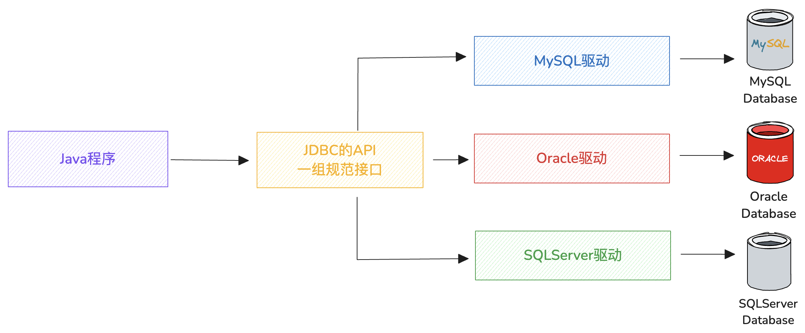

---
文章分类:
  - 编程语言与技术
文章标签:
  - 实践
  - Java
  - JDBC
文章简介: JDBC的基本操作、常见问题及其解决方案。
文章精选:
  - 否
是否发布:
  - 否
发布时间: 
创建时间: 2025-01-02
修改时间: 2025-01-03
---

### 1. 引言

在Java开发程序时，数据都是存储在内存中，属于临时存储。当程序停止或重启时，内存中的数据就丢失了。为了持久化存储可采用的方式：

1. 数据通过I/O流技术，存储在本地磁盘中，解决了持久化问题，但没有结构和逻辑，不方便管理和维护。
2. 通过关系型数据库，将数据按照特定的格式交由数据库管理系统维护。关系型数据库是通过库和表分隔不同的数据，表中数据存储的方式是行和列，区分相同格式不同值的数据。

数据的操作：数据存储在数据库，解决了数据存储问题，当程序运行时也需要读取数据，以及对数据做增删改查操作。

### 2. JDBC概述

JDBC：Java Database Connectivity，Java数据库连接；是Java提供的一组独立于任何数据库管理系统的API。面向接口编程，无需关注具体实现过程。

Java提供接口规范，由各个数据库厂商提供接口实现，厂商提供的实现类封装成jar文件，也就是数据库驱动jar包。

Java简单执行过程：



JDBC的核心组成：1. 接口规范；2. 实现规范。

1. 接口规范：
	- 为了项目代码的可移植性，可维护性。Java程序连接各种数据库的进行统一接口，保持代码一致性。
	- 接口存储在 `java.sql` 和 `javax.sql` 包下。
2. 实现规范：
	- 各厂商的DBMS软件各有不同，内部通过SQL实现增、删、改、查等操作交给数据库厂商自己实现。
	- 厂商将实现内容和封装成jar文件。程序只需要引入jar文件到项目中集成后，调用实现过程操作数据库。

### 3. JDBC入门

JDBC搭建步骤：

1. 准备数据库环境。
2. 官网下载数据库连接驱动jar包。
3. 创建Java项目，在项目下创建lib文件夹，将下载的驱动jar包复制到文件夹里。
4. 选中lib文件夹右键 -> add as library，与项目集成。
5. 编写JDBC代码。

驱动jar包：

- MySQL：[https://downloads.mysql.com/archives/c-j/](https://downloads.mysql.com/archives/c-j/)

实现代码：SQL部分

```sql
CREATE TABLE t_person (
	id INT AUTO_INCREMENT COMMENT '人员ID' PRIMARY KEY,
	code VARCHAR(20) NOT NULL COMMENT '工号',
	name VARCHAR(20) NOT NULL COMMENT '姓名',
	age INT NOT NULL COMMENT '年龄',
	salary DOUBLE(10,2) NOT NULL COMMENT '收入',
	create_time DATETIME NOT NULL DEFAULT CURRENT_TIMESTAMP COMMENT '创建时间',
	update_time DATETIME NOT NULL DEFAULT CURRENT_TIMESTAMP ON UPDATE CURRENT_TIMESTAMP COMMENT '修改时间',
	INDEX idx_code (code) COMMENT '工号索引',
	INDEX idx_name (name) COMMENT '姓名索引'
) COMMENT='人员信息表';

INSERT INTO t_person (code, name, age, salary) VALUES ('001', '张三', 30, 5000.00);
INSERT INTO t_person (code, name, age, salary) VALUES ('002', '李四', 25, 4500.00);
INSERT INTO t_person (code, name, age, salary) VALUES ('003', '王五', 40, 6000.00);
INSERT INTO t_person (code, name, age, salary) VALUES ('004', '赵六', 35, 5500.00);
INSERT INTO t_person (code, name, age, salary) VALUES ('005', '孙七', 28, 4800.00);
```

实现代码：Java代码

```java
import java.sql.*;  
  
public class MainTest {  
  
    public static void main(String[] args) throws ClassNotFoundException, SQLException {  
        // 1. 注册驱动  
        Class.forName("com.mysql.cj.jdbc.Driver");  
  
        // 2. 获取连接  
        // URL: 协议://ip地址:端口号/数据库名称，本机连接可以简写为：jdbc:mysql:///demo  
        String url = "jdbc:mysql://localhost:3306/demo";  
        String username = "root";  
        String password = "ZYMzym111";  
        Connection connection = DriverManager.getConnection(url, username, password);  
  
        // 3. 获取执行SQL语句对象  
        Statement statement = connection.createStatement();  
  
        // 4. 编写SQL语句，并执行  
        String sql = "SELECT id,code,name,age,salary,create_time,update_time from t_person";  
        ResultSet resultSet = statement.executeQuery(sql);  
  
        // 5. 处理结果集  
        while (resultSet.next()) {  
            int id = resultSet.getInt("id");  
            String code = resultSet.getString("code");  
            String name = resultSet.getString("name");  
            int age = resultSet.getInt("age");  
            double salary = resultSet.getDouble("salary");  
            Date createTime = resultSet.getDate("create_time");  
            Date updateTime = resultSet.getDate("update_time");  
            System.out.println(id + "\t" + code + "\t" + name + "\t" + age + "\t"  
                    + salary + "\t" + createTime + "\t" + updateTime);  
        }  
  
        // 6. 关闭资源  
        resultSet.close();  
        statement.close();  
        connection.close();  
    }  
}
```

Java实现步骤：

1. 注册驱动，`Class.forname()`。
2. 获取连接， `Connection`。
3. 获取执行SQL语句对象， `Statement`。
4. 编写SQL语句，并执行， `statement.executeQuery()`。
5. 处理结果集， `ResultSet`。
6. 关闭资源， `ResultSet、Statment、Connection`。

### 4. JDBC核心API

**注册驱动**：`Class.forname("com.mysql.cj.jdbc.Driver");`

- Java中，使用JDBC连接数据库时，需要加载数据库特定的驱动程序，从而与数据库进行通信。加载驱动程序的目的是为了注册驱动程序，是的JDBC API能够识别并与特定的数据库进行交互。
- 从JDK6开始，不需要再显示地调用 `Class.forName()` 来加载JDBC驱动，只要在类路径中集成了对应的jar文件，会自动在初始化时注册驱动程序。

```java
// 1. 注册驱动  
// Class.forName("com.mysql.cj.jdbc.Driver");  
DriverManager.registerDriver(new Driver()); 
```

**Connection**：JDBC API重要接口，用于建立数据库的通信通道。Connection对象不为空，则表示一次数据库连接。

- 在建立连接时，需要指定数据库的URL、用户名、密码参数。`URL: 协议://ip地址:端口号/数据库名称`。
- `Connection` 接口还负责管理事务，`Connection` 接口提供了 `commit` 和 `rollback` 方法，用于提交事务和回滚事务。
- `Connection` 可以创建 `Statement` 对象，用于执行SQL语句并与数据库进行交互。
- 在使用JDBC时，必须要先获取 `Connection` 对象，在使用完毕后，要释放资源，避免资源占用浪费及泄漏。

```java
// 2. 获取连接  
// URL: 协议://ip地址:端口号/数据库名称，本机连接可以简写为：jdbc:mysql:///demo  
String url = "jdbc:mysql://localhost:3306/demo";  
String username = "root";  
String password = "ZYMzym111";  
Connection connection = DriverManager.getConnection(url, username, password);  
```

**Statement**：用于执行SQL语句并与数据库进行交互。通过 `Statement` 对象，可以向数据库发送SQL语句并获取执行结果。

- 结果可以是一个或多个结果。增删改：返回受影响行数，单个结果；查询：单行单列，多行多列，单行多列等结果。
- `Statement` 接口在执行SQL语句时，会产生**SQL注入攻击**问题。当 `Statement` 执行动态构建的SQL查询时，需要将查询条件与SQL语句拼接，直接将参数和SQL语句一并生成，让SQL查询条件始终为true得到结果。

```java
// 3. 获取执行SQL语句对象  
Statement statement = connection.createStatement();  
// 4. 编写SQL语句，并执行  
// String sql = "SELECT id,code,name,age,salary,create_time,update_time from t_person";
// 4. 编写SQL语句，并执行  
String pid = "1' or '1' = '1"; 
String sql = "SELECT id,code,name,age,salary,create_time,update_time from t_person where id='" + pid + "'";  
statement.executeQuery(sql);
```

**PreparedStatement**：是 `Statement` 接口的子接口，用于**预编译**SQL查询。

- 在创建 `PreparedStatement` 时，就会预编译SQL语句，也就是SQL语句已经固定。
- 防止SQL注入：`PreparedStatement` 支持参数化查询，将数据作为参数传递到SQL语句中，采用 `?` 占位符的方式，将传入参数用 `'` 单引号包裹起来。
- `PreparedStatement` 预编译SQL语句，同一个SQL语句多次执行的情况下，可以复用，不必每次重新编译和解析。
- 基于 `PreparedStatement` 进行实现会更安全、效率更高。

```java
// 3. 获取执行SQL语句对象  
// Statement statement = connection.createStatement();  
PreparedStatement preparedStatement = connection.prepareStatement("SELECT id,code,name,age,salary,create_time,update_time from t_person where id = ?");  
preparedStatement.setString(1, "1' or '1' = '1");  
  
// 4. 执行SQL语句，并接受结果  
ResultSet resultSet = preparedStatement.executeQuery();
```

**ResultSet**：用于保存数据库中执行查询语句所返回的结果集。提供了便利和访问查询结果的方式。

- 遍历结果：RestSet可以用 `next()` 方法，将游标移动到结果集的下一行，逐行遍历数据库查询结果，返回值为 boolean 类型，true代表有下一行结果，false则代表没有。
- 获取单列结果：通过 `getXXX()` 的方法获取单列的数据，该方法为重载方法，支持索引或列名进行获取。

```java
// 4. 编写SQL语句，并执行  
String sql = "SELECT id,code,name,age,salary,create_time,update_time from t_person";  
ResultSet resultSet = statement.executeQuery(sql);  

// 4. 执行SQL语句，并接受结果  
// ResultSet resultSet = preparedStatement.executeQuery();

// 5. 处理结果集  
while (resultSet.next()) {  
	int id = resultSet.getInt("id");  
	String code = resultSet.getString("code");  
	String name = resultSet.getString("name");  
	int age = resultSet.getInt("age");  
	double salary = resultSet.getDouble("salary");  
	Date createTime = resultSet.getDate("create_time");  
	Date updateTime = resultSet.getDate("update_time");  
	System.out.println(id + "\t" + code + "\t" + name + "\t" + age + "\t"  
			+ salary + "\t" + createTime + "\t" + updateTime);  
}  
```

### 5. PreparedStatement实现CRUD

**查询**：单行单列

```java
public void testQuerySingleRowAndCol() throws SQLException {  
    // 1. 注册驱动（可忽略）  
  
    // 2. 获取连接  
    Connection connection = DriverManager.getConnection("jdbc:mysql:///demo", "root", "ZYMzym111");  
  
    // 3. 获取预编译执行对象  
    PreparedStatement preparedStatement = connection.prepareStatement("select count(*) as count from t_person");  
  
    // 4. 执行并获取结果集  
    ResultSet resultSet = preparedStatement.executeQuery();  
  
    // 5. 处理结果集  
    /*while (resultSet.next()) {  
        System.out.println(resultSet.getInt("count"));    }*/    // 单行单列时，至少需要一次判断  
    if (resultSet.next()) {  
        int count = resultSet.getInt("count");  
        System.out.println(count);  
    }  
  
    // 6. 关闭资源  
    resultSet.close();  
    preparedStatement.close();  
    connection.close();  
}
```

**查询**：单行多列

```java
public void testQuerySingleRow() throws SQLException {
	// 1. 注册驱动（可忽略）

	// 2. 获取连接
	Connection connection = DriverManager.getConnection("jdbc:mysql:///demo", "root", "ZYMzym111");

	// 3. 获取预编译执行对象
	PreparedStatement preparedStatement = connection.prepareStatement("select id, code, name, age, salary, " +
			"create_time as createTime, update_time as updateTime from t_person where id = ?");
	preparedStatement.setInt(1, 1);

	// 4. 执行并获取结果集
	ResultSet resultSet = preparedStatement.executeQuery();

	// 5. 处理结果集
	while (resultSet.next()) {
		String id = resultSet.getString("id");
		String code = resultSet.getString("code");
		String name = resultSet.getString("name");
		int age = resultSet.getInt("age");
		double salary = resultSet.getDouble("salary");
		Date createTime = resultSet.getDate("createTime");
		Date updateTime = resultSet.getDate("updateTime");
		System.out.println(id + "\t" + code + "\t" + name + "\t" + age + "\t"
				+ salary + "\t" + createTime + "\t" + updateTime);
	}

	// 6. 关闭资源
	resultSet.close();
	preparedStatement.close();
	connection.close();
}
```

**查询**：多行多列

```java
public void testQueryMultiRow() throws SQLException {  
    // 1. 注册驱动（可忽略）  
  
    // 2. 获取连接  
    Connection connection = DriverManager.getConnection("jdbc:mysql:///demo", "root", "ZYMzym111");  
  
    // 3. 获取预编译执行对象  
    PreparedStatement preparedStatement = connection.prepareStatement("select id, code, name, age, salary, " +  
            "create_time as createTime, update_time as updateTime from t_person where salary >= ?");  
    preparedStatement.setDouble(1, 5000);  
  
    // 4. 执行并获取结果集  
    ResultSet resultSet = preparedStatement.executeQuery();  
  
    // 5. 处理结果集  
    while (resultSet.next()) {  
        String id = resultSet.getString("id");  
        String code = resultSet.getString("code");  
        String name = resultSet.getString("name");  
        int age = resultSet.getInt("age");  
        double salary = resultSet.getDouble("salary");  
        Date createTime = resultSet.getDate("createTime");  
        Date updateTime = resultSet.getDate("updateTime");  
        System.out.println(id + "\t" + code + "\t" + name + "\t" + age + "\t"  
                + salary + "\t" + createTime + "\t" + updateTime);  
    }  
  
    // 6. 关闭资源  
    resultSet.close();  
    preparedStatement.close();  
    connection.close();  
}
```

**新增**：

```java
public void testInset() throws SQLException {  
    Connection connection = DriverManager.getConnection("jdbc:mysql:///demo", "root", "ZYMzym111");  
  
    PreparedStatement preparedStatement = connection.prepareStatement("insert into t_person(code,name,age,salary) values(?,?,?,?)");  
    preparedStatement.setString(1, "010");  
    preparedStatement.setString(2, "刘丽");  
    preparedStatement.setInt(3, 35);  
    preparedStatement.setDouble(4, 5400.0D);  

	// result: 增删改，返回受影响行数
	int result = preparedStatement.executeUpdate();  
	
	if (result > 0) {  
	    System.out.println("插入成功");  
	} else {  
	    System.out.println("插入失败");  
	}
  
    preparedStatement.close();  
    connection.close();  
}
```

**修改**：

```java
public void testUpdate() throws SQLException {  
    Connection connection = DriverManager.getConnection("jdbc:mysql:///demo", "root", "ZYMzym111");  
  
    PreparedStatement preparedStatement = connection.prepareStatement("update t_person set age=? where id=?");  
    preparedStatement.setString(1, "40");  
    preparedStatement.setString(2, "6");  
  
    int result = preparedStatement.executeUpdate();  
  
    if (result > 0) {  
        System.out.println("修改成功");  
    } else {  
        System.out.println("修改失败");  
    }  
  
    preparedStatement.close();  
    connection.close();  
}
```

**删除**：

```java
public void testDelete() throws SQLException {  
    Connection connection = DriverManager.getConnection("jdbc:mysql:///demo", "root", "ZYMzym111");  
  
    PreparedStatement preparedStatement = connection.prepareStatement("delete from t_person where id = ?");  
    preparedStatement.setInt(1, 6);  
  
    int result = preparedStatement.executeUpdate();  
  
    if (result > 0) {  
        System.out.println("删除成功");  
    } else {  
        System.out.println("删除失败");  
    }  
  
    preparedStatement.close();  
    connection.close();  
}
```

### 6. 常见问题

**资源的管理**：在使用JDBC相关资源时，如：`Connection`、`PreparedStatement`、`ResultSet` 等， 使用完毕后，要及时关闭这些资源以释放数据库服务器资源和避免内存泄漏。

**SQL语句问题**：`java.sql.SQLSyntaxErrorException`，可能的情况：1. SQL语句有错误；2. 连接数据库的URL中，数据库名称编写错误，也会报该异常。

**SQL语句未设置参数问题**：`java.sql.SQLException: No value specified for parameter 1`，在使用预编译SQL语句时，如果有 `?` 占位符，要为每一个占位符赋值，否则报该错误。

**用户名或密码错误**：`java.sql.SQLException: Access denied for user 'root'@'localhost' (using password: YES)`，连接数据库时，用户名和密码不匹配。

**通信异常**：`com.mysql.jdbc.excptions.CommunicationsException: Communications link failure`,在连接数据库的URL中，IP或端口有误。
