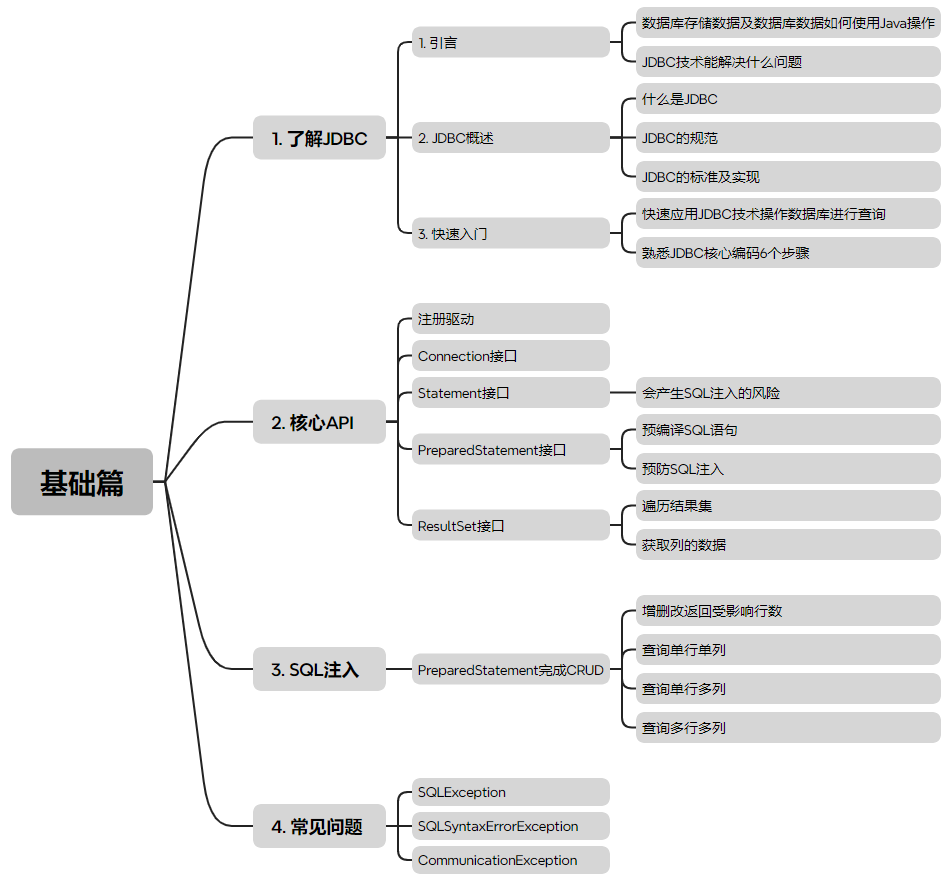
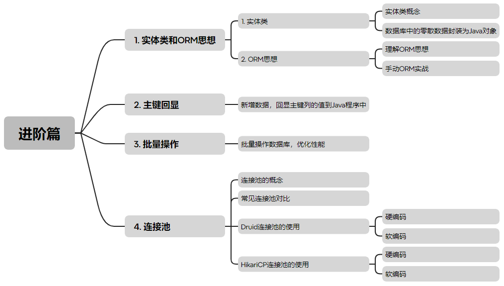
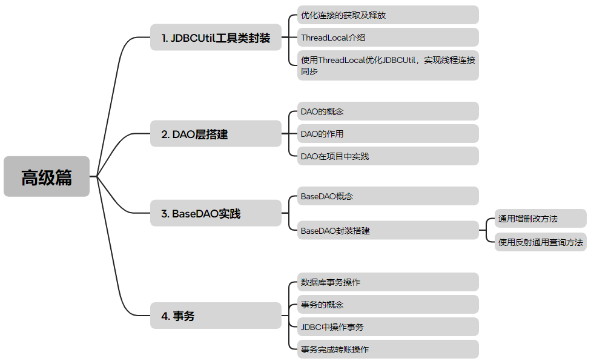

---
文章分类:
  - 编程语言与技术
文章标签:
  - 实践
  - Java
  - JDBC
文章简介: JDBC介绍涵盖基础、进阶和高级篇，分别涉及基础应用、ORM优化及实战经验。
文章精选:
  - 否
是否发布:
  - 否
发布时间: 
创建时间: 2025-01-02
修改时间: 2025-01-02
---

### 1. 章节介绍

基础篇：解决问题，快速熟悉JDBC的基础应用。包括：1. 了解JDBC；2. 核心API；3. SQL注入；4. 常见问题。

进阶篇：理解ORM思想，在基础内容上进一步的优化，掌握多种连接池优化程序的能力。包括：1. 实体类和ORM思想； 2. 主键回显；3. 批量操作；4. 连接池。

高级篇：融入实战经验的封装、优化、功能流程的把控，强化开发项目思想，优化代码逻辑。包括：1. 工具类封装；2. DAO层搭建；3. BaseDAO实战；4. 事务。

