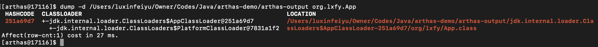
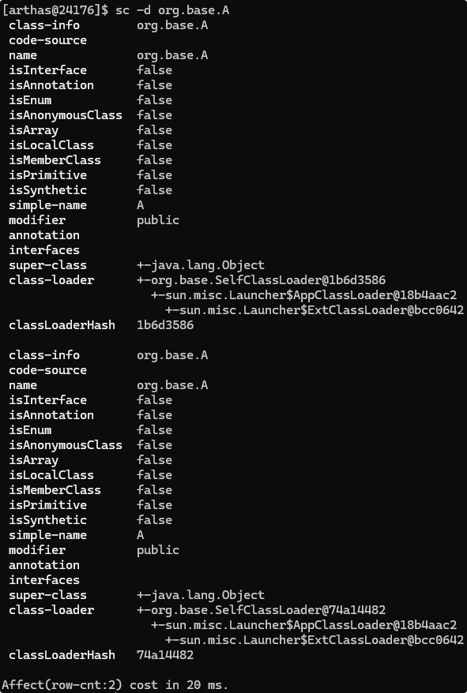
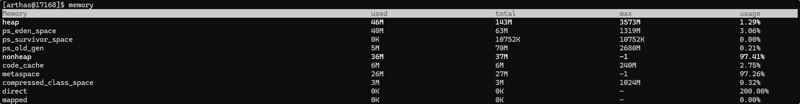
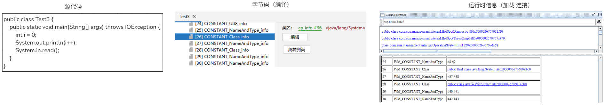
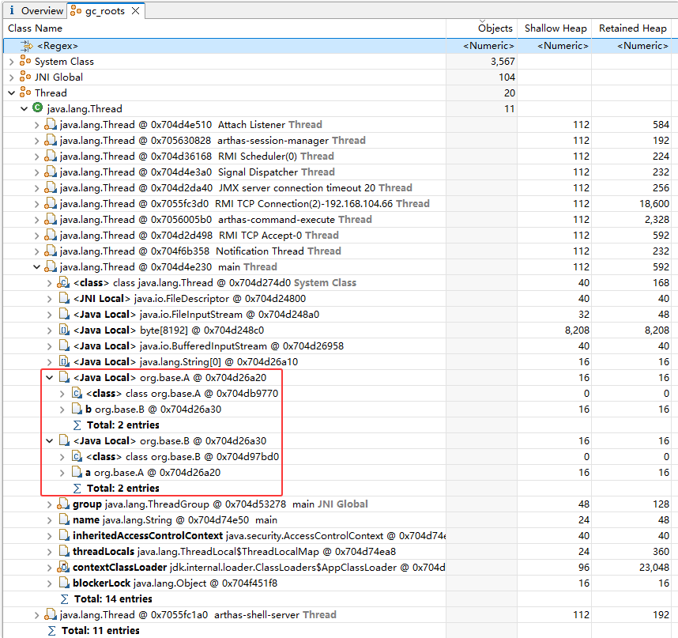

---
文章分类:
  - 编程语言与技术
文章标签:
  - 理论
  - 实践
  - Java
  - JVM
文章简介: 
文章类型:
  - 原创
创建时间: 2025-03-03
修改时间: 2025-03-03 09:28:44
---

### 基础篇章节

1. 初识JVM
2. 字节码文件详解
3. JVM的内存区域
4. JVM的垃圾回收

### 1. 初识JVM

JVM（Java Virtual Machine，Java虚拟机）：本质是一个运行在计算机上的程序，负责运行Java字节码文件。


**JVM的功能**：

- 解释和运行：对字节码文件中的指令实时解释成机器码，让计算机执行。
- 内存管理：1. 自动为对象、方法等分配内存。2. 自动的垃圾回收机制，回收不再使用的对象。
- 即时编译：对热点代码进行优化，提升执行效率。

JVM的功能-即时编译（Just-In-Time，简称JIT）：为了支持跨平台特性。在不做优化时，速度是不如C/C++运行编译和链接后的可执行文件（机器码）。但在优化后，速度能达到接近C/C++的运行效率。

即时编译的工作方式：


**常见的JVM**：

|             虚拟机              |   作者    | 支持版本                     | 特性                                                              | 适用场景                   |
| :--------------------------: | :-----: | ------------------------ | --------------------------------------------------------------- | ---------------------- |
| **HotSpot<br>（Oracle JDK版）** | Oracle  | 所有版本                     | 使用最广泛，稳定可靠，社区活跃；<br>JIT支持；<br>Oracle JDK默认虚拟机                   | 默认                     |
|  **HotSopt<br>（Open JDK版）**  | Oracle  | 所有版本                     | 使用最广泛，稳定可靠，社区活跃；<br>JIT支持；<br>开源，Open JDK默认虚拟机                  | 默认<br>有二次开发的需求         |
|         **GraalVM**          | Oracle  | 11，17，19<br>企业支持8        | 对语言支持Ruby、Python、C++等<br>高性能、JIT、AOT支持                          | 微服务、云原生架构需要多语言混合编程     |
|    **Gragonwell JDK 龙井**     | Alibaba | 标准版 8，11，17<br>扩展版：11，17 | 基于Open JDK增强<br>高性能、Bug修复、安全性提升<br>JWarmup、ElasticHeap、Wisp特性支持 | 电商、物流、金融领域<br>对性能要求比较高 |
|      **Eclipse Openj9**      |   IBM   | 8，11，17，19，20            | 高性能、可扩展<br>JIT、AOT支持                                            | 微服务、云原生架构              |

Java虚拟机规范：[Java SE Specifications](https://docs.oracle.com/javase/specs/index.html)

- 由Oracle指定，包含了Java虚拟机在设计和实现时需要遵守的规范，主要包含class字节码文件的定义、类和接口的加载和初始化，指令集等内容。
- 规范是对虚拟机的设计要求，并不是对Java设计的要求，即在虚拟机上也可以运行其它符合规范的语言，例如：Groovy、Scala生成的class字节码文件。

HotSpot的发展历程：

1. 1999年4月：HotSpot虚拟机首次发布，在JDK1.3时，HotSpot VM成默认的虚拟机。HotSpot的技术基础来源于Smalltalk语言的一种实现 - Strongtalk。
2. 2006年12月：JDK6.0发布，在虚拟机层面，改进垃圾收集算法、优化虚拟机性能。
3. 2009年~2013年：在JDK7中首次推出了G1垃圾回收器。2010年Sun被Oracle收购后，HotSpot继续作为Oracle JDK的核心虚拟机。整合JRockit。从JDK 1.8开始，永久代被元空间替代。
4. 2018年~2019年：JDK11优化了G1垃圾收集器的性能，同时推出了ZGC新一代的垃圾回收器。JDK12推出Shenandoah垃圾回收器。
5. 2019年~至今：以HotSpot为基础的GraalVM虚拟机诞生，解决了单体引用中多语言整合的难题，同时提升运行时的效率。

### 2. 字节码文件详解

字节码文件：1. Java虚拟机的组成；2. 字节码文件的组成；3. 类的生命周期；4. 类加载器。

#### 2.1 Java虚拟机的组成


- 类加载器：加载class字节码文件中的内容到内存中。
- 运行时数据区域：负责管理JVM使用到的内存，比如创建对象和销毁对象。
- 执行引擎：将字节码中的指令解释成机器码，同时使用即时编译器优化性能。
- 本地接口：调用本地已经编译的方法，比如虚拟机中提供的C/C++的方法。

#### 2.2 字节码文件组成

能够解决的应用场景：

1. 通过字节码指令来解释程序执行结果。
2. 解决启动时文件版本的冲突。
3. 解决系统升级过程中原问题未解决的情况。

**打开字节码文件**：【[jclasslib工具](https://github.com/ingokegel/jclasslib/releases)】


- 基础信息【一般信息、接口】：魔数、字节码文件对应的Java版本号、访问标识（`public final`等等）、父类和接口。
- 常量池【常量池】：字符串常量、类或接口名、字段名。主要在字节码指令中使用。
- 字段【字段】：当前类或接口声明的字段信息。 
- 方法【方法】：当前类或接口生命的方法信息，字节码指令。
- 属性【属性】：类的属性，例如源码的文件名，内部类的列表等。

**字节码文件的组成**：基础信息【一般信息、接口】、常量池、字段、方法、属性。

基本信息【一般信息、接口】：

- Magic魔数：Java的class文件前4个字节是CAFEBABE。
- 主、副版本号：编译字节码文件的JDK版本。
- 访问标识：标识是类还是接口、注解、枚举、模块。标识`public final abstract`。
- 类、父类、接口索引：通过这些索引可以找到类、父类、接口的信息。

文件是无法通过文件扩展名来确定文件类型，文件扩展名可以随意更改，不影响文件的内容。软件是使用文件的头几个字节取进行校验，如果软件不支持则就会出错。Java字节码文件中的文件头成为Magic魔数。一些常见的文件头如下：

|         文件类型          | 字节数 |          文件头           |
| :-------------------: | :-: | :--------------------: |
|       JEPG(jpg)       |  3  |         FFD8FF         |
|       PNG(png)        |  4  | 89504e47<br>（文件末尾也有要求） |
|          bmp          |  2  |          424D          |
|       XML(xml)        |  5  |       3C3F786D6C       |
|       AVI(avi)        |  4  |        41564920        |
| Java字节码文件<br>(.class) |  4  |        CAFEBABE        |

常量池：避免相同的内容重复定义，节省空间。

- 常量池中的数据都有一个编号，编号从1开始。在字段或字节码指令中通过编号可以快速的找到对应的数据。
- 字节码指令中通过引用到常量池的过程称为符号引用。


如图所示，`FINISHED` 可以是变量名，也可以是变量值。可以通过常量池只需要定义一次值。

方法：存放字节码指令的核心位置，字节码指令的内容存放在方法的code属性中。

问题1：解释为什么 `i++` 和 `++i` 的结果不一样？

```java
// i++
public class HelloWorld {
	public static void main(String[] args) {
		int i = 0;
		i = i++;
	}
}

// 字节码如下：
0 iconst_0 // 将常量0的值复制到操作数栈。
1 istore_1 // 将操作数栈的值填充到1号位置。
2 iload_1 // 将1号位置的值复制到操作数栈。
3 iinc 1 by 1 // 对局部变量表的index位置增加constant值，即对1号位置增加1。
6 istore_1 // 将操作数栈的值填充到1号位置。
7 return


// ++i
public class HelloWorld {
	public static void main(String[] args) {
		int i = 0;
		i = ++i;
	}
}

// 字节码如下：
0 iconst_0
1 istore_1
2 iinc 1 by 1
5 iload_1
6 istore_1
7 return
```

问题2：`i++;` 、 `i = i + 1;` 和 `i += 1;`它们的执行效率？

```java
i += 1;[4行] 等于 i++;[4行] 大于 i = i + 1;[7行]

// i+=1; 字节码如下：
0 iconst_0
1 istore_1
2 iinc 1 by 1
5 return

// i++; 字节码如下：
0 iconst_0
1 istore_1
2 iinc 1 by 1
5 return

// i=i+1; 字节码如下：
0 iconst_0
1 istore_1
2 iload_1
3 iconst_1
4 iadd
5 istore_1
6 returnÏ
```

**字节码常用的工具**：

1. **javap**是JDK自带的反编译工具，可以通过 `javap -v 字节码文件` 在控制台查看字节码文件的内容。适合在服务器上查看字节码文件内容。
2. **jclasslib插件**，在Idea编辑器中安装插件。
3. [**Arthas**](https://arthas.aliyun.com)是一款线上监控诊断产品，通过全局视角实时查看应用load、内存、gc、线程状态信息，并能在不修改代码的情况下，对业务问题进行诊断，提升线上问题排查效率。

javap是JDK自带的反编译工具，使用效果图：


jclasslib插件，安装效果图：


Arthas功能：监控面板、查看字节码信息、方法监控、类的热部署、内存监控、垃圾回收监控、应用热点定位等。

Arthas监控面板：[dashboard -i 事件间隔/毫秒 -n 次数](https://arthas.aliyun.com/doc/dashboard.html)


Arthas将已加载的类字节码文件导出到特定目录：[dump -d 保存路径 类的全限定名](https://arthas.aliyun.com/doc/dump.html)



Arthas反编译已经加载类的源码：[jad 类的全限定名](https://arthas.aliyun.com/doc/jad.html)


#### 2.3 类的生命周期

类的生命周期：描述了一个类加载、使用、卸载的整个过程。

类的生命周期应用点：1. 运行时常量池。2. 多态的原理。3. 类的加密和解密。4. 类加载器的作用。

**类的生命周期过程**：加载 -> 连接 -> 初始化 -> 使用 -> 卸载。连接细分：验证 -> 准备 -> 解析。


**加载（Loading）**：

1. 类加载器根据类的全限定名通过不同的渠道以二进制的方式获取字节码信息。渠道：本地文件【磁盘上的字节码文件】；动态代理生成【程序运行时使用】；通过网络传输的类【早期的Applet技术使用】。
2. 类加载器在加载完类之后，Java虚拟机会将字节码中的信息保存到方法区中。生成一个InstanceKlass对象，保存类的所有信息【基本信息、常量池、字段、方法】，里面包含特定功能比如多态的信息。
3. Java虚拟机在堆中生成一份与方法区中数据类似的java.lang.Class对象【字段、方法】，与方法区的InstanceKiass对象关联。作用是在Java代码中去获取类的信息以及存储静态字段的数据（JDK8之后）。

开发者可访问堆中的Class对象而不能直接访问方法区中的所有信息。Java虚拟机控制开发者访问数据的范围。

加载阶段，查看内存中的对象：`hsdb` 查看Java虚拟机内存信息。在JDK8时，工具在JDK的lib/sa-jdi.jar中。在JDK8之后，可以使用 `jhsdb` 命令查看。注意：JDK的版本要保持一致。

```bash
# JDK8 启动命令：
java -cp $JAVA_HOME/lib/sa-jdi.jar sun.jvm.hotspot.HSDB

# JDK9 及之后
# 在 HotSpot JVM 中，InstanceKlass（类的元数据）和 Oop（对象实例）之间的关系是单向的，目的是为了满足 JVM 的内存管理和性能优化需求。
jhsdb hsdb
```

在JDK8中测试的效果如下：


在JDK17中测试的效果如下：


**连接（Linking）**：

- 验证：验证内容是否满足《Java虚拟机规范》。
- 准备：给静态变量赋初始值。
- 解析：将常量池中的符号引用替换成指向内存的直接引用。

验证的目的是检测Java字节码文件是否遵循《Java虚拟机规范》的约束，一般不需要开发人员参与。主要包括以下四部分：

1. 文件格式验证，文件是否以0xCAFEBABE开头，主次版本号是否满足当前Java虚拟机版本要求。
2. 元信息验证，例如：类必须要有父类（super不能为空）。
3. 验证程序指执行指令的语义是否正确。
4. 符号引用验证，例如：是否访问了其它类中的 `private` 的方法等。

```java
// 在JDK8中校验Java虚拟机要求的版本
return (major >= JAVA_MIN_SUPPORTED_VERSION) && (major <= max_version) &&
	((major != max_version) || (minor <= JAVA_MAX_SUPPORTED_MINOR_VERSION));
```

准备是为静态变量（static）分配内存并设置初始值。此部分是JDK8及之后的版本。每种数据类型的初始值如下：

| 数据类型      | 初始值      |
| :-------- | :------- |
| `int`     | 0        |
| `long`    | 0        |
| `short`   | 0        |
| `char`    | '\u0000' |
| `byte`    | 0        |
| `boolean` | false    |
| `double`  | 0.0      |
| 引用数据类型    | null     |

注意：如果是 `final` 修饰的基本数据类型的静态变量，在准备阶段会将代码中的值进行赋值。


解析：将常量池中的符号引用替换成指向内存的直接引用。

- 符号引用：在字节码文件中使用编号来访问常量池中的内容。
- 直接引用：不再使用编号，使用内存中的地址进行访问具体的数据。


**初始化（Initialization）**：会执行静态代码块中的代码，并为静态变量赋值。执行字节码文件中 `clinit` 部分的字节码指令。

字段声明在静态代码块之前：


静态代码块在字段声明之前：


注意：静态代码块和字段声明在初始化时，`clinit` 方法中的执行顺序与Java中编写的顺序是一致的。

会导致类进行初始化操作的情况：

1. 访问一个类的静态变量或静态方法。注意当变量是 `final` 修饰且等号右边是常量时不会触发初始化。
2. 调用 `Class.forName(String className)` 方法。
3. `new` 一个该类的对象时。
4. 执行 `main` 方法的当前类。

情况示例：在VM Option中添加 `-XX:+TraceClassLoading` 参数可以打印出加载并初始化的类。

```java
// 访问一个类的静态变量或静态方法。
public class Test2 {  
    public static void main(String[] args) {  
        int a1 = TestClass.a1; // TestClass不会初始化  
        System.out.println(a1);  
        int a = TestClass.a; // TestClass会初始化  
        System.out.println(a);  
    }  
}  
  
class TestClass {  
    static {  
        System.out.println("TestClass clinit...");  
    }  
  
    // 这个会在 连接的准备 阶段中赋int的默认值，在初始化时赋当前值1  
    public static int a = 1;  
  
    // 这个值在 连接的准备 阶段中赋值  
    public static final int a1 = 2;  
}

// 调用 `Class.forName(String className)` 方法。
public class Test3 {  
    public static void main(String[] args) throws ClassNotFoundException {  
        Class clazz = Class.forName("org.lxfy.TestClass");  
    }  
}  
  
class TestClass {  
    static {  
        System.out.println("TestClass clinit...");  
    }  
}

// `new` 一个该类的对象时 和 执行 `main` 方法的当前类
public class Test4 {  
    static {  
        System.out.println("Test4 clinit...");  
    }  
  
    public static void main(String[] args) {  
        TestClass tc = new TestClass();  
    }  
}  
  
class TestClass {  
    static {  
        System.out.println("TestClass clinit...");  
    }  
}
```

初始化拓展示例：

```java
// 以下示例输出的内容为：DACBCB
public class Test5 {  
    public static void main(String[] args) {  
        System.out.println("A");  
        new Test5();  
        new Test5();  
    }  
  
    // 这段代表在当前类的默认构造方法调用时。  
    public Test5() {  
        System.out.println("B");  
    }  
  
    // 这段代表在当前类的默认构造方法调用前执行。  
    {  
        System.out.println("C");  
    }  
  
    // 这段代表在当前类初始化时执行。  
    static {  
        System.out.println("D");  
    }  
}
```

初始化可能不会调用 `clinit` 指令的情况：

1. 无静态代码块且无静态变量赋值语句。
2. 有静态变量的声明，但没有赋值语句。
3. 静态变量的定义使用 `final` 关键字，这类变量会在准备阶段直接进行赋值。

```java
public static int a;

public static final int a1 = 1;
```

初始化父子类时的关系：

- 直接访问父类的静态变量，不会触发子类的初始化。
- 子类的初始化 `clinit` 调用之前，会先调用父类的 `clinit` 初始化方法。

```java
// 最终结果 2
public class Test6 {  
    public static void main(String[] args) {  
        new TestChild();  
        System.out.println(TestChild.a);  
    }  
}  
  
class TestParent {  
    static int a = 0;  
  
    static {  
        a = 1;  
    }  
}  
  
class TestChild extends TestParent {  
    static {  
        a = 2;  
    }  
}

// 最终结果 1
public class Test6 {  
    public static void main(String[] args) {  
        System.out.println(TestChild.a);  
    }  
}  
  
class TestParent {  
    static int a = 0;  
  
    static {  
        a = 1;  
    }  
}  
  
class TestChild extends TestParent {  
    static {  
        a = 2;  
    }  
}
```

初始化中特殊情况：

1. 数组创建不会导致数组中元素的类进行初始化。
2. `final` 修饰的变量，如果赋值的内容需要执行指令才能得出结果，会执行 `clinit` 方法进行初始化。

```java
// 数组创建不会导致数组中元素的类进行初始化。
public class Test7 {  
    public static void main(String[] args) {  
	    // 数组的创建只与数组本身的内存分配有关，而与数组元素的类无关
        TestObj[] arr = new TestObj[10];  
    }  
}  
  
class TestObj {  
    static {  
        System.out.println("TestObj clinit...");  
    }  
}

// `final` 修饰的变量，如果赋值的内容需要执行指令才能得出结果，会执行 `clinit` 方法进行初始化。
public class Test8 {  
    public static void main(String[] args) {  
        System.out.println(TestClass.a1);  
    }  
}  
  
class TestClass {  
    public static final int a1 = Integer.valueOf(1);  
  
    static {  
        System.out.println("TestClass clinit...");  
    }  
}
```

#### 2.4 类加载器

类加载器（ClassLoader）是Java虚拟机提供给应用程序去实现获取类和接口字节码数据的技术。类加载器只参与加载过程中的字节码获取和加载到内存这一部分。


类加载器的应用场景：

1. SPI机制（Service Provider Interface）、类的热部署、Tomcat类的隔离。
2. 类的双亲委派机制、打破类的双亲委派机制、自定义类加载器。
3. 使用Arthas不停机解决线上故障。

**类加载器的分类**：一类是Java代码实现，一类是Java虚拟机底层源码实现。

- 虚拟机底层实现：源代码位于Java虚拟机的源码中，实现语言与虚拟机底层一致，比如Hotspot使用C++。是加载程度运行时的基础类，保证Java程序中基础类被正确加载，确保其可靠性，比如`java.lang.String`。
- Java：JDK中默认提供或者自定义，JDK中默认提供了多种处理不同渠道的类加载器，程序开发者也可以根据需求定制。继承自抽象类 `ClassLoader` ，所有Java中实现的类加载器都需要继承 `ClassLoader` 这个抽象类。

在JDK8及之前的版本中默认的类加载器：


Arthas类加载器信息查看： [classloader](https://arthas.aliyun.com/doc/classloader.html)


- `BootstrapClassLoader`：C++编写的启动类加载器。
- `com.taobao.arthas.agent.ArthasClassloader`：Arthas加载器。
- `sun.misc.Launcher$ExtClassLoader`：扩展类加载器。
- `sun.reflect.DelegatingClassLoader`：JDK底层实现，提升反射效率的加载器。
- `sun.misc.Launcher$AppClassLoader`：应用程序类加载器。
- `javax.management.remote.rmi.NoCallStackClassLoader` ：通过RMI实现客户端与远程服务器之间的通信。
- `sun.reflect.misc.MethodUtil`：工具类，用于反射操作，提供静态方法 `invoke`，可以动态调用任意类的任意方法。

启动类加载器（Bootstrap）：加载Java中最核心的类。是由Hotspot虚拟机提供的、使用C++编写的类加载器。默认加载Java安装目录 `/jre/lib` 下的类文件，比如rt.jar，tools.jar，resources.jar等。

```java
public static void main(String[] args) {  
	// null
    System.out.println(String.class.getClassLoader());  
}
```

Arthas全限定名的类对应的类加载器： [sc -d 类的全限定名](https://arthas.aliyun.com/doc/sc.html)


通过启动类加载器去加载用户自定义jar包：
 
1. 放入 `/jre/lib` 目录下进行扩展：不推荐，可能会出现由于文件名不匹配问题不会正常被加载。
2. 使用参数进行扩展：推荐，使用 `-Xbootclasspath/a:jar包目录/jar包名` 进行扩展。

扩展类加载器（Extension）：允许扩展Java中比较通用的类；应用程序类加载器（Application）：加载应用使用的类。这两个类加载器都是JDK提供的、使用Java编写的类加载器。源码在 `sun.misc.Launcher` 中，是一个静态内部类。继承自 `URLClassLoader`。可通过目录或指定jar包将字节码文件加载到内存中。


扩展类加载器（Extension）是JDK中提供的，使用Java编写的类加载器。默认加载Java安装目录 `/jre/lib/ext` 下的类文件。

```java
public static void main(String[] args) {  
    // sun.misc.Launcher$ExtClassLoader@677327b6
    System.out.println(ScriptEnvironment.class.getClassLoader());  
}
```

查看扩展类加载器的默认路径：

```java
String extDirs = System.getProperty("java.ext.dirs");  
System.out.println("Java Extension Directories: " + extDirs);
```

通过扩展类加载器去加载用户自定义jar包：

1. 放入 `/jre/lib/ext` 下进行扩展：不推荐。
2. 使用参数进行扩展：推荐，使用 `-Djava.ext.dirs=jar包目录` 进行扩展。这种方式可能会覆盖原始目录，可以追加 `;(windows) 或 :(macos/linux)` 原始目录。

应用程序类加载器（Application）加载 `classpath` 下的类文件。加载项目中创建的类或maven中包含的类。

Arthas类加载器详情信息查看： [classloader -l 和 classloader -c 加载器的hash值](https://arthas.aliyun.com/doc/classloader.html)


**类加载器的双亲委派机制**：核心是解决一个类到底是由谁加载的问题。

双亲委派机制作用：

1. 保证类加载的安全性：通双亲委派机制避免恶意代码替换JDK中的核心类库，确保核心类库的完整性和安全性。
2. 避免重复加载：双亲委派机制可以避免同一个类被多次加载。

双亲委派机制：当一个类加载器接收到加载类的任务时，会自底向上查找是否加载过，再由顶向下进行加载。

- 向上查找：如果已经加载过，就直接返回Class对象，加载过程结束。避免一个类重复加载。
- 向下委派：加载优先级。如果所有父类加载器都无法加载该类，则由当前类加载器尝试加载。若当前类也无法加载，则抛出类无法找到异常 `java.lang.ClassNotFoundException` 。


重复的类：如果一个类重复出现在三个类加载器的加载位置，应该由谁来加载？启动类加载器加载，根据双亲委派机制，它的优先级是最高的。

String类能覆盖吗：在项目中创建一个 `java.lang.String` 类，会被加载吗？不能，会返回启动类加载器在 rt.jar 包中的 `String` 类。

如何在Java代码中主动加载一个类：

1. 使用 `Class.forName` 方法，使用当前的类加载器去加载指定的类。
2. 获取到类加载器，通过类加载器的 `loadClass` 方法指定某个类加载器加载。

```java
public class Test1 {  
    public static void main(String[] args) throws ClassNotFoundException {  
        // 获取当前main方法所在类的类加载器，应用程序类加载器  
        ClassLoader classLoader = Test1.class.getClassLoader();  
        System.out.println(classLoader);  
        // 使用应用程序类加载器加载 org.base.Student        
        Class<?> clazz = classLoader.loadClass("org.base.Student");  
        System.out.println(clazz.getClassLoader());  
    }  
}
```

注意：要加载的类必需要由符合它的类加载器进行加载，否则会抛出 `java.lang.ClassNotFoundException` 异常

Arthas类加载器树型信息查看： [classloader -t](https://arthas.aliyun.com/doc/classloader.html)


**打破双亲委派机制**：

打破双亲委派机制的方式：

1. 自定义类加载器：自定义类加载器并且重写loadClass方法，去除双亲委派机制的代码。Tomcat通过这种方式实现应用之间类隔离。
2. 线程上下文类加载器：利用上下文类加载器加载类。比如：JDBC和JNDI等。
3. Osgi框架的类加载器：Osgi框架实现了一套新的类加载器机制，允许同级之间委派进行类的加载。

自定义加载器：Tomcat程序中使用自定义类加载器来实现应用之间类的隔离，每一个应用会有一个独立的类加载器加载对应的类。


`ClassLoader` 的4核心方法：双亲委派机制的核心代码就位于 `loadClass` 方法中。


`classloader` 的 `loadClass(String name)` 方法是只进行加载，不进行连接和初始化工作。而 `Class.forName()` 方法是进行加载、连接和初始化工作。

```java
// student 类
package org.base;  
  
public class Student {  
	static {  
	    System.out.println("Student clinit...");  
	}
}

// 测试方法
public class Test1 {  
    public static void main(String[] args) throws ClassNotFoundException {  
        // 应用程序类加载器，加载Student  
        ClassLoader classLoader = Test1.class.getClassLoader();  
        Class<?> clazz = classLoader.loadClass("org.base.Student");  
        // 执行加载、连接和初始化  
        Class.forName("org.base.Student");  
    }  
}
```

双亲委派机制的核心代码：

1. `findLoadedClass(name)`：判断当前类是否加载过。
2. `parent.loadClass(name, false)`：调用上级加载类的方法。
3. `findBootstrapClassOrNull(name)`：调用底层启动类加载器。
4. `findClass(name)`：由当前类加载器加载。
5. `resolveClass(c)`：执行类的连接过程。

```java
protected Class<?> loadClass(String name, boolean resolve)  
    throws ClassNotFoundException  
{  
    synchronized (getClassLoadingLock(name)) {  
        // First, check if the class has already been loaded  
        Class<?> c = findLoadedClass(name);  
        if (c == null) {  
            long t0 = System.nanoTime();  
            try {  
                if (parent != null) {  
                    c = parent.loadClass(name, false);  
                } else {  
                    c = findBootstrapClassOrNull(name);  
                }  
            } catch (ClassNotFoundException e) {  
                // ClassNotFoundException thrown if class not found  
                // from the non-null parent class loader          
            }  
  
            if (c == null) {  
                // If still not found, then invoke findClass in order  
                // to find the class.               
                long t1 = System.nanoTime();  
                c = findClass(name);  
  
                // this is the defining class loader; record the stats  
                sun.misc.PerfCounter.getParentDelegationTime().addTime(t1 - t0);  
                sun.misc.PerfCounter.getFindClassTime().addElapsedTimeFrom(t1);  
                sun.misc.PerfCounter.getFindClasses().increment();  
            }  
        }  
        if (resolve) {  
            resolveClass(c);  
        }  
        return c;  
    }  
}
```

自定义加载器：打破双亲委派代码示例

```java
// 在 D:\\ext\\org\\base 目录下存放 一个 A.class 文件

// A.class 源码
package org.base;  
  
public class A {  
    static {  
        System.out.println("A clinit...");  
    }  
}

// 测试代码
import java.io.File;  
import java.io.FileInputStream;  
import java.io.IOException;  
  
public class SelfClassLoader extends ClassLoader {  
    private String basePath;  
    private final static String FILE_EXT = ".class";  
  
    public void setBasePath(String basePath) {  
        this.basePath = basePath;  
    }  
  
    @Override  
    public Class<?> loadClass(String name) throws ClassNotFoundException {  
        if (name.startsWith("java.")) {  
            return super.loadClass(name);  
        }  
        byte[] clazzData = loadClassData(name);  
        return defineClass(name, clazzData, 0, clazzData.length);  
    }  
  
    private byte[] loadClassData(String name) {  
        // 将类名转换为文件路径格式  
        String fileName = name.replace('.', File.separatorChar) + FILE_EXT;  
        // 拼接完整的文件路径  
        String filePath = basePath + File.separator + fileName;  
        // 使用try-with-resources确保资源正确关闭  
        try (FileInputStream fis = new FileInputStream(filePath)) {  
            // 获取文件长度  
            int length = fis.available();  
            byte[] data = new byte[length];  
            // 读取文件内容到字节数组  
            fis.read(data);  
            // 返回字节数组  
            return data;  
        } catch (IOException e) {  
            e.printStackTrace();  
            return null;  
        }  
    }  
  
    public static void main(String[] args) throws ClassNotFoundException, InstantiationException, IllegalAccessException {  
        SelfClassLoader classLoader = new SelfClassLoader();  
        classLoader.setBasePath("D:\\ext\\");  
  
        Class<?> clazz = classLoader.loadClass("java.lang.String");  
        clazz.newInstance();  
  
        Class<?> clazz1 = classLoader.loadClass("org.base.A");  
        // A clinit...
		clazz1.newInstance();  
		// 自定义类的加载器：org.base.SelfClassLoader@1b6d3586
		System.out.println("自定义类的加载器：" + clazz1.getClassLoader());  
		// 自定义类的父类加载器：sun.misc.Launcher$AppClassLoader@18b4aac2
		System.out.println("自定义类的父类加载器：" + clazz1.getClassLoader().getParent());
		// 系统默认加载器：sun.misc.Launcher$AppClassLoader@18b4aac2
		System.out.println("系统默认加载器：" + getSystemClassLoader());
    }  
}
```

注意：自定义类加载器，如果不手动指定父类加载器，默认是应用类程序加载器。

```java
// JDK8，ClassLoader类中提供了构造方法
private ClassLoader(Void unused, ClassLoader parent) {  
    this.parent = parent;  
    if (ParallelLoaders.isRegistered(this.getClass())) {  
        parallelLockMap = new ConcurrentHashMap<>();  
        package2certs = new ConcurrentHashMap<>();  
        assertionLock = new Object();  
    } else {  
        // no finer-grained lock; lock on the classloader instance  
        parallelLockMap = null;  
        package2certs = new Hashtable<>();  
        assertionLock = this;  
    }  
}

// getSystemClassLoader() 默认系统类加载器
protected ClassLoader() {  
    this(checkCreateClassLoader(), getSystemClassLoader());  
}

protected ClassLoader(ClassLoader parent) {  
    this(checkCreateClassLoader(), parent);  
}
```

两个自定义类加载器加载相同的限定名类，不会冲突。在同一个Java虚拟机中，只有相同的类限定名才会被认为是同一个类。

```java
public static void main(String[] args) throws ClassNotFoundException, InstantiationException, IllegalAccessException, IOException {  
    SelfClassLoader classLoader = new SelfClassLoader();  
    classLoader.setBasePath("D:\\ext\\");  
	Class<?> clazz1 = classLoader.loadClass("org.base.A");  
    clazz1.newInstance();  
  
    SelfClassLoader classLoader1 = new SelfClassLoader();  
    classLoader1.setBasePath("D:\\ext\\");  
    Class<?> clazz2 = classLoader1.loadClass("org.base.A");  
    clazz2.newInstance();  
  
    System.in.read();  
}
```

Arthas全限定名的类对应的类加载器： [sc -d 类的全限定名](https://arthas.aliyun.com/doc/sc.html)



由于 `loadClass` 方法会打破双亲委派机制，所以实现扩展且不破坏双亲委派机制的自定义类加载器的方式是重写 `findClass` 方法。

线程上下文类加载器：JDBC方式，在JDBC中使用了DriverManager来管理项目中引入的不同数据库的驱动，比如MySQL驱动、Oracle驱动等。

- DriverManager类位于rt.jar包中，由启动类加载器加载。
- 依赖中的驱动对应的类，由应用程序类加载器来加载。


由于双亲委派机制是由下级向上级进行委派，先请求上级加载。而在JDBC中，是上级向下级进行委派，让下级帮助加载对应的依赖类。所以称违反了双亲委派机制。

DriverManager发现注册的jar包技术：SPI机制（Service Project Interface），是JDK内置的一种服务提供发现机制。SPI工作原理：在ClassPath路径下的META-INF/services文件夹中，以接口全限定名来命名文件名，对应的文件里面写接口的实现。

JDBC实现类：以MySQL为例


JDBC发现注册：以MySQL为例


```java
// SPI提供的类加载器：ServiceLoader 获取Driver的对象
ServiceLoader<Driver> loadedDrivers = ServiceLoader.load(Driver.class);
```

JDBC操作步骤：以MySQL为例

```java
import java.sql.*;  
  
public class MainTest {  
  
    public static void main(String[] args) throws ClassNotFoundException, SQLException {  
        // 1. 注册驱动  
        Class.forName("com.mysql.cj.jdbc.Driver");  
  
        // 2. 获取连接  
        // URL: 协议://ip地址:端口号/数据库名称，本机连接可以简写为：jdbc:mysql:///demo  
        String url = "jdbc:mysql://localhost:3306/demo";  
        String username = "root";  
        String password = "ZYMzym111";  
        Connection connection = DriverManager.getConnection(url, username, password);  
  
        // 3. 获取执行SQL语句对象  
        Statement statement = connection.createStatement();  
  
        // 4. 编写SQL语句，并执行  
        String sql = "SELECT id,code,name,age,salary,create_time,update_time from t_person";  
        ResultSet resultSet = statement.executeQuery(sql);  
  
        // 5. 处理结果集  
        while (resultSet.next()) {  
            int id = resultSet.getInt("id");  
            String code = resultSet.getString("code");  
            String name = resultSet.getString("name");  
            int age = resultSet.getInt("age");  
            double salary = resultSet.getDouble("salary");  
            Date createTime = resultSet.getDate("create_time");  
            Date updateTime = resultSet.getDate("update_time");  
            System.out.println(id + "\t" + code + "\t" + name + "\t" + age + "\t"  
                    + salary + "\t" + createTime + "\t" + updateTime);  
        }  
  
        // 6. 关闭资源  
        resultSet.close();  
        statement.close();  
        connection.close();  
    }  
}
```

`DriverManager` 通过初始化时 `loadInitialDrivers()` 方法去进行SPI发现和初始化依赖。


在SPI中使用了线程上下文中保存的类加载器进行类的加载，这个类加载器一般是应用程序类加载器。

```java
public static <S> ServiceLoader<S> load(Class<S> service) {  
    ClassLoader cl = Thread.currentThread().getContextClassLoader();  
    return ServiceLoader.load(service, cl);  
}
```

手动修改线程类加载器：

```java
ClassLoader beforeContextClassLoader = Thread.currentThread().getContextClassLoader();  
System.out.println(beforeContextClassLoader);  
  
Thread.currentThread().setContextClassLoader(new SelfClassLoader());  
ClassLoader contextClassLoader = Thread.currentThread().getContextClassLoader(); 
System.out.println(contextClassLoader);
```

JDBC方式中是否真正的打破了双亲委派机制：

- 打破了双亲委派机制：这种由启动类加载器加载的类，委派应用程序类加载器去加载类的方式，打破了双亲委派机制。
- 没有打破双亲委派机制：类加载流程中，没有违反双亲委派机制。

打破双亲委派机制：OSGi模块化（==过时==），它存在同级之间的类加载器的委托加载。除此之外，OSGi还是用类加载器实现热部署的功能。


热部署；指在服务器不停止的情况下，动态更新字节码文件到内存中。

Arthas实现热部署操作步骤：

1. 使用 `jad 类的全限定名` 反编译查看源码。
2. 使用 `jad --source-only 类的全限定名 > 保存目录/类名.java` 将反编译的文件保存，修改文件内容。
3. 使用 `mc -c 类加载器的hashcode 目录/类名.java -d 输出目录` 编译并输出编译后文件信息。`mc` 命令用来编译修改过的代码。
4. `retransform class文件所在目录/类名.class`，用 `retransform` 命令加载新的字节码。

Arthas热部署注意事项：

1. 程序重启后，字节码文件会恢复，除非将class文件放入jar包中进行更新。
2. 使用 `retransform` 不能添加方法或字段，也不能更新正在执行中的方法。

**JDK9之后的类加载器**

- 在JDK8及之前的版本中，扩展类加载器和应用程序类加载器的源码位于rt.jar包中的 `sun.misc.Launcher.java`。
- 在JDK9引入了module的概念，类加载就需要通过jmods目录的jmod文件中引入。

变化1：JDK9的启动类加载器使用Java编写，位于 `jdk.internal.loader.ClassLoaders` 类中。Java中的 `BootClassLoader` 继承自 `BuiltinClassLoader` 实现从模块中查找要加载的字节码资源文件。启动类加载器依然无法通过Java代码获取到，返回仍然是 `NULL`，保持统一。


变化2：扩展类加载器被替换为平台类加载器（Platform Class Loader）。平台类加载器遵循模块化方式加载字节码文件，所以继承关系从 `URLClassLoader` 变成了`BuiltinClassLoader`，`BuiltinClassLoader` 实现了从模块中加载字节码文件。平台类加载器的存在多是为了与老版本设计方案兼容，自身并没有特殊的逻辑。


### 3. JVM的内存区域

Java虚拟机在运行Java程序过程中管理的内存区域，称为运行时数据区。在Java虚拟机规范中规定了每一部分的作用。


#### 3.1 程序计数器

**程序计数器**（Program Counter Register，PC寄存器）：每个线程会通过程序计数器记录当前要执行的字节码指令的地址。

- 在加载阶段，虚拟机将字节码文件中的指令读取到内存之后，会将原文件中的偏移量转化成内存地址。每一条字节码指令都会拥有一个内存地址。
- 在代码执行过程中，程序计数器会记录下一行字节码指令的地址。执行完当前指令之后，虚拟机的执行引擎根据程序计数器执行下一行指令。

程序计数器的作用：

1. 程序计数器可以控制程序指令的进行，实现分支、跳转、异常等逻辑。
2. 在多线程执行情况下，Java虚拟机通过程序计数器记录CPU切换前解释执行到哪句指令并继续解释运行。

注意：程序计数器不会出现内存溢出。因为每个内存只存储一个固定长度的内存地址。程序计数器是不会发生内存。开发者无需对程序计数器做任何处理。

内存溢出是指程序在使用某块区域时，存放的数据占用内存大小超过了虚拟机能提供的内存上限。

#### 3.2 Java虚拟机栈

**栈**：Java虚拟机栈（在Java中实现的方法）、本地方法栈（在方法中加上 `native` 关键字的方法）

**Java虚拟机栈**（Java Virtual Machine Stack）：采用栈的数据结构来管理方法调用中的基本数据，先进后出（First In Last Out），每个方法的调用使用一个栈帧（Stack Frame）来保存。

Java虚拟机栈简单示例：

```java
public class MainTest {  
    public static void main(String[] args) {  
        methodA();  
    }  
  
    public static void methodA() {  
        System.out.println("methodA exec...");  
        methodB();  
    }  
  
    public static void methodB() {  
        System.out.println("methodB exec...");  
        methodC();  
        methodD();  
    }  
  
    public static void methodC() {  
        System.out.println("methodC exec...");  
    }  
  
    public static void methodD() {  
        System.out.println("methodD exec...");  
    }  
}
```

当程序运行到 `System.out.println("methodC exec...");` 这里时栈的结构如下：


在程序遇到异常时，也是通过栈帧的方式，逐层抛出异常。

Java虚拟机栈随着线程的创建而创建，回收则会在线程的销毁时进行。由于方法可能在不同的线程中执行，每个线程都会包含一个自己的虚拟机栈。

**Java虚拟机中栈帧组成**：1. 局部变量表；2. 操作数栈；3. 帧数据。

**Java虚拟机中栈帧组成 - 局部变量表**：作用是在运行过程中存放所有的局部变量。编译成字节码文件时就可以确定局部变量表的内容。


栈帧中的局部变量表是一个数组，数组中每个位置称之为槽（slot），`long` 和 `double` 类型占用两个槽，其它类型占用一个槽。

在实例方法中的序号为0的位置存放的是 `this`，指向当前调用方法的对象，运行时会在内存中存放示例对象的地址。


方法参数也会保存在局部变量表中，其顺序与方法中参数定义的顺序一致。

局部变量表保存的内容有：实例方法的 `this` 对象，方法的参数，方法体中声明的局部变量。

注意：为了节省空间，局部变量表中的槽时可以重复使用的，一旦某个局部变量不再生效，当前槽就可以再次被使用。

**Java虚拟机中栈帧组成 - 操作数栈**：栈帧中虚拟机执行指令过程中用来存放临时数据的一块区域。是一种栈式的数据结构。在编译期就可以确定操作数栈的最大深度，从而在执行时正确的分配内存大小。


**Java虚拟机中栈帧组成 - 帧数据**：包含动态链接、方法出口、异常表的引用。每一个虚拟机都是可以自定义。

动态链接：当前类的字节码指令引用了其它类的属性或方法时，需要将符号引用（编号）转换成对应的运行时常量池中的内存地址。动态链接就保存了编号到运行时常量池的内存地址的映射关系。


方法出口：方法在正确或异常结束时，当前栈帧会被弹出，同时程序计数器应该指向上一个栈帧中的下一条指令的地址。所以需要在当前栈帧中存储此方法的出口地址。

异常表：存放代码中异常的处理信息，包含了异常捕获的生效范围以及异常发生后跳转到的字节码指令位置。


**Java虚拟机栈 -  栈内存溢出**：当栈帧过多，占用内存超过栈内存可以分配的最大大小时，会出现内存溢出。Java虚拟机栈内存溢出时会出现 `StackOverflowError` 的错误。

Java虚拟机栈默认大小：取决于操作系统和计算机的体系结构。

1. Linux：x86（64位）是1MB；ppc：2MB。
2. BSD：x86（64位）是1MB。
3. Solaris：64位是1MB。
4. Windows：基于操作系统默认值。

测试虚拟机栈的大小和栈帧异常：

```java 
public class Test3 {  
    public static int count = 0;  
  
    public static void main(String[] args) {  
        methodA();  
    }  
  
    public static void methodA(){  
        count++;  
        methodA();  
    }  
}
```

设置Java虚拟机栈的大小：可以使用虚拟机参数 `-Xss`，格式： `-Xss栈大小`。栈大小单位默认是字节且必须是1024的倍数，可以为k或K(KB)、m或M(MB)、g或G(GB)等。

注意：除了 `-Xss` 外，也可以使用 `-XX:ThreadStackSize` 调整标志来配置堆栈大小。格式为 `-XX:ThreadStackSize=1024`。

Hotspot JVM对在WIndows（64位）下JDK8中栈大小的最小值要大于180K，最大值要小于1G。

当局部变量过多、操作数栈深度过大也会影响栈内存的大小。在一般情况下，不会出现栈内存溢出，可以手动指定为 `-Xss256K` 节省内存。

#### 3.3 本地方法栈

Java虚拟机存储了Java方法调用时的栈帧，而本地方法栈存储的是native本地方法的栈帧。

**在HotSpot中Java虚拟机站和本地方法栈共用一个栈结构**。本地方法栈会在栈内存上生成一个栈帧，临时保存方法的参数同时方便在出现异常时也把本地方法的栈信息打印出来。

```java
public class Test3 {  
	public static void main(String[] args) {  
	    try {  
	        File file = new File("E:\\Abcd.txt");  
	        FileOutputStream fileOutputStream = new FileOutputStream(file);  
	        fileOutputStream.write("demo".getBytes());  
	    } catch (FileNotFoundException e) {  
	        e.printStackTrace();  
	    } catch (IOException e) {  
	        e.printStackTrace();  
	    }  
	}
}
```


#### 3.4 堆

一般Java程序中堆内存空间最大的一块内存区域，创建出来的对象都存在于堆上。栈上的局部变量表可以存放堆上对象的引用。静态变量也可以存放堆对象的引用，通过静态变量实现对象在线程之间的共享。

堆内存溢出示例：

```java
import java.util.ArrayList;  
  
public class Test3 {  
    public static void main(String[] args) {  
        ArrayList<Object> objects = new ArrayList<>();  
        while (true) {  
            objects.add(new byte[1024 * 1024 * 100]);  
        }  
    }  
}
```


Java堆中控制大小的相关参数值：1. `used`；2. `total`；3. `max`。

1. `used`：指当前已经使用的堆内存。
2. `total`：Java虚拟机已经分配的可用堆内存。
3. `max`：是Java虚拟机可分配的最大堆内存。

随着堆中的对象增多，当 `total` 可以使用的内存即将不足时，Java 虚拟机会继续分配内存给堆。`total`最多只能与 `max`相等。

堆内存溢出的条件，不是当 `used` = `total` = `max`时发生溢出。


Arthas监控面板：[dashboard -i 事件间隔/毫秒](https://arthas.aliyun.com/doc/dashboard.html)


Arthas查看JVM内存信息：[memory](https://arthas.aliyun.com/doc/memory.html)



在不设置任何虚拟机参数时，`max` 默认是系统内存的1/4，`total` 默认是系统内存的1/64。一般在实际场景中需要设置 `total` 和 `max` 的值。

设置Java虚拟机堆的大小：可以使用虚拟机参数 `-Xmx` 设置 `max` 最大值、 `-Xms` 设置 `total` 初始值。格式：`-Xmx最大堆内存大小`、`Xms初始total值大小`。堆大小单位默认是字节且必须是1024的倍数，可以为k或K(KB)、m或M(MB)、g或G(GB)等。

堆大小的 `-Xmx` 要大于2M，`-Xms` 要大于1M。

在Arthas中的heap堆内存使用了JMX技术中内存获取方式，这种方式与垃圾回收期有关，计算的是可分配对象的内存，而不是整个内存。

在Java开发中，建议将 `-Xmx` 和 `-Xms` 设置为相同的值。减少申请并分配内存时间上的开销，同时不会出现内存过剩之后堆收缩的情况。

#### 3.5 方法区

方法区：存放基础信息的位置，线程共享。包含：1. 类的元信息；2. 运行时常量池；3. 字符串常量池。

1. 类的元信息：保存所有类的基本信息。
2. 运行时常量池：保存字节码文件中常量池的内容。
3. 字符串常量池：保存字符串常量。

**方法区 - 类的元信息**：存储每个类的基本信息（元信息），一般称为InstanceKlass对象。在类的加载阶段完成。


**方法区 - 运行时常量池**：常量池中存放的是字节码中的常量池的内容。

- 静态常量池：字节码文件中通过编号查表的方式找到常量。
- 运行时常量池：当常量池加载到内存之后，通过内存地址快速的定位到常量池中的内容，这种常量池称为运行时常量池。



方法区是《Java虚拟机规范》中设计出来的虚拟概念，每款Java虚拟机在实现上都各自不相同。

- JDK7及之前的版本将方法区存放在堆区域中的永久代空间。堆的大小由虚拟机参数 `-XX:MaxPermSpace=值` 来控制。
- JDK8及之后的版本将方法区存放在元空间中，元空间位于操作系统维护的直接内存中。默认情况下只要不超过操作系统承受的上限，可以一直分配。可以使用 `-XX:MaxMetaSpaceSize=值` 将空间最大大小进行限制。


Arthas查看JVM内存信息：[memory](https://arthas.aliyun.com/doc/memory.html)

- JDK7及之前的版本查看ps_perm_gen属性。
- JDK8及之后查看metaspace属性。

方法区的溢出：通过ByteBuddy框架，动态生成字节码数据，加载到内存中。

```java
// ByteBuddy框架使用

// 步骤1：引入依赖
<dependency>
    <groupId>net.bytebuddy</groupId>
    <artifactId>byte-buddy</artifactId>
    <version>1.17.2</version>
</dependency>

// 步骤2：创建ClassWriter对象
ClassWriter cw = new ClassWriter(0);

// 步骤3：调用visit方法，创建字节码数据
cw.visit(Opcodes.V17, Opcodes.ACC_PUBLIC, className, null, "java/lang/Object", null);

// 示例代码：
import net.bytebuddy.jar.asm.ClassWriter;  
import net.bytebuddy.jar.asm.Opcodes;  
  
import java.io.IOException;  
  
public class ByteBuddyTest extends ClassLoader {  
    public static void main(String[] args) throws IOException {  
        System.in.read();  
        ByteBuddyTest test = new ByteBuddyTest();  
        int countClass = 0;  
        while (true) {  
            String className = "Class" + countClass;  
            ClassWriter cw = new ClassWriter(0);  
            cw.visit(Opcodes.V17, Opcodes.ACC_PUBLIC, className, null, "java/lang/Object", null);  
            byte[] bytes = cw.toByteArray();  
            test.defineClass(className, bytes, 0, bytes.length);  
            System.out.println(++countClass);  
        }  
    }  
}
```

JDK1.8及之后的异常提示：


**方法区 - 字符串常量池**：存储在代码中定义的常量字符串内容。


运行时常量池与字符串常量池的区别与联系：

- JDK7之前：运行池常量池包含字符串常量池。Hotspot虚拟机堆方法区的实现为永久代。
- JDK7时：字符串常量池从方法区移动到了堆中，运行时常量池剩下的内容放在了永久代。
- JDK8之后：Hotspot移除了永久代，用元空间 Metaspace 取而代之，字符串常量池还在堆中。

不同JDK下字符串常量池的位置：


字符串通过对象相加与直接字符串结果不相同。


字符串通过常量相加与直接字符串结果相同。


`String.intern()` 方法是可以手动将字符串放入字符串常量池中，在JDK7及之后的版本中由于常量池在堆上，所以 `intern()` 方法会把第一次遇到的字符串引用放到字符串常量池。

静态变量存储位置：在JDK6及之前的版本中，静态变量是存放在方法区中，也就是永久代。JDK7及之后的版本中，静态变量存放在堆中的 Class 对象中，脱离了永久代。参考BytecodeInterpreter针对putstatic指令处理。

#### 3.6 直接内存

直接内存（Direct Memory）并不在《Java虚拟机规范》，不属于Java运行时内存区域。

在JDK1.4中引入了 NIO 机制，使用了直接内存，主要为了解决：

1. Java堆中的对象不再使用时需要回收，不使用 NIO 时，回收时会影响对象的创建和使用。
2. IO操作，比如读文件时需要先把文件读入直接内存（缓冲区）再把数据复制到Java堆中。

可以放入直接内存中即可，同时Java堆上维护直接内存的引用，减少了数据复制的开销。同时写文件也是类似的。


直接内存中使用：`ByteBuffer`，语法：`ByteBuffer directBuffer = ByteBuffer.allocateDirect(size)`。

Arthas查看JVM内存信息，直接内存 `direct`：[memory](https://arthas.aliyun.com/doc/memory.html)


```java
import java.io.IOException;  
import java.nio.ByteBuffer;  
import java.util.ArrayList;  
import java.util.List;  
  
public class Test3 {  
  
    public static int size = 1024 * 1024 * 100;  
    public static List<ByteBuffer> list = new ArrayList<>();  
    public static int count = 0;  
  
    public static void main(String[] args) throws IOException, InterruptedException {  
        System.in.read();  
        while (true) {  
            ByteBuffer directBuffer = ByteBuffer.allocateDirect(size);  
            list.add(directBuffer);  
            System.out.println(++count);  
            Thread.sleep(3000);  
        }  
    }  
}
```

直接内存使用也会存在溢出情况：


设置直接内存大小： `-XX:MaxDirectMemorySize=大小`。单位可以为k或K(KB)、m或M(MB)、g或G(GB)等。默认不设置该参数情况下，JVM 自动选择最大分配的大小。

### 4. JVM的垃圾回收

内存泄漏：不在使用的对象在系统中未被回收，内存泄漏的累积导致内存溢出。

在C/C++这类没有自动垃圾水后机制的语言中，就需要手动进行释放对象。这个释放对象的过程就叫做垃圾回收。

C++手动垃圾回收示例：

```c++
#include <iostream> 
class Test { 
public: 
	// 构造函数 
	Test() { std::cout << "Test object created." << std::endl; }
	// 析构函数 
	~Test() { std::cout << "Test object destroyed." << std::endl; } 
	// 其他成员函数可以根据需要添加 
};

int main() { 
	while (true) { 
		Test *test = new Test(); // 创建 Test 对象 
		delete test; // 删除 Test 对象，避免内存泄漏 
	}
	return 0; 
}
```

Java中简化了对象的释放，引入了自动的**垃圾回收**（Garbage Collection，GC）机制。通过垃圾回收器来对不再使用的对象完成自动的回收，垃圾回收器主要负责对**堆**上的内存进行回收。

**自动垃圾回收器 VS 手动垃圾回收器**：

自动垃圾回收：根据对象是否使用，由虚拟机来回收对象。

- 优点：降低开发者实现难度、降低对象回收BUG的可能性。
- 缺点：开发者无法控制内存回收的及时性。

手动垃圾回收器：由开发者实现对象的删除。

- 优点：回收及时性高，由开发者把控回收的时机。
- 缺点：编写不当容易出现悬空指针、重复释放、内存泄漏等问题。

**垃圾回收内容**：

1. 方法区的回收。
2. 堆回收：1. 引用计数法和可达性分析法；2. 五种对象引用；3. 垃圾回收算法；4. 垃圾回收器。

注意：线程不共享的部分（程序计数器、Java虚拟机栈、本地方法栈）是伴随着线程的创建而创建，线程的销毁而销毁。而方法的栈帧在执行完方法之后就会自动弹出栈并释放掉对应的内存。

#### 4.1 方法区的回收

方法区中类的声明周期：加载 -> 连接 -> 初始化 -> 使用 -> 卸载。连接细分：验证 -> 准备 -> 解析。


方法区中能收回的内容主要就是不在使用的类。判定一个类是否可以被写在，需要同时满足以下三个条件：

1. 此类的所有实例都已经被回收，在堆中不存在任何类的实例对象以及子类对象。
2. 加载该类的类加载已经被回收。
3. 该类对应的 `java.lang.Class` 对象没有在任何地方被引用。

```java
// 1. 此类的所有示例都已经被回收，在堆中不存在任何类的实例对象以及子类对象。
Class<?> clazz = loader.loadClass("com.lxfy.cove.A");
Object o = clazz.newInstance();
o = null;

// 2. 加载该类的类加载已经被回收。
URLClassLoader loader = new URLClassLoader(
		new URL[]{new URL("/user/lxfy/demo")}
	);
loader = null;
```

在Java程序中观察方法区中类的回收：

```java
import java.net.URL;  
import java.net.URLClassLoader;  
import java.util.ArrayList;  
  
public class MethodGCTest {  
    // JDK8中：   -XX:+TraceClassLoading -XX:+TraceClassUnloading    
    // JDK17中：  -Xlog:class+load=info -Xlog:class+unload=info    
    public static void main(String[] args) {  
        try {  
			ArrayList<Class<?>> classes = new ArrayList<>();  
			ArrayList<URLClassLoader> loaders = new ArrayList<>();  
			ArrayList<Object> objects = new ArrayList<>();  
			while (true) {  
			    URLClassLoader loader = new URLClassLoader(new URL[]{  
			            new URL("file:/Users/luxinfeiyu/Owner/Codes/Java/arthas-demo.jar")  
			    });  
			    Class<?> clazz = loader.loadClass("org.lxfy.A");  
			    clazz.newInstance();  
			  
			    // 破坏条件1：此类的所有示例都已经被回收，在堆中不存在任何类的实例对象以及子类对象。  
			    //objects.add(clazz);  
			    // 破坏条件2：加载该类的类加载已经被回收。  
			    //loaders.add(loader);  
			    // 破坏条件3：该类对应的 `java.lang.Class` 对象没有在任何地方被引用。  
			    //classes.add(clazz);  
			  
			    System.gc();  
			}
        } catch (Exception e) {  
            e.printStackTrace();  
        }  
    }  
}
```

注意：如果需要手动触发垃圾回收，可以调用 `System.gc()` 方法。但是调用此方法不一定会立即回收垃圾，仅仅是向Java虚拟机发送一个垃圾回收请求，具体是否需要执行垃圾回收由Java虚拟机自行判断。

开发中此类场景出现的很少，主要在热部署应用场景中（如OSGi、JSP），每一个JSP文件对应一个唯一的类加载器，当一个JSP文件修改了，就直接卸载这个类加载器。重新创建类加载器，重新加载JSP文件。

#### 4.2 堆回收 - 引用计数法和可达性分析法

Java中的对象在堆中能否被回收，根据对象是否被**引用**来决定的。

```java
// 类的创建和回收
public static void main(String[] args) {
	Test test = new Test();
	test = null;
}

// 类属性相互引用
public static void main(String[] args) {
	A a1 = new A();
	B b1 = new B();
	a1.b = b1;
	b1.a = a1;

	a1 = null;
	b1.a = null;
}

class A{
	B b;
}

class B{
	A a;
}
```

**判断堆上的对象是否被引用**：引用计数法和可达性分析法。

**引用计数法**：会为每一个对象维护一个引用计数器，当对象被引用时加1，取消引用时减1。当对象被引用的数量为0时，表明当前对象是可以被回收。

引用计数法优点：实现简单，在C++中的智能指针就采用了引用计数法。

引用计数法缺点：1. 每次引用和取消引用都需要维护计数器，对系统性能有一定的影响。2. 存在循环引用问题，所谓循环引用就是当A引用B，B同时引用A时会出现对象无法回收的问题。

查看垃圾回收日志：`-verbose:gc` 虚拟机参数。

```java
// 查看循环引用垃圾回收
public static void main(String[] args) {
	while(true) {
		A a1 = new A();
		B b1 = new B();
		a1.b = b1;
		b1.a = a1;
	
		a1 = null;
		b1 = null;
	}
}

class A{
	B b;
}

class B{
	A a;
}
```

在Java虚拟机中使用的是**可达性分析算法**来判断对象是否可以被回收。

**可达性分析**将对象分为两类：垃圾回收的根对象（GC Root）和普通对象，对象与对象之间存在引用关系。

根对象（GC Root）类型：

1. 线程Thread对象，引用线程栈帧中的方法参数、局部变量等。
2. 系统类加载器加载的 `java.lang.Class` 对象。
3. 监视器对象，用来保存同步锁 `synchronized` 关键字持有的对象。
4. 本地方法调用时使用的全局对象，由JVM来控制调用。


查看GC Root对象的方式：arthas和eclipse Memory Analyzer（MAT）工具。MAT是eclipse推出的Java堆内存检测工具。具体操作步骤如下：

1. 使用arthas的 [`heapdump 文件输出目录/文件名.hprof`](https://arthas.aliyun.com/doc/heapdump.html) 命令将堆内存快照保存到本地磁盘中。
2. 使用 [MAT工具](https://eclipse.dev/mat/download/) 打开堆内存快照文件。
3. 选择GC Roots功能查看所有的GC Root。

```java
import java.io.IOException;  
  
public class ReferenceCounting {  
    public static A a2 = null;  
  
    public static void main(String[] args) throws IOException {  
        A a1 = new A();  
        B b1 = new B();  
        a1.b = b1;  
        b1.a = a1;  
        a2 = a1;  
        System.in.read();  
//        a1 = null;  
//        b1 = null;  
    }  
}  
  
class A {  
    B b;  
}  
  
class B {  
    A a;  
}
```


查看GC Root中的循环引用：



复制A变量地址，查找引用A的所有对象，关注a2的对象：


#### 4.3 堆回收 - 五种对象引用

在可达性算法中描述对象引用，一般指的是强引用，即GC Root对象对普通对象有引用关系，只要这层关系存在，普通对象就不会被回收。除了强引用关系外，Java中还设计了其它四种引用方式：1. 软引用；2. 弱引用；3. 虚引用；4. 终结器引用。

**软引用**：相对于强引用，是一种比较弱的引用关系，如果一个对象只有软引用关联到它，当内存不足时，就会将软引用中的数据进行回收。

在JDK1.2 版本之后提供了 `SoftReference` 类来实现软引用，软引用常用于缓存中。


软引用执行过程：

1. 将对象使用软引用包装起来，`new SofeReference<对象类型>(对象)`。
2. 内存不足时虚拟机尝试进行垃圾回收。
3. 如果垃圾回收仍不能解决内存不足问题，回收软引用中的对象。
4. 如果内存依然不足，抛出 `OutOfMemory` 异常。

```java
// 将100m数据存入软引用中
byte[] bytes = new byte[1024 * 1024 * 100];
SoftReference<bytep[]> softReference = new SoftReference<byte[]>(bytes);
```

通过借助 `Caffeine` 框架实现软引用：

```java
import com.github.benmanes.caffeine.cache.Cache;  
import com.github.benmanes.caffeine.cache.Caffeine;  
import java.util.concurrent.TimeUnit;  
  
  
public class SoftReferenceTest1 {  
    public static void main(String[] args) {  
        //        Cache<String, String> cache = Caffeine.newBuilder()  
        //                .initialCapacity(10) // 初始容量  
        //                .maximumSize(1000) // 最大缓存条目数  
        //                .expireAfterWrite(10, TimeUnit.MINUTES) // 写入后10分钟过期  
        //                .build();  
        Cache<Object, Object> cache = Caffeine.newBuilder()  
                .softValues().build();  
        cache.put("key1", "newValue1"); // 存入或更新数据  
  
        String value = String.valueOf(cache.getIfPresent("key1")); // 键存在，返回对应的值；如果不存在，返回 null        String value1 = String.valueOf(cache.get("key2", k -> "computedValue")); // 键不存在，会调用指定的加载函数计算值并存入缓存  
  
        cache.invalidate("key1"); // 删除指定键  
        cache.invalidateAll(); // 清空所有缓存  
    }  
}
```

使用 `SoftReference` 软引用：

```java
import java.io.IOException;  
import java.lang.ref.SoftReference;  
  
public class SoftReferenceTest2 {  
    // -Xmx200m  
    public static void main(String[] args) throws IOException {  
        byte[] bytes = new byte[1024 * 1024 * 100];  
        SoftReference<byte[]> softReference = new SoftReference<>(bytes);  
        bytes = null;  
        System.out.println(softReference.get());  
  
        byte[] bytes2 = new byte[1024 * 1024 * 100];  
        System.out.println(softReference.get());  
          
//        // 在-Xmx200m条件下，java.lang.OutOfMemoryError: Java heap space  
//        byte[] bytes3 = new byte[1024 * 1024 * 100];  
//        // 手动释放softReference引用，不太适合，在执行时当前内容不一定是回收了  
//        softReference = null;  
//        System.gc();  
//        System.in.read();  
    }  
}
```

判断 `SoftReference` 对象需要回收：使用队列机制

1. 软引用创建时，通过构造器传入引用队列。
2. 在软引用中包含的对象被回收时，该软引用对象会被放入队列中。


使用引用队列进行回收软引用：

```java
import java.io.IOException;  
import java.lang.ref.ReferenceQueue;  
import java.lang.ref.SoftReference;  
import java.util.ArrayList;  
  
public class SoftReferenceTest3 {  
    // -Xmx200m  
    public static void main(String[] args) throws IOException {  
  
        ArrayList<SoftReference> softReferences = new ArrayList<>();  
        ReferenceQueue<byte[]> queues = new ReferenceQueue<>();  
        for (int i = 0; i < 10; i++) {  
            byte[] bytes = new byte[1024 * 1024 * 100];  
            SoftReference<byte[]> softReference = new SoftReference<>(bytes, queues);  
            softReferences.add(softReference);  
        }  
  
        SoftReference<byte[]> ref = null;  
        int count = 0;  
        while ((ref = (SoftReference<byte[]>) queues.poll()) != null) {  
            count++;  
        }  
        System.out.println(count);  
    }  
}
```

通过软引用实现学生对象缓存：


```java
import java.lang.ref.ReferenceQueue;  
import java.lang.ref.SoftReference;  
import java.util.HashMap;  
import java.util.Map;  
  
public class StudentCache {  
  
    private static StudentCache cache = new StudentCache();  
  
    // -Xmx10m  
    public static void main(String[] args) {  
        for (int i = 0; ; i++) {  
            StudentCache.getInstance().put(new Student(i, String.valueOf(i)));  
        }  
    }  
  
    private Map<Integer, StudentRef> studentRefs;  
  
    private ReferenceQueue<Student> queue;  
  
    // 创建Student软引用对象 Integer -> StudentRef    private class StudentRef extends SoftReference<Student> {  
        private Integer _key = null;  
  
        public StudentRef(Student _student, ReferenceQueue<Student> _queue) {  
            super(_student, _queue);  
            _key = _student.getId();  
        }  
    }  
  
    private StudentCache() {  
        studentRefs = new HashMap<Integer, StudentRef>();  
        queue = new ReferenceQueue<Student>();  
    }  
  
    public static StudentCache getInstance() {  
        return cache;  
    }  
  
    // 缓存Student对象  
    private void put(Student _student) {  
        cleanCache();  
        StudentRef studentRef = new StudentRef(_student, queue);  
        studentRefs.put(_student.getId(), studentRef);  
        System.out.println(studentRefs.size());  
    }  
  
    // 通过ID获取Student，如果没有则先添加在获取  
    public Student getStudent(Integer _id) {  
        Student student = null;  
        if (studentRefs.containsKey(_id)) {  
            student = studentRefs.get(_id).get();  
        }  
        if (student == null) {  
            student = new Student(_id, String.valueOf(_id));  
            System.out.println("Retrieve From Student Cache. ID:" + _id);  
            this.put(student);  
        }  
        return student;  
    }  
  
    //  清空哪些Student对象已经被回收的StudentRef对象。  
    private void cleanCache() {  
        StudentRef studentRef = null;  
        while ((studentRef = (StudentRef) queue.poll()) != null) {  
            studentRefs.remove(studentRef._key);  
        }  
    }  
  
    public void clearAll() {  
        cleanCache();  
        studentRefs.clear();  
        System.gc();  
        System.runFinalization();  
    }  
}  
  
class Student {  
    private Integer id;  
    private String name;  
  
  
    public Student(Integer id, String name) {  
        this.id = id;  
        this.name = name;  
    }  
  
    public Integer getId() {  
        return id;  
    }  
}
```

**弱引用**：整体机制和软引用基本一致，区别在于弱引用包含的对象在垃圾回收时，不管内存够不够都会直接被回收。

在JDK1.2版本之后提供了WeakReference类来实现弱引用，弱引用主要在ThreadLocal中使用。弱引用对象本身也可以使用引用队列进行回收。


```java
import java.lang.ref.WeakReference;  
  
public class WeakReferenceTest {  
    public static void main(String[] args) {  
        byte[] bytes = new byte[1024 * 1024 * 100];  
        WeakReference<byte[]> weakReference = new WeakReference<>(bytes);  
        bytes = null;  
        System.out.println(weakReference.get());  
  
        System.gc();  
  
        System.out.println(weakReference.get());  
    }  
}
```

**虚引用** 和 **终结器引用** 在常规的开发中是不会使用的。

**虚引用**：又成幽灵引用或幻影引用，不能通过虚引用对象获取到包含的对象。虚引用唯一的用途是当对象被垃圾回收器回收时，可以接收到对应的通知。在Java中使用PhantomReference实现了虚引用，直接内存中为了及时知道直接内存对象不再使用，从而回收内存，使用了虚引用来实现。

```java
import java.io.IOException;  
import java.nio.ByteBuffer;  
import java.util.ArrayList;  
import java.util.List;  
  
public class PhantomReferenceTest1 {  
    private static int size = 1024 * 1024 * 100;  
    public static List<ByteBuffer> list = new ArrayList<>();  
  
    public static void main(String[] args) throws IOException {  
        while (true) {  
            // 1. 创建DirectByteBuffer对象并返回。  
            // 2. 在DirectByteBuffer构造方法中，向操作系统申请直接内存空间  
            ByteBuffer buffer = ByteBuffer.allocate(size);  
            // 1. 释放内存的强引用；2. 通过虚引用通知内存释放空间。  
            buffer = null;  
  
            System.in.read();  
        }  
  
    }  
}
```

**终结器引用**：指的是在对象需要被回收时，对象将会被放置在Finalizer类中的引用队列中，并在稍后由一个FinalizerThread线程从队列中获取对象，然后执行对象的finalize方法，在对象第二次被回收时，该对象才真正被回收。在这个过程中可以在finalize方法中再将自身使用强引用关联上，但一般不建议，如果耗时过长会影响其它对象的回收。

```java
public class FinalizeReferenceTest1 {  
    public static FinalizeReferenceTest1 Instance;  
  
    public void alive() {  
        System.out.println("FinalizeReferenceTest1  Object alive");  
    }  
  
  
    @Override  
    protected void finalize() throws Throwable {  
        // 多次调用只能执行一次当前方法  
        try {  
            System.out.println("FinalizeReferenceTest1 finalize");  
            Instance = this;  
        } finally {  
            super.finalize();  
        }  
    }  
  
    public static void main(String[] args) throws InterruptedException {  
        Instance = new FinalizeReferenceTest1();  
        useFinalizeMethod();  
        useFinalizeMethod();  
    }  
  
    public static void useFinalizeMethod() throws InterruptedException {  
        Instance = null;  
        // 回收对象；  
        System.gc();  
        // 由于finalize 方法的优先级比较低，暂停一小段时间  
        Thread.sleep(500);  
        if (Instance != null) {  
            Instance.alive();  
        } else {  
            System.out.println("FinalizeReferenceTest1 Instance is null");  
        }  
    }  
}
```

#### 4.4 堆回收 - 垃圾回收算法

垃圾回收核心功能：

1. 找到内存中存活的对象。
2. 释放不在存活对象的内存，使得程序能再次利用这部分空间。

垃圾回收算法的历史和分类：

1. 1960年，John McCarthy 发布了第一个GC算法：标记-清除算法。
2. 1963年，Marvin L. Minsky 发布了复制算法。

之后的所有垃圾回收算法，都是在这两种算法的基础上优化而来：


Java垃圾回收算法会通过单独的GC线程来完成，不管是哪种GC算法，都会有部分阶段需要停止所有的用户线程。这个过程被称之为 Stop The World 简称 STW，如果 STW 时间过长则会影响用户的使用。


Java虚拟机模拟耗时测试：

```java
import java.util.ArrayList;  
import java.util.List;  
  
public class StopTheWorldTest1 {  
    // -XX:+UseSerialGC -Xmx4G -verbose:gc  
    public static void main(String[] args) {  
        new PrintTimeThread().start();  
        new Thread(new ObjectCreateThread()).start();  
    }  
}  
  
class PrintTimeThread extends Thread {  
    @Override  
    public void run() {  
        long last = System.nanoTime();  
        while (true) {  
            long now = System.nanoTime();  
            System.out.println(now - last);  
            last = now;  
            try {  
                Thread.sleep(100);  
            } catch (InterruptedException e) {  
                throw new RuntimeException(e);  
            }  
        }  
    }  
}  
  
class ObjectCreateThread implements Runnable {  
    @Override  
    public void run() {  
        List<byte[]> objects = new ArrayList<byte[]>();  
        while (true) {  
            if (objects.size() > 20) {  
                objects.clear();  
            }  
            byte[] b = new byte[1024 * 1024 * 100];  
            objects.add(b);  
            try {  
                Thread.sleep(10);  
            } catch (InterruptedException e) {  
                throw new RuntimeException(e);  
            }  
        }  
    }  
}
```

判断垃圾回收算法的优劣：

1. 吞吐量：指CPU用于执行用户代码的时间与CPU总执行时间的比值。即吞吐量 = 执行用户代码时间 / (执行用户代码时间 + GC时间)。吞吐量数值越高，垃圾回收效率就越高。
2. 最大暂停时间：指所有垃圾回收过程中的STW时间最大值。最大暂停时间越短，用户使用系统时收到的影响就越短。
3. 堆使用效率，在不同垃圾回收算法中，对堆内存的使用方式是不同的。例如：标记清除算法可以使用完整堆内存，而复制算法会将堆内存一分为二，每次只能使用一半内存。从堆使用效率上来说，标记清除算法优于复制算法。 


吞吐量、最大暂停时间、堆使用效率三者不可兼得。一般来说，堆内存越大，最大暂停时间就越长。减少最大暂停时间，就会降低吞吐量。

**垃圾回收算法 - 标记清除算法**核心思想的两阶段：

1. 标记阶段，将所有存活的对象进行标记。在Java中使用可达性分析算法，从GC Root开始通过引用链遍历出所有存活的对象。
2. 清除阶段，从内存中删除没有被标记的对象（非存活对象）。

标记清除算法的优缺点：

- 优点：实现简单，只需要在第一个阶段给每个对象维护一个标志位，第二个阶段删除对象即可。
- 缺点：1. 碎片化问题，当内存连续中存储不同大小的对象，在删除之后内存会出现很多细小可用的单元，但如果需要使用一个比较大的空间时是无法进行分配的。2. 分配速度慢。由于内存碎片存在，需要维护一个空闲链表，极优可能在每次遍历到最后才能获取到合适的内存空间。

**垃圾回收算法 - 复制算法**核心思想：

1. 准备两块空间 From空间和 To空间，每次在分配对象阶段，只能使用其中一块空间（From空间）。
2. 在垃圾回收GC阶段，先将GC Root对象搬入To空间，通过可达性分析将From空间存活对象复制到To空间。
3. 将两块空间的From和To空间名字进行互换。

复制算法的优缺点：

1. 吞吐量高，复制算法只需要遍历一次存活对象复制到To空间即可，比标记-整理算法少了一遍遍历过程，因而性能较好，但是不如标记-清除算法，因为标记-清除算法不需要进行对象移动。
2. 不会发生碎片化，复制算法在复制之后会将对象按顺序放入To空间中，所以对象外的区域都是可用空间，不存在碎片化内存空间。
3. 内存使用效率低，每次只能让一般的空间来创建对象使用。

**垃圾回收算法 - 标记整理算法**核心思想两个阶段：也称标记压缩算法，是对标记清理算法中容易产生碎片问题的一种解决方案。

1. 标记阶段，将所有存活的对象进行标记。在Java中使用可达性分析算法，从GC Root开始通过引用链遍历出所有存活对象。
2. 整理阶段，将存活对象移动到堆的一端。清理掉存活对象的内存空间。

标记整理算法的优缺点：

1. 内存使用效率高，整个堆内存都可以使用，不会像复制算法只能使用半个堆内存。
2. 不会发生碎片化，整个阶段可以将对象往内存的一侧进行移动，剩下的空间都是可以分配对象的有效空间。
3. 整理阶段的效率不高，整理算法优很多种，比如Lisp2整理算法需要对整个堆的对象搜索3次，整体性能不佳。可以通过Two-Finger、表格算法、ImmixGc等高效的整理算法进行优化此阶段的性能。

现在优秀的垃圾回收算法，会将上述描述的垃圾回收算法组合进行使用。应用最广的就是分代垃圾回收算法（Generational GC）

**垃圾回收算法 - 分代垃圾回收算法**：将整个内存区域划分为年轻代和老年代。

- 年轻代（新生代）Young区，存放存活时间比较短的对象。该区域又分为伊甸园（Eden区）、幸存区（Survivor，S0和S1）。
- Old区老年代，存放存活时间比较长的对象。

Arthas中查看内存区域组成：[memory](https://arthas.aliyun.com/doc/memory.html)，如果是JDK8中，需要添加 `-XX:+UseSerialGC`参数。


调整内存区域的大小：如果是JDK8中，需要添加 `-XX:+UseSerialGC`参数。

|                  参数名                   | 参数含义                          |
| :------------------------------------: | ----------------------------- |
|                 `-Xms`                 | 设置堆的最小和初始化<br>必须是1024倍数且大于1MB |
|                 `-Xmx`                 | 设置堆的最大值<br>必须是1024倍数且大于2MB    |
|                 `-Xmn`                 | 新生代的大小                        |
|          `-XX:SurvivorRatio`           | 伊甸园区和幸存区的比例，默认为8              |
| `-XX:+PrintGCDetails`<br>`-verbose:gc` | 打印GC日志                        |

**垃圾回收算法 - 分代垃圾回收算法**步骤：

1. 分代回收时，创建出来的对象，首先会被放入到Eden伊甸园区，随着Eden区越来越多，如果Eden区满，新创建的对象已经无法放入，就会触发年轻代GC，称为Minor GC 或 Young GC。此GC会把需要Eden中和From需要回收的对象回收，把没有回收的对象放入To区，最后将From区和To区名称进行交换，当Eden区满时在放入对象依然会发生Minor GC。
2. 注意每次Minor GC之后都会为对象记录它的年龄，初始值为0，每次GC完加1。当年龄达到阈值（最大15，默认值和垃圾回收器有关），对象就会被晋升至老年代。
3. 当老年代中空间不足，无法再放入新的对象时，先尝试Minor GC，如果还不足，就会触发Full GC，Full GC会对整个对象堆进行垃圾回收。
4. 如果Full GC依然无法回收掉老年代的对象，那么当对象继续放入老年代时，就会抛出 OutOfMemory 异常。

Java程序测试GenerationalGC的Minor GC和Full GC：

```java
import java.io.IOException;  
import java.util.ArrayList;  
import java.util.List;  
  
public class GenerationalGCTest1 {  
    // -XX:+UseSerialGC -Xms60m -Xmx60m -XX:SurvivorRatio=3 -XX:+PrintGCDetails  
    public static void main(String[] args) throws IOException {  
        List<Object> list = new ArrayList<Object>();  
        int count = 0;  
        while (true) {  
            System.in.read();  
            System.out.println(++count);  
            list.add(new byte[1024 * 1024 * 1]);  
        }  
    }  
}
```

Generational GC算法把堆分成年轻代和老年代：

1. 系统中的大部分对象，都是创建出来之后很快就不再使用可以被回收。
2. 老年代中会存放长期存活的对象。
3. 在虚拟机的默认设置中，新生代大小远小于老年代的大小。

Generational GC算法把堆分成年轻代和老年代的原因：

1. 可以通过调整年轻代和老年代的比例来适应不同类型的应用程序，提高内存的利用率和性能。
2. 新生代和老年代使用不同垃圾回收算法，新生成一版选择复制算法，老年代可以选择标记-清除和标记-整理算法，由开发者自行选择灵活度较高。
3. 分代的设计中允许回收新生代（Minor GC），如果能满足对象分配的要求就不需要堆整个堆进行回收（Full GC）,STW时间会减少。

#### 4.5 堆回收 - 垃圾回收器

**垃圾回收器的组合**，除了G1之外，其它垃圾回收器必须成对组合使用。


垃圾回收器组合：1. Serial 和 Serial Old；2. ParNew 和 CMS；3. Parallel Scavenge 和 Parallel Old。
   是一种单线程串行回收年轻代的垃圾回收器。

- 回收年轻代，使用复制算法。
- 优点：单CPU处理下吞吐量非常优秀。
- 缺点：多CPU下吞吐量不如其它垃圾回收器，堆如果偏大会让用户线程处于长时间的等待。
- 使用场景：Java编写的客户端程序或硬件配置有限的场景。


**老年代 - Serial Old垃圾回收器**：是Serial垃圾回收器的老年代版本，使用单线程串行回收。`-XX:+UseSerialGC` 新生代、老年代都使用串行回收器。

- 回收老年代，使用标记-整理算法。
- 优点：单CPU处理器下吞吐量非常出色。
- 缺点：多CPU下吞吐量不如其他垃圾回收器，堆如果偏大会让用户线程长时间等待。
- 使用场景：与Serial垃圾回收器搭配使用或在CMS特殊情况下使用。


程序测试使用arthas的`dashboard -n 1`查看JVM虚拟机垃圾回收器

```java
import java.io.IOException;  
  
public class SerialGCTest {  
    // JDK8, -XX:+UseSerialGC  
    public static void main(String[] args) throws IOException {  
        System.in.read();  
    }  
}
```


**年轻代 - ParNew垃圾回收器**：是对Serial在多CPU下的优化，使用多线程进行垃圾回收。`-XX:+UseParNewGC` 新生代使用ParNew回收器，老年代使用串行回收器。

- 回收年轻代，使用复制算法
- 优点：多CPU处理器下停顿时间较短。
- 缺点：吞吐量和停顿时间不如G1，所以在JDK9之后不建议使用。
- 使用场景：JDK8及之前版本中与CMS老年代垃圾回收器搭配使用。


程序测试使用arthas的`dashboard -n 1`查看JVM虚拟机垃圾回收器

```java
import java.io.IOException;  

// OpenJDK 64-Bit Server VM warning: Using the ParNew young collector with the Serial old collector is deprecated and will likely be removed in a future release
public class ParNewTest {  
    // JDK8, -XX:+UseParNewGC  
    public static void main(String[] args) throws IOException {  
        System.in.read();  
    }  
}
```


**老年代 - CMS垃圾回收器**：Concurrent Mark Sweep，关注系统的暂停时间，允许用户线程和垃圾回收线程在某些步骤中同时执行，减少用户线程的等待时间。`-XX:+UseConcMarkSweepGC`。

- 回收老年代，使用标记-清除算法。
- 优点：系统由于垃圾回收出现的停顿时间较短，用户体验好。
- 缺点：1. 内存碎片问题；2. 退化问题（转为Serial Old）；3. 浮动垃圾问题。
- 使用场景：大型互联网系统中用户请求数据量大、频率高的场景。例如：商品列表，订单信息。

CMS垃圾回收器执行步骤：

1. 初始标记，用极短的时间标记处GC Roots能直接关联到的对象。
2. 并发标记，标记所有的对象，用户线程不需要暂停。
3. 重新标记，由于并发标记阶段有些对象会发生了变化，存在标错、漏标等情况，需要重新标记。
4. 并发清理，清理死亡的对象，用户线程不需要暂停。


CMS垃圾回收器存在问题：

1. CMS使用了标记-清理算法，在垃圾收集结束之后会出现大量的内存碎片，CMS会在Full GC时进行碎片整理。会导致用户线程暂停，可以使用 `-XX:CMSFullGCBeforeCompaction=N`，参数默认为0，表示调整N次Full GC后再整理。
2. 无法处理在并发清理过程中产生的“浮动垃圾”，不能做到完全的垃圾回收。
3. 如果老年代内存不足无法分配对象，CMS就会退化成Serial Old单线程回收老年代。

程序测试使用arthas的`dashboard -n 1`查看JVM虚拟机垃圾回收器

```java
public class ParNewCMSTest {  
    // JDK8, -XX:+UseParNewGC -XX:+UseConcMarkSweepGC  
    public static void main(String[] args) throws IOException {  
        System.in.read();  
    }  
}
```


**年轻代 - Parallel Scavenge垃圾回收器**：是JDK8默认的年轻代垃圾回收器，多线程并行回收，关注系统的吞吐量。具备自动调整堆内存大小的特点。

- 回收年轻代，复制算法。
- 优点：吞吐量高，而且手动可控。为了提高吞吐量，虚拟机会动态调整堆的参数。
- 缺点：不能保证单次的停顿时间。
- 适用场景：后台任务，不需要与用户交互并且容易产生大量的对象。例如：大数据处理，大文件导出。


**老年代 - Parallel Old垃圾回收器**：是为Parallel Scavenge收集器设计的老年代版本，利用多线程并发收集。`-XX:+UseParallelGC` 或 `-XX:+UseParallelOldGC` 可以使用 Parallel Scavenge + Parallel Old组合。

- 回收老年代，标记-整理算法
- 优点：并发收集，在多核CPU下效率较高。
- 缺点：暂停时间会比较长。
- 使用场景：与Parallel Scavenge配套使用。


程序测试使用arthas的`dashboard -n 1`查看JVM虚拟机垃圾回收器

```java
import java.io.IOException;  
  
public class PSPOTest {  
    // JDK8, -XX:+UseParallelGC -XX:+UseParallelOldGC  
    public static void main(String[] args) throws IOException {  
        System.in.read();  
    }  
}
```


打印Java中启动时的参数信息：`java -XX:+PrintCommandLineFlags -version`。

Parallel Scavenge垃圾回收器允许手动设置最大暂停时间和吞吐量，官方建议不要设置堆内存的最大值，垃圾回收器会根据最大暂停时间和吞吐量自动调整堆内存大小。

- 最大暂停时间：`-XX:MaxGCPauseMillis=n`，设置每次垃圾回收时的最大停顿毫秒数。
- 吞吐量：`-XX:GCTimeRatio=n`，设置吞吐量为n（用户线程执行时间= n/n+1）；
- 自动调整内存大小：`-XX:+UseAdaptiveSizePolicy`，设置让垃圾回收器根据吞吐量和最大停顿时间的毫秒数自动调整堆内存大小。

`-XX:+PrintFlagsFinal`：打印Java程序所有配置的最终值。

程序测试Parallel Scavenge的参数配置：

```java
import java.io.IOException;  
import java.util.ArrayList;  
import java.util.List;  
  
public class PSPOTest {  
    // 最大暂停时间：-XX:MaxGCPauseMillis=n；吞吐量：-XX:GCTimeRatio=n；自动调整内存大小：-XX:+PrintFlagsFinal。  
    // JDK8, -XX:+UseParallelGC -XX:MaxGCPauseMillis=10 -XX:+UseAdaptiveSizePolicy -XX:+PrintFlagsFinal -XX:+PrintGCDetails -verbose:gc  
    public static void main(String[] args) throws IOException {  
        System.in.read();  
        List<Object> list = new ArrayList<Object>();  
        int count = 0;  
        while (true) {  
            list.add(new byte[1024 * 1024 * 1]);  
            if (++count % 1024 == 0) {  
                list.clear();  
            }  
        }  
    }  
}
```

Parallel Scavenge关注的吞吐量和允许用户设置最大暂停时间，但会减少年轻代可用空间的大小。

CMS关注暂停时间，但吞吐两方面会下降。

**G1垃圾回收器**：Garbage First，在JDK9之后默认的垃圾回收器。G1融合Parallel Scavenge垃圾回收器和CMS垃圾回收器的优点。具备的特点：

1. 支持巨大的堆空间回收，并有较高的吞吐量。
2. 支持多CPU并行垃圾回收。
3. 允许用户设置最大暂停时间。

G1出现之前的垃圾回收器的内存结构：


G1垃圾回收器 - 内存结构：G1的整个堆会被划分为多个大小相等的区域，称之为区Region，区域不要求是连续的。分为Eden、Survivor、Old区。Region的大小通过堆空间大小/2048计算，也可以通过参数 `-XX:G1HeapRegionSize=32m` 指定（32m指定的Region大小）。Region size必须是2的指数幂，取值范围从1M道32M。


G1垃圾回收器的回收方式：1. 年轻代回收（Young GC）；2. 混合回收（Mixed GC）。

G1垃圾回收器 - 年轻代回收（Young GC）：回收Eden区和Survivor区中不用的对象。会导致STW，G1中可以通过参数 `-XX:MaxGCPauseMillis=n` 设置每次垃圾回收时最大暂停时间毫秒数，默认200。G1垃圾回收器尽可能的保证暂停时间。

1. 新创建的对象会存放在Eden区。当G1判断年轻代不足（max默认60%），无法分配对象时需要回收时会执行Young GC。
2. 标记出Eden和Survivor区域中的存活对象。
3. 根据配置的最大暂停时间选择某些区域，将存活对象复制到一个新的Survivor区中（年龄+1），清空这些区域。
4. 后续Young GC时与之前相同，只不过Survivor区中存活对象会被搬运到另一个Survivor区。
5. 当某个存活对象的年龄达到阈值（默认15），将放入老年代。
6. 当存在对象的大小超过Region的一半，会直接放入老年代，这类老年代被称为Humongous区。如果对象过大会横跨多个R Region。
7. 多次回收之后，会出现很多Old老年代区，此时总堆占有率达到阈值会触发回收Mixed GC。回收所有年轻代和部分老年代的对象及大对象区。采用复制算法来完成。

G1在进行Young GC过程中会记录每次垃圾回收时每个Eden区和Survivor区的平均耗时，作为下一次回收时的参考依据。根据配置的最大暂停时间计算出本次回收时最多能回收多少个Region区域。

G1垃圾回收器 - 混合回收（Mixed GC）：回收所有年轻代和部分老年代的对象及大对象区。采用复制算法。通过 `-XX:InitiatingHeapOccupancyPercent` 来配置总堆占有的阈值（默认45%）。G1堆老年代的清理会选择存活度最低的区域来进行回收，这样可以保证回收效率最高。

混合回收分为：初始标记（initial mark）、并发标记（concurrent mark）、最终标记（remark 或 Finalize Marking）、并发清理（cleanup）。


- 初始标记：标记GC Roots引用对象为存活。
- 并发标记：将第一步中标记的对象引用的对象，标记为存活。
- 最终标记：标记那些引用改变漏标的对象。但不管本次新创建、不在关联的对象（等待下次处理）。
- 并发复制清理：将存活的对象复制到其他的Region，不会产生内存碎片。

注意：当清理过程中没有足够的空Region存放转移的对象，会出现Full GC。单线程执行标记-整理算法，此时会导致用户线程暂停。所以尽量保证应用的内存有一定多余的空间。

G1垃圾回收器：通过 `-XX:+UseG1GC` 打开G1的开关，在JDK9之后默认。通过 `-XX:MaxGCPauseMillis=毫秒值` 设置最大暂停时间，默认200。

- 回收年轻代和老年代，使用复制算法。
- 优点：对较大的堆回收时延迟可以控制，不会产生内存碎片，并发标记的SATB算法效率高。
- 缺点：JDK8之前不够成熟。
- 使用场景：JDK8最新版本、JDK9之后建议默认使用。

程序测试使用arthas的`dashboard -n 1`查看JVM虚拟机垃圾回收器

```java
import java.io.IOException;  
  
public class G1Test {  
    // JDK8, -XX:+UseParallelGC -XX:+UseParallelOldGC  
    public static void main(String[] args) throws IOException {  
        System.in.read();  
    }  
}
```


**垃圾回收器选择**：

- 在JDK8及之前：ParNew + CMS（关注暂停时间）；Parallel Scavenge + Parallel Old（关注吞吐量）；G1（JDK8之前不建议使用，关注较大堆处理和暂停时间）。
- 在JDK9之后：G1（默认）

除上述的垃圾回收器外，还有ZGC、GraalVM等。
