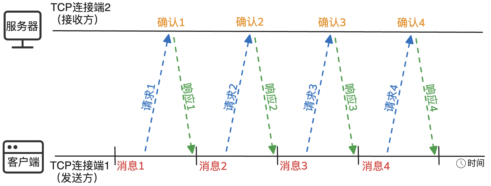

---
文章分类:
  - 编程语言与技术
文章标签:
  - 理论
文章简介: 
文章精选:
  - 否
是否发布:
  - 否
发布时间: 
创建时间: 2024-08-05
修改时间: 2024-12-03
---

### 1. OSI七层模型详解

**计算机网络分层表示的原因**：在两台计算机要进行数据通信时，需要**保证数据通路顺畅**、**确定目标计算机状态**、**识别目标计算机**、**数据错误的勘测**等等一系列的问题。而通过功能分类，对每层进行独立单一设计，实现解耦、不同层实现不同功能。

- 网络应用数据 -> 视频、文件、游戏。
- 可靠数据通路 -> 数据错误、连接丢失。
- 物理网络接入 -> 光电等物理特性。

**OSI七层模型详细功能介绍**：

| 层次   | 功能               |
| ---- | ---------------- |
| 应用层  | 为计算机用户提供接口和服务    |
| 表示层  | 数据处理（编码解码、加密解密等） |
| 会话层  | 管理（建立、维护、重连）通信会话 |
| 传输层  | 管理端到端的通信连接       |
| 网络层  | 数据路由（决定数据在网络的路径） |
| 数据链路 | 管理相邻节点之间的数据通信    |
| 物理层  | 数据通信的光电物理特性      |

**注意**：OSI七层模型（理论中），TCP/IP四层模型（实际中）。

**OSI七层和TCP/IP四层模型图**：

**报文结构（以TCP/IP模型为例）**：

**对网络层、传输层、应用层分别解释**：

**网络层**：

- OSI模型：第三层；TCP/IP模型：第二层
- 关键协议：IP协议、ICMP协议

网络层属于主机之间的通信，它的目的是向上提供简单灵活的、无连接的、尽最努力交付的数据报服务，网络层不提供服务质量的承诺。

特点：不需要建立连接；每个数据报单独路由；每个数据报有完整的目标地址；不提供可靠的连接；到达终点可能无序；由终点进行差错控制。

**传输层**：

- OSI模型：第四层；TCP/IP模型：第三层
- 关键协议：TCP协议、UDP协议

传输层属于主机间不同进程的通信，传输层向上面的应用层提供通信服务，并屏蔽了下面的核心网络细节，使得面向传输层编程就像是两个主机进程之间有一条端到端的逻辑通信信道一样；当传输层采用TCP协议时，这条逻辑通信信道就是一条可靠的通信信道，而尽管下面的网络层时不可靠的。

**应用层**：

- TCP/IP模型：第四层
- 关键协议：HTTP协议、FTP协议、SMTP协议、DNS等等

应用层定义了运行在不同端系统上的应用程序进程如何相互传递报文。应用层定义了进程交换的报文类型、报文的语法、字段的含义、进程如何发生数据、怎样发送数据等等。

**报文传输时各层的功能**：

| 层次  | 功能            |
| --- | ------------- |
| 网络层 | 提供主机之间的通信     |
| 传输层 | 提供主机不同进程之间的通信 |
| 应用层 | 提供不同应用之间的通信   |

### 2. HTTP演化过程

**HTTP演化版本时间线**：

- 1991年：HTTP/0.9，主要是文字描述。
- 1996年：HTTP/1.0，主要是富文本。
- 1997年：HTTP/1.1。
- 2015年：HTTP/2.0，主要是图片、视频。

不同时段所产生内容：

- 1984年 ~ 1995年：合并网络、创建互联网的时代。
- 1995年 ~ 2010年：商业化、私有化、中心化的时代。
- 2010年 ~ 至今：去中心化、内容为主的时代。

**HTTP/0.9、1.0、1.1、2.0各版本功能**：

- HTTP/0.9：**HTTP协议类型**；设计雏形，具有缺陷；只支持GET方法；**不支持多媒体内容**；只有HTML对象。
- HTTP/1.0：使用广泛；增加了许多方法（POST、DELETE、PUT等）；**支持多媒体对象**；无连接，无状态等。**设计改良**。
- HTTP/1.1：**长连接**；管道化；缓存处理；断点传输等。**性能效率提升**。
- HTTP/2.0：二进制分帧；**多路复用**；头部压缩；**服务端推送**等。**性能极致提升**。

**HTTP/1.1版本的keep-alive长连接**：

Header头部：**Connection: Keep-alive**

keep-alive长连接是应用层的协议，底层是由传输层TCP进行提供服务。所以在进行keep-alive长连接前，需要客户端和服务端进行TCP连接，而TCP的连接需要三次握手、四次挥手的成本。

使用keep-alive和不使用keep-alive的区别：

**HTTP/2.0版本的多路复用**：

多路复用通常表示在一个信道上传输多路信号或数据流的过程和技术。通过使用多路复用，通信运营商可以避免维护多条线路，从而有效地节约运营成本。

- 二进制分帧是基础，通信单位为帧（报文 -> 帧）。
- 多请求并行不依赖多TCP连接。
- 并行在一个TCP连接交互多种类型信息。

**HTTP/2.0版本的头部压缩**（HPACK header compression）：主要是为了减少客户端和服务端的数据大小。

- 客户端和服务端均维护了一个静态字典。静态字典中包含常见的头部名称、请求方法和数据的组合。
- Huffman编码对字符的压缩。客户端进行Huffman编码，服务器端进行Huffman解码。

**HTTP/2.0版本的服务器推送**：

服务端的“未卜先知”，主动推送资源给客户端。减少客户端的请求时间。

### 3. HTTP状态码及含义

**HTTP报文结构**：

**HTTP请求方法**：是HTTP请求对服务器资源进行操作（增删改查+系统功能），通过定义不同方法实现不同操作。

- **GET**：最常用的方法，常用于请求服务器发送某个资源。
- **HEAD**：和GET类似，但服务器在响应中只返回首部。
- **POST**：向服务器写入数据。
- **TRACE**：观察请求报文到达服务器的最终样子。
- **PUT**：和GET相反，服务器写入资源（文件、多媒体等）。
- **DELETE**：请求服务器删除请求URL所指定的资源。
- **OPTIONS**：用于返回服务器所支持的操作方法。

幂等操作和幂等函数：

- **幂等操作**：任意多次执行的所产生的影响均与一次执行的影响相同。
- **幂等函数**：可以使用相同参数重复执行，并能获得相同结果的函数。

一般来讲，属于幂等操作的是：GET、HEAD、TRACE、OPTIONS；根据处理逻辑判断是否称为幂等操作：POST、PUT、DELETE。

OPTIONS请求的示例：

**HTTP状态码**：

| 状态码     | 含义       |
| ------- | -------- |
| 200~299 | 成功状态码    |
| 300~399 | 重定向状态码   |
| 400~499 | 客户端错误状态码 |
| 500~599 | 服务端错误状态码 |

**200~299**常见状态码：

- 200：OK，请求成功，实体的主体部分包含了请求的资源。
- 204：No Content，响应报文中包含若干首部和一个状态行，但是没有实体的主体部分。

**300~399**常见状态码：

- 304：Not Modified，请求的资源未修改，服务器返回此状态码时，不会返回任何资源。

**400~499**常见状态码：

- 400：Bad Request，客户端请求语法错误，服务器无法理解。
- 401：Unauthorized，请求客户端在获取对资源访问之前，需要进行权限认证。
- 403：Forbidden，请求被服务器拒绝了。
- 404：Not Found，用于说明服务器无法找到所请求的URL。

**500~599**常见状态码：

- 500：Internal Server Error，服务器内部错误，无法完成请求。
- 502：Bad Gateway，作为网关或代理工作的服务器尝试执行请求时，从远程服务器接受到了一个无效的响应。
- 503：Service Unavailable，用来说明服务器现在无法为该请求提供服务。
- 504：Gateway Timeout，网关或代理的服务器，未及时从远端服务器获取请求。

### 4. 对称与非对称加密

**安全传输模型**：

**密钥**：明文转化为密文或将密文转化成明文的算法中输入的参数。分为**对称密钥**和**非对称密钥**。

古典密码学：

- **置换密码表**：将AZ与ZA进行替换，即字母表的后移位数决定了映射字母表。例如A后移3位，A -> D、B -> E。
- **代换密码表**：随机对应关系，即字母A~Z映射关系不定，但都是一对一进行映射，映射的结果不能重复。

古典密码学存在安全性问题：通过对大量文章统计A ~ Z的频率进行统计，之后对密文A ~ Z进行频率统计，进行对照加工处理反编译。

**对称加密**：

- 用户A和用户B的密钥是相同的。
- 古典密码学也属于对称加密的特殊例子。

常见的对称加密算法：DES、3DES、AES（AES的优点：速度快、安全性高）。

**非对称加密**：

- 用户A和用户B的密钥是不同的。
- 用户A使用对方密钥（公钥）进行加密，用户B使用自己密钥（私钥）进行解密。

常见的非对称加密算法：RSA（最具有影响力的算法，数论，两个大的素数进行相乘，解是对素数的因式分解）、ECC（椭圆加密算法）、DH。

**非对称加密的过程**：

1. 密钥a（公钥）、密钥b（私钥），是拥有一定数学关系的一组密钥。
	- 密钥a（公钥）：公钥给别人使用，对外公开。
	- 密钥b（私钥）：私钥给自己使用，不对外公开。
2. 发送数据者使用密钥a（公钥）进行加密，通过互联网（网络），传输给数据接收者。
3. 数据接收者使用密钥b（私钥）进行解密，从而获取数据发送者的数据内容。

**对称加密和非对称加密的比较**：

| 对比类型 | 对称加密 | 非对称加密       |
| ---- | ---- | ----------- |
| 密钥   | 一串密钥 | 一组密钥（公钥、私钥） |
| 效率   | 效率高  | 效率低         |
| 安全性  | 较高   | 更高          |
| 管理成本 | 高    | 低           |

**散列算法**（Hash function）：又称**哈希函数**。是一种从任何一种数据中创建小的数字“指纹”的方法。散列函数把消息或数据压缩成摘要，使得数据量变小，将数据的格式固定下来。

通过Hash function之后的字符串，完全看不到原文内容。如果两个原文不同，那么Hash之后的结果，也是极大概率的不一致。如果两个Hash结果一致，并不能说明两个原文一定相同，存在Hash碰撞问题。

Hash function的关系：多对一。常见的散列算法：MD5。

散列算法是不安全的，具体的操作为：

- 获取到后台数据库的数据（拖库）。
- 使用一些常见和特殊的哈希散列算法。
- 对照自身庞大的哈希散列结果数据。

**加盐操作**是为了规避散列之后反破解，在散列之前对需要散列的值进行部分自定义处理，从而进一步加大破解难度。

**从严格意义上来说，哈希散列算法，不能算加密算法，因为Hash散列是单向的，不具备逆向解密的能力**。

### 5. HTTPS加密认证过程的TLS技术

HTTP VS HTTPS：

| 类别  | HTTP | HTTPS |
| --- | ---- | ----- |
| 安全性 | 不安全  | 安全    |
| 复杂度 | 低    | 高     |
| 效率  | 高    | 低     |
| 端口  | 一般80 | 443   |

- HTTPS（Secure）是安全的HTTP协议
- 访问方式：http(s)://<主机>:<端口>/<路径>

**TLS**（Transport Layer Security，传输层安全协议）：

- 介于应用层和传输层之间的协议。
- 保障数据安全和数据完整。
- 对传输层数据进行加密后传输。

HTTPS安全本质是基于TLS协议之上的安全。**TLS技术中结合了对称加密、非对称加密技术设计的安全协议**。

**TLS中的数字证书**：是互联网通讯中标识通讯各方身份信息的一个数字认证，可以在网上来标识对方的身份。数字证书是**可信任组织**颁发给**特定对象**的认证。

数字证书的组成：证书格式、版本号、证书序列号、签名算法、有效期、对象名称、对象公开密钥（非对称加密来生成对称密钥）等。

**HTTPS建立连接过程**：

1. 443端口的TCP连接。
2. **SSL安全参数握手（通过非对称加密来生成对称密钥）**。
3. 客户端/服务器端数据通讯。

**SSL安全参数握手具体过程**：

1. 客户端生成随机数1，并向服务器端发送：随机数1、协议版本、加密算法（对称加密算法）。
2. 服务器端生成随机数2，并向客户端发送：确定加密算法、**数字证书**、随机数2。
3. 客户端确认数字证书是否有效、生成随机数3、使用服务器的公钥进行加密随机数3，并向服务器端发送加密后随机数3。
4. 服务器端接受随机数3，服务器端通过私钥进行解密验证。
5. 客户端和服务器端，根据随机数1、2、3和相同的算法生成对称密钥。
6. 之后的通信中，客户端和服务器端都使用对称密钥进行加密通 信。

**不使用非对称密钥进行加密的原因**：

1. 客户端需要存储服务器端的公钥，服务器端也需要存储客户端的公钥。
2. 非对称加密算法的计算量相较于对称加密的计算量比较大，效率慢。

### 6. DNS服务的工作流程

**DNS**（Domain Name System，域名系统）：是一项互联网服务，存储域名和IP地址相互映射关系的一个分布式数据库，它能够使人更方便的访问互联网。

**域名** -> DNS域名服务 -> **IP地址** -> 进程服务（IP+端口）

DNS域名的特点和组成：

- 域名有由点、字母和数字组成。
- 点分割不同的域。
- 域名可以分为顶级域、二级域、三级域。

DNS域名分类：

| 类别      | 举例                            |
| ------- | ----------------------------- |
| 根域名服务器  | 根域名服务器                        |
| 顶级域名服务器 | cn域名服务器、com域名服务器、net域名服务器 ... |
| 权威域名服务器 | edu.cn域名服务器 ...               |

**DNS工作流程：DNS迭代查询 和 DNS递归查询**

**DNS迭代查询**：

1. 客户端查询客户端主机缓存的域名，否。
2. 客户端查询本地域名服务器的域名，否。
3. 本地域名服务器**请求**根域名服务器**查询**顶级域名服务器的地址，根域名服务器返回顶级域名服务器给本地域名服务器。
4. 本地域名服务器**请求**顶级域名服务器**查询**权威域名服务器的地址，顶级域名服务器返回权威域名服务器给本地域名服务器。
5. 本地域名服务器**请求**权威域名服务器**查询**域名的地址，权威域名服务器s返回域名给本地域名服务器。
6. 本地域名服务器将域名地址返回给客户端。

**DNS递归查询**：

1. 客户端查询客户端主机缓存的域名，否。
2. 客户端查询本地域名服务器的域名，否。
3. 本地域名服务器**请求**根域名服务器。
4. 根域名服务器**请求**顶级域名服务器。
5. 顶级域名服务器**请求**权威域名服务器。
6. 权威域名服务器**返回**域名地址给顶级域名服务器。
7. 顶级域名服务器**返回**域名地址给根域名服务器。
8. 根域名服务器**返回**域名地址给本地域名服务器。
9. 本地域名服务器**返回**域名地址给客户端。

### 7. DNS攻击方式和原理

DNS攻击的相关场景：

1. 错误域名解析到纠错导航页面。
2. 错误域名解析到非正常页面。
3. 将正常站点解析到恶意页面。

原因：正常域名 -> **DNS解析过程（出错）** -> 错误域名地址。

**攻击方式1：DNS劫持**

避免劫持手段：在配置DNS服务器时，不要采用**自动获得DNS服务器地址**，可以**使用自定义DNS服务器配置**一些大厂服务器地址等。

**攻击方式2：DNS欺骗**

DNS欺骗不是攻击服务器，而是进行伪造服务器，从到达到攻击者希望用户访问的主页效果。

> DNS劫持、DNS欺骗，都是攻击者希望客户端用户访问攻击者期望的页面。

**DNS本质是一种程序**，而程序部署对应的物理设备容量承载是存在极限的，超过这个容量极限服务可能会存在宕机现象。

**DDos攻击**（Denial-of-service Attack）：拒绝服务攻击，是一种网络攻击手法，目的在于使目标电脑的网络或系统资源耗尽，使服务暂停中断或停止，导致其正常用户无法访问。

**DNS防范的手段**：

1. 采购一些防范服务，提高本地域名服务器的安全性。
2. 选取一些大厂的域名服务器，减低个人被攻击的风险。

### 8. TCP和UDP协议

TCP和UDP协议是属于传输层：

- OSI模型：第四层、TCP/IP模型：第三层

传输层属于主机间不同进程的通信，传输层向上面的应用层提供通信服务，并屏蔽了下面的核心网络细节，使得面向传输层编程就像是两个主机进程之间有一条端到端的逻辑通信信道一样；当传输层采用TCP协议时，这条逻辑通信信道就是一条可靠的通信信道，而尽管下面的网络层时不可靠的。

**TCP和UDP协议的报文结构**：传输层协议首部 + 传输层协议数据。

**端口**：为了区分主机网络间的不同进程。范围：0 ~ 65535。

- IP地址：区分主机
- 端口：区分主机网络进程

**套接字**（Socket）： IP地址 + 端口。占用16个比特位。

**UDP协议组成**：源端口号、目的端口号、UDP长度和UDP校验和。

- UDP长度：标识传输层协议数据大小。
- UDP校验和：判断数据在传输过程中有无差错。

**TCP协议组成**：

- **序号**：占4个字节[0, 4294967295]；TCP数据是字节流，每个字节都有唯一的序号；起始序号在建立TCP连接的时候设置；表示本报文段数据的第一个字节的序号。
- **确认号**：和序号一致，占用4个字节；表示期待收到对方下一个报文的第一个数据字节的序号。
- **控制位**：占6个比特位；特殊标识：URG、ACK、PSH、RST、SYN、FIN。
	- URG（紧急位，Urgent）：URG=1，表示紧急数据。
	- ACK（确认位，Acknowledgement）：ACK=1，确认号才生效。
	- PSH（推送位，Push）：PSH=1，尽快地把数据交付给应用层。
	- RST（重置位，Reset）：RST=1，重新建立连接。
	- SYN（同步位，Synchronization）：SYN=1，表示连接请求报文。
	- FIN（终止位，Finish）：FIN=1，表示释放连接。
- **窗口**：占用2个字节[0, 65535]；指明允许对方发送的数据量；由于数据缓冲的空间有限，不能无限缓冲数据。

**UDP 与 TCP比较**：

- TCP比UDP的协议头部更加复杂。
- TCP提供可靠的有连接服务；UDP提供不可靠的无连接服务。

| 比较对象 | UDP   | TCP   |
| ---- | ----- | ----- |
| 性能   | 性能负载低 | 性能负载高 |
| 速度   | 速度快   | 速度慢   |
| 实现难度 | 实现简单  | 实现复杂  |
| 应用场景 | 简单场景  | 复杂场景  |
| 面向连接 | 无连接服务 | 有连接服务 |
| 可靠性  | 不可靠服务 | 可靠服务  |

TCP可靠有连接：

- 可靠传输：无差错、不丢失、不重复；
- 按序到达：数据有序；
- 有连接：1. 建立连接；2. 通过连接进行通信；3. 释放连接。

**UDP 和 TCP 应用场景**：

| 应用      | 应用层协议          | 传输层协议 |
| ------- | -------------- | ----- |
| 域名转换    | DNS（域名系统）      | UDP   |
| 文件传送    | TFTP（简单文件传输协议） | UDP   |
| 流式多媒体通信 | -              | UDP   |
| IP地址配置  | DHCP（动态主机配置协议） | UDP   |
| 电子邮件    | SMTP（简单邮件传送协议） | TCP   |
| 文件传送    | FTP（文件传送协议）    | TCP   |
| 远端终端接入  | TELNET（远程终端协议） | TCP   |
| WWW     | HTTP（超文本传输协议）  | TCP   |

### 9. TCP连接的三次握手

**TCP连接正常建立的过程**：

1. SYN=1, seq=x：请求同步，告诉对方自己的数据序列号。
2. SYN=1, ACK=1, seq=y, ack=x+1：确认对方的数据，告诉对方自己的数据序列号。
3. ACK=1, seq=x+1, ack=y+1：确认对方的数据，开始传输数据。

**TCP连接异常情况**：

当网络波动的原因，使得主动发起方连续发送多次连接请求，在三次连接中可避免这种多次请求的现象。**解决方式**：主动发起方会根据被动接收方的响应，从而忽略其它同一连接的响应。这样，在被动接受方中的第三次握手中就可知道该连接具体是哪个。

### 10. TCP连接的四次挥手

**TCP连接正常释放的过程**：

1. FIN=1, seq=u：主动方请求中断连接。
2. ACK=1, seq=v, ack=u+1：被动方表示确认收到中断报文。
3. FIN=1, ACK=1, seq=w, ack=u+1：被动方请求中断连接。
4. ACK=1, seq=u+1, ack=w+1：主动方确认中断连接。

**TIME-WAIT状态**：第四次挥手后，主动中断连接方所处的状态，这个状态下，主动方尚未完全关闭TCP连接，端口不可复用。

在一般情况下，TIME-WAIT = 2 * MSL。MSL（Max Segment Lifetime）：最长报文段寿命。RFC 793标准建议设置为2分钟。

**TIME-WAIT = 2 * MSL的原因**：

1. 保证最后的一个ACK报文一定能到达对方。如果在2MSL时间内没有到达，那么被动接收方会重新进行第三次挥手，确保连接正常释放。
2. 确保当前连接所有的报已经过期。

### 11. TCP的可靠传输

**方式1：停止-等待协议**

如果发送方发送消息或接收方确认时，某一方出现问题后，都会在一定时间后触发超时重传。

停止-等待协议特点：

- 是最简单的可靠传输协议。
- 对信道的利用效率不高。

**方式2：连续ARQ（Automatic Repeat reQuest）协议【滑动窗口】**

连续ARQ协议【滑动窗口】特点：

- 在接收方中是对每一个传输的字节进行确认。

**方式3：连续ARQ（Automatic Repeat reQuest）协议【累计确认】**

连续ARQ协议【累计确认】特点：

- 在接收方中只对最后传输的字节进行确认。表明该字节之前的内已经全部收到。

**TCP协议中滑动窗口所涉及到的相关概念及情况**：

没有可用窗口的情况：

有可用窗口的情况：

可用窗口加入新的内容的情况：

- 窗口指明对方发送的数据量。
- TCP协议是传输数据流的协议，通过TCP协议头部序号、确认号以及窗口等字段的控制，可以在有限的缓冲资源下，接收几乎无限的数据。

### 12. TCP拥塞避免算法

**网络拥塞**：在某段时间内，若对网络中的某一资源（带宽、缓存、处理机等）的需求超过了该资源所能提供的可用部分，网络性能就会变坏，这种情况称为网络拥塞。

网络拥塞往往由多种因素引起，它并不是一个单点问题。所以拥塞避免是一个全局角度的问题。

考虑TCP拥塞避免的目地：防止过多数据注入到网络中，避免网络中的路由器或链路过载。

**网络拥塞的趋势图**：

**慢开始与拥塞避免**：

- **拥塞窗口（cwnd）**：是TCP协议基于窗口的拥塞控制时需要的一个配置变量。发送方在发送数据时，会维持一个叫拥塞窗口cwnd（congestion windo）的状态变量，并且可以动态变化。在TCP报文头部，发送方让自己的发送窗口等于拥塞窗口。
- **门限值（ssthresh）**：拥塞避免算法启动阈值，当拥塞窗口cwnd超过门限值ssthresh时，启动慢开始算法。
- **传输轮次（Route-Trip）**：一次报文发送和确认称为一次传输轮次，RTT（Route-Trip Time）指一次传输轮次的往返时间。

**快重传与快恢复**：

- **快重传**：发送方尽早知道个别报文段的丢失，并立即重传，以避免发送方认为网络发生了拥塞，从而因为拥塞避免算法降低发送数据。对丢失的数据进行立即确认。

**慢开始与拥塞避免、快重传与快恢复综合图示**：

1. 连接建立后，先进行**慢开始**算法，拥塞窗口cwnd = 1并按指数规律增大。
2. 当cwnd >= ssthresh后，换成**拥塞避免**算法，拥塞窗口cwnd按线性增长。
3. 在这两个阶段中，如果**出现了超时现象**，则均切换为**慢开始**算法。ssthresh = cwnd / 2; cwnd = 1。
4. 在这两个阶段中，如果**出现了3次重复确认的ACK**时，则**先进行快重传算法**，将丢失的补传，而**后进行快恢复算法**。ssthresh = cwnd / 2; cwnd = ssthresh。
5. 在数据传输完成后，释放连接。

### 13. TCP粘包原理

**TCP协议与应用层协议关系**：部分应用层协议依赖于传输层的TCP协议。即传输层的TCP协议作为应用层可靠和顺序传输的基石。

TCP协议是面向字节流的数据传输协议，它可能会组合或拆分应用层协议的数据。应用层数据拆分的好坏，会直接导致数据在发送时是否会产生粘包现象。

以HTTP协议为例，其实体消息的首部有一个Content-Length，用来指明发送给接收方的消息主体的大小。即用十进制数字表示的数据字节的大小。

**粘包**：一个报文或两个报文被错误的拆分或解释。**粘包并不是TCP协议造成的，而是应用层协议设计缺陷导致的问题**。

**解决粘包的方法**：1. 基于长度的标识；2. 基于特殊分隔符；

**Nagle算法**：通过减少数据包的方式提高TCP传输性能的算法。

由于网络带宽有限， ，而是会在本地缓冲区中等待更多待发送的数据，这种批量发送数据的策虽然会影响实时性和网络延迟，但是能够降低网络拥堵的可能性并减少额外开销。

**触发Nagle算法的两个条件**：1. 缓冲区中数据超过最大数据段（MSS）。2. 上一个数据段被确认（ACK）后。

**面向TCP编程**：应用根据TCP字节流的组合或拆分的特性，进行针对性设计。例如，WebSocket手动指定接收数据的大小。

### 14. TCP协议安全性

**TCP连接的三次握手**：

**SYN flood攻击**：

- **利用三次握手的过程漏洞**。使得被动接受连接方的多个TCP连接都处于（SYNC-RCVD）阶段，消耗大量资源。最终因为资源耗尽，从而拒绝其它服务（Dos）。
- **攻击方伪造大量的第一次握手的报文，但却忽略第二次握手的报文**。

**攻击方式1：资源耗尽类攻击**

- 攻击方控制大量的“肉鸡”，向目标服务器发送大量连接握手报文。
- **完成三次握手后保持连接，但不做任何事情，消耗TCP连接资源。或者马上断开连接又重新发起新连接**。
- 最终影响正常服务或直接宕机。

**攻击方式2：协议特性漏洞攻击**

- 攻击方控制大量的“肉鸡”，向目标服务器发送大量连接握手报文。
- **建立正常连接后，依据TCP流量控制的特性，马上将TCP窗口设置为0，然后断开连接，使得目标服务器一直等待窗口的再次重新打开**。
- 最终影响正常服务或直接宕机。

**防范攻击手段**：

- 识别异常流量
- 分流异常流量
- 高可用服务部署
- 合理设置参数
- 实时监控告警

**简单防范架构示例**：

### 15. VPN虚拟专用网技术

由于一些机构组织不需要所有计算机都接入网络，并且机构内部成员可能跨地域通信存在加密安全的需求，故此，产生了VPN技术。

**常见的VPN实例**：公司内网；校园网；工业专用网等。

**专用IP地址**：一些只能提供给机构内部通信的IP地址；这类IP地址不能接入到互联网上与其它网络主机进行通信。即专用IP地址只能用作本地地址而不能用作全球地址，因为**专用IP地址在全球并不是唯一的**。**互联网上的路由器对目的地址为专用IP地址的数据报一律不进行转发**。

- A类专用地址：10.0.0.0 ~ 10.255.255.255
- B类专用地址：172.16.0.0 ~ 172.31.255.255
- C类专用地址：192.168.0.0 ~ 192.168.255.255

**VPN相关网络协议**：

- IPSec（Internet Protocol Security）：支持传输模式和隧道模式两种模式。传输模式用于保护主机到主机之间的通信，而隧道模式可以创建一个虚拟的、加密的网络隧道，用于保护网络到网络之间的通信。提供了强大的加密标准，如AES和3DES，以及完整性检查和数据源认证。
- PPTP（Point-to-Point Tunneling Protocol）：在公共网络上创建加密的、点对点的通信隧道。使用MPPE（Microsoft Point-to-Point Encryption）来加密数据，相比IPSec，它的加密强度较弱，且存在一些安全漏洞。PPTP 易于设置。
- L2TP（Layer 2 Tunneling Protocol）：本身不是一种加密协议，通常与IPSec结合使用，以提供数据的加密和完整性保护。可以在两个网络设备之间创建一个二层隧道，使得数据包能够像在本地网络中一样传输。与IPSec结合使用时，L2TP/IPSec 提供了一个安全、可靠的VPN解决方案。
