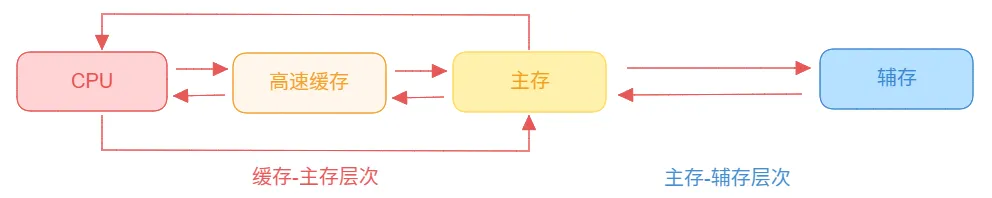

---
文章分类:
  - 编程语言与技术
文章标签:
  - 理论
文章简介: 
文章精选:
  - 否
是否发布:
  - 否
发布时间: 
创建时间: 2024-08-05
修改时间: 2024-12-05
---

### 1. 操作系统的进程

**操作系统的演进历史**：

- **无操作系统的时代**：人工操作、用户独占、CPU等待人工操作、**资源利用率很低**。
- **批处理系统的时代**：无需等待人工操作、批量输入任务、**资源利用率提升**、**多道程序设计**。
- **分时系统的时代**：人-机交互、多用户共享、**及时调试程序**、**资源利用率提升**。

多道程序设计：为了批处理系统可以一次处理多个任务。

- 指在计算机内存中同时存放多个程序。
- 在计算机的管理程序之下相互穿插运行。

加入多道程序设计之后，用户无需面向接口编程；IO设备管理软件，提供读写功能；文件管理软件，提供操作文件接口。

操作系统实现了对计算机硬件资源的管理和抽象。

**操作系统的进程**：

- 是系统进行**资源分配和调度的基本单位**。
- 作为程序独立运行的载体，保障程序的正常执行。
- 使得操作系统资源的利用率大幅提升。

**进程的形态分类**：1. 进程标识符；2. 处理机状态；3. 进程调度信息；4. 进程控制信息。

**进程的形态**：

### 2. 进程的状态模型

**进程五状态模型**：创建、就绪、运行、阻塞、终止。

- **创建状态**：分配PCB -> 插入就绪队列；**创建进程时拥有PCB，但其它资源尚未就绪的状态**。操作系统提供fork函数接口创建进程。
- **就绪状态**：**获得除CPU之外的其它所有资源后的状态**。当有CPU的使用权后，即刻运行。
- **运行状态**：**进行获得CPU，其程序正在执行的状态**。在单处理机中，在某个时刻只能有一个进程处于运行状态。
- **阻塞状态**：**由于某种原因，导致其它设备未就绪而无法继续执行的状态**。
- **终止状态**：系统清理 -> PCB归还；**进程结束由系统清理或归还PCB的状态**。

**阻塞、非阻塞、同步、异步**：

- **阻塞和非阻塞**强调的是**程序在等待调用结果时的状态**。
- **同步和异步**强调的是**消息通信机制**。

阻塞和非阻塞的应用场景：

- 读写磁盘、网络都属于阻塞。
- 大文件读取一般采用非阻塞。

### 3. 操作系统的线程

20世纪60年代提出进程的概念；20世纪90年代以后，多处理机系统迅速发展；提出比进程更小的独立运行的单位-线程，目地是为了提高系统内程序并发执行的速度，提升吞吐量。

**线程的特点**：1. 轻装上阵；2. 轻量级进程。

**操作系统的线程**：

- 是操作系统进行**运行调度的最小单位**。
- 包含在进程之中，是进程中实际工作的单位。
- 一个进程可以并发多个线程，每个线程执行不同的任务。

**进程（Process）VS 线程（Thread）**：

| 对比方面 | 进程        | 线程       |
| ---- | --------- | -------- |
| 资源   | 资源分配的基本单位 | 不拥有资源    |
| 调度   | 调度开销大     | 调度开销小    |
| 系统开销 | 进程系统开销大   | 线程系统开销小  |
| 并发性  | 进程间并发     | 进程内多线程并发 |

### 4. 用户态和内核态

设计用户态和内核态目的：为了解决操作系统资源管理的安全性，防止用户对资源的不合理调用或处理。

Linux的系统特权：

- 对不同的操作赋予不同的执行等级。
- 与系统相关的一些特别关键的操作必须由最高特权的程序来完成。
- 特权分为四级，从高到低：0级 ~ 3级。

**内核态**：

- 内核空间存放的是内核代码和数据。
- 由进程执行操作系统内核的代码。
- CPU可以访问内存所有数据，包括外围设备。

**用户态**：

- 用户空间存放的是用户程序的代码和数据。
- 由进程在执行用户自己的代码（非系统调用之类的函数）。
- CPU只可以访问有限的内存，而不允许访问外设。

内核空间和用户空间共同组成了内存空间。

**内核态与用户态切换情况**：1. 系统调用；2. 异常中断；3. 外围设备中断。

### 5. 程序运行类型

程序运行类型主要有：**CPU密集型**、**IO密集型**和**混合类型**。

CPU密集型（计算密集型，CPU Bound）：

- 完成一项任务的时间取决于CPU的速度。
- 当前任务CPU利用率高，其它事情处理慢。
- 处理器资源需求高，存储器资源需求低。
- 可以通过多线程充分利用CPU资源。

IO密集型：

- 完成一项任务的时间取决于IO设备的速度。
- 当前任务CPU利用率低，大部分时间在等待设备完成
- 频繁读写网络、磁盘等任务。
- 处理器资源需求低，存储器资源需求高。
- 可以提高磁盘的读写性能。

**对不同类型的服务部署**：

| **需求对象** | **CPU密集型** | **IO密集型** | **混合类型** |
| -------- | ---------- | --------- | -------- |
| CPU      | 高          | 一般        | 高        |
| 内存       | 高          | 高         | 高        |
| 磁盘       | 一般         | 高         | 高        |

### 6. 协程相关基础

**上下文切换**：出现于分时系统。由于系统的CPU是轮流分配给各个程序的，那在一段时间内多任务运行的，所以在任务的来回切换时，需要知道当前的任务从哪里加载和开始运行的。

在进程控制块中为了记录上下文切换时的这些内容，就产生了一个字段为上下文数据。

**上下文数据分类**：1. 寄存器级上下文；2. 用户级上下文；3. 系统级上下文。

**上下文切换的过程**：

**上下文切换的计算**：每次切换时间（us） * 切换次数 / 核心数 / 1000 = 上下文切换时间成本(ms)

**协程（Coroutine）**：微线程、纤程、协作式线程，是用户级线程。

- 比线程更小的粒度。
- 运行效率更高。
- 可以支持更高并发。

协程由用户自行调度，内核无法干涉。

协程的优点：

- 调度、切换、管理更加轻量。
- 可以减少上下文切换的成本。
- 协程主要运用在多IO的场景。

协程的缺点：

- 内核无法感知协程的存在。
- 无法发挥CPU的多核优势。

### 7. 存储器的层次结构

选购存储器的依据：读写速度快、存储容量大、价格低。位价：指每比特位价格，即价格/容量。

**存储器的层次结构**：

**局部性原理**：指CPU访问存储器时，无论是存取指令还是存取数据，所访问的存储单元都趋于聚集在一个较小的连续区域中。

**缓存-主存层次**：

- 原理：局部性原理。
- 实现：在CPU与主存之间增加一层速度快（容量小）的Cache。
- 目的：解决主存速度与CPU速度不匹配的问题。

**主存-辅存层次**：

- 原理：局部性原理。
- 实现：在主存之外增加辅助存储器。
- 目的：解决主存容量不足的问题。

**缓存的设计**：考虑局部性原理；分离冷热数据，降低热点服务的负载；提升吞吐量、并发量，提升服务质量。

### 8. 虚拟内存

**虚拟内存的由来**：

- 存在进程实际需要的内存很大，超过物理内存的容量。
- 多道程序设计，使得每个进程可用物理内存更加稀缺。
- 不可能无限增加物理内存，物理内存总有不够的时候。

**虚拟内存**：是操作系统内存管理的关键技术； 让多道程序和大程序运行成为现实；把程序使用内存划分，将部分暂时不使用的内存存储的内容放置在辅存中。

**逻辑地址空间**：

- 是进程可以使用的内存空间。
- 大小仅受CPU地址长度限制。
- 32位地址最大逻辑空间为4G。
- 是一个进程运行时，程序指令与程序数据可以用的相对地址空间。
 
**物理地址空间**：

- 指向物理内存的存储空间。
- 是程序运行过程在物理内存分配和使用的地址空间。

**磁盘-逻辑地址-物理地址映射关系**：

- 当程序运行时，无需全部装入内存，只需要装载当前使用的部分即可。
- 如果需要访问的页不在内存中时，则发出缺页中断，并发起页面置换。
- 故此，在用户层面看，系统拥有很大的空间，即虚拟内存。

**虚拟内存实际是对物理内存的补充，速度接近于内存，成本近于辅存**。

**高速缓存替换的时机**：当CPU在从高速缓存中读取调整数据时，发现调整缓存中并没有所需数据，则就要考虑从主存中读取数据。此时，就为高速缓存替换的时机。

**主存页面替换的时机**：当CPU从主存中去读取数据时，发现主存中也没有数据，则就要考虑从辅存中读取所需数据。此时，就为主存页面替换的时机。

**替换策略发生在：Cache-主存之间、主存-辅存之间**。

### 9. 操作系统内存管理

**内存管理方式**：1. 页式存储管理；2. 段式存储管理；3. 段页式存储管理。

**页式存储管理**：将进程逻辑空间等分成若干大小的页面，然后把物理内存空间也分成与页面大小相等的物理块。在实际运行中，以页面为单位把进程所需内容装进物理内存分散的物理块中。

- 页表：记录进程的逻辑空间与物理空间的映射。

**注意**：

- 页面大小应该适中，过大难以分配，过小而页表管理空间很大。
- 页面大小通常是512B ~ 8K，Linux 一般是 4K。

**多级页表**：减少进程运行时，页表存储空间大小的开销。

在现代计算机中，可以支持非常大的逻辑地址空间（2^32 ~2^64），这样，页表就变得非常大，也就要占用非常大的内存空间。例如，具有32位逻辑地址空间的分页系统，规定页面大小为4KB，则每个进程页表项可达1M（2^20）个，如果每个页表项占用1Byte，故每个进程仅仅页就要占用1MB的内存空间。

**页式存储管理的缺点：有一段连续的逻辑分布在多个页面中，将大大降低执行效率**。

**段式存储管理**：将进程逻辑空间划分成若干段（非等分），而段的长度由连续逻辑的长度决定。

**段式存储管理相比页式存储管理更加灵活**。

**段页式存储管理**：先将逻辑空间按段式管理分成基若干段，然后再把段内空间按页式管理等分成若干页。

**缺页中断**：在请求分页系统中，可以通过查询页表中的状态来确定所要访问的页面是否存在于内存中。**每当所要访问的页面不在内存时，会产生一次缺页中断**，此时操作系统会根据页表中的外存地址在外存中找到所缺的一页，将其调入内存中。

- 由于磁盘属于外设，读写磁盘时需要系统调用。即需要用户态和内核态交互。
- 中断过程：保护CPU现场 -> 分析中断原因 -> 中断处理 -> 恢复CPU环境。
- 发生时间：在指令执行期间产 生和处理中断和信号。在一条指令执行期间，可能产生多次缺页中断。

### 10. 页面置换算法

**页面转换算法的时机**：

- **高速缓存替换的时机**：当CPU在从高速缓存中读取调整数据时，发现调整缓存中并没有所需数据，则就要考虑从主存中读取数据。此时，就为高速缓存替换的时机。
- **主存页面替换的时机**：当CPU从主存中去读取数据时，发现主存中也没有数据，则就要考虑从辅存中读取所需数据。此时，就为主存页面替换的时机。

**单向链表**：每个节点都有下一个节点的地址或引用。

- 可以快速找到一个节点的下一个节点

**双向链表**：每个节点都有上一个节点和下一个节点的地址或引用。

- 可以快速找到一个节点的下一个节点
- 可以快速找到一个节点的上一个节点
- 可以快速去掉链表中的某一个节点

**缓存转换算法**：1. 先进先出算法（FIFO）；2. 最不经常使用算法（LFU）；3. 最近最少使用算法（LRU）。

**先进先出算法（FIFO）**：

- 最先进入的最早淘汰。
- 可以通过队列、栈和链表进行实现。

**最不经常使用算法（LFU）**：

- 优先淘汰最不经常使用的字块。
- 每个字块内需要额外的空间记录字块的使用频率。

**最近最少使用算法（LRU）**：

- 优先淘汰一段时间内没有使用的字块。
- 把当前访问节点置于链表前面（保证链表头部节点是最近使用的）。
- 一般使用双向链表。

### 11. Linux文件系统

**常见的文件系统**：

- Windows：FAT、NTFS
- Linux：ext2/3/4

**文件系统**是操作系统用于明确存储设备或分区上的文件的方法和数据结构；即在存储设备上组织文件的方法。操作系统中负责管理和存储文件信息的软件机构称为文件管理系统。

**FAT文件系统（File Allocation Table）**：

- FAT16、FAT32等，是微软早期Dos/Windows使用的文件系统。
- 使用一张表保存盘块的信息，表结构由物理块和下一个盘块组成。

**NTFS文件系统（New Teachnology File System）**：

- WindowsNT环境的文件系统。
- NTFS对FAT进行了改进，取代了旧的文件系统。

**ext文件系统（Extended File System，扩展文件系统）**：

- Linux的文件系统。
- ext2/3/4 数字表示第几代。

**ext文件系统结构示意图**：

- Boot Sector：启动扇区，安装开机管理程序。
- Block Group：块组，存储数据的实际位置。
- Superblock：
	- 记录整个文件系统相关信息的地方。
	- Block和Inode的使用情况。
	- 时间信息、控制信息等。
- Inode bitmap：
	- Inode的位示图。
	- 记录已分配的Inode和未分配的Inode。
- Data block：
	- Data block是存放文件内容的地方。
	- 每个block都有唯一的编号。
	- 文件的block记录在文件的Inode上。
- Inode Table：
	- 存放文件Inode的。
	- 每一个文件（目录）都有一个Inode。
	- 是每一个文件（目录）的索引节点。
	- 相关的元信息：索引节点编号、文件类型、链接指针、文件权限、文件物理地址、文件链接计数、文件长度、文件读写时间、文件状态、访问计数等。
- Inode：
	- 文件名是存放在目录的Inode节点上，而非是放在文件的Inode节点上。
	- 在列出目录内文件的时候无需加载文件的Inode。
- Block bitmap：
	- 与Inode bitmap功能类似。
	- 记录Data block的使用情况。

**Linux 文件 = Inode + Block**：

**硬链接**：

- 具有相同Inode节点号的文件互为硬链接文件。
- 删除硬链接文件或者源文件任意之一，文件实体并未被删除。
- 创建硬链接命令 `ln 源文件 硬链接文件`

**软链接**：

- 软链接类似Windows系统的快捷方式。
- 软链接里面存放的是源文件的路径，指向源文件。
- 删除源文件，软链接依然存在，但无法访问源文件内容。

### 12. 磁盘冗余阵列

**磁盘冗余阵列**（RAID，Redundant Array of Independent Disks）：利用虚拟化存储技术把多个磁盘组合起来，成为一个或多个硬盘阵列，目的为**提升性能**或**减少冗余**，或两者同时提升。

**磁盘冗余阵列分级**：RAID0、RAID1、RAID5、RAID10等。

**RAID0**：

- 性能：单块磁盘的N倍。
- 不提供数据校验和数据冗余。
- 某块磁盘损坏，数据直接丢失且无法恢复。

**RAID1**：

- 性能：单块磁盘的N/2倍。
- 数据无差别双写工作磁盘和镜像磁盘。
- 数据可靠性强，只要不是同时损坏，都可以恢复。

**RAID5**：

- 数据中心最常见的RAID等级。
- 提供纠错海明码实现数据冗余校验。
- 分散校验盘，提高写性能，降低校验盘出错概率。

**RAID10**：

- RAID0 + RAID 1。
- 既保证了数据冗余又保证了读写效率。
- 磁盘空间存储冗余，浪费严重。

**RAID0 VS RAID1 VS RAID5 VS RAID10**：

| 对比方面 | RAID0 | RAID1     | RAID5      | RAID10    |
| ---- | ----- | --------- | ---------- | --------- |
| 数据保护 | 不提供   | 提供        | 提供         | 提供        |
| 写效率  | 高     | 高         | 低          | 高         |
| 读效率  | 高     | 中         | 高          | 高         |
| 容量   | 高     | 中         | 高          | 高         |
| 应用   | 读写要求高 | 数据安全/容易恢复 | 兼顾经济性/数据安全 | 数据安全/容易恢复 |
